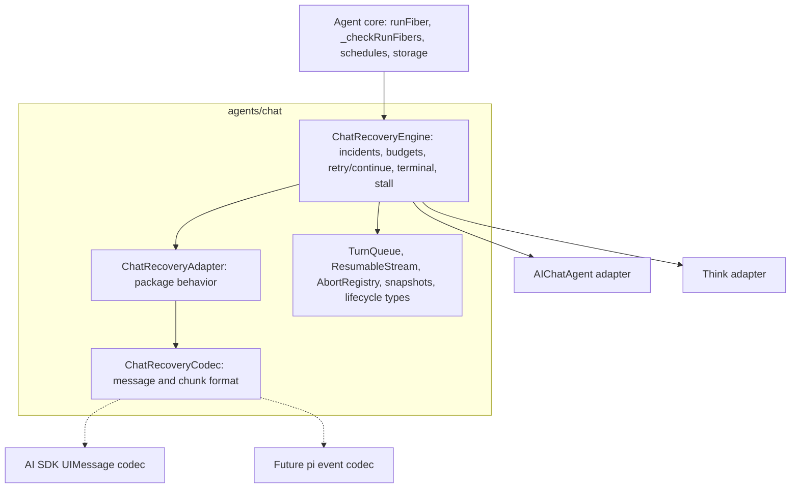
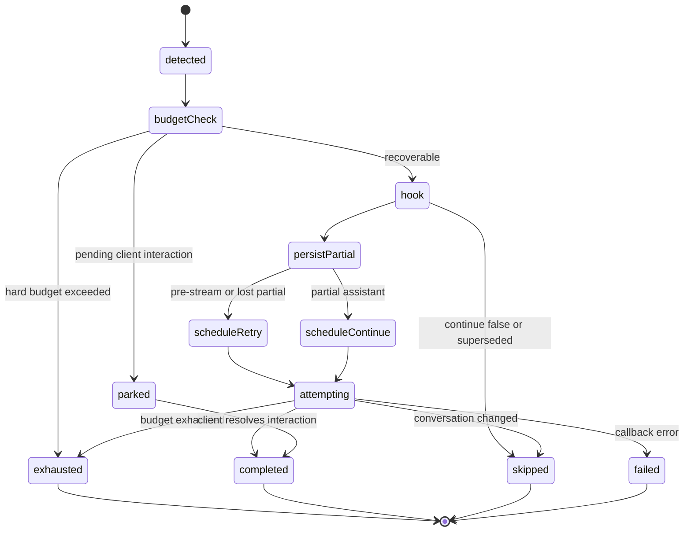
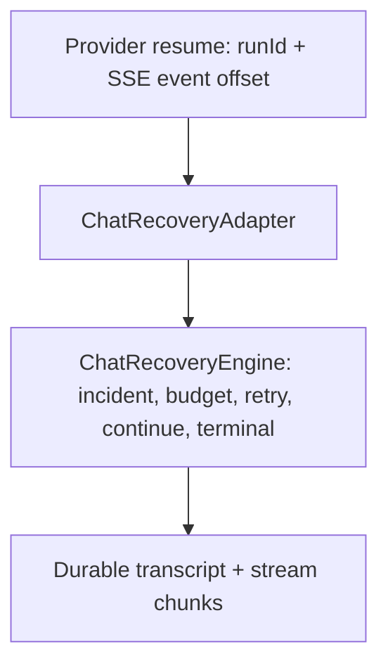

Status: accepted — foundation implemented (Phases 0–5 merged); post-v1 extensions tracked below

# RFC: Shared chat recovery foundation

Related:

- [chat-shared-layer.md](./chat-shared-layer.md)
- [rfc-chat-recovery-work-budget.md](./rfc-chat-recovery-work-budget.md)
- [rfc-ai-chat-maintenance.md](./rfc-ai-chat-maintenance.md)
- [think-vs-aichat.md](./think-vs-aichat.md)

## Current state & next steps (resume point)

> Quick orientation for a fresh working session. The authoritative detail lives in
> the **Progress log** (newest first) and the Phase 5 section; this block is the
> map, not the territory. Last updated after commit `d0c9585b` (Layer-5 live
> deploy/chaos suites landed + nightly wiring).
>
> _Archival note: the Progress log has been moved to a sibling file —
> [rfc-chat-recovery-foundation-progress.md](./rfc-chat-recovery-foundation-progress.md)
> — now that the `chat-recovery-foundation` branch is finalized, so this RFC
> freezes as a point-in-time record, per `design/AGENTS.md`._

**Where we are.** The shared recovery foundation (Phases 0–5) is implemented and
merged on the `chat-recovery-foundation` branch. The recovery engine, resume
handshake, and streaming codec all live in `agents/chat`; `@cloudflare/ai-chat`
and `@cloudflare/think` delegate to them, and the engine seam is
vocabulary-agnostic (`RecoveryPartial = { text, parts: unknown[],
hasSettledToolResults }`, each codec owns its own chunk vocabulary). Three codecs
exist: `AISDKRecoveryCodec` (prod), and the `experimental/pi-recovery` (pi
`AgentEvent`) + `experimental/tanstack-recovery` (AG-UI) harnesses.

**Guiding aim.** Share the implementation, converge on the behavior that is best
for the user, and keep per-package only what a product decision genuinely
dictates. ai-chat and Think already share the client contract (wire protocol +
AI-SDK `UIMessage` content model — one `useAgentChat` drives both), so remaining
divergences are server-side substrate or latent bug-asymmetries, not client
protocol. See **"Convergence philosophy (north star)"** for the litmus test
(behavior drift → converge; bug-asymmetry → fix in the shared primitive; product
substrate → keep per-package) and the ai-chat-as-subset end-state.

**Recently landed (most recent first).**

- `d0c9585b` — **Layer 5 live deploy/chaos — LANDED, validated on the real edge**
  (opt-in, not a merge gate). ai-chat's `deployed-recovery.test.ts` gained a
  false-positive guard (a completed turn is NOT spuriously recovered by
  reconnect/idle churn, and keeps serving) beside the mid-turn-redeploy eviction
  test; `experimental/chat-recovery-probe` gained `scripts/run-suite.mjs` (deploy
  under a throwaway name → run the fast abort-driven Think scenarios a6/a7/a8/idem
  → always delete). Root `test:recovery:live` runs both; gated nightly jobs
  (`e2e-deployed-ai-chat`, `e2e-deployed-think-probe`) stay off unless the
  `RUN_DEPLOYED_E2E` repo var / manual `run_deployed` dispatch enables them. See
  the **Layer 5** section for the real-edge realities discovered.
- `d7f3e5bc` / `f44227bf` / `55091855` — **e2e CI hardening** (no product change):
  promoted the previously manual-only SIGKILL suites to nightly jobs
  (`e2e-ai-chat-recovery`, `e2e-agents`, `e2e-engine-genericity`); added
  `pi-recovery`'s missing `test` script + `pi-codec.test.ts` (32 tests, matching
  tanstack's codec coverage) + READMEs for both genericity harnesses; fixed a
  `think` `assistant-e2e` post-test unhandled-rejection flake. (Deferred, tracked:
  unifying the divergent ai-chat/agents wrangler e2e harnesses — pure hygiene.)
- `16175930` / `ba05478e` — **branch cleanup, Tiers 1–2** (no behavior change):
  dedup the third hand-copied `sendIfOpen` (now imported from `connection.ts`),
  remove dead code (`targetAssistantId` engine field, pi-recovery `hasFiberRows`),
  `@internal`-group the recovery exports in the `agents/chat` barrel and prune 12
  zero-consumer barrel exports, and truth-up `chat-shared-layer.md` + this RFC.
- `754c7b0f` — **orphan-persist store seam promoted to a shared interface**: the
  by-convention store-write alignment from orphan-persist step (d) is now the
  type-enforced `OrphanPersistStore<M = UIMessage>` (the `SessionProvider` write
  subset, message-type-parameterized). Both hosts route their orphan-persist write
  through a host adapter typed against it (`agents` patch changeset). This is the
  first concrete step of the deferred "align the storage seam with `Session`"
  north-star item below.
- `66e7a790` / `b62241e9` — **engine-owned exhaustion helper** (API-ergonomics
  finding **#3**, closed): `runChatRecoveryExhaustion(input, { emit, onExhausted?,
onError, terminalize })` folds the `build → notify → terminalize` give-up
  sequence every host repeated, owning the invariant (notify before any terminal
  write; a throwing `onExhausted` never blocks terminal UX) while the host
  expresses its terminal writes in `terminalize(ctx)`. All four hosts moved onto
  it; the harnesses also gained a `_setChatRecovering` option-bag wrapper. A
  follow-up convergence then flipped `AIChatAgent`'s terminalize to
  **broadcast-first** (matching `Think`), removing the last divergent give-up
  ordering — both hosts now broadcast the banner before the durable writes
  (`@cloudflare/ai-chat` patch changeset). See the two newest Progress-log
  entries.
- `799d2a04` — **real Workers AI provider run** (open
  item #1, closed): the `experimental/tanstack-recovery` harness now streams a
  real `@cf/moonshotai/kimi-k2.7-code` reply via `@tanstack/ai` `chat()` +
  `@cloudflare/tanstack-ai`'s `createWorkersAiChat`, behind a per-turn `provider`
  switch and a `RUN_WORKERS_AI_E2E`-gated e2e (faux stays the CI default). The
  codec/handshake/engine seams were unchanged — recovery genuinely CONTINUES from
  the survived partial against a non-deterministic stream. See the newest
  Progress-log entry.
- `c6f596c4` — progress-bump **timing** convergence (the deferred Tier-2
  correctness item): both hosts now credit the no-progress counter through one
  shared rule `shouldCreditStreamProgress` (milestone-always + throttled
  streaming-content deltas via `StreamProgressCreditThrottle`). Closes
  API-ergonomics finding **#1**.
- `21d02e4b` — RFC doc-staleness fixes (status/header/caveat/dangling ref).
- `a1925401` — Route 2 reframed and deprioritized (it reduces to a client-side
  AI-SDK-SSE → AG-UI translator, an already-proven codec axis; **not** a
  recovery deliverable).
- Earlier on-branch: `038e6d23` Tier-2 extraction (codec + resume-handshake
  seams; findings **#2, #5, #6** closed); the TanStack/AG-UI second harness; the
  tool-`parts` codec path; the `RecoveryPartial` agnostic-seam refactor.

**Tracked work items (status inline — #1 landed; #2 is release-sweep only).**

1. **Orphan-persist consolidation — LANDED** (all four steps; kept here for the
   4-step verdict record). Subsumes the former "finding #4 — hand the
   decoded partial through" and "start-id alignment onto the codec" items; see the
   _Orphan-persist 4-step verdict_ design note and the Progress-log entries.
   A step-by-step investigation of both `_persistOrphanedStream` bodies found that
   3 of its 4 steps are unifiable and only one is genuinely storage-coupled:
   - **(a) chunks → parts** — **LANDED.** ai-chat's `_persistOrphanedStream` now
     reconstructs via the shared `StreamAccumulator` instead of a hand-rolled
     `applyChunkToParts` loop + inline `start`/`finish`/`message-metadata`. Scoped
     to reconstruction only (provably behavior-identical); the full
     seed-then-replace was **not** adopted because it would change ai-chat's
     tool-result-merge semantics — so (b)/(c)/(d) below were kept verbatim. See the
     newest Progress-log entry.
   - **(b) target-id resolution** — **LANDED** as a named seam. ai-chat now has a
     `_resolveOrphanTargetId(streamId, reconstructedId, fallbackId)` method — the one
     legitimately per-package step (a flat array can't express the parent/child a
     Session tree uses to resolve this structurally, so ai-chat reads the stored
     `message_id`, #1691, with a last-assistant fallback for legacy rows). Think
     resolves it structurally from its Session tree and so never had #1691. Neither
     is buggy. **Design correction from the earlier plan:** the hook lives **on the
     host, not on the shared engine adapter.** Hoisting the full orchestration into
     the engine would have required strip/broadcast/flush hooks that fight the
     substrate split for negative clarity; the engine boundary (it decides _whether_
     to persist; the host decides _how_) is already the right seam.
   - **(c) tool-part dedup** — **LANDED** as the shared pure primitive
     `reconcileOrphanPartial(existing, incoming)` in `message-reconciler.ts`
     (exported from `agents/chat`, unit-tested). It captures ai-chat's
     append-merge-with-`toolCallId`-dedup-and-metadata-overlay. Confirmed (per the
     2026-06 correction) this is **not** convergeable to Think's whole-message
     replace: ai-chat's early tool-approval persist can apply a client tool result
     IN PLACE that lives ONLY in storage (never in the chunk stream), so a replace
     would clobber it — the append-merge deliberately preserves it. Think has no
     early/mid-stream persist, so its replace is already dedup-safe (the shared
     reconstruction is idempotent by `toolCallId`) and it doesn't call the helper.
     So (c) is a shared primitive with one consumer today, available to any host that
     later gains an early-persist path.
   - **(d) upsert-by-id** — **LANDED** as recognizably the same `SessionProvider`
     -subset store-write on both hosts: ai-chat does `findIndex` → map-replace /
     append over its flat array; `Think._upsertMessageInHistory` does
     `session.getMessage` → `updateMessage` / `appendMessage` over a Session tree.
     No behavior change. (Handing the already-decoded partial through to close the
     old finding-#4 second-decode is a separate, still-open codec-seam item — it was
     **not** part of this consolidation.)
     \_As-built: (b)/(c)/(d) are now factored into named seams (`_resolveOrphanTargetId`
     - shared `reconcileOrphanPartial` + the subset upsert) rather than collapsed into
       one engine body — the substrate split (flat vs tree) and ai-chat's deliberate
       client-tool-result preservation correctly keep the two `_persistOrphanedStream`
       bodies separate. No changeset: pure internal refactor, no public API / observable
       behavior change. See the newest Progress-log entry.\_
2. **Phase 6 e2e audit + Phase 7 docs/release notes** — **largely done.** Phase 6
   orphan-persist e2e audit complete (see the Phase-6 audit subsection: coverage map
   - green ai-chat SIGKILL re-runs, one accepted gap). `chat-shared-layer.md` now has
     a `recovery-engine.ts` section (engine ownership, adapter/wake seams, the four
     orphan-persist seams) + a history note linking this RFC; stale orphan-persist
     references in that doc were corrected. The full local SIGKILL e2e sweep is now
     wired into nightly CI, and the optional Layer-5 live deploy/chaos suites have
     **landed** (opt-in; see the Layer 5 section). **Remaining:** finalize/sweep
     changesets at release time (the `reconcileOrphanPartial` export changeset is in;
     the broader behavior-change changesets already exist). The inline Progress log
     has been archived to a sibling file per `design/AGENTS.md` —
     [rfc-chat-recovery-foundation-progress.md](./rfc-chat-recovery-foundation-progress.md).

**Explicitly deferred / post-v1.** `AutoContinuationController` (the ~260-line
duplicated auto-continuation barrier) and the low-risk **adapter-spine helpers
(Tier A + B)** have since **landed** — see the two tracked follow-ups below, now
marked done. What remains host-side is the recovery-engine adapter seam
(`_chatRecoveryEngine` / `_runChatRecoveryFiber`) plus the product-substrate
`dispatch`/`classify`/`terminalize` methods, both deferred into the Turns effort
(a persistence-model rearchitecture, not a leaf lift — see the convergence litmus
test); Tier-3 (full streaming-driver merge); Workers AI
Gateway provider-resume checkpoints; Route 2 (front
`AIChatAgent` itself with a TanStack client); `ResumeHandshakeHost` Approach B
(injectable frame vocabulary — revisit only if a second foreign client appears);
unifying the divergent ai-chat/agents wrangler e2e harnesses (pure test hygiene).
See **"Platform context: where this seam is heading"** for the (non-scope) north
star — aligning the storage seam with the existing `Session` provider interface
and eventually lifting `resumable-stream` into a general durable-stream substrate.

> **Tracked follow-up — `AutoContinuationController` extraction — ✅ DONE.**
> Landed as a pure de-dup PR (`agents` patch changeset
> `auto-continuation-controller-extraction`). **As built:**
>
> - New shared primitive `packages/agents/src/chat/auto-continuation-controller.ts`
>   (`AutoContinuationController` + `AutoContinuationHost` + `ContinuationSpec`),
>   exported `@internal` from `agents/chat`. It owns the coalesce timer, the
>   `_barrierActive` double-fire guard, and the whole schedule → coalesce → fire
>   lifecycle (`schedule` / `rearmForBatch` / `armTimer` / `fireWhenStable` /
>   `activateDeferredAndReschedule` / `cancelTimer` / `isArmed` / `reset`).
> - Both hosts kept their original method names as **thin delegating wrappers**
>   (`_scheduleAutoContinuation`, `_rearmPendingAutoContinuationForBatch`,
>   `_onStreamingTurnFinalized`, `_activateDeferred…`, `_fireAutoContinuation`);
>   `_fireAutoContinuation` is now parameterless and reads `connection` /
>   `requestId` from `_continuation.pending`. `_resetAutoContinuationTimer` and
>   `_fireAutoContinuationWhenStable` were absorbed into the controller. The 50ms
>   coalesce constant is single-sourced as `AutoContinuationController.COALESCE_MS`
>   (ai-chat's duplicate `AUTO_CONTINUATION_COALESCE_MS` removed).
> - **Net −~375 lines** across the two hosts. White-box test probes were repointed
>   at the relocated fields (`_autoContinuation._timer` / `._barrierActive`); no
>   host-suite spec edits were needed (the primary parity gate). New focused unit
>   suite `auto-continuation-controller.test.ts` (17 tests: scheduling branches,
>   coalesce, double-fire guard, stream-active gate, incomplete-batch hold, drain,
>   deferred activation, reset, reset-during-drain reentrancy isolation).
> - **Fast-follow (intentional behavior change, `@cloudflare/think` patch
>   changeset `think-waituntilstable-armed-continuation`):** Think's
>   `waitUntilStable()` now consults `controller.isArmed()` via a new
>   `_hasArmedContinuation()` so it waits out an armed-but-not-yet-fired
>   continuation before reporting stable — converging Think's idle definition with
>   ai-chat's `waitForIdle()`. Both Think callers are recovery paths bounded by
>   `stableTimeoutMs`, so it cannot wedge. (Residual: a sub-microtask Think-only
>   turn-registration gap remains — pre-existing, belongs to the deferred Tier-3
>   streaming-driver merge.)
> - Validation: full `pnpm run check` (113 projects); chat 433, ai-chat 687, think
>   workers 689, controller 17; e2e ai-chat SIGKILL 10/10, Think recovery 26/5skip;
>   full `nx run-many -t test` matrix green (sequential — the 6 parallel "failures"
>   were confirmed Nx-flaky cloudflare-pool startup timeouts); independent Bugbot
>   pass found no bugs.
>
> ---
>
> **Original brief (for history):**
>
> - **Precondition (already done):** the barrier _behavior_ converged and landed
>   (ai-chat adopted Think's event-driven, no-timeout, stream-gated shape; see the
>   as-built note under the "auto-continuation barrier convergence" progress
>   entry). Both hosts now expose the **same method shape**, so this follow-up is a
>   pure code de-dup, **not** a behavior change.
> - **Scope:** extract the ~260-line near-identical barrier into a shared
>   `AutoContinuationController` in `agents/chat`. Shared method names across both
>   hosts: `_scheduleAutoContinuation`, `_rearmPendingAutoContinuationForBatch`,
>   `_fireAutoContinuationWhenStable`, `_drainInteractionApplies`,
>   `_onStreamingTurnFinalized`, `_fireAutoContinuation` (+ the
>   `AUTO_CONTINUATION_COALESCE_MS` constant). ai-chat additionally has the
>   `_continuation` deferred/coalesce machinery and an idle-awareness shim Think
>   lacks — keep those as host hooks, don't force them into Think.
> - **Parameterization:** a stream-active signal (`_streamingAssistant` /
>   `_streamingTurnActive`), a fire callback (host's `_runExclusiveChatTurn`), and
>   the host's apply-drain primitive. Controller owns the timer + double-fire guard
>   (`_continuationBarrierActive`).
> - **Gate:** its own PR + `agents` changeset + behavior tests proving both hosts'
>   barriers stay byte-for-byte behaviorally identical (no double-fire, no
>   fire-through on incomplete batch, self-heal across hibernation).
> - **Sibling follow-up (separate PR) — ✅ DONE (Tier A + B), see the block
>   below:** the leaf adapter-spine helpers (`_classifyAgentToolChildRecovery`,
>   `broadcast()` frame interception, `_awaitWithDeadline` + the apply-drain). The
>   other names in the original sweep (`_runChatRecoveryFiber`, engine adapter
>   wiring, `_getPartialStreamText`, `_resumeHandshake` factory, terminal-storage
>   delegates) turned out to already be one-line shared delegates or to sit on the
>   recovery-engine seam the Turns RFC reshapes — left in place to avoid
>   extract-then-reshape churn.

> **Tracked follow-up — adapter-spine helpers (Tier A + B) — ✅ DONE.**
> Landed as a pure de-dup PR (`agents` patch changeset
> `adapter-spine-helpers-dedup`; ai-chat/think need none). **As built:**
>
> - New `packages/agents/src/chat/async-helpers.ts` (`TIMED_OUT`,
>   `awaitWithDeadline`, `drainInteractionApplies`) — the deadline-bounded promise
>   race and the substrate-free interaction-apply completeness drain
>   (parameterized by `hasPending` / `getTail`, re-read each iteration). Both hosts
>   dropped their duplicate `TIMED_OUT` symbol and delegate through their existing
>   `_awaitWithDeadline` / `_drainInteractionApplies` wrappers.
> - `classifyAgentToolChildRecovery(storage)` added to `recovery-incident.ts`
>   (in-progress > failed > none precedence); both hosts'
>   `_classifyAgentToolChildRecovery` are now one-line delegates.
> - `interceptAgentToolBroadcast(msg, hooks)` added to `agent-tools.ts` (the #1575
>   agent-tool tailing snoop), parameterized by an `AgentToolBroadcastHooks`
>   substrate (forwarder / live-sequence / last-error maps, the host
>   response-frame type, the host run-lookup). Both `broadcast()` overrides keep a
>   cheap size-guard — so the common no-child path stays allocation-free — then
>   delegate the snoop and call `super.broadcast`.
> - **Net −~160 lines** across the two hosts; **zero host-suite spec edits** (the
>   primary parity gate). New unit coverage: `async-helpers.test.ts` (deadline +
>   drain, incl. rejected-tail), `classifyAgentToolChildRecovery` precedence, and
>   `interceptAgentToolBroadcast` forward/error/passthrough/no-op.
> - **Deliberately NOT hoisted (RFC bucket 3):** `_dispatchRecovered*Turn` /
>   `_classifyRecovered*Turn` / `terminalize`. Their convergeable parts (give-up
>   broadcast-first ordering, recovering-state-on-connect replay, scheduled-recovery
>   error handling) were already converged with changesets; what remains is
>   product-substrate — Think's durable submission ledger
>   (`completeSubmissionAfterRecovery?` / `markSubmissionInterrupted?` adapter hooks
>   ai-chat no-ops) and the persistence model (ai-chat flat `this.messages` + #1691
>   guard vs Think's async `Session` tree / `getLatestLeaf`, a storage-coupled
>   "Tie"). Deeper convergence is a persistence-model rearchitecture that belongs to
>   the Turns effort. **Verified residual:** ai-chat _does_ clear the "recovering…"
>   indicator on a normal recovered-turn finish — its
>   `_updateChatRecoveryIncident(…, "completed")` routes through the shared engine's
>   `updateIncident` → `setRecovering(false)`, asserted in `recovery-engine.test.ts`
>   ("clears recovering on completed") — so there is no bucket-1 gap.
> - Validation: full `pnpm run check` (113 projects); agents + ai-chat + think
>   suites green sequentially with zero spec edits.

**Working conventions.** Validate with `pnpm run check` (113 projects) before
considering anything done; host-suite tests via each package's
`vitest.config.ts`; `packages/` API/behavior changes need a changeset; commit per
coherent step and add a Progress-log entry (newest first) for anything
substantive. Do **not** edit `node_modules/`/`dist/`; no `any`; ES modules only.

## The problem

`@cloudflare/ai-chat` and `@cloudflare/think` now have a sophisticated durable
chat recovery system: a turn can survive browser disconnects, Durable Object
hibernation, process death, deploy churn, partial streaming failures, pending
client tool/HITL interactions, and exhausted recovery budgets.

The underlying idea is strong, but the implementation is not in a strong
long-term shape. The durable recovery engine is duplicated across:

- [packages/ai-chat/src/index.ts](../packages/ai-chat/src/index.ts)
- [packages/think/src/think.ts](../packages/think/src/think.ts)

The shared `agents/chat` layer already owns important primitives:

- [packages/agents/src/chat/turn-queue.ts](../packages/agents/src/chat/turn-queue.ts)
- [packages/agents/src/chat/submit-concurrency.ts](../packages/agents/src/chat/submit-concurrency.ts)
- [packages/agents/src/chat/resumable-stream.ts](../packages/agents/src/chat/resumable-stream.ts)
- [packages/agents/src/chat/recovery.ts](../packages/agents/src/chat/recovery.ts)
- [packages/agents/src/chat/lifecycle.ts](../packages/agents/src/chat/lifecycle.ts)
- [packages/agents/src/chat/message-builder.ts](../packages/agents/src/chat/message-builder.ts)
- [packages/agents/src/chat/stream-accumulator.ts](../packages/agents/src/chat/stream-accumulator.ts)
- [packages/agents/src/chat/protocol.ts](../packages/agents/src/chat/protocol.ts)

The core durable execution primitive is also shared in
[packages/agents/src/index.ts](../packages/agents/src/index.ts): `runFiber`,
`_runFiberWithStashWrapper`, `_checkRunFibers`,
`_handleInternalFiberRecovery`, and `FiberRecoveryContext`.

What is not shared is the recovery orchestration policy. Both `AIChatAgent` and
`Think` carry their own copies of the same large state machine:

- `_runChatRecoveryFiber`
- `_handleInternalFiberRecovery`
- `_beginChatRecoveryIncident`
- `_chatRecoveryContinue`
- `_chatRecoveryRetry`
- `_exhaustChatRecovery`
- `_persistOrphanedStream`
- `_getPartialStreamText`
- `_bumpChatRecoveryProgress`
- terminal replay helpers
- stable-timeout reschedule helpers
- HITL park helpers
- retry-vs-continue classification
- request-context restore
- recovery observability emission

This is already causing drift. Some comments in the code explicitly say one
helper mirrors the same helper in the other package. That is a warning sign: the
recovery path is one of the highest-risk pieces of the chat stack, and it is
being maintained by copying changes between two large files.

### Recovery and hibernation layers

The current system has several related but separate recovery layers.

1. **Reconnect resume.** A browser disconnects while the Durable Object is still
   alive. The server keeps reading the provider stream, persists stream chunks
   through `ResumableStream`, and replays buffered chunks to the reconnecting
   client.

2. **WebSocket hibernation.** The Durable Object has hibernated sockets and no
   active JavaScript isolate. A later client message, reconnect, alarm, or
   platform event wakes a new isolate that must restore enough chat state to
   route the message, replay any active stream metadata, and run fiber recovery
   before user `onStart()` code can accidentally overwrite recovery context.
   This is not always a crash: a clean hibernation should not create a false
   recovery incident, but it exercises the same boot/rehydration path.

3. **Durable turn recovery.** The Durable Object isolate dies, a deploy happens,
   or the process crashes mid-turn. The provider stream reader is gone. On the
   next wake, `Agent._checkRunFibers()` detects an orphaned `runFiber` row and
   dispatches the recovery hook. The chat agent reconstructs the partial
   assistant state, persists what is safe to persist, and schedules either a
   retry or a continuation through Durable Object alarms.

All three layers matter. `ResumableStream` is already shared. WebSocket
hibernation and durable turn recovery both depend on correct wake-time
rehydration. Durable turn recovery orchestration is not shared today.

### Current shared pieces

The existing shared layer is useful but incomplete.

`packages/agents/src/chat/recovery.ts` defines `ChatFiberSnapshot` and helpers
to wrap/unwrap the initial fiber stash. It captures request identity,
continuation status, latest message IDs, `lastBody`, and `lastClientTools`.

`packages/agents/src/chat/lifecycle.ts` defines shared public types:

- `ChatRecoveryContext`
- `ChatRecoveryOptions`
- `ChatRecoveryConfig`
- `ResolvedChatRecoveryConfig`
- `ChatRecoveryExhaustedContext`
- `ChatRecoveryProgressContext`
- `SaveMessagesOptions`
- `SaveMessagesResult`
- `ChatResponseResult`
- `MessageConcurrency`

Those files describe the public shape, but they do not run recovery. The
incident state machine, scheduling, terminalization, pending-interaction
handling, orphan persistence, and retry/continue decisions still live in each
consumer package.

### Current behavioral drift

Some divergence is intentional product behavior. Some is accidental drift. Some
is an improvement that should be shared.

Important differences today include:

- `Think` has a live stall watchdog (`_iterateWithStallWatchdog`,
  `_routeStallToBoundedRecovery`, `ChatStreamStalledError`) that routes an
  in-isolate stalled stream into the same bounded recovery path. `AIChatAgent`
  does not have equivalent protection.
- `Think` defaults `chatRecovery` to `true`; `AIChatAgent` defaults it to
  `false`.
- `Think` replays recovering state on connect; `AIChatAgent` did not — converged
  in slice 2d (`AIChatAgent` now replays it too; see the progress log).
- `Think` has stronger recovery callback error handling.
- `Think` has durable submission recovery and must complete, skip, or park
  submissions correctly.
- `AIChatAgent` has client/server reconciliation behavior required by the AI SDK
  React client, which `Think` mostly avoids through its Session persistence
  model.
- Progress accounting differs: `AIChatAgent` records progress on meaningful
  chunks, while `Think` often records progress around durable chunk flushes and
  tool-output paths.
- Terminal delivery ordering differs: `AIChatAgent` records terminal state
  before broadcasting, while `Think` favors a broadcast-first path in parts of
  the exhaustion flow for deploy/storage-failure resilience.

The goal is not to preserve every difference forever behind an abstraction. When
one implementation has better behavior, we should converge both packages on that
behavior intentionally, with tests and release notes.

### AI SDK coupling

The implementation is currently AI SDK oriented, but not every part is AI SDK
specific.

AI SDK specific pieces include:

- `UIMessage` and `UIMessageChunk`
- `toUIMessageStream()` / `toUIMessageStreamResponse()` stream shape
- chunk-to-parts assembly in `message-builder.ts`
- `StreamAccumulator`
- `convertToModelMessages` and continuation checkpoint repair in `Think`
- client-side `@ai-sdk/react` transport behavior
- client/server assistant ID reconciliation in `AIChatAgent`
- tool part states such as `input-available`, `output-available`,
  `approval-requested`, and dynamic tool parts

Generic pieces include:

- serialized turn queueing
- submit concurrency policies
- abort registry
- resumable stream byte storage
- fiber snapshots
- incident budgets
- progress/work accounting
- alarm scheduling
- terminal replay via WebSocket resume handshake
- recovering-state delivery
- observability event names
- retry-vs-continue orchestration

This suggests a split: the shared recovery engine should be format-agnostic
where possible, but the seam cannot be just a message/chunk codec. Much of the
current variance is behavioral: persistence model, HITL semantics, submission
lifecycle, terminal UX, and reconnect policy.

## The proposal

Introduce a shared, internal, composition-based recovery foundation in
`packages/agents/src/chat`.

The foundation has three conceptual parts:

1. `ChatRecoveryEngine` - shared policy and orchestration.
2. `ChatRecoveryAdapter` - package-specific behavior and host operations.
3. `ChatRecoveryCodec` - message/chunk format normalization, initially AI SDK
   oriented and later extensible to other harnesses.

The engine should be treated as sibling-package support, not as a public API for
application developers. Users should continue to interact with:

- `chatRecovery`
- `onChatRecovery`
- `onExhausted`
- `shouldKeepRecovering`
- `stash()`
- `continueLastTurn`
- existing `AIChatAgent` and `Think` APIs

There should be no new app-developer import required to get recovery behavior.

### Shape of the engine

`ChatRecoveryEngine` owns the durable recovery state machine.

Responsibilities:

- Wrap chat turns in durable fibers through the adapter's fiber seam.
- Detect and classify recovered chat fibers.
- Create and update `ChatRecoveryIncident` records.
- Apply attempt, no-progress, work-budget, and caller-predicate limits.
- Keep retry and continue attempts under one incident identity.
- Debounce deploy storms so repeated wakes do not burn the attempt budget.
- Park recovery when the turn is waiting on a client/HITL interaction.
- Decide _whether_ to persist a recoverable orphan partial (the adapter does the
  write; see "Persist-orphan boundary" below).
- Schedule `_chatRecoveryContinue` or `_chatRecoveryRetry`.
- Reschedule after stable-timeout churn without self-deduping the alarm row.
- Terminalize exhausted recovery and invoke `onExhausted`.
- Preserve the terminal replay path used by `useAgentChat`.
- Emit `chat:recovery:*` observability events with compatible payloads.
- Coordinate optional live stall recovery.
- Handle recovery callback errors consistently.

It should not own:

- The public `onChatMessage` contract.
- Provider invocation.
- AI SDK `UIMessage` semantics.
- The package's canonical message store.
- `Think` Session internals.
- `AIChatAgent` message reconciliation.
- `Think` durable submission lifecycle.
- WebSocket protocol parsing outside recovery-specific frames.
- Public defaults for `chatRecovery`.

### Recovery surface map

Recovery is not a single entry point. The current code reaches recovery-adjacent
logic from several places, and the refactor must be explicit about which layer
owns each one. Otherwise the extraction silently drops a `Think`-only path.

| Surface                           | Today                                                                                                                | Ownership after refactor                                                                |
| --------------------------------- | -------------------------------------------------------------------------------------------------------------------- | --------------------------------------------------------------------------------------- |
| Fiber recovery on wake            | `Agent._checkRunFibers()` -> `_handleInternalFiberRecovery` in each package                                          | Engine. Dispatched through the adapter's fiber seam.                                    |
| Incident lifecycle and budgets    | `_beginChatRecoveryIncident`, progress, attempt/work limits                                                          | Engine.                                                                                 |
| Retry vs continue scheduling      | `_chatRecoveryContinue`, `_chatRecoveryRetry`                                                                        | Engine policy; adapter executes the actual turn.                                        |
| Terminalization and replay        | `_exhaustChatRecovery`, `_recordChatTerminal`, `_replayTerminalOnResume`                                             | Engine policy; adapter delivers UX.                                                     |
| Messenger/workflow fiber dispatch | `Think` delegates first: `_messengerRuntime?.handleFiberRecovery(ctx)` ([think.ts](../packages/think/src/think.ts))  | Adapter. Runs before chat recovery via `tryHandleNonChatFiberRecovery`.                 |
| Durable submission drain          | `Think` constructor + submission lifecycle hooks                                                                     | Adapter. Engine provides hooks; `AIChatAgent` adapter no-ops.                           |
| Agent-tool child-run reconcile    | `_reconcileOwnStaleAgentToolChildRuns` in both packages                                                              | Adapter. Engine calls it after recovery completes.                                      |
| Resume-ACK orphan persist         | `_persistOrphanedStream` reached from a resume ACK (not a fiber) ([ai-chat index](../packages/ai-chat/src/index.ts)) | Adapter (reconnect-resume layer). Shares the adapter orphan writer with fiber recovery. |
| Live stall route                  | `Think._routeStallToBoundedRecovery`                                                                                 | Adapter input into engine; opens an incident sharing identity with deploy recovery.     |

Explicit non-goals for this refactor (named so reviewers know they are out of
scope, not forgotten):

- Parent agent-tool re-attach (`Agent._scheduleAgentToolRunRecovery`) stays in
  `Agent`. The only constraint is an ordering invariant: chat fiber recovery runs
  before user `onStart()` and before parent agent-tool re-attach on wake.
- Context-overflow compact-and-retry inside the inference loop is a different
  failure class and stays in `Think`.
- Facet/sub-agent fiber recovery (`Agent._checkFacetRunFibers`) is out of scope.
- `onStart` media/`SQLITE_NOMEM` boot degradation stays package-owned; recovery
  classification must read durable state where the in-memory cache is degraded
  (see "Boot-time degraded reads" below).

### Adapter seam

`ChatRecoveryAdapter` is the main seam. It is behavioral, not just a codec.

Illustrative shape:

```ts
type ChatRecoveryAdapter = {
  readonly name: "AIChatAgent" | "Think" | string;
  readonly snapshotKind: string;
  // New snapshots are written under one shared envelope key
  // (`__cfChatFiberSnapshot`, owned by the engine). Adapters only list their
  // legacy per-package keys so pre-cutover rows still unwrap on read.
  readonly legacySnapshotEnvelopeKeys: readonly string[];
  readonly chatFiberName: string;

  getRecoveryConfig(): ResolvedChatRecoveryConfig;
  getMessages(): unknown[];
  getLatestLeaf(): Promise<RecoveredLeaf | null>;
  findLatestUserMessage(): Promise<RecoveredUserMessage | null>;

  restoreRecoveredRequestContext(ctx: RecoveredRequestContext): Promise<void>;
  rehydrateBeforeBudgetCheck?(): Promise<void>;

  // Post-v1 extension. Not implemented in the first ship. The engine is designed
  // to accommodate provider-level resume via opaque outcomes (see "Relationship
  // to Workers AI Gateway resume"), but v1 ships transcript-level recovery only.
  getProviderResumeCheckpoint?(): Promise<ProviderResumeCheckpoint | null>;
  tryProviderResume?(input: ProviderResumeInput): Promise<ProviderResumeResult>;

  // Non-chat fibers (messenger/workflow) get first refusal before chat recovery.
  tryHandleNonChatFiberRecovery?(ctx: FiberRecoveryContext): Promise<boolean>;

  // Classification is adapter-owned: stream-terminal alone is not enough.
  classifyRecoveredTurn(input: ClassifyRecoveredTurnInput): Promise<{
    kind: "retry" | "continue" | "skip";
    retryTargetUserId?: string;
    targetAssistantId?: string;
    skipReason?: string;
  }>;

  resolveStreamForRecovery(requestId: string): Promise<{
    streamId: string | null;
    streamStillActive: boolean;
    streamIsTerminal: boolean;
  }>;
  getPartialForStream(streamId: string): Promise<RecoveredPartial>;
  persistOrphanPartial(input: OrphanPersistInput): Promise<void>;
  completeOrphanStream?(streamId: string): Promise<void>;

  hasPendingInteractionForStable(): Promise<boolean>;
  hasPendingInteractionForBudget(): Promise<boolean>;
  parkForPendingInteraction(input: ParkRecoveryInput): Promise<void>;

  continueRecoveredTurn(
    input: ContinueRecoveryInput
  ): Promise<RecoveryTurnResult>;
  retryRecoveredUserTurn(
    input: RetryRecoveryInput
  ): Promise<RecoveryTurnResult>;
  handleConversationSuperseded(input: SupersededRecoveryInput): Promise<void>;

  // Durable submissions (Think). ai-chat adapter no-ops, but the engine must not
  // assume submissions are absent.
  completeSubmissionAfterRecovery?(
    input: SubmissionRecoveryInput
  ): Promise<void>;
  markSubmissionInterrupted?(input: SubmissionRecoveryInput): Promise<void>;

  // Stale agent-tool child runs after a recovered parent turn.
  reconcileAgentToolRunsAfterRecovery?(): Promise<void>;

  // Forward progress is recorded at stream production time, never on replay.
  onForwardProgressAtProductionTime(input: ForwardProgressInput): Promise<void>;

  // Scheduled-callback failures: distinguish app failure from platform transient.
  handleScheduledRecoveryError(
    input: ScheduledRecoveryErrorInput
  ): Promise<ScheduledRecoveryErrorOutcome>;

  setRecovering(input: RecoveringStateInput): Promise<void>;
  deliverTerminal(input: TerminalDeliveryInput): Promise<void>;
  replayTerminalOnResume(input: TerminalReplayInput): Promise<boolean>;

  onRecoveryEvent(input: RecoveryEventInput): void;
  log(level: "info" | "warn" | "error", message: string, meta?: unknown): void;

  // Host operations. The agent that implements the adapter is also the host, so
  // there is no separate `ChatRecoveryHost` type. These let the engine run the
  // state machine and stay unit-testable against a fake adapter (fake storage,
  // fake scheduler, deterministic clock) with no Workers runtime.
  schedule(
    delaySeconds: number,
    callback: "_chatRecoveryContinue" | "_chatRecoveryRetry",
    data: unknown,
    opts: { idempotent: boolean }
  ): Promise<void>;
  storageGet<T>(key: string): Promise<T | undefined>;
  storagePut<T>(key: string, value: T): Promise<void>;
  storageDelete(key: string): Promise<void>;
  storageList<T>(opts: { prefix: string }): Promise<Map<string, T>>;
  invokeOnChatRecovery(
    ctx: ChatRecoveryContext
  ): Promise<ChatRecoveryOptions | void>;
  getResumableStream(): ResumableStreamHandle;
};
```

The new methods reflect behavior that already exists in code but did not map onto
the original sketch:

- `classifyRecoveredTurn` replaces implicit retry-vs-continue logic. A
  stream-terminal check alone is not sufficient: `Think` also consults
  `_shouldPersistOrphanedPartial` and `_hasPersistedRecoveredAssistant`, and
  `AIChatAgent` uses `_shouldRetryRecoveredPreStreamTurn`. The adapter returns the
  decision; the engine applies budgets and scheduling.
- `tryHandleNonChatFiberRecovery` preserves `Think`'s ordering where messenger and
  workflow fibers are dispatched before chat recovery claims a recovered fiber.
- `completeSubmissionAfterRecovery` / `markSubmissionInterrupted` extend
  `ContinueRecoveryInput` / `RetryRecoveryInput` with submission fields (such as
  `Think`'s `recoveredRequestId`). The engine threads them through scheduling; the
  `AIChatAgent` adapter leaves them unimplemented.
- `reconcileAgentToolRunsAfterRecovery` keeps `_reconcileOwnStaleAgentToolChildRuns`
  behavior under the adapter.
- `onForwardProgressAtProductionTime` makes explicit that progress is bumped from
  streaming/codec hooks while the turn is producing output, not from recovery
  replay or re-persisting already-stored chunks.
- `handleScheduledRecoveryError` converges both packages on `Think`'s stronger
  callback-error handling (app error terminalizes/marks failed; platform transient
  defers and reschedules without sealing the incident).

The actual interface should be smaller than this sketch if implementation shows
some operations can be derived rather than supplied. The important point is that
the seam must cover behavior and host I/O, not only message parsing. Because the
agent class is both the adapter and the host, the engine is constructed as
`new ChatRecoveryEngine(adapter)` with a single object - there is no second host
seam to wire.

Adapter-owned behaviors:

- How to inspect the latest persisted leaf.
- How to determine whether a pre-stream turn is retryable.
- How to preserve settled tool results even when `persist: false`.
- How to restore `lastBody`, `lastClientTools`, and stash data.
- (Post-v1) How to persist and restore provider-level resume checkpoints such as
  Workers AI Gateway `{ runId, eventOffset }`, and how to attempt provider-level
  byte-exact resume before falling back to transcript-level continuation.
- How to detect pending client/HITL interactions.
- How to wait for stable state before continuing.
- How to call `continueLastTurn` or retry the last user turn.
- How to reconcile or skip if the conversation changed.
- How to complete, skip, or park durable submissions.
- How to deliver recovering and terminal UX.
- How to record progress under package-specific streaming semantics.
- How to reconcile stale agent-tool child runs after recovery.

### Codec seam

`ChatRecoveryCodec<TMessage, TChunk>` is a narrower seam under the adapter.

It should contain only format knowledge:

- parse serialized chunk body
- serialize chunk body
- classify progress-bearing chunks
- classify replay chunks
- reconstruct a partial assistant from chunk bodies (via the shared
  `StreamAccumulator` — the codec feeds chunks in; it does not own a bespoke
  reconstruction. This is the single home for "chunks → parts", removed from the
  adapter list above to kill the double-assignment that let ai-chat hand-roll a
  subset inline.)
- repair interrupted tool parts
- determine whether a message contains settled tool results
- find latest user/assistant messages if the transcript shape is generic enough
- normalize continuation checkpoints if the provider rejects assistant prefill

The initial codec will be AI SDK oriented and can reuse existing primitives:

- `applyChunkToParts`
- `StreamAccumulator`
- `sanitizeMessage`
- `enforceRowSizeLimit`
- `isReplayChunk`
- `normalizeToolInput`

This keeps the engine open to a future non-AI-SDK harness without pretending
that today's system is already fully generic.

### Persist-orphan boundary

Persisting an orphaned partial is the place where the "engine owns policy,
adapter owns the store" split is easiest to get wrong. In code today,
`_persistOrphanedStream` reconstructs messages, merges by message id /
`toolCallId`, writes the transcript, and (in `Think`) broadcasts. That is store
knowledge, not policy. The boundary should be three explicit responsibilities:

1. **Adapter reports state.** `resolveStreamForRecovery(requestId)` returns
   `{ streamId, streamStillActive, streamIsTerminal }`, and `getPartialForStream`
   returns the reconstructed partial. This is the only way the engine learns
   about the stream.
2. **Engine decides.** `shouldPersistOrphan(flags)` is engine policy over
   adapter-supplied flags only (`streamStillActive`, `streamIsTerminal`,
   `hasPartial`, `hookOptions`, `hasSettledToolResults`). The engine never reads
   the transcript directly.
3. **Shared layer reconstructs + merges; adapter writes.** Reconstruction
   (`StreamAccumulator`), the merge onto an existing message, and tool-part dedup
   are **shared** (`StreamAccumulator.mergeInto` + `message-reconciler`) — they are
   not store knowledge. The adapter owns only the genuinely store-coupled steps:
   **target-id resolution** (`resolveOrphanTargetId` — stored `message_id` vs
   tree-position), the **raw store write**, the **broadcast**, and preserving
   settled tool results even when `onChatRecovery` returns `{ persist: false }`.

> **General seam rule (the principle the 4-step verdict generalizes).**
> _Merge/reconcile/dedup is shared; only target-id resolution and the raw store
> write are the adapter seam._ This is the litmus test applied to persistence:
> "how to combine two messages" is behavior (converge it into a shared primitive);
> "where the bytes live and under what id" is the product's storage model (keep it
> in the adapter). The same rule already governs the incoming path —
> `reconcileMessages` is shared, the `persistMessages`/`appendMessage` write is
> per-host — so the orphan path is just bringing one straggler corner in line.

The reconnect-resume layer reaches the same orphan writer from a resume ACK rather
than from fiber recovery. That path is adapter-owned and shares the writer so the
two layers cannot diverge on how an orphan is persisted.

#### Orphan-persist 4-step verdict (2026-06 investigation)

A step-by-step read of both `_persistOrphanedStream` bodies (ai-chat
[`index.ts:1452–1543`](../packages/ai-chat/src/index.ts), Think
[`think.ts:11174–11197`](../packages/think/src/think.ts)) against the shared
primitives (`StreamAccumulator`, `applyChunkToParts`, `resolveToolMergeId`, the
`message_id` stream-metadata column) decomposes the writer into four steps and
takes a best-in-class call on each. This **supersedes** the earlier Tier-3 claim
that the whole writer is "legitimately different, keep package-specific" — only
one of the four steps actually is.

| Step                         | ai-chat today                                                                                                                                     | Think today                                                                                                                           | Verdict                                                                                                                                                                                                                                                                                                                                                                                                                                                                                                                                                                                                                                                                                                                                                                                                                                                                                                                                                                                                                                                                                                                                                                                                                                                                                                |
| ---------------------------- | ------------------------------------------------------------------------------------------------------------------------------------------------- | ------------------------------------------------------------------------------------------------------------------------------------- | ------------------------------------------------------------------------------------------------------------------------------------------------------------------------------------------------------------------------------------------------------------------------------------------------------------------------------------------------------------------------------------------------------------------------------------------------------------------------------------------------------------------------------------------------------------------------------------------------------------------------------------------------------------------------------------------------------------------------------------------------------------------------------------------------------------------------------------------------------------------------------------------------------------------------------------------------------------------------------------------------------------------------------------------------------------------------------------------------------------------------------------------------------------------------------------------------------------------------------------------------------------------------------------------------------ |
| **(a)** chunks → parts       | hand-rolls `applyChunkToParts` + inline `start`/`finish`/`message-metadata`                                                                       | `StreamAccumulator` (superset: same builder + all metadata chunks + `error`/`finish-step` + cross-message-tool detection)             | **Think.** `StreamAccumulator` is the complete shared abstraction; ai-chat duplicates a subset inline (and adopts `start.messageId` without the `!isContinuation` guard the accumulator has — safe only because #1229 strips it upstream). Migrate ai-chat onto it. No behavior change.                                                                                                                                                                                                                                                                                                                                                                                                                                                                                                                                                                                                                                                                                                                                                                                                                                                                                                                                                                                                                |
| **(b)** target-id resolution | fresh id → provider `start.messageId` → stored `message_id` (#1691) → last-assistant fallback                                                     | fresh UUID; continuation target resolved later from tree position (`getLatestLeaf` + the `lastLeaf?.id !== targetId` supersede guard) | **Tie — genuinely storage-coupled.** ai-chat needs the explicit stored id because a flat array can't express parent/child, so "last assistant" is ambiguous (the #1691 corruption). Think can't represent #1691: the tree's `getLatestLeaf` lands a new-turn-after-a-later-user-message as "leaf is a user message → skip." Forcing either onto the other's scheme regresses or adds dead weight. Keep behind a narrow `resolveOrphanTargetId` host hook. _Residual: ai-chat's `storedId == null` branch is the pre-#1691 buggy last-assistant path, live only for legacy rows; Think has no such hazard._                                                                                                                                                                                                                                                                                                                                                                                                                                                                                                                                                                                                                                                                                             |
| **(c)** tool-part dedup      | inline dedup by `toolCallId` when **appending** reconstructed parts onto an existing message (`message.parts = [...existing.parts, ...newParts]`) | none — appends a fresh-id message; no same-id merge to dedup against                                                                  | **Neither has a bug; (c) is downstream of (b), NOT an independent asymmetry** (corrected 2026-06 — supersedes the earlier "fixed in one, not the other" reading). `applyChunkToParts` is **already fully idempotent by `toolCallId`** (`message-builder.ts:237–240, 273–297`, the #1404 `findToolPartByCallId` guards), so the accumulator never holds duplicate tool parts and `StreamAccumulator.mergeInto` (which _replaces_ parts with the deduped `[...this.parts]`, not append) needs **no** dedup. ai-chat hand-rolls a dedup only because its path reconstructs a _fresh_ message and then **appends** onto the existing same-id message (a consequence of (b)'s same-id merge + ai-chat's **ai-chat-only** tool-approval early-persist, so the message already exists on replay). Think uses a fresh id + the `_shouldPersistOrphanedPartial` guard and has **no** early message-persist, so there is nothing to dedup against — not a gap. **Action:** not a standalone patch. The dedup disappears for free when ai-chat adopts the shared **seed-then-replace** model (seed the accumulator with the resolved target's parts, replay chunks — `applyChunkToParts` dedups against the seed — then `mergeInto` replaces), folded into the step-(a) migration. `mergeInto` is left unchanged. |
| **(d)** upsert-by-id         | `findIndex` + replace/append (flat array)                                                                                                         | `_upsertMessageInHistory` (Session `getMessage` → update/append)                                                                      | **Tie — mechanically equivalent given a resolved id.** The flat-array case already lives in `mergeInto`; Think keeps the tree upsert. Substrate difference only, no bug.                                                                                                                                                                                                                                                                                                                                                                                                                                                                                                                                                                                                                                                                                                                                                                                                                                                                                                                                                                                                                                                                                                                               |

Net target: **(a)+(d)** both flow through `StreamAccumulator`/`mergeInto`,
**(c)** moves into `mergeInto` (closing Think's gap), and **(b)** is the single
remaining host primitive (`resolveOrphanTargetId`) — the step that legitimately
follows the storage model. That collapses ~90 lines of ai-chat's hand-rolled
writer into the engine and removes a silent Think correctness gap, while leaving
exactly one seam where the flat-array vs Session-tree substrate shows through.
_Wiggle room when we get to it: whether `resolveOrphanTargetId` hangs off the
adapter or the codec, and whether (c) ships standalone first._

#### Pluggable storage — feasible, but a product/risk call, not an impossibility

A related pressure-test: the non-goals forbid moving ai-chat onto Session
storage, but is a single pluggable-storage agent actually _impossible_? **No — a
flat message list is a degenerate (linear) Session tree**, so a neutral store
interface (`upsertById`, `getLatestLeaf`, `append(parentId?)`) is conceivable and
would make even step (b) above a shared implementation. The reason to **not** do
it is risk/reward and product direction, not architecture: the storage model is
the most load-bearing, already-shipped surface in each host (ai-chat's flat
`cf_ai_chat_agent_messages` + v4→v5 migration vs Think's Session tree + hydration
budget), the payoff is non-user-facing, and the roadmap is for `Think` to subsume
`AIChatAgent` rather than to unify their substrates underneath a shared interface.
Forcing a shared store interface now would constrain independent evolution of both
formats for little gain. Recorded so the "can't" is understood as "shouldn't (yet)."

### Architecture



### Recovery state machine

The shared engine should make this state machine explicit and testable:



### Public API stance

This RFC does not propose a new public recovery API.

`ChatRecoveryEngine`, `ChatRecoveryAdapter`, and `ChatRecoveryCodec` are internal
sibling-package support. They are marked `@internal`, not exported from the
`agents` package root, and not documented for application developers. We own all
the consumers (`AIChatAgent`, `Think`, and the internal pi validation adapter),
so there is no reason to expose them. If a barrel re-export is needed for build
reasons, it stays `@internal`. Promoting any of these to a public API is a
separate future decision, not part of this refactor.

Existing public hooks and config remain the supported surface:

```ts
chatRecovery: ChatRecoveryConfig;

protected onChatRecovery(
  ctx: ChatRecoveryContext
): Promise<ChatRecoveryOptions | void>;
```

`ChatRecoveryConfig` remains class-field or constructor configuration. The
existing warning remains important: recovery budgets are evaluated before
`onStart()` runs after a wake, so assigning `chatRecovery` in `onStart()` is too
late for the interrupted turn that matters.

## Better-behavior convergence

The refactor should not preserve every current divergence as permanent adapter
policy. When one package has clearly better recovery behavior, both packages
should converge on that behavior intentionally.

### Convergence philosophy (north star)

The guiding aim across this whole effort: **share the implementation, converge on
the behavior that is best for the user, and keep per-package only what a product
decision genuinely dictates.** We own both `@cloudflare/ai-chat` and
`@cloudflare/think`, so there is no reason to ship a capability dark on one side
and "flip it later" — we converge now, with a changeset and tests, every time.

This rests on a load-bearing fact that is easy to forget: **ai-chat and Think
already share the client-facing contract.** Both speak the same wire protocol
(`CHAT_MESSAGE_TYPES` / `cf_agent_chat_*` in
[protocol.ts](../packages/agents/src/chat/protocol.ts)) and the same content model
(AI-SDK `UIMessage` chunks streamed through `aiSdkRecoveryCodec` /
`toUIMessageStream()`), which is exactly why one `useAgentChat` hook drives both
agents today. The divergences are therefore **not** in what the client sees — they
are server-side substrate (storage model, durable submissions) and _additive_
event types layered on the shared stream. That means convergence is mostly about
aligning **server behavior** behind an already-shared contract, not about
reconciling two different client protocols.

#### The litmus test: why does this difference exist?

For every divergence, ask which of three buckets it falls in — the bucket dictates
the action:

1. **Behavior drift / one side is simply better** → **converge on the better one.**
   The other package adopts it (e.g. give-up broadcast-first ordering; Think's
   event-driven auto-continuation barrier; shared stall recovery). Best-in-class
   for the user is the tie-breaker, not "least change."
2. **Latent bug-asymmetry — one side fixed something the other didn't** →
   **propagate the fix into the shared primitive** so neither can regress. These
   are not design choices; they are bugs found by reading the two implementations
   side by side, and the shared layer is where the fix belongs. (Candidate
   habitat: the Tier-1 4f-ii items, where ai-chat hand-rolls a subset of a shared
   primitive — diff for a latent fix before converging. _Note: orphan-persist (c)
   first looked like a clean bucket-2 case but on inspection was **downstream of
   (b)** — `applyChunkToParts` is already idempotent, so there was no shared-
   primitive gap. A good reminder to verify the asymmetry is real before
   "propagating a fix" that isn't needed._)
3. **Product decision dictates the difference** → **keep per-package**, with the
   engine treating it as an _optional capability_, never a shared requirement.
   Storage model (ai-chat's flat array + v4→v5 migration vs Think's Session tree),
   durable submissions, codemode execute-pause HITL, media eviction — these exist
   because the products differ, and forcing them to converge would be the
   abstraction dictating the product (the inversion the adapter seam exists to
   prevent). See "Decision: substrate capabilities are optional".

#### End-state: ai-chat as the lean subset, Think as the product superset

Played out, convergence makes **ai-chat's recovery behavior a strict subset of
Think's** — same shared engine, same wire/content contract, same converged
behaviors — with Think adding only the _product substrate_ on top (submissions,
Session tree, codemode HITL, scheduled-task/workflow entry points). The roadmap is
for Think to eventually subsume ai-chat, so we deliberately push behavior toward a
single shared implementation while letting the substrate stay divergent. This is
**not** a plan to unify the storage models: a flat list is a degenerate Session
tree and a neutral store interface is _feasible_, but doing it is a risk/reward and
product-direction call, not a recovery deliverable (see the pluggable-storage note
under "Persist-orphan boundary").

#### Wiggle room (decided deliberately, revisit when we get there)

- **Per-package defaults stay** (`chatRecovery` off for ai-chat, on for Think)
  unless a separate semver-visible RFC changes them — the engine does not own
  defaults.
- **Some convergences are large rearchitectures, not leaf lifts** (the
  auto-continuation barrier was a substantial `AIChatAgent` slice, not a follow-on
  to a dedup). Sequence behavior convergence by risk, and let a changeset + tests
  gate each one.
- **"Better" is occasionally a judgment call.** Where it is, record the reasoning
  in a Behavior decision / Progress-log entry (as with broadcast-first) rather than
  converging silently, so the call is reviewable.

#### When to use `OrphanPersistStore` vs converge onto `SessionProvider`

The orphan-persist store seam (`OrphanPersistStore<M = UIMessage>` in
[orphan-store.ts](../packages/agents/src/chat/orphan-store.ts), the landed
instance of deferred north-star item (a)) is worth a standing note, because it is
easy to mistake for a general message store and over-apply.

- **What it is:** a deliberately narrow _capability slice_ — read-one + upsert
  (`getMessage` / `appendMessage` / `updateMessage`) — that is the **write subset
  of `SessionProvider`**, parameterized over the message type (`UIMessage` default
  for the two AI-SDK hosts; `SessionProvider` satisfies it at `SessionMessage`).
  "Generic" here means _SDK-neutral_, **not** _general-purpose_. The actual
  general store is `SessionProvider` (tree, branches, history, compaction); this
  is a keyhole onto that same substrate, named for its one current consumer.
- **Reuse the _pattern_, not the type.** The reusable convergence mechanism is:
  define a narrow interface that is a structural subset of `SessionProvider` →
  have each host expose an adapter typed against it → enforce with a return-type
  annotation + a `tests-d` assignability assertion. That turns "the two hosts
  happen to write the same shape" into "the compiler fails if they drift," and is
  the playbook for future storage-seam convergence.
- **Don't widen it into a god-interface.** If a future RFC needs more than
  read-one + upsert (history reads, branches, deletes, compaction), converge that
  host path onto `SessionProvider` _proper_, or define a **sibling** narrow slice —
  do not bolt operations onto `OrphanPersistStore`. The moment it stops being "the
  orphan-persist write subset" it is lying about its name.
- **Expect it to dissolve, not calcify.** The end-state above (ai-chat's flat list
  as a degenerate `Session` tree, both hosts persisting through `Session` /
  `SessionProvider`) makes this seam collapse: the adapter stops being
  "flat-array vs tree" and becomes "use the session." Treat `OrphanPersistStore`
  as the forcing function that proves the subset relationship _today_, expected to
  retire once ai-chat adopts a Session-backed store — not a permanent fixture.
- **Naming signals scope.** It is `OrphanPersistStore`, not `ChatMessageStore`, on
  purpose. Rename to a neutral name only when a real _second_ consumer of the same
  read-one+upsert slice appears — not speculatively.

Litmus shorthand: reach for this interface when you hit the **orphan-persist
write** specifically; for anything broader, prefer converging the host onto
`SessionProvider` over growing this seam.

### Convergence matrix

| Area                           | Current `AIChatAgent`                                                                                           | Current `Think`                                                                                          | Proposed shared behavior                                                                                                                                                                                  |
| ------------------------------ | --------------------------------------------------------------------------------------------------------------- | -------------------------------------------------------------------------------------------------------- | --------------------------------------------------------------------------------------------------------------------------------------------------------------------------------------------------------- |
| Durable recovery default       | `chatRecovery = false`                                                                                          | `chatRecovery = true`                                                                                    | Keep defaults per package unless a separate semver-visible RFC changes them. The engine does not own defaults.                                                                                            |
| Live stalled stream            | No bounded stall watchdog                                                                                       | Routes stalls into bounded recovery                                                                      | Adopt shared stall recovery in both packages, enabled by default when `chatRecovery` is on. `AIChatAgent` gains a default stall timeout. Changeset required.                                              |
| Recovery callback errors       | Less complete handling                                                                                          | Stronger callback-error handling                                                                         | Adopt Think's stronger behavior for both packages: app errors terminalize or mark failed consistently; platform transients can defer.                                                                     |
| Recovering state on reconnect  | Not replayed on connect → now replayed (slice 2d)                                                               | Replayed on connect                                                                                      | DONE (slice 2d): `AIChatAgent` converged onto Think's replay-on-connect UX; shipped as a user-visible behavior change (minor changeset).                                                                  |
| Terminal delivery              | Resume handshake, persist-first in main path                                                                    | Resume handshake, some broadcast-first resilience                                                        | Keep resume-handshake delivery. Converge on terminal-before-seal ordering (durably record/deliver before sealing the incident); duplicate delivery tolerated, lost delivery is not.                       |
| Pending interaction predicates | Split stable wait vs client-budget predicate                                                                    | More client-focused predicate                                                                            | Converge on split predicates so server-tool stability and client/HITL budget exemption are not conflated.                                                                                                 |
| Auto-continuation barrier      | Barrier inside the continuation turn; fixed 60s timeout then continues against an incomplete tool batch (#1649) | Event-driven barrier before enqueue; stream-gated; no orphan timeout; waits for batch completion (#1650) | DONE: `AIChatAgent` converged onto Think's event-driven, no-timeout, stream-gated barrier; the 60s force-continue is gone (parks until the batch completes). Minor changeset shipped. See decision below. |
| Durable submissions            | Not applicable                                                                                                  | Must recover, park, complete, skip, or exhaust submissions                                               | Keep as adapter-owned Think behavior. The engine provides hooks; `AIChatAgent` adapter no-ops.                                                                                                            |
| Message reconciliation         | Required for AI SDK client IDs                                                                                  | Session persistence avoids much of it                                                                    | Keep adapter-owned. Do not force Think into ai-chat reconciliation.                                                                                                                                       |
| Progress accounting            | Meaningful chunk types                                                                                          | Durable flush/tool-output oriented                                                                       | Converge on one progress policy: bump only on new forward work at production time, never on replay/re-persist. Land with budget tests proving no regressions.                                             |
| Terminal exhausted callback    | Existing public hook                                                                                            | Existing public hook plus durable-work effects                                                           | Shared engine invokes hook, but adapter owns durable side effects.                                                                                                                                        |

#### Matrix status + litmus re-classification (2026-06)

The matrix above mixes "current state" with "proposed", and a 2026-06 re-read
against the [Convergence philosophy](#convergence-philosophy-north-star) litmus
test found several cells the landed work has overtaken. Corrections (the matrix
cells are left as the original record; this is the authoritative status):

- **Terminal delivery** — the "ai-chat = persist-first" cell is **stale**. ai-chat
  converged to **broadcast-first** this cycle (bucket 1; `@cloudflare/ai-chat`
  patch shipped). **DONE.**
- **Message reconciliation** — "Keep adapter-owned. Do not force Think into ai-chat
  reconciliation" is **no longer true and was the right call to drop**:
  `reconcileMessages` / `resolveToolMergeId` are shared in
  `agents/chat/message-reconciler.ts` and **both** hosts call them (Think at
  `think.ts:7590` incoming + `8766` `resolveToolMergeId`). This is **bucket 1, DONE**.
  (It once looked like the precedent for an orphan-persist (c) dedup, but (c)
  turned out to be downstream of (b) with no shared-primitive gap — see the 4-step
  table.)
- **Auto-continuation barrier / Recovering-state-on-connect** — already tagged DONE
  in-cell; bucket 1.
- **Progress accounting** — converged via `shouldCreditStreamProgress` (finding #1).
  **DONE**, bucket 1.
- **Durable submissions / Terminal exhausted callback durable effects** — correctly
  **bucket 3** (product substrate); confirmed keep-per-package.
- **Live stalled stream** — shipped **opt-in, not default-on**. The cell proposed
  "enabled by default when `chatRecovery` is on"; as shipped, both packages expose
  `chatStreamStallTimeoutMs` defaulting to `0` (disabled), so the rollout is a pure
  capability addition with no silent behavior change (parity with Think). **DONE**,
  bucket 1. See the corrected "Adopt shared stall recovery" decision below.

Going forward, new matrix rows should carry an explicit **status** (proposed /
DONE) and **litmus bucket** (1 behavior-drift / 2 bug-asymmetry / 3 product) so the
table stays a live triage tool rather than drifting into a mix of past and future.

### Behavior decisions

#### Adopt shared stall recovery

`Think` can detect a live stream that is not making progress and route it into
bounded recovery. This is better than waiting for a deploy or isolate death to
surface the problem.

The shared engine supports stall detection as an input path into the same
incident budget machinery, and both packages use it.

Decision (as shipped — revised from the original default-on plan): the stall
watchdog is exposed in **both** packages as the opt-in `chatStreamStallTimeoutMs`
(a class field like `chatRecovery`), defaulting to `0` (disabled). `Think` already
defaulted to `0`, and defaulting `AIChatAgent` to `0` too makes the rollout a pure
capability addition with **no** silent behavior change for existing turns. When set
(`> 0`) and `chatRecovery` is on, a stall routes into the same bounded-recovery
machinery; with `chatRecovery` off it surfaces as a terminal stream error (clears
the spinner). The original plan here was "default-on when `chatRecovery` is on";
that was revised to opt-in parity with Think to avoid changing behavior for apps
that never asked for it. Shipped with the `@cloudflare/ai-chat`
`chat-stream-stall-watchdog` changeset + tests.

#### Adopt stronger callback-error handling

Recovery callbacks can fail for two broad reasons:

- application-level failure: the recovered turn really failed and should be
  terminalized or marked failed
- platform/transient failure: storage, scheduling, or deploy churn interrupted
  the recovery callback itself

The shared engine should preserve the stronger behavior currently present in
`Think`: terminal UX should be delivered when the turn is unrecoverable, but
platform transients should not permanently seal the incident before terminal
state is durably delivered.

This is a correctness improvement for `AIChatAgent`.

#### Adopt Think's event-driven auto-continuation barrier

**DONE** (auto-continuation convergence slice) — `AIChatAgent` now runs the
event-driven, no-timeout, stream-gated barrier described below; the 60s
force-continue and the in-turn poll are gone. See the Progress log entry for the
as-built mapping (barrier-out-of-turn, double-fire guard, SSE-loop finalize
hook, deferred/coalesce reconciliation, and the idle/stable continuation
awareness that this convergence required). Orchestration stays package-local; a
future slice may lift the shared algorithm into `agents/chat`.

When a turn ends with parallel client tool calls still outstanding, the agent must
wait for every tool result before auto-continuing, or it continues inference against
an incomplete batch. The two packages solved this differently:

- **`AIChatAgent` (#1649):** the barrier runs _inside_ the exclusive continuation
  turn (`_awaitPendingInteractionBarrier`, `index.ts:2443–2471`), polling for
  completion with a fixed `AUTO_CONTINUATION_PENDING_TOOL_TIMEOUT_MS = 60_000`
  timeout, after which it proceeds with whatever arrived. The continuation is queued
  via `_enqueueAutoContinuation` → `_queueAutoContinuation` → `onChatMessage`.
- **`Think` (#1650):** the barrier is _event-driven and runs before enqueue_
  (`_scheduleAutoContinuation` → `_fireAutoContinuationWhenStable` →
  `_drainInteractionApplies`, `think.ts:10771–10961`). It returns without firing if
  the batch is incomplete (`_hasIncompleteToolBatch`), re-arms on the next applied
  result (`_rearmPendingAutoContinuationForBatch`, `_onStreamingTurnFinalized`), is
  gated on no active stream (`_streamingAssistant`), guards against double-fire
  (`_continuationBarrierActive`), and has **no orphan timeout** — an incomplete batch
  simply never auto-continues until it completes.

Decision: converge both packages onto Think's event-driven model. It is strictly
better — it never fires inference against a half-complete tool batch, and it removes
the arbitrary 60s window after which `AIChatAgent` currently continues with missing
results.

Scope — this is a substantial `AIChatAgent` slice, NOT a near-trivial follow-on to
Slice 4f. A code read (2026-06) found ai-chat's barrier is wired into a whole
continuation state machine and depends structurally on running _inside the exclusive
turn_; its own docblock (`index.ts:2437–2441`) explains it needs no concurrent-entry
guard precisely because "this runs inside the exclusive continuation turn … so the
turn queue serializes barrier waits." Moving to Think's model therefore requires more
than dropping the timeout. `AIChatAgent` must:

- Move the barrier _out_ of the continuation turn and make it event-driven before
  enqueue (the `_scheduleAutoContinuation` → `_fireAutoContinuationWhenStable` shape),
  dropping `_awaitPendingInteractionBarrier`, the in-turn poll, and
  `AUTO_CONTINUATION_PENDING_TOOL_TIMEOUT_MS`.
- **Add** a `_continuationBarrierActive`-style double-fire guard. This becomes
  load-bearing once the work leaves the turn — today the turn queue is what serializes
  barrier waits, so removing the in-turn barrier removes that guarantee.
- **Add** a stream-active gate + a stream-finalize re-arm hook. Think hangs these on
  `_streamingAssistant` / `_onStreamingTurnFinalized` in its `toUIMessageStream()`
  loop; ai-chat's streaming loop is the SSE reader (`_streamSSEReply` / `_reply`), so
  there is no equivalent finalize point — one has to be introduced in the SSE loop.
- **Reconcile** ai-chat's `_continuation` coalesce / `prerequisite` / deferred
  machinery (`_enqueueAutoContinuation`, `_mergeAutoContinuationPrerequisite`,
  `_storeDeferredAutoContinuation`, `_activateDeferredAutoContinuation`) with Think's
  re-arm-on-apply model — Think has no direct analogue, so this is a behavior mapping,
  not a delete.

The only piece Slice 4f contributes is the shared leaf `_hasIncompleteToolBatch`
(verified byte-identical, lifted in 4f). 4f is a prerequisite, not the bulk of the
work.

Risk + scope: this changes `AIChatAgent`'s user-visible timing — a stuck or
never-arriving tool result that previously force-continued after 60s now parks
indefinitely until the batch completes (matching Think, and matching how a pending
HITL/client interaction already parks). That is the intended behavior, but it is a
semver-minor behavior change and ships with a changeset. e2e coverage must include,
beyond the obvious parallel-tool-call completion case: (1) a never-completing-tool
case (confirm it parks, does not force-continue, and stays budget-free the same way
`hasPendingClientInteraction` parking does); and critically (2) a **deploy/crash
mid-park** case — confirm chat-recovery _re-arms_ the parked continuation rather than
exhausting it or false-terminalizing, since ai-chat's recovery path may currently
assume the timeout model. Sequence it as its own slice **after Slice 4f** — it is
independent of Phase 5, but note a soft coupling: the SSE-loop finalize hook lands in
the same streaming region the Tier-2 codec extraction will touch, so if Phase 5 runs
close behind, coordinate the two rather than adding a hook the codec work then moves.
The orchestration stays package-local for now (it is NOT routed through
`ChatRecoveryEngine`); only the leaf predicate is shared. A future slice may lift the
converged barrier into `agents/chat` once both packages run the identical algorithm —
track that as a follow-up, not part of this decision.

#### Prefer recovering replay on connect

If a client reconnects while recovery is already in progress, the better UX is
to know the server is recovering rather than appearing idle.

The shared behavior should replay recovering state on connect for both packages,
while still clearing it on completion, exhaustion, skipped recovery, or HITL
park. Because this changes `AIChatAgent` client-visible state, it should be
called out in the changelog.

#### Preserve terminal delivery through resume handshake

Terminal recovery errors should continue to be delivered through the stream
resume handshake:

1. server reports a stream is resumable
2. client sends resume ACK
3. server replays errored chunks and sends a terminal error frame
4. `useAgentChat` receives the error through its active transport stream

Bare connect frames are not enough because they do not flow through the
transport stream reader in the right way.

#### Preserve settled tool results

`onChatRecovery` may return `{ persist: false }`, but settled tool results must
not be dropped. Tool outputs are often side effects that already happened. The
shared engine should treat "do not persist partial text" and "drop settled tool
results" as different decisions.

#### Keep retry and continue under one incident identity

The current recovery identity intentionally excludes `recoveryKind`. An incident
can begin as a retry and later become a continue, or vice versa, without
resetting budgets. The shared engine should preserve this.

#### Keep schedule callback names stable

The scheduled callback names `_chatRecoveryContinue` and `_chatRecoveryRetry`
are effectively persisted data while a recovery is outstanding. Both packages
schedule recovery against those names, so the alarm rows in `cf_agents_schedules`
reference them by string. In addition, `Think` reads those rows back in
production through `_hasScheduledRecoveredContinuation`
([packages/think/src/think.ts](../packages/think/src/think.ts)), which queries
`WHERE callback = '_chatRecoveryContinue'`; `AIChatAgent` only queries those rows
in test helpers today. Either way, renaming the callbacks would strand old
schedule rows and break in-flight deploys. The engine may move logic behind those
callbacks, but the callback names should remain stable unless there is an
explicit migration.

## Edge-case invariants

These invariants should be treated as design constraints and test requirements.

### Boot order

`Agent._checkRunFibers()` runs on wake before user `onStart()`. Recovery config,
client-tool rehydration needed for recovery classification, and adapter
initialization must be available before budget evaluation.

### Boot-time degraded reads

Recovery classification reads the latest leaf during `_checkRunFibers`, before
`onStart()`. If `Think`'s in-memory message view is degraded after a boot failure
(for example media hydration or `SQLITE_NOMEM` degradation), the in-memory
transcript may not match durable state. `getLatestLeaf()` and
`classifyRecoveredTurn` must read durable transcript state, not a possibly empty
in-memory cache, so a degraded boot does not misclassify a recoverable turn.

### Hibernation wake order

WebSocket hibernation is a normal Durable Object lifecycle path, not only a
failure path. A hibernated object can wake because:

- a connected hibernated WebSocket sends a message
- a browser reconnects and asks to resume a stream
- a scheduled recovery alarm fires
- a platform event recreates the isolate

The shared engine must make this wake path explicit. On wake, the adapter should
restore stream metadata, recovering/terminal flags, request context, client tool
schemas, and any package-specific durable work state before recovery makes
budget or retry/continue decisions.

A clean hibernation with no orphaned fiber should not create a recovery incident
or bump recovery progress. A hibernation wake that discovers an orphaned chat
fiber should follow the same durable turn recovery path as deploy/process death.

### Hibernated sockets and active streams

Hibernated WebSockets can outlive the isolate that created them. Recovery must
not assume in-memory connection sets, pending resume connections, active stream
objects, or `_streamingMessage` references survive hibernation. Durable metadata
must be the source of truth after wake.

Client-visible behavior should remain consistent across hibernation:

- a resume request after hibernation should either replay durable chunks, report
  no resumable stream, or deliver terminal replay through the ACK path
- recovering state should be replayed according to the chosen shared behavior
- hibernation without active recovery should not show a false recovering state
- hibernation should not duplicate assistant messages or stream chunks

### ACK versus fiber recovery race

A reconnect ACK can cause `ResumableStream.replayChunks()` to finalize an
orphaned stream while the fiber recovery path is also inspecting the same
stream. Recovery must check whether the stream is still active before persisting
or finalizing the orphan partial.

### Pre-stream retry

If eviction happens before any assistant stream chunk is durably observed, the
correct behavior is usually retrying the last user turn rather than continuing a
nonexistent assistant. But the retry is only safe when the latest persisted leaf
is still the relevant user message and the stream metadata does not prove a
terminal assistant already exists.

### Partial assistant continue

If any recoverable assistant partial exists, recovery should persist it when
safe and continue from the last assistant state. Continuing must not merge into
the wrong assistant message. Stream metadata message IDs are important.

### Conversation supersession

If a user or client changed the conversation after the interrupted turn, the
recovery continuation may be stale. `AIChatAgent` and `Think` have different
side effects here because `Think` has durable submissions. The shared engine
should route this through adapter hooks.

### HITL and client tools

Pending client interactions are not stuck server work. They should not burn the
no-progress or attempt budget. Recovery should park and wait for the client
interaction to resolve.

The adapter needs two predicates:

- "Is the system stable enough to start a recovery continuation?"
- "Is this recovery budget-free because it is waiting on a client?"

Those are related but not identical.

### Stable-timeout rescheduling

Initial recovery schedules should be idempotent so deploy storms do not enqueue
many duplicate continuations.

Stable-timeout reschedules must not be idempotent against the currently
executing one-shot schedule row. If they are idempotent, they can dedupe
themselves and never fire.

### Terminal before seal

When recovery exhausts, terminal state must be delivered or durably recorded
before the incident is sealed as exhausted. If a platform transient interrupts
terminal delivery, the system should retry the give-up path rather than mark the
incident done and lose the terminal UX.

Duplicate terminal delivery is acceptable. Lost terminal delivery is not.

### Progress semantics

The progress counter is the basis for no-progress timeout reset and
`maxRecoveryWork`. It must not be bumped by mere replay or by reconstructing a
partial from already persisted chunks. It should be bumped only when the system
observes new forward work according to adapter policy.

### Provider-resume checkpoints (post-v1)

This is a forward-looking extension, not part of the first ship. It is documented
here so v1 does not paint itself into a corner. The engine vocabulary below must
exist from day one; the adapter implementation lands later.

Some providers can resume the upstream model stream directly. The Workers AI
Gateway merge RFC documents this for run-catalog models: the run path can return
`cf-aig-run-id`, and `resume(from=N)` replays from an SSE event index.

Those provider-level checkpoints are valuable but not sufficient on their own.
They should be treated as an adapter-owned fast path under chat recovery:

- the adapter persists `{ runId, eventOffset }` or an equivalent checkpoint as
  the stream advances
- hibernation wake and fiber recovery restore the checkpoint before
  retry/continue classification
- recovery first tries byte-exact provider resume when the checkpoint is valid
- if provider resume is expired or unavailable, recovery falls back to persisted
  partial + semantic continuation, retry, accept-partial, or terminalization

Provider resume replay must not double-count chat recovery progress for events
that were already emitted and persisted before interruption. Progress should
advance only when the resumed provider stream emits new complete events beyond
the persisted offset.

### Resume capability honesty

Provider capabilities vary. The Workers AI Gateway RFC calls out a current
transport split: the run path can provide resume (`cf-aig-run-id`) while the
gateway path provides server-side fallback/caching/log IDs but no run ID.

The chat recovery layer should not hide that trade-off. If the selected model
transport cannot provide provider-level resume, the adapter should report no
provider checkpoint and the shared engine should go directly to transcript-level
recovery. If a user requested an option that disables provider resume, that
belongs in provider/model configuration warnings, not in the chat recovery
engine.

### Terminal replay retention

Terminal records should survive connection drops during replay. If a client
drops mid-terminal replay, a later reconnect should still be able to receive the
terminal.

### Legacy snapshots and incidents

`ChatFiberSnapshot` version 1 and legacy unwrapped stash payloads must continue
to recover. The new unified envelope key `__cfChatFiberSnapshot` is used for new
writes, but `unwrapChatFiberSnapshot`
([packages/agents/src/chat/recovery.ts](../packages/agents/src/chat/recovery.ts))
must still accept the legacy per-package keys on read. Deprecated reason strings
such as `max_recovery_window_exceeded` must remain tolerated in persisted incident
records.

## Cutover deploy (mid-recovery)

The deploy that ships this refactor is itself a deploy-mid-recovery event. When
the new engine boots, it can find incidents, snapshots, and schedule rows written
by the old per-package code. The refactor must round-trip every persisted artifact
without a data migration. Today the `ChatRecoveryIncident` shape, its keys, and
the incident-id formula are duplicated verbatim in both packages and are not yet
in `agents/chat`; moving them must preserve the exact serialized contract.

### Cutover invariants

| Artifact                  | Requirement                                                                                                                                                                                                                                                         |
| ------------------------- | ------------------------------------------------------------------------------------------------------------------------------------------------------------------------------------------------------------------------------------------------------------------- |
| Incident KV records       | Same key prefix `cf:chat-recovery:incident:` and same JSON shape (including optional `workBaseline`, `recoveryRootRequestId`).                                                                                                                                      |
| Progress counter          | Same key `cf:chat-recovery:progress`.                                                                                                                                                                                                                               |
| Recovering / terminal KV  | Same keys `cf:chat:recovering` and `cf:chat:last-terminal`.                                                                                                                                                                                                         |
| Incident id formula       | `(recoveryRootRequestId ?? requestId) + ":" + (latestUserMessageId ?? "")`, with `recoveryKind` still excluded.                                                                                                                                                     |
| Snapshot envelope keys    | New writes use one shared key `__cfChatFiberSnapshot`. Reads tolerate the legacy per-package keys (`__cfAIChatFiberSnapshot`, `__cfThinkChatFiberSnapshot`) for pre-cutover rows. Unwrap by trying the shared key, then the adapter's `legacySnapshotEnvelopeKeys`. |
| Schedule callback names   | `_chatRecoveryContinue` / `_chatRecoveryRetry` unchanged.                                                                                                                                                                                                           |
| Schedule payload fields   | Unknown/extra fields tolerated (for example `Think`'s `recoveredRequestId` must survive a round-trip through new code).                                                                                                                                             |
| Deprecated reason strings | Strings such as `max_recovery_window_exceeded` remain tolerated.                                                                                                                                                                                                    |

### Cutover testing

- Golden fixtures: load pre-cutover incident records, snapshot envelopes, and
  schedule payloads captured from both packages, and assert the new engine
  recovers them.
- Single-release expectation: because old code schedules and new code's
  `_chatRecoveryContinue` runs on the same wake, the engine and adapters must read
  both old and new shapes for at least one release.
- Local SIGKILL smoke across the cutover: kill wrangler mid-stream before merge,
  upgrade in place, then wake and assert recovery completes.

## Relationship to Workers AI Gateway resume (post-v1)

Provider-level resume is a post-v1 adapter extension. v1 ships transcript-level
recovery (retry/continue/terminalize) only. This section exists so the v1 engine
is designed to accept the extension later without an engine rewrite: the engine
speaks only opaque resume outcomes ("available", "succeeded", "expired",
"unavailable"), and the adapter owns everything provider-specific. None of the
provider-resume work blocks the v1 merge.

[rfc-workers-ai-gateway-merge.md](./rfc-workers-ai-gateway-merge.md) is directly
related. It solves a lower-level problem: how a Workers AI / AI Gateway backed
provider can resume an upstream model stream from a provider-owned buffer.

That RFC established:

- run-catalog models on the Workers AI run path can return `cf-aig-run-id`
- resume uses an SSE event index (`from=N`), not a byte offset or UI message part
  index
- the resumed stream should be fed back through the provider's own parser
- provider-level resume can be byte-exact when the upstream buffer still exists
- provider-level resume expires, at which point callers need a fallback
- not every transport supports resume; gateway-only features can disable it

The chat recovery foundation sits above that. It should use provider resume as a
fast path when available, but it must still own the broader incident lifecycle.

### Layering



Provider resume answers:

- Can we reattach to the same upstream model run?
- From which complete SSE event should replay resume?
- Did the upstream provider buffer expire?
- Is byte-exact tail replay still possible?

Chat recovery answers:

- Is this interruption part of an existing recovery incident?
- Should the turn retry, continue, park, accept partial, or terminalize?
- Has the recovery made progress recently?
- Has the work budget been exceeded?
- What should the client see while recovery is active?
- What durable transcript state is safe to persist?

### Recovery ladder

When an interrupted stream has a provider checkpoint, the adapter should expose
it to the engine as a best-effort resume option. The recovery ladder becomes:

1. **Provider resume.** Reattach using `{ runId, eventOffset }` and stream the
   byte-exact tail through the same provider parser.
2. **Semantic continuation.** If provider resume expired or is unavailable,
   persist the partial assistant state and continue from the durable transcript.
3. **Retry.** If no assistant partial exists, retry the last user turn.
4. **Accept partial or terminalize.** If policy says recovery should stop, persist
   the chosen terminal/partial state and surface it to the client.

This ladder should be adapter-owned at the provider-specific edges and
engine-owned at the policy edges. The engine should not understand
`cf-aig-run-id` directly; it should understand "provider resume checkpoint
available", "provider resume succeeded", "provider resume expired", and
"provider resume unavailable".

### Checkpoint shape

The exact shape should stay adapter-owned, but a Workers AI Gateway checkpoint is
likely to look like:

```ts
type WorkersAIGatewayResumeCheckpoint = {
  kind: "workers-ai-gateway";
  runId: string;
  eventOffset: number;
  transport: "run";
  model: string;
  capturedAt: number;
  expiresAt?: number;
};
```

The adapter may store this inside `stash()` recovery data, stream metadata,
request context, or package-specific durable state. The RFC does not mandate the
storage location. It does require that hibernation wake and fiber recovery can
restore it before classification.

### Capability interactions

The Workers AI Gateway RFC documents a transport split: run-path calls can carry
resume, while gateway-path calls can carry server-side fallback, caching, and log
IDs. Until Cloudflare exposes a run ID on the gateway path, a caller cannot have
both provider-level resume and gateway-only features in one call.

This chat recovery RFC should not blur that boundary. If provider resume is
disabled by model/transport choice, chat recovery still works through transcript
continuation/retry. It is just less exact and may spend more tokens.

### Testing implications

These scenarios gate the provider-resume extension, not the v1 merge. They are
listed here so the extension has a ready test plan when it lands.

When provider resume ships, the chat recovery test plan should add
gateway-resume-specific scenarios:

- provider checkpoint is persisted as events stream
- hibernation wake restores checkpoint before recovery classification
- deploy/process death after event offset `N` resumes byte-exactly from `N`
- resumed provider events do not duplicate already persisted chat chunks
- provider resume expiry falls back to semantic continuation
- gateway-only options produce no provider checkpoint and use transcript recovery
- repeated deploy churn advances the provider event offset without resetting the
  chat recovery incident incorrectly

## Genericity and future harnesses

The main near-term consumer remains the AI SDK `UIMessage` system. The proposed
design should not overfit to it.

A future harness such as
[pi](https://github.com/earendil-works/pi/tree/main/packages/agent) has a
different conceptual shape:

- transcript: `AgentMessage[]`
- stream: agent events such as `message_update`, `message_end`,
  `tool_execution_start`, `tool_execution_end`
- model conversion: `convertToLlm`
- continuation: `continue()` from existing context
- custom messages: filtered or transformed before model calls

That maps naturally onto the adapter/codec split:

- `ChatRecoveryAdapter` owns how to persist and continue a pi agent context.
- `ChatRecoveryCodec` owns how pi events become recoverable partial assistant
  state and progress events.
- The shared engine still owns incident budgets, scheduling, terminalization,
  HITL park, and retry/continue orchestration.

Supporting harnesses like pi is an explicit goal, not a hypothetical. To keep the
seam honest, this RFC commits to building a real pi adapter (with a small pi codec)
as a validation deliverable. It does not need to be a published package - an
internal fixture under `experimental/` is enough - but it must run the same shared
engine through the real recovery suites. If the engine cannot drive a pi adapter
without `UIMessage`-shaped assumptions leaking through, the seam is wrong and we
fix it before declaring the foundation done. Building the second harness is the
only credible proof that the abstraction is not accidentally AI-SDK-only.

### Second harness: a TanStack AI client + Workers AI provider (stress test, follow-up)

The pi fixture (Phase 5) proves genericity along **one** axis: a non-AI-SDK server
transcript + event vocabulary, driven by a deterministic faux model over an HTTP control
surface. A second harness should stress the **complementary** axis the pi fixture leaves
untouched — a non-AI-SDK **client transport** talking to a **real streaming model** —
because that is where the remaining `UIMessage`/AI-SDK-shaped assumptions are most likely
to hide (the resume handshake and the streaming codec, not the transcript model).

**Shape.** A runnable example built on [TanStack AI](https://www.npmjs.com/package/@tanstack/ai)
(`@tanstack/ai`'s `chat()` + its event client) for the client, with
[`@cloudflare/tanstack-ai`](https://www.npmjs.com/package/@cloudflare/tanstack-ai) (the
Workers AI / AI Gateway provider adapter — "Use TanStack AI with Cloudflare Workers AI and
AI Gateway", currently `0.1.10`, `deps: openai`) as the model provider. This satisfies the
repo rule that examples use Workers AI for LLM calls (so no third-party key), and it
exercises the recovery path against a _real_ streaming provider rather than a scripted one.
Note there is already adjacent TanStack wiring to lean on: `agents/browser/tanstack-ai`,
`@cloudflare/codemode/tanstack-ai`, and `examples/think-tanstack-start` (the last wires
TanStack **Start** SSR + Think, but does NOT use `@tanstack/ai`'s chat client — so this is
net-new coverage, not a duplicate).

**What it stress-tests that pi does not.**

- **Resume / reconnect handshake against a foreign client transport.** `AIChatAgent`'s
  notify → REQUEST → ACK → replay handshake is carried over its own `cf_agent_*` WebSocket
  protocol, shaped around the AI SDK `useChat` transport. TanStack AI brings its own
  client + SSE/event transport. Binding recovery to it is exactly the Tier-2 "is the
  handshake transport-agnostic, or AI-SDK-client-coupled?" question the pi fixture could
  not ask (pi has no interactive client — it polls status over HTTP).
- **The streaming codec against a real provider's chunk stream.** Workers AI streaming
  through `@cloudflare/tanstack-ai` produces real, non-deterministic SSE chunks; the codec
  (`applyChunkToParts` / the seam pi exercised with `RecoveryPartial`) has to reconstruct a
  partial from _those_, not from a faux model's scripted deltas.
- **The tool-`parts` codec path** that pi left unproven (pi text turns are always
  `parts:[]`): a TanStack AI tool call streaming would finally exercise `MessagePart`
  reconstruction + the settled-tool persist gate (`partialHasSettledToolResults`) end-to-end.
  _(Done — the harness now reconstructs AG-UI `TOOL_CALL_\*`chunks into tool parts and proves
the gate keeps a settled-tool partial under`{ persist: false }` while dropping a text-only
  one; see the progress log. The real-Workers-AI provider run is now ALSO done — see the
  newest progress-log entry — so no open codec axis remains.)\_

**Build route (decided).** Two routes were considered:

1. _Engine-direct (like the pi fixture)_ — **chosen starting point.** A thin `Agent`
   subclass drives the shared `ChatRecoveryEngine` directly, with TanStack AI as the wire
   and Workers AI as the model. Lower effort; proves the engine runs with a real transport +
   real model, and is the cleanest way to surface transport/codec seam leaks first.
2. _Bridge onto `AIChatAgent`_ — **deprioritized after Route 1 (reframed).** The original
   pitch was "front `AIChatAgent` with a TanStack client to test whether the AI-SDK-coupled
   handshake can serve a foreign client." Route 1 already answered that: the handshake/transport
   layer is two independent concerns, and only one is coupled.
   - **The handshake + frame envelope** (`cf_agent_stream_resuming` → `resume_ack` → replay,
     `resume_none`, `chat_recovering`, and the `{ type, id, body, done, replay? }` response
     envelope) is **transport-agnostic** — Route 1 drove the REAL shared `ResumeHandshake` over
     a `@tanstack/ai` `SubscribeConnectionAdapter` with a thin client frame-router and zero
     `agents` change (`ws-bridge.ts`). So "does the handshake serve a foreign client?" = **yes,
     already proven.**
   - **The chunk payloads inside `response.body`** ARE AI-SDK-specific: `AIChatAgent` streams AI
     SDK UIMessage SSE parts (`text-delta`, `tool-input-available`, …), whereas a TanStack client
     consumes AG-UI `StreamChunk`s. Our harness bridge could `JSON.parse(body)` straight to a
     `StreamChunk` ONLY because the harness server emits AG-UI; the real `AIChatAgent` does not.

   So actually fronting the real `AIChatAgent` reduces to writing a **client-side AI-SDK-SSE →
   AG-UI chunk translator** in the bridge — a **codec-translation** exercise, NOT the handshake
   test it was billed as. And that axis is already proven from the other direction (our codec
   reconstructs AG-UI chunks, `AIChatAgent`'s reconstructs AI-SDK chunks, both feed the SAME
   agnostic `RecoveryPartial` seam). A genuinely TanStack-native `AIChatAgent` (server emits
   AG-UI) is a much larger separate effort and is essentially what the engine-direct harness
   already prototypes. **Conclusion: drop Route 2 as a recovery-validation deliverable;** the
   only remaining untested codec axis is the **real Workers AI provider** run (non-deterministic
   stream, below) — which is now **done** (see the newest progress-log entry): the faux model is
   swapped, per turn, for `@tanstack/ai` `chat()` over `@cloudflare/tanstack-ai`'s
   `createWorkersAiChat`, and recovery continues against the live stream with no seam change.

**Where it lives (decided).** A full-stack app under `examples/` (Kumo UI,
`PoweredByCloudflare`, the example conventions in `examples/AGENTS.md`) for the user-facing
demo, paired with a SIGKILL crash-mid-stream e2e mirroring `experimental/pi-recovery/e2e`
and the ai-chat e2e so the recovery claim is asserted, not just demoable.

**Dependencies / setup.** Adds `@tanstack/ai` (already in the lockfile at `0.28.0`; latest
`0.32.0`) and `@cloudflare/tanstack-ai` (new), plus a Workers AI binding (`AI`) in
`wrangler.jsonc`. Per `AGENTS.md`, new deps in `packages/` are "ask first" — but this is an
example, so it only needs the example's own `package.json`.

**Done when.** A SIGKILL mid-stream is recovered by the shared engine and the TanStack AI
client observes a continued/completed turn, with **no engine change specific to the AI SDK
client** — and any seam leak found while binding the handshake/codec to TanStack AI's
transport is recorded (the same trip-wire as pi) and folded back into the AI SDK adapter.

**Status: BUILT — engine-direct, `experimental/tanstack-recovery/`** (Route 1; sibling to
`pi-recovery`, not `examples/`, since it is a genericity harness not a showcase). Decisions
taken vs the plan above: (a) **faux AG-UI model everywhere** (user choice) — a deterministic
slow `AsyncIterable<StreamChunk>` (`RUN_STARTED` → `TEXT_MESSAGE_*` → `RUN_FINISHED`) keeps
the SIGKILL e2e's continuation math exact, with a documented one-line swap to
`@cloudflare/tanstack-ai`'s `createWorkersAiChat` + `chat()` (the chunk vocabulary the codec

- bridge consume is identical, so the swap is model-only); (b) **the LIVE resume handshake
  is bound now** (the more ambitious option) via a custom `@tanstack/ai`
  `SubscribeConnectionAdapter` (`subscribe()`/`send()` over a raw WebSocket), so the foreign
  client genuinely drives notify → ACK → replay rather than just the codec.

**Core finding (the seam this forced).** The shared `ResumeHandshake` driver — and
`ResumableStream.replayChunks` — are **frame-vocabulary-coupled but protocol-agnostic**.
They emit `cf_agent_stream_resuming` / `_resume_none` and AI-SDK-shaped
`cf_agent_use_chat_response` bodies (`{ body, done, id, type, replay? }`); only
`responseMessageType` is injectable. A `@tanstack/ai` client instead wants a stream of AG-UI
`StreamChunk`s. **Approach A (taken):** a thin client-side `cf_agent_* <-> AG-UI` bridge
(`src/ws-bridge.ts`) intercepts `STREAM_RESUMING` → fires `STREAM_RESUME_ACK`, swallows
`STREAM_RESUME_NONE`, and unwraps each response frame's `body` into a `StreamChunk`. The
measurement: that bridge is **one frame-router over ~6 wire constants** — i.e. the resume
PROTOCOL (notify → ACK → replay, #1733 double-send, #1645 terminal-via-resume) drove a
foreign client with **zero change to published `agents`**; only the frame VOCABULARY is
coupled. `TanStackRecoveryCodec` proves the complementary codec axis: it reconstructs the
partial from AG-UI `TEXT_MESSAGE_CONTENT` deltas, feeding the engine the same `{ text, parts }`.

**Approach B (deferred, optional future work).** Because the bridge is thin, generalizing the
handshake's resuming/none/response vocabulary behind injectable `ResumeHandshakeHost` fields
(defaults = the exact `cf_agent_*` bytes, so the golden-frame gate stays green) is **not**
warranted yet. It would let foreign clients drop the bridge but touches published
`packages/agents` → changeset. Revisit only if a second foreign client appears or the bridge
grows. The one genuinely still-open axis was a **real Workers AI provider** run (the documented
one-line swap) — now **done** (newest progress-log entry); the swap was model-only, exactly as
predicted, leaving the handshake/codec/engine seams untouched. **Route 2** (front `AIChatAgent`
with a TanStack client) has been
**deprioritized** — Route 1 already proved the handshake is transport-agnostic, leaving only a
client-side AI-SDK-SSE → AG-UI chunk translation that is redundant with the codec seam already
proven from both directions (see the reframed "Build route" item above). The **tool-`parts` codec
path** (once text-only here, like pi) is now **closed** — the harness reconstructs AG-UI
`TOOL_CALL_*` chunks into its own **AG-UI-native** tool parts (the follow-up `RecoveryPartial`
refactor removed the earlier AI-SDK `MessagePart` fabrication and made the engine seam
agnostic by type), computes `hasSettledToolResults` itself, and proves the engine's settled-tool
gate keeps that partial under `{ persist: false }` while dropping a text-only one (see the two
newest progress-log entries).

**Repo dependency note.** `@tanstack/ai-client` / `@tanstack/ai-react` (which expose the
`SubscribeConnectionAdapter` / `ChatClient` / `useChat` surface this harness needs) require
`@tanstack/ai@0.32`, so `@tanstack/ai` was bumped `0.28 → 0.32` across the repo
(`agents` + `codemode` devDeps); their peer ranges (`<1.0.0`) and public API are unchanged
and all 113 projects typecheck, so no changeset. No engine source changed → no changeset for
the harness itself.

### Decision: substrate capabilities are optional, not shared requirements

A recurring question (most concretely: "should `AIChatAgent` grow a submission
layer so the wake-recovery bodies fully converge?") resolves to **no**, and this is
a load-bearing design decision for Slice 4d-2 and the pi adapter.

`Think`'s durable **submission layer** (`cf_think_submissions`, see
[think-durable-submissions.md](./think-durable-submissions.md)) and its
**Session-tree leaf** model (see [think-sessions.md](./think-sessions.md)) are
_product substrates_, not recovery primitives. Submissions exist to give external
RPC callers (webhooks, scheduled tasks, workflow `step.prompt`) a durable
`accepted` boundary with idempotency; `AIChatAgent` — a flat-table protocol adapter
(see [think-vs-aichat.md](./think-vs-aichat.md)) — has none of those entry points,
and the documented roadmap is for `Think` to eventually subsume `AIChatAgent`, not
for `AIChatAgent` to grow `Think`'s machinery. Recovery merely _leverages_ whichever
substrate a host has.

Therefore the engine treats substrate-coupled behavior as an **absent capability**,
not a shared requirement: the wake frame (Slice 4d-2) owns the lifecycle, but the
retry/continue/skip **decision is a package-owned seam** (`classifyRecoveredTurn` +
`dispatchRecoveredTurn`). `Think` implements it with its submission lifecycle +
session leaf; `AIChatAgent` implements a leaf-only version over its flat message
array (no submission ops); a pi adapter implements it on its own substrate. Forcing
every adapter to grow `Think`'s substrate to participate would be the abstraction
dictating the product — the exact inversion the adapter seam exists to prevent, and
it would also break the pi-adapter genericity proof (pi will not have submissions
either).

This decision is also the coordination point with the sibling Think API RFCs:
[rfc-think-turns.md](./rfc-think-turns.md) (`_admitTurn` / `TurnSpec`, the
`recovery-continue` / `recovery-retry` triggers) and
[rfc-think-actions.md](./rfc-think-actions.md) (the durable action ledger consulted
on recovery re-entry) both _target_ this package-owned decision seam — i.e. `Think`'s
recovery decision is on a path to become _more_ substrate-specific, not less, so the
seam must stay package-owned. (Naming note: those RFCs were written against an
assumed `ThinkRecoveryAdapter` with `classifyRecoveredTurn` / `resolveStreamForRecovery`;
the implemented seam is `ChatRecoveryAdapter` in `agents/chat`. 4d-2 should reconcile
the decision-hook names with the Turns/Actions expectations, or update those RFCs to
the real names.)

### Platform context: where this seam is heading (north star, not scope)

This RFC's deliverable is the chat-recovery foundation, and that scope is **not**
expanding. But a 2026-06 step-back confirmed the seam we are building is one
instance of a platform-wide pattern, and two of its substrates **already exist in
the repo in parallel work** — so the only thing to do now is make sure this seam
converges _toward_ them rather than beside them. Cheap insurance, not new work.

The platform pattern: every agent capability ("a chat turn", "a subagent call",
"an MCP stream", "a workflow step") is composed from a few orthogonal substrates —
**durability/resume** (`runFiber`, `resumable-stream`, recovery engine, MCP
event-store), **streaming** (chunk-persist → replay → resume-handshake),
**storage/session** (where state lives), **protocol/RPC/state-sync** (the wire),
and **capabilities** (MCP/skills/browser/tools). The same litmus test governs the
whole platform: behavior is shared; only **substrate, vocabulary, and capability**
are pluggable.

Two alignments keep the chat-recovery seam compatible with that future:

1. **Shape the storage seam toward the existing `Session` provider interface.** The
   target adapter seam (the finish line for this work) is essentially three things
   a host supplies — **storage** (`upsertById` / `getLatestLeaf` /
   `resolveOrphanTargetId`), **wire vocabulary**, and **product hooks**
   (submissions, HITL). The `experimental/memory/session` provider system is
   already a pluggable, **`UIMessage`-compatible** store with `agent` + `postgres`
   providers — i.e. the "neutral store interface" the [Persist-orphan
   boundary](#persist-orphan-boundary) note called feasible-but-deferred already
   exists. The risk to avoid is inventing a _second_, chat-only storage abstraction
   that later has to be reconciled with it. So: design `resolveOrphanTargetId` + the
   store-write hook to be **shaped like (or become) a Session-provider method**, so
   ai-chat's flat array and Think's tree reduce to two providers of one interface —
   and the deferred pluggable-storage outcome arrives via work already in flight.
   This does **not** mean migrating ai-chat onto Session storage now (still a
   non-goal); it means not foreclosing it.
2. **Treat `resumable-stream` as substrate, not chat.** It is conceptually a
   general durable-stream primitive (subagent-to-parent streams and MCP streams
   would want it) but is currently coupled to `cf_ai_chat_*` tables. Do not
   generalize it now — but keep the codec seam from baking in chat-only assumptions
   that would block a later lift, the same discipline as "pi is the forcing
   function", one layer up.

Net: no scope change. The chat-recovery work stays the proving ground; these notes
just point its target seam at the platform substrates so the two efforts meet.

### Session-provider alignment spike — result (2026-06)

Ran the spike that gates orphan-persist **(b)** consolidation: read the real
`SessionProvider` interface (`experimental/memory/session/provider.ts`) and asked
whether the orphan store-write + target-id resolution can be shaped toward it
without inventing a second storage abstraction. **Yes — with one refinement to the
note above.**

Three findings:

1. **The store-write half maps cleanly onto `SessionProvider` as-is.** The orphan
   writer needs exactly four ops, and the interface already has all four with the
   right semantics:
   - `getMessage(id)` — find the existing target row.
   - `getLatestLeaf()` — Think's tail-of-branch target; ai-chat's "last assistant"
     is the flat-array analog.
   - `appendMessage(msg, parentId?)` — **idempotent** (re-appending the same id is a
     no-op), `parentId: undefined → attach to latest leaf`.
   - `updateMessage(msg)` — replace-by-id, the merge's write half.

   Methods return `T | Promise<T>`, so the sync DO-SQLite path and an async
   (Postgres) path both satisfy it.

2. **ai-chat's flat `UIMessage[]` is a _degenerate linear_ `SessionProvider`.**
   `getMessage`=findIndex, `getLatestLeaf`=last row, `appendMessage`=push (ignore
   `parentId`; linear), `updateMessage`=replace-by-id. So **both hosts implement one
   interface** — ai-chat as a linear provider, Think via `AgentSessionProvider`
   (tree). No chat-only storage abstraction is needed; the "neutral store interface"
   the [Persist-orphan boundary](#persist-orphan-boundary) note called
   feasible-but-deferred **already exists** and both shapes reduce to it. This is the
   green light to design the store-write seam as a `SessionProvider` _subset_ rather
   than a bespoke hook.

3. **`resolveOrphanTargetId` is _not_ a store method — it's recovery policy above the
   store** (this corrects the parenthetical in alignment point 1 above, which listed
   it alongside `getLatestLeaf` as if it were storage). It consults knowledge the
   store doesn't and shouldn't have: ai-chat reads the **stored stream `message_id`**
   (#1691); Think falls to `getLatestLeaf`. So it stays a thin **recovery-adapter
   hook** that _calls_ the provider's `getMessage` / `getLatestLeaf` — keeping the
   store interface clean (no recovery-specific method leaks in).

Resulting layering (the finish-line shape for orphan-persist):

```ts
// Shared recovery writer (engine) — host-agnostic:
const msg = accumulator.toMessage(); // (a) reconstruct — shared, landed
const targetId = adapter.resolveOrphanTargetId(
  // (b) policy — adapter hook
  streamId,
  msg.id
);
const existing = await store.getMessage(targetId); // store read
const merged = reconcileOrphan(existing, msg); // (c) merge+dedup — shared
existing // (d) write — store
  ? await store.updateMessage(merged)
  : await store.appendMessage(merged);

// store: a SessionProvider subset
//   ai-chat  → linear provider over the flat cf_ai_chat_agent_messages array
//   Think    → AgentSessionProvider (tree)
```

Scope guardrails confirmed: "shape toward" means **align signatures** (same names +
semantics as the `SessionProvider` subset) so a future unification is a rename, not a
redesign. It does **not** mean migrating ai-chat onto Session storage now, nor
promoting `SessionProvider` out of `experimental/` — both still non-goals.

Out of scope / not conflated: `chat-sdk`'s `ChatSdkStateAdapter` is a separate
concern — a `StateAdapter` for the external `chat` package that shards
thread/channel/message-history **state** across sub-agents (key-prefix sharding),
not the message store this seam targets.

Net for the plan: **(b) consolidation is unblocked.** Build `resolveOrphanTargetId`
as an adapter hook and the store-write as a four-method `SessionProvider`-subset
seam; **(c)** merge+dedup and **(d)** upsert ride along on that shape (they are
already shared / dedup-safe per the idempotency finding).

## Chat-layer extraction map (2026-06 design review)

Before starting Phase 5, a design review mapped **all** parallel chat machinery
across `AIChatAgent` ([packages/ai-chat/src/index.ts](../packages/ai-chat/src/index.ts))
and `Think` ([packages/think/src/think.ts](../packages/think/src/think.ts)) that is
NOT yet shared, to answer one question: beyond recovery, what other chat machinery
should move into `agents/chat`? The review covered four surfaces — message
persistence, stream lifecycle + broadcast, inbound request/connection handling, and
tool/HITL/terminal state — comparing the two files method-by-method.

Already shared (excluded from the map): `turn-queue`, `submit-concurrency`,
`resumable-stream`, `message-builder`, `stream-accumulator`, `protocol`,
`parse-protocol`, `message-reconciler`, `tool-state`, `client-tools`,
`broadcast-state`, `agent-tools`, `continuation-state`, `abort-registry`,
`sanitize`, plus the recovery modules (`recovery-engine`, `recovery-incident`,
`recovery`, `stall-watchdog`, `lifecycle`).

The pervasive tell is the same one that motivated the recovery engine: both files
are littered with "Mirrors `@cloudflare/think`" / "symmetric with `AIChatAgent`"
comments marking hand-maintained parallel code (e.g. ai-chat `758`, `2305–2319`,
`3156`, `3936`, `4445`; think `2667–2668`, `7627`, `7996–7997`, `9205–9206`,
`11109–11110`). Findings sort into three tiers. Line numbers are as of 2026-06 and
will drift — trust the method names.

### Tier 1 — leaf dedup (Slice 4f; do before pi)

Near-duplicate leaf helpers and constants, captured as Slice 4f in the Phase 4 slice
plan below (with method names, line ranges, and per-item lift strategy). Slice 4f is
split by risk: **4f-i** is the genuine pure / storage-glue lifts (same playbook as 4e
— zero behavior change, no changeset; several confirmed byte-identical in the 2026-06
review), and **4f-ii** is two items that _look_ like dedup but are behavior-sensitive
convergences (ai-chat's local `enforceRowSizeLimit` reimpl; ai-chat's inline protocol
parse vs the shared `parseProtocolMessage`) and so each take their own slice with a
verify-first gate and a likely changeset. The 4f-i leaves land first because several
are the pieces the Tier-2 resume-handshake frame will compose.

**Litmus re-read (2026-06):** the two **4f-ii** items — ai-chat's local
`enforceRowSizeLimit` reimpl and its inline protocol parse vs the shared
`parseProtocolMessage` — are the _same shape_ as orphan-persist step (a): **ai-chat
hand-rolls a subset of something that already exists shared.** That pattern is the
prime habitat for a **bucket-2 bug-asymmetry** (one copy quietly carries a fix or
an edge-case the other lacks). So 4f-ii's "verify-first + likely changeset" gate
should explicitly _diff the two implementations for a latent fix_, not just confirm
behavioral equivalence — converge onto the shared primitive AND carry whichever
side's fix is better into it, exactly as (c) does for `mergeInto`.

### Tier 2 — structural seams pi should drive (do WITH Phase 5)

Two subsystems are parallel-but-divergent in the same shape recovery was — a shared
spine with package-specific organs and heavy "Mirrors" cross-referencing — but they
should be extracted **as part of Phase 5, driven by the pi adapter**, not
speculatively before it. The reason is the core Phase-5 thesis: extracting a seam
without a third (non-AI-SDK) consumer risks re-baking the exact `UIMessage` / AI-SDK
assumptions the seam is meant to abstract. Pi is the forcing function.

1. **Resume / reconnect handshake.** The notify → REQUEST → ACK → replay sequence
   (`_notifyStreamResuming`, the `STREAM_RESUME_REQUEST` / `STREAM_RESUME_ACK`
   handlers, `_replayTerminalOnResume` / `_replayTerminalOnAck`) plus terminal
   replay and the recovering frame. ai-chat (`1077–1161`, `3877–3928`) and Think
   (`_handleStreamResumeRequest` / `_handleStreamResumeAck` `7495–7566`,
   `11167–11214`) are near byte-parallel; they differ almost entirely in (a) the
   **wire-type vocabulary** (`CF_AGENT_STREAM_*` vs `MSG_STREAM_*`) and (b) the
   **idle-connect payload** (Think pushes the full transcript via
   `_buildIdleConnectMessages`; ai-chat sends only the recovering frame). This is the
   single most coherent extractable subsystem after recovery — a shared "resume
   handshake" frame + a small adapter (wire vocabulary, idle-connect payload builder,
   storage). Pi has its own wire vocabulary, so pi is exactly what proves the seam is
   wire-agnostic. The Tier-1 leaf lifts (terminal trio, recovering flag,
   `_getPartialStreamText`) are the pieces this frame composes, which is why they go
   first. **Litmus re-read (2026-06):** the spine is already _partly_ shared
   (`ResumeHandshake` in `agents/chat`, imported by both — Think `think.ts:159`), so
   the remaining divergence is genuinely just (a) wire vocabulary (bucket 3,
   protocol naming) and (b) the idle-connect payload. (b) deserves its own litmus
   pass when we extract: "Think sends the full transcript, ai-chat sends only the
   recovering frame" is a **user-visible behavior difference**, not vocabulary —
   it may be a bucket-1 convergence (should a reconnecting ai-chat client also get
   the transcript?) rather than a permanent adapter knob. Flag, don't assume.

2. **Streaming response loop + codec.** The provider-stream → accumulate → store
   durably → broadcast → complete/error → terminal-frame spine. The drivers are
   genuinely different architectures (ai-chat reads an SSE `Response` via
   `_streamSSEReply` / `_reply` and mutates a `UIMessage` with `applyChunkToParts`;
   Think iterates `result.toUIMessageStream()` through a `StreamAccumulator` in
   `_streamResult`), but the inner spine is parallel. This is precisely what the
   RFC's **third conceptual part, the `ChatRecoveryCodec`, already exists to abstract
   — and Phase 5 already requires a `PiRecoveryCodec`.** So this extraction is on the
   pi roadmap by construction; doing it standalone first would duplicate that effort
   and risk an AI-SDK-shaped codec. Treat the codec seam as the home for the
   chunk-shape differences (`applyChunkToParts` vs `StreamAccumulator`, start-id
   alignment `_alignStreamStartId` vs the inline rewrite, chunk-type progress
   gating).

   **Litmus re-read (2026-06) — this item shrinks.** The orphan-persist (a)
   verdict already decides the biggest "chunk-shape difference" listed here:
   ai-chat adopts the shared `StreamAccumulator` (the superset), so
   "`applyChunkToParts` vs `StreamAccumulator`" and "start-id alignment" stop being
   _two codec implementations to abstract behind a seam_ and become _one shared
   reconstruction both drivers feed_. What genuinely remains divergent is the
   **driver** (ai-chat's SSE `Response` reader vs Think's async-iterator over
   `toUIMessageStream()`) plus **progress gating** (already converged via
   `shouldCreditStreamProgress`). **Consequence:** the orphan-persist consolidation
   (open item #1) and this streaming-codec extraction **share the reconstruction
   work** — converging ai-chat onto `StreamAccumulator` does double duty (live loop
   _and_ orphan path), and should be sequenced as one effort rather than two. The
   codec seam is correspondingly thinner than this bullet originally implied: it
   abstracts the driver + format vocabulary, not the reconstruction.

### Tier 3 — keep package-specific (do NOT extract)

The map confirms these are correctly divergent; extracting them would be the
"abstraction dictating the product" inversion the Genericity decision forbids:

- **Message storage model** — ai-chat's flat `cf_ai_chat_agent_messages` array
  (`persistMessages`, `_loadMessagesFromDb`, `_persistedMessageCache`,
  `maxPersistedMessages`, the v4→v5 `autoTransformMessages` migration) vs Think's
  Session tree (`session.appendMessage` / `updateMessage` / `getHistory`,
  `hydrationByteBudget`, `_syncMessages`). Fundamental; the non-goals already forbid
  moving ai-chat onto Session storage.
- **Think-only substrate** — durable submissions (`cf_think_submissions`,
  `submitMessages`), codemode execute-pause/resume HITL (`pendingExecutions`,
  `approveExecution` / `rejectExecution`), media eviction, transcript repair,
  scheduled tasks, workflow notifications.
- **ai-chat-only substrate** — `_persistedMessageCache` incremental-skip,
  `maxPersistedMessages` cap, streaming `tool-approval-request` early-persist
  (`_approvalPersistedMessageId`), the v4→v5 migration.
- **`_persistOrphanedStream` — only the target-id step stays per-package**
  (revised; the 2026-06 _Orphan-persist 4-step verdict_ under "Persist-orphan
  boundary" supersedes the original "whole writer is legitimately different"
  claim here). Of its four steps, (a) chunks→parts, (c) tool dedup, and (d) upsert
  unify behind `StreamAccumulator`/`mergeInto`; only **(b) target-id resolution**
  is genuinely storage-coupled (ai-chat's stored `message_id` / #1691 vs Think's
  tree-position), and it stays as a narrow `resolveOrphanTargetId` host hook. Note
  (c) tool dedup is **downstream of (b)**, not a Think gap: `applyChunkToParts` is
  already idempotent, so ai-chat's hand-rolled dedup just dissolves when it adopts
  the shared seed-then-replace model (no `mergeInto` change). (The shared
  invariant — progress is not bumped on orphan persist — still holds.)
- **Boot ordering** — ai-chat installs chat in the constructor; Think defers
  protocol setup to `onStart` step 7 after session / workspace / skills hydration.
  Different lifecycle by construction.
- **Request-context persist/restore** — ai-chat combines body + client tools in one
  `cf_ai_chat_request_context` table (`_persistRequestContext` /
  `_restoreRequestContext`); Think splits them across `think_config`
  (`_persistBody` / `_persistClientTools`). Same semantics, different storage
  backends — keep package-local. (The pure predicate leaves over the restored client
  tools _are_ shared in 4f-i; only the storage glue stays package-specific.)

### Auto-continuation convergence (a behavior decision, not a leaf lift)

The parallel-tool-call barrier (#1649 ai-chat vs #1650 Think) was intentionally
divergent and has now been **converged onto Think's event-driven model** (DONE) —
recorded as a behavior decision under "Better-behavior convergence" (minor changeset
shipped). This was NOT a dedup: it was a substantial `AIChatAgent` rearchitecture
(barrier out of the turn, a new double-fire guard, a new SSE-loop finalize hook,
reconciling ai-chat's `_continuation` coalesce/deferred machinery, and teaching the
idle/stable checks about an armed-but-unfired continuation). Slice 4f contributed the
shared leaf (`_hasIncompleteToolBatch`, verified byte-identical) that the convergence
consumes — see the behavior decision and the Progress log entry for the full
as-built scope.

### Sequencing

1. **Slice 4f** (Tier 1) — shrink the copy-paste drift surface with safe leaf lifts
   (4f-i) before pi touches this code; the two behavior-sensitive convergences (4f-ii:
   `enforceRowSizeLimit`, `parseProtocolMessage`) each take their own slice.
2. **Auto-continuation convergence** — its own `AIChatAgent` slice (changeset),
   gated on 4f-i landing the shared `_hasIncompleteToolBatch`. Independent of Phase 5,
   but its SSE-loop finalize hook touches the same streaming region the Tier-2 codec
   extraction will; if Phase 5 runs close behind, coordinate the two. See the behavior
   decision for the full scope — it is the largest single piece of go-forward work,
   not a follow-on to 4f.
3. **Phase 5 (pi)** — let the pi adapter drive the Tier-2 extractions (resume
   handshake + streaming codec). If a Tier-2 seam cannot be cleanly shared for pi,
   that is the signal the seam is wrong — better learned while extracting than after.

## Testing strategy

This refactor should leave the test suite in a better place than today. The
testing strategy should be layered so each level catches a different class of
failure.

### Layer 1: shared engine unit tests

Location:

- `packages/agents/src/chat/__tests__/`

Use:

- fake `ChatRecoveryAdapter`
- fake storage
- fake scheduler
- deterministic clock
- deterministic progress counter
- no Workers runtime unless necessary

The goal is to test the incident state machine directly without involving AI SDK
streams, WebSockets, or real Durable Object storage.

Coverage:

- incident opens on recovered fiber
- incident identity excludes recovery kind
- first attempt behavior
- retry and continue share one budget
- attempt cap
- attempt reset on progress
- deploy-storm debounce does not burn attempts
- no-progress timeout
- work budget
- `maxRecoveryWork: Infinity`
- `shouldKeepRecovering` returns true
- `shouldKeepRecovering` returns false
- `shouldKeepRecovering` throws and is treated as keep-recovering
- no-progress timeout wins before predicate
- work budget wins before predicate
- HITL park marks the incident skipped/parked rather than exhausted
- HITL park clears recovering state
- initial recovery schedule uses idempotent scheduling
- stable-timeout reschedule uses non-idempotent scheduling
- terminal delivery happens before incident seal
- duplicate terminal delivery is tolerated
- terminal delivery transient leaves incident recoverable
- callback app error follows chosen shared behavior
- callback platform error follows chosen shared behavior
- deprecated persisted reason strings are tolerated
- legacy v1 fiber snapshot unwrap works

Suggested test names:

- `opens an incident for an orphaned chat fiber`
- `shares budget when retry becomes continue`
- `does not burn attempts inside deploy debounce window`
- `resets attempts after adapter-reported progress`
- `exhausts on no-progress timeout`
- `exhausts on finite work budget`
- `does not exhaust progressing work when maxRecoveryWork is Infinity`
- `parks budget-free while waiting on client interaction`
- `records terminal before sealing exhausted incident`
- `uses non-idempotent stable-timeout reschedules`

### Layer 2: adapter contract tests

Location:

- `packages/ai-chat/src/tests/`
- `packages/think/src/tests/`
- optionally a shared contract helper under `packages/agents/src/chat/__tests__/`

These tests should run the same behavioral contract against the `AIChatAgent`
adapter and the `Think` adapter, but only for the **shared subset**. Several
contract areas are `Think`-only (durable submissions, messenger/workflow fiber
dispatch, live stall recovery) and have no `AIChatAgent` equivalent; those run
against the `Think` adapter alone.

Coverage:

- pre-stream eviction classifies as retry
- partial assistant classifies as continue
- terminal stream metadata does not retry incorrectly
- changed latest leaf is treated as superseded
- stream metadata message ID is used when persisting orphan partials
- `{ persist: false }` still preserves settled tool results
- `lastBody` restores before recovered continuation
- `lastClientTools` restores before pending-interaction classification
- stash data reaches `onChatRecovery` as `recoveryData`
- pending interaction for stability is distinct from pending interaction for
  budget exemption
- adapter progress policy does not bump during replay
- recovering-state delivery follows chosen shared behavior
- terminal delivery follows resume-handshake behavior
- observability payloads match current event names and fields
- log prefixes remain package-specific

Think-specific contract coverage:

- recovered durable submission completes after recovered success
- recovered durable submission parks during HITL
- recovered durable submission skips on conversation supersession
- recovered durable submission exhausts with terminal state
- messenger/workflow fiber recovery is not intercepted by chat recovery

AIChatAgent-specific contract coverage:

- client/server assistant ID reconciliation remains intact
- stale AI SDK client messages do not duplicate assistant rows
- tool result replay does not regress settled tool parts
- `useAgentChat` receives terminal errors through transport streams

### Layer 3: package integration tests

Existing unit and integration tests become golden behavior. They should be
updated only where this RFC intentionally chooses a better shared behavior.

Important existing suites:

- `packages/ai-chat/src/tests/durable-chat-recovery.test.ts`
- `packages/ai-chat/src/tests/chat-recovery.test.ts`
- `packages/ai-chat/src/tests/continue-last-turn.test.ts`
- `packages/ai-chat/src/tests/ws-transport-resume.test.ts`
- `packages/ai-chat/src/tests/tool-result-replay.test.ts`
- `packages/ai-chat/src/tests/pending-interaction.test.ts`
- `packages/ai-chat/src/tests/errored-stream-replay.test.ts`
- `packages/ai-chat/src/tests/reconcile-identical-content.test.ts`
- `packages/ai-chat/src/tests/streaming-message-id.test.ts`
- `packages/think/src/tests/agents/think-session.ts`
- `packages/think/src/tests/errored-stream-replay.test.ts`
- Think tests for durable submissions, stall recovery, tool rollback,
  messenger recovery, workflow recovery, and assistant loop recovery

Hibernation at this layer is **simulated**: real WebSocket hibernation cannot be
driven inside `vitest-pool-workers`. Existing tests reconstruct `ResumableStream`
and clear in-memory state to model a wake (for example
`packages/ai-chat/src/tests/resumable-streaming.test.ts`). Real hibernation/process
death is covered in Layer 4.

Assertions to add or tighten:

- terminal error reaches `useAgentChat` through the resume handshake
- `useAgentChat` sets and clears `error` correctly after terminal recovery
- hibernation wake restores stream metadata before handling resume requests
- hibernation wake restores `lastBody`, `lastClientTools`, recovering state, and
  terminal replay state before recovery classification
- clean hibernation without an orphaned fiber does not create a recovery incident
- (post-v1) hibernation wake restores provider resume checkpoints before recovery
  classification
- (post-v1) provider resume success streams only new events beyond the persisted
  event offset
- (post-v1) provider resume expiry falls back to semantic continuation or retry
  according to policy
- `isRecovering` is true during live recovery
- `isRecovering` is restored on reconnect if recovery is already active
- `isRecovering` clears after completion
- `isRecovering` clears after exhaustion
- `isRecovering` clears after HITL park
- multi-tab reconnect preserves `STREAM_RESUME_NONE`
- terminal replay remains available after mid-replay disconnect
- settled tool results survive `{ persist: false }`
- initial recovery schedules are idempotent
- stable-timeout reschedules are non-idempotent
- observability event payloads remain compatible
- no public hook signature or import-path changes
- no app-developer imports are required
- intentional behavior changes from the convergence matrix (for example
  `AIChatAgent` recovering-replay-on-connect) are covered by changesets

### Layer 4: local e2e crash and reconnect tests

The refactor must be validated against real Durable Object persistence and real
WebSocket reconnect/hibernation behavior. Unit tests cannot model all timing
windows.

This layer already exists and should be extended, not invented. There is a real
SIGKILL + persistent-storage e2e suite (`.wrangler-e2e-state`) to build on.

Required harnesses (extend these in Phase 0):

- `packages/agents/src/e2e-tests/fiber-eviction.test.ts` and
  `packages/agents/src/e2e-tests/recovery-helpers.ts` - SIGKILL + persistent
  state primitives.
- `packages/ai-chat/src/e2e-tests/harness.ts` with
  `packages/ai-chat/src/e2e-tests/chat-recovery.test.ts`,
  `chat-recovery-outcomes.test.ts`, `chat-recovery-exhaustion.test.ts`,
  `chat-recovering-status.test.ts`, and `stream-buffer-cleanup.test.ts`.
- `packages/think/src/e2e-tests/chat-recovery.test.ts`, `stall-recovery.test.ts`,
  `submission-recovery.test.ts`, `messenger-recovery.test.ts`,
  `workflow-recovery.test.ts`, `context-overflow-recovery.test.ts`,
  `tool-rollback.test.ts`, `reattach-budget.test.ts`, and
  `persist-false-preserves.test.ts`.

Scenarios:

- kill/restart before the first assistant chunk
- kill/restart during text streaming
- kill/restart during reasoning streaming
- kill/restart during tool input streaming
- kill/restart after tool output but before assistant continuation
- kill/restart during `continueLastTurn`
- kill/restart during terminal exhaustion
- browser disconnect while Durable Object remains alive
- browser disconnect plus Durable Object death before reconnect
- hibernated WebSocket wakes the Durable Object with a normal chat message
- hibernated WebSocket wakes the Durable Object with a stream resume request
- hibernated WebSocket wakes while `cf:chat:recovering` is set
- hibernated WebSocket wakes after terminal state was recorded but before the
  client saw it
- hibernation after stream completion does not replay stale active stream state
- clean hibernation with no orphaned fiber does not schedule recovery
- (post-v1) provider resume checkpoint exists after event offset `N`; recovery
  reattaches and emits only the tail beyond `N`
- (post-v1) provider resume checkpoint has expired; recovery falls back to
  transcript-level continuation
- (post-v1) provider transport lacks resume capability; recovery skips provider
  resume and uses transcript-level recovery
- reconnect ACK races with fiber recovery
- repeated deploy churn over a long progressing turn
- explicit work budget catches a progressing runaway loop
- no-progress timeout catches a stuck turn
- pending client tool/HITL across deploy parks recovery
- client tool result after park resumes the turn
- multi-tab reconnect across deploy
- one tab receives live tail while another receives resume-none
- Think durable submission recovers after process death
- Think durable submission parks for HITL
- Think durable submission exhausts and records terminal state
- Think stall watchdog routes a live stalled stream into bounded recovery

Each e2e should assert both transcript state and wire-visible client state.

For transcript state, assert:

- no duplicate assistant messages
- no lost settled tool results
- correct final assistant text
- correct assistant message ID after orphan persistence
- correct submission status where applicable

For client state, assert:

- replayed chunks arrive in order
- (post-v1) provider-resumed chunks do not duplicate chunks already emitted
  before the persisted SSE event offset
- live tail continues after replay
- `isRecovering` state is correct
- terminal error is surfaced through the transport
- error and recovering state clear at the right time
- hibernation wake does not produce duplicate `start`, `finish`, or terminal
  frames
- hibernated sockets route `TOOL_RESULT`, `TOOL_APPROVAL`, cancel, clear, and
  resume messages through the same recovered state as fresh connections

### Layer 5: live deploy and chaos tests (LANDED — opt-in, not a merge gate)

Layer 4 (the extended local SIGKILL + persistent-state e2e suites) is the
confidence gate for this refactor. Live deploy/chaos testing catches real
isolate-replacement and hibernation timing that local workerd cannot; it is
opt-in (real, billable Workers) and not a merge blocker.

**Status: implemented and validated on the real edge.** The two fixtures the
sketch called for already existed and were extended/wired:

- **ai-chat** (`packages/ai-chat/src/e2e-tests/deployed-recovery.test.ts`,
  `RUN_DEPLOYED_E2E=1 pnpm --filter @cloudflare/ai-chat test:e2e:deployed`):
  1. a mid-turn redeploy evicts the live DO → recovery fires on cold start;
  2. a normally-completed turn is NOT spuriously recovered by reconnect / idle
     churn, and the agent keeps serving fresh turns (the false-positive guard).
- **Think** (`experimental/chat-recovery-probe`, `scripts/run-suite.mjs`,
  `RUN_DEPLOYED_E2E=1 pnpm test:e2e:deployed`): deploys the probe under a
  throwaway name and runs the fast, deterministic, abort-driven scenarios — `a6`
  (HITL park survives churn, completes on reply), `a7` (server-orphan recovers
  via repair, not exempt), `a8` (approval-requested park), `idem` (idempotency).
  The slow real-deploy-churn scenarios (`a1/a2/a4/a5/a9/rapid`) stay manual.

Realities discovered building it (worth keeping):

- On the real edge a `wrangler deploy` takes ~15–20s, so a _finite_ turn
  completes before the redeploy lands — the deployed fixtures hang the turn to
  guarantee an interruptible in-flight fiber. A deployed CONTINUE-with-exact-text
  assertion is therefore racy; the local SIGKILL suites own that, and the
  deployed suites prove "recovery triggers / no false positive" instead.
- _Natural_ deployed exhaustion seals are racy (a content runaway loses its seal
  to a `conversation_changed` skip; a stuck turn is dropped as non-recoverable on
  attempt 1), so the probe seeds them deterministically (`/probe/prime-seal`,
  the `rapid` scenario) rather than asserting a flaky live seal.
- With multiple accessible accounts wrangler can resolve the wrong one and fail
  with `Authentication error [code: 10000]`; pin `CLOUDFLARE_ACCOUNT_ID`.

Operational rules met: opt-in `pnpm run test:recovery:live` (root), unique
throwaway worker names, guaranteed `wrangler delete` teardown, deterministic
fakes, bounded timeouts, no secrets in the repo. CI: gated nightly jobs
`e2e-deployed-ai-chat` + `e2e-deployed-think-probe` (off unless the
`RUN_DEPLOYED_E2E` repo variable is set or a manual `run_deployed` dispatch
enables them).

### Layer 6: release gates

Before merging the implementation:

- `pnpm run check`
- shared `agents/chat` recovery engine tests
- targeted `AIChatAgent` recovery tests
- targeted `Think` recovery tests
- extended local e2e crash/reconnect tests (Layer 4) - this is the gate
- internal pi adapter runs the shared engine recovery subset (genericity proof)
- explicit reviewer checklist for behavior convergence items
- changelog/changeset for user-visible behavior changes
- live deploy smoke (Layer 5) is an optional follow-up, not a merge blocker

Reviewer checklist:

- Does `AIChatAgent` keep its public hook signatures and import paths unchanged?
- Does `Think` keep its public hook signatures and import paths unchanged?
- Is every intentional behavior change from the convergence matrix covered by a
  changeset?
- Are package defaults unchanged unless explicitly changed?
- Does the engine remain internal?
- Are schedule callback names stable?
- Are observability payloads compatible?
- Does terminal replay still go through resume ACK?
- Are settled tool results preserved?
- Are HITL/client interactions budget-free?
- Are stable-timeout reschedules non-idempotent?
- Did the extended local e2e suites pass for changed behavior?
- Does the internal pi adapter still recover through the shared engine?

## Implementation plan

### Working cadence (applies to every phase)

This refactor is high-risk and long-running, so every step follows the same
loop. Do not skip steps; the review-before-advance discipline is the main
guard against shipping a subtly broken recovery path.

1. **Do the step.** Make the smallest coherent change that advances the current
   phase.
2. **Update the plan.** Immediately reflect what changed in this document —
   tick the relevant phase checklist, record new findings, and note any scope
   or interface change. The plan is kept live; it always describes reality, not
   the original intent. The "Progress log" below is the running record.
3. **Deep-review the change.** Before moving on, audit the change for edge cases
   and things we might have missed: cutover/round-trip safety, hibernation and
   wake ordering, budget/idempotency invariants, terminal-before-seal, settled
   tool results, observability payload compatibility, and behavior parity
   between `AIChatAgent` and `Think`. Write the findings down (in the commit
   message and, when they change the design, in this document) so the next step
   starts from a known-good base. If the review surfaces a problem that could
   force an interface redesign (e.g. a seam that cannot be cleanly shared across
   `AIChatAgent`, `Think`, and the pi/TanStack harnesses — see the
   "Chat-layer extraction map" and the Phase 5 API-ergonomics findings), pause
   and revisit the seam rather than pushing forward.
4. **Commit.** Commit the work with a detailed message that states what changed,
   why, what was reviewed, and what is deliberately deferred. One commit per
   coherent step keeps the history bisectable across a risky refactor.

### Progress log

The running Progress log has been archived to a sibling file now that the
`chat-recovery-foundation` branch is finalized:
**[rfc-chat-recovery-foundation-progress.md](./rfc-chat-recovery-foundation-progress.md)**
(newest first). This RFC is frozen as a point-in-time decision record.

### Phase 7: documentation and release notes

After implementation:

- Update [chat-shared-layer.md](./chat-shared-layer.md) to describe recovery
  engine ownership.
- Add a history note linking this RFC.
- Add changesets/changelog entries for packages with user-visible behavior
  changes.
- Keep this RFC as the point-in-time decision record.

## Non-goals

This RFC does not propose:

- Replacing `AIChatAgent` with `Think`.
- Moving `AIChatAgent` onto `Think` Session storage.
- Changing `onChatMessage` signatures.
- Publishing a general third-party recovery engine API.
- Replacing the AI SDK React transport.
- Refactoring the full chat WebSocket protocol into a new base class.
- Changing `chatRecovery` defaults without an explicit semver decision.
- Removing `runFiber`.
- Changing how app developers configure recovery.
- Publishing a public pi package. (An internal pi adapter is in scope as a
  validation harness; shipping pi as a supported product is not.)

## The alternatives

### Leave the duplication

We could keep the two recovery engines and rely on discipline to sync fixes
between them.

Rejected. Recovery is too subtle for hand-synced private methods. The existing
drift already shows better behavior landing in one package but not the other.

### Shared abstract base class

We could introduce a shared `RecoverableChatAgent` base class and have
`AIChatAgent` and `Think` inherit from it.

Rejected. Both already extend `Agent`, and inheritance would push package
behavior into protected-method overrides. That is similar to the shape that made
the current code hard to reason about. Composition gives each package an
explicit adapter boundary.

### Mixin

We could use a mixin to inject recovery methods into both classes.

Rejected. A mixin hides dependencies and makes initialization order harder to
audit. Recovery depends on boot timing, storage, schedules, WebSocket UX, and
package-specific state. An explicit engine object is easier to test.

### Codec-only abstraction

We could define `ChatHarness<TMessage, TChunk>` as a message/chunk codec and
keep the rest of recovery in each package.

Rejected. The main duplication is not chunk parsing. It is incident policy,
budgets, scheduling, terminalization, HITL park, and retry/continue
orchestration.

### Adapter-only abstraction, no codec seam

We could make the adapter own all message/chunk behavior and skip a separate
codec.

Partially rejected. The adapter is the main seam, but a small codec seam is
useful because AI SDK message/chunk normalization is already shared and future
non-AI-SDK harnesses will need a place to normalize event streams.

### Preserve every current divergence as policy

We could use the adapter to preserve every difference between `AIChatAgent` and
`Think`.

Rejected as the default stance. Some differences are product defaults or storage
model necessities, but others are simply better behavior in one package. The
refactor should converge on the better behavior intentionally, with tests and
release notes.

### Publish `ChatRecoveryEngine`

We could expose `ChatRecoveryEngine` as a public `agents/chat` API for external
frameworks.

Rejected for now. The shape is not proven by a second real harness. Keep it
internal until a concrete adapter such as pi validates the API.

### New package

We could create a new package for recovery primitives.

Rejected. Both `ai-chat` and `think` already depend on `agents`, and
`agents/chat` is already the shared sibling-package layer. A new package adds
publishing and dependency complexity without solving a real boundary problem.

## Open questions and what could force a redesign

This RFC is confident in the direction but honest about where the ground is soft.
These are the risks most likely to change the shape of the work, called out so
reviewers can evaluate them directly rather than discovering them mid-implementation.

### Could force an interface redesign

- **Adapter shape surviving `Think` (Phase 3).** The adapter sketch is validated
  against today's code, but `Think`'s submission lifecycle, messenger/workflow
  fiber ordering, and live stall routing are the real stress test. If wiring
  `Think` needs hooks that do not generalize, the adapter interface will move.
  Expectation: the interface is provisional until Phase 3 lands; Phase 2 alone
  does not prove it.
- **Clean deletion in Phase 4.** The goal is to remove the duplicated state
  machine, not to replace it with thin wrappers in both packages that re-create a
  different kind of duplication. If too much logic has to stay package-side to
  preserve behavior, the engine boundary is in the wrong place and should be
  reconsidered before the duplication is deleted.
- **Pi adapter leaks (Phase 5).** If the internal pi adapter cannot recover
  through the engine without `UIMessage`-shaped assumptions, the codec/adapter
  split is wrong. That is the intended trip-wire, but it can invalidate parts of
  the seam.

### Could change scope or sequencing

- **Cutover safety.** The shipping deploy is itself a deploy-mid-recovery. If
  golden-fixture round-trip cannot be made reliable, the cutover may need a
  staged dual-read release rather than a single release. Golden fixtures must land
  in Phase 0, not be deferred.
- **Test fidelity.** Real WebSocket hibernation cannot be driven in
  `vitest-pool-workers`. We accept simulated hibernation at Layer 3 and the
  existing SIGKILL e2e suites at Layer 4 as the gate. If a class of timing bugs
  only reproduces live, Layer 5 may have to be promoted from optional to required
  sooner than planned.

### Accepted, not blocking

- Intentional `AIChatAgent` behavior changes (stall timeout, recovering-replay,
  callback-error handling) are semver-visible and ship with changesets. This is a
  deliberate convergence cost, not an open question.

If any of the "could force an interface redesign" items fire, the right response
is to pause extraction and revisit the seam, not to push through with a leaky
abstraction.

## The decision

Proposed:

- Add an internal shared `ChatRecoveryEngine` under `agents/chat`.
- Use composition, not inheritance.
- Make `ChatRecoveryAdapter` the single behavioral + host seam (no separate host
  type).
- Keep `ChatRecoveryCodec` narrow and message/chunk focused.
- Keep `ChatRecoveryEngine`, `ChatRecoveryAdapter`, and `ChatRecoveryCodec`
  strictly internal.
- Build an internal pi adapter to prove the seam is not AI-SDK-only.
- Keep existing public hooks and defaults unless explicitly changed.
- Converge decisively on the better behavior where current packages differ
  (stall recovery, callback-error handling, recovering-replay, terminal-before-seal,
  one progress policy), each with a changeset.
- Design for provider-level resume as a post-v1 adapter extension without
  building it in v1.
- Make the test strategy a prerequisite for implementation, with the extended
  local e2e suites as the merge gate and live deploy as an optional follow-up.

If accepted, implementation should proceed only after Phase 0 characterization
tests define the intended behavior.

## Future work: ideas adapted from the Flue analysis

These came out of the Phase 5 inverse analysis ("could Flue drop its in-house recovery
and adopt this engine, and what does it do that we don't?"). Flue
([github.com/withastro/flue](https://github.com/withastro/flue)) is a pi-based agent
harness — its `session.ts`/`submission-state.ts` import `@earendil-works/pi-ai`, the same
substrate as our P5-1 pi fixture — so its recovery design is directly comparable to ours.
None of these are required for the foundation refactor; they are independent, mostly
small follow-ups. Each entry is written to be picked up cold in a later session: what
Flue does, what we do today, the concrete change, where it lands, and how to know it
works. Ordered by recommended priority.

### F1. In-band recovery signals in the transcript (recommended first)

- **What Flue does.** When a submission is interrupted and resumed, Flue writes explicit
  entries into the durable message history — a `submission_interrupted` signal (carrying
  the list of tool calls that were in flight), a `stream_continued` marker, and
  per-tool interrupted markers. The transcript itself becomes the audit trail, and the
  model sees that its previous turn was cut off and is being continued.
- **What we do today.** We do the _structural_ repair — `repairInterruptedToolPart`
  flips an unresolved tool part to an errored/interrupted result so the model does not
  silently re-run it (#1631), and settled results are preserved. But recovery itself is
  only surfaced out-of-band: incident records in storage + `chat:recovery:*` events on
  the chat socket. The model never receives an in-band "you were interrupted and
  resumed" signal, and the durable history has no human-readable record that a given
  assistant message was reconstructed/continued rather than generated in one pass.
- **Concrete change.** Add an optional, host-controlled recovery signal that the engine
  asks the adapter to record at resume time. Sketch: a new adapter hook
  `recordRecoverySignal(signal: RecoverySignal)` where `RecoverySignal` is a small
  discriminated union (`{ kind: "continued"; partialChars; generatedChars }`,
  `{ kind: "interrupted"; interruptedToolCallIds: string[] }`). The default AIChatAgent
  adapter implementation can no-op (preserving current behavior) or append a system/data
  part to the assistant message; an opted-in host can inject a real history entry the
  model reads. Keep it message-agnostic: the signal is plain data, the adapter decides
  how it materializes in its message model (mirrors the `RecoveryPartial`/codec split).
- **Where it lands.** Engine seam: `ChatRecoveryAdapter` (new optional hook) +
  `recovery-engine.ts` call site at the continue/retry dispatch. Reference
  implementations: AI SDK adapter in `packages/ai-chat`, and the pi fixture in
  `experimental/pi-recovery/src/pi-agent.ts` (it already computes
  `recoveredVia`/`partialPrefixChars`/`recoveryGeneratedChars` in its `RecoverySummary`,
  so it is the cheapest place to prove the hook end-to-end).
- **Done when.** The pi SIGKILL e2e can assert a recovery signal is present in the
  recovered transcript, and the engine unit suite covers the no-op default. No engine
  change is `UIMessage`-specific.

### F2. Transport-agnostic recovery observability hook

- **What Flue does.** Exports run/recovery telemetry through OpenTelemetry (with
  Braintrust/Sentry sinks), so a headless operator sees recovery activity without a
  connected client.
- **What we do today.** Recovery progress is emitted over the chat WebSocket
  (`chat:recovery:notify/progress/...`), which is ideal for a live SPA but invisible to
  production/headless monitoring. There is no substrate-level observer.
- **Concrete change.** Add a single optional observer callback on the engine/adapter,
  e.g. `onRecoveryIncident(summary: RecoveryIncidentSummary)`, fired at the key
  lifecycle points (incident opened, attempt started, continued/regenerated, exhausted,
  resolved). It must take no dependency on any telemetry vendor — just hand the host a
  structured summary and let it wire OTel/logs/metrics. Reuse the existing incident
  record shape as the payload so this is mostly plumbing, not new bookkeeping.
- **Where it lands.** `recovery-engine.ts` incident lifecycle transitions; surfaced via
  an optional adapter method so it is opt-in and tree-shakeable. No new deps in
  `packages/`.
- **Done when.** A test host can capture the full incident lifecycle through the hook,
  and the default path (no observer) is unchanged.

### F3. Context-overflow as a first-class recoverable mode

- **What Flue does.** Treats context overflow (silent truncation or an explicit
  provider overflow error) as a recovery state that triggers compact-then-retry within
  the same classifier, rather than a separate ad-hoc code path.
- **What we do today.** The recovery classifier models interruption only (crash/deploy/
  stall → continue vs retry). Overflow handling, where it exists, is not part of the
  recovery state machine.
- **Concrete change.** Add an `overflow` classification to the recovered-turn
  classifier that routes to a compaction step before retrying, reusing the existing
  attempt budget so an overflow loop cannot run unbounded. This needs a host-provided
  "compact context" operation (likely already present in some hosts) exposed through the
  adapter; if absent, classification falls back to the current behavior.
- **Where it lands.** `classifyRecoveredTurn` + the dispatch in `recovery-engine.ts`; new
  optional adapter operation `compactForRetry()`. Scope caveat: this is broader than the
  interruption-recovery foundation and may pull in context-management concerns — treat as
  a separate mini-RFC if it grows.
- **Done when.** A simulated overflow drives compact→retry under budget in the engine
  unit suite, and a host without `compactForRetry()` degrades to current behavior.

### F4. Explicit schema versioning for durable recovery tables

- **What Flue does.** Keeps a `schema-version.ts` stamp for its durable store, enabling
  ordered forward migrations and downgrade detection.
- **What we do today.** Lazy `ALTER`-on-missing-column migration (e.g.
  `ResumableStream._migrateMetadataColumns`; the P5-1b pi fixture added its `partial`
  column the same way). It works but is ad hoc — no ordered migrations, no downgrade
  detection, easy to drift between packages.
- **Concrete change.** Stamp a `schema_version` row (or `PRAGMA user_version`) on the
  recovery-owned SQLite tables (`ResumableStream` buffers, incident storage) and run an
  explicit, ordered migration list on open. Keep it tiny — a version int + an array of
  migration steps — not a migration framework.
- **Where it lands.** `ResumableStream` and the incident/storage layer in `agents/chat`.
- **Done when.** Opening an old-schema DB migrates forward deterministically and a unit
  test exercises a version bump.

### F5. "Provider-unreached" as a distinct classification signal

- **What Flue does.** Distinguishes "the model provider was never reached" (the turn made
  zero progress, so it is safe to replay/retry even when inspection is otherwise
  uncertain) from "the provider responded partially," and feeds that into the
  retry/replay decision.
- **What we do today.** We track a no-progress budget but do not explicitly model
  _whether the provider was even reached_ as an input to continue-vs-retry-vs-give-up.
- **Concrete change.** Thread a `providerReached: boolean` (or a small progress-stage
  enum) into the snapshot/recovery context so `classifyRecoveredTurn` can safely choose
  a clean replay when nothing was sent to the model, without consuming the same budget as
  a partial-response retry.
- **Where it lands.** `ChatFiberSnapshot`/recovery context + `classifyRecoveredTurn`;
  the adapter populates the signal from its turn state.
- **Done when.** The classifier picks replay-without-budget-burn for a provably
  provider-unreached interruption, covered in the engine unit suite.

### Not on this list (already at parity or below the engine)

- **Mid-batch tool repair (`tool_results_partial`).** We already preserve settled tool
  results and mark unresolved calls via transcript repair (#1631, #1657 and the
  parallel-clobber fixes), and additionally handle client-tool replay / HITL approval
  that Flue's server-only model does not. This is parity (arguably ahead), not a gap.
- **Leased multi-owner execution store** (`owner_id`/`lease_expires_at`/`attempt_count`).
  This sits _below_ the engine and assumes a multi-runtime/Postgres world. The DO
  single-actor model with idempotent `schedule()` makes a lease layer unnecessary here
  (see the Phase 5 "substrate-coupled" scoping conclusion). Think already has a
  queryable `cf_think_submissions` store for its own case.
