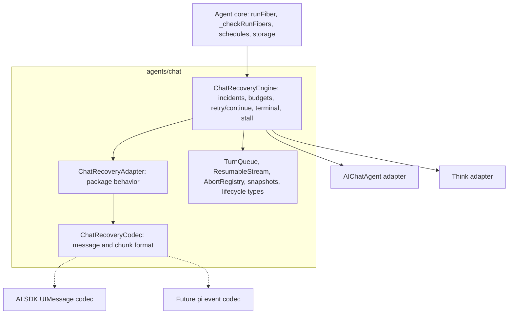
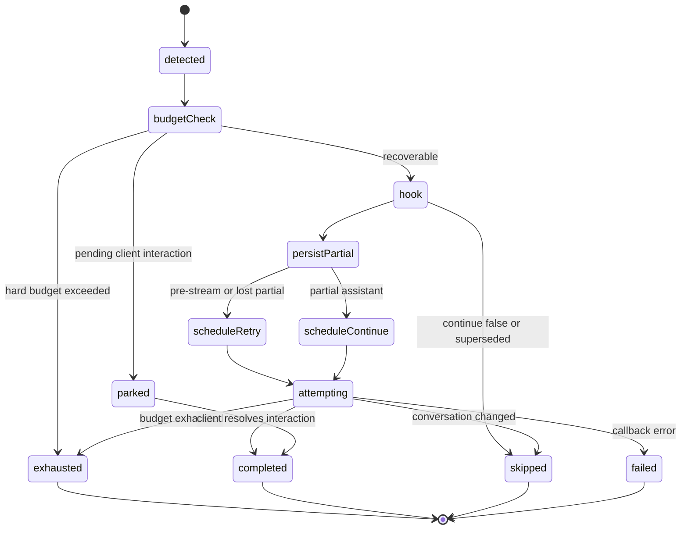
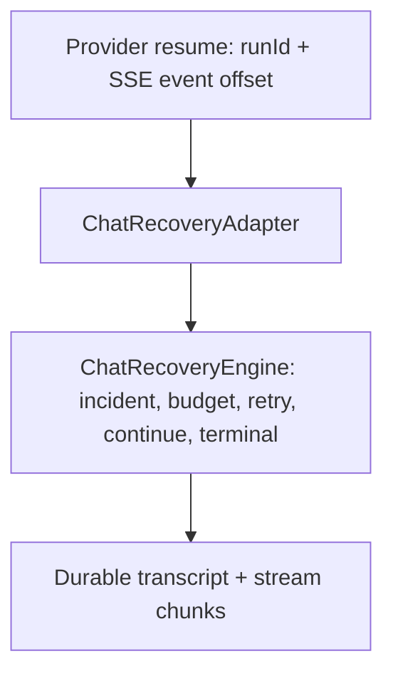

Status: proposed

# RFC: Shared chat recovery foundation

Related:

- [chat-shared-layer.md](./chat-shared-layer.md)
- [rfc-chat-recovery-work-budget.md](./rfc-chat-recovery-work-budget.md)
- [rfc-ai-chat-maintenance.md](./rfc-ai-chat-maintenance.md)
- [think-vs-aichat.md](./think-vs-aichat.md)

## The problem

`@cloudflare/ai-chat` and `@cloudflare/think` now have a sophisticated durable
chat recovery system: a turn can survive browser disconnects, Durable Object
hibernation, process death, deploy churn, partial streaming failures, pending
client tool/HITL interactions, and exhausted recovery budgets.

The underlying idea is strong, but the implementation is not in a strong
long-term shape. The durable recovery engine is duplicated across:

- [packages/ai-chat/src/index.ts](../packages/ai-chat/src/index.ts)
- [packages/think/src/think.ts](../packages/think/src/think.ts)

The shared `agents/chat` layer already owns important primitives:

- [packages/agents/src/chat/turn-queue.ts](../packages/agents/src/chat/turn-queue.ts)
- [packages/agents/src/chat/submit-concurrency.ts](../packages/agents/src/chat/submit-concurrency.ts)
- [packages/agents/src/chat/resumable-stream.ts](../packages/agents/src/chat/resumable-stream.ts)
- [packages/agents/src/chat/recovery.ts](../packages/agents/src/chat/recovery.ts)
- [packages/agents/src/chat/lifecycle.ts](../packages/agents/src/chat/lifecycle.ts)
- [packages/agents/src/chat/message-builder.ts](../packages/agents/src/chat/message-builder.ts)
- [packages/agents/src/chat/stream-accumulator.ts](../packages/agents/src/chat/stream-accumulator.ts)
- [packages/agents/src/chat/protocol.ts](../packages/agents/src/chat/protocol.ts)

The core durable execution primitive is also shared in
[packages/agents/src/index.ts](../packages/agents/src/index.ts): `runFiber`,
`_runFiberWithStashWrapper`, `_checkRunFibers`,
`_handleInternalFiberRecovery`, and `FiberRecoveryContext`.

What is not shared is the recovery orchestration policy. Both `AIChatAgent` and
`Think` carry their own copies of the same large state machine:

- `_runChatRecoveryFiber`
- `_handleInternalFiberRecovery`
- `_beginChatRecoveryIncident`
- `_chatRecoveryContinue`
- `_chatRecoveryRetry`
- `_exhaustChatRecovery`
- `_persistOrphanedStream`
- `_getPartialStreamText`
- `_bumpChatRecoveryProgress`
- terminal replay helpers
- stable-timeout reschedule helpers
- HITL park helpers
- retry-vs-continue classification
- request-context restore
- recovery observability emission

This is already causing drift. Some comments in the code explicitly say one
helper mirrors the same helper in the other package. That is a warning sign: the
recovery path is one of the highest-risk pieces of the chat stack, and it is
being maintained by copying changes between two large files.

### Recovery and hibernation layers

The current system has several related but separate recovery layers.

1. **Reconnect resume.** A browser disconnects while the Durable Object is still
   alive. The server keeps reading the provider stream, persists stream chunks
   through `ResumableStream`, and replays buffered chunks to the reconnecting
   client.

2. **WebSocket hibernation.** The Durable Object has hibernated sockets and no
   active JavaScript isolate. A later client message, reconnect, alarm, or
   platform event wakes a new isolate that must restore enough chat state to
   route the message, replay any active stream metadata, and run fiber recovery
   before user `onStart()` code can accidentally overwrite recovery context.
   This is not always a crash: a clean hibernation should not create a false
   recovery incident, but it exercises the same boot/rehydration path.

3. **Durable turn recovery.** The Durable Object isolate dies, a deploy happens,
   or the process crashes mid-turn. The provider stream reader is gone. On the
   next wake, `Agent._checkRunFibers()` detects an orphaned `runFiber` row and
   dispatches the recovery hook. The chat agent reconstructs the partial
   assistant state, persists what is safe to persist, and schedules either a
   retry or a continuation through Durable Object alarms.

All three layers matter. `ResumableStream` is already shared. WebSocket
hibernation and durable turn recovery both depend on correct wake-time
rehydration. Durable turn recovery orchestration is not shared today.

### Current shared pieces

The existing shared layer is useful but incomplete.

`packages/agents/src/chat/recovery.ts` defines `ChatFiberSnapshot` and helpers
to wrap/unwrap the initial fiber stash. It captures request identity,
continuation status, latest message IDs, `lastBody`, and `lastClientTools`.

`packages/agents/src/chat/lifecycle.ts` defines shared public types:

- `ChatRecoveryContext`
- `ChatRecoveryOptions`
- `ChatRecoveryConfig`
- `ResolvedChatRecoveryConfig`
- `ChatRecoveryExhaustedContext`
- `ChatRecoveryProgressContext`
- `SaveMessagesOptions`
- `SaveMessagesResult`
- `ChatResponseResult`
- `MessageConcurrency`

Those files describe the public shape, but they do not run recovery. The
incident state machine, scheduling, terminalization, pending-interaction
handling, orphan persistence, and retry/continue decisions still live in each
consumer package.

### Current behavioral drift

Some divergence is intentional product behavior. Some is accidental drift. Some
is an improvement that should be shared.

Important differences today include:

- `Think` has a live stall watchdog (`_iterateWithStallWatchdog`,
  `_routeStallToBoundedRecovery`, `ChatStreamStalledError`) that routes an
  in-isolate stalled stream into the same bounded recovery path. `AIChatAgent`
  does not have equivalent protection.
- `Think` defaults `chatRecovery` to `true`; `AIChatAgent` defaults it to
  `false`.
- `Think` replays recovering state on connect; `AIChatAgent` currently does not.
- `Think` has stronger recovery callback error handling.
- `Think` has durable submission recovery and must complete, skip, or park
  submissions correctly.
- `AIChatAgent` has client/server reconciliation behavior required by the AI SDK
  React client, which `Think` mostly avoids through its Session persistence
  model.
- Progress accounting differs: `AIChatAgent` records progress on meaningful
  chunks, while `Think` often records progress around durable chunk flushes and
  tool-output paths.
- Terminal delivery ordering differs: `AIChatAgent` records terminal state
  before broadcasting, while `Think` favors a broadcast-first path in parts of
  the exhaustion flow for deploy/storage-failure resilience.

The goal is not to preserve every difference forever behind an abstraction. When
one implementation has better behavior, we should converge both packages on that
behavior intentionally, with tests and release notes.

### AI SDK coupling

The implementation is currently AI SDK oriented, but not every part is AI SDK
specific.

AI SDK specific pieces include:

- `UIMessage` and `UIMessageChunk`
- `toUIMessageStream()` / `toUIMessageStreamResponse()` stream shape
- chunk-to-parts assembly in `message-builder.ts`
- `StreamAccumulator`
- `convertToModelMessages` and continuation checkpoint repair in `Think`
- client-side `@ai-sdk/react` transport behavior
- client/server assistant ID reconciliation in `AIChatAgent`
- tool part states such as `input-available`, `output-available`,
  `approval-requested`, and dynamic tool parts

Generic pieces include:

- serialized turn queueing
- submit concurrency policies
- abort registry
- resumable stream byte storage
- fiber snapshots
- incident budgets
- progress/work accounting
- alarm scheduling
- terminal replay via WebSocket resume handshake
- recovering-state delivery
- observability event names
- retry-vs-continue orchestration

This suggests a split: the shared recovery engine should be format-agnostic
where possible, but the seam cannot be just a message/chunk codec. Much of the
current variance is behavioral: persistence model, HITL semantics, submission
lifecycle, terminal UX, and reconnect policy.

## The proposal

Introduce a shared, internal, composition-based recovery foundation in
`packages/agents/src/chat`.

The foundation has three conceptual parts:

1. `ChatRecoveryEngine` - shared policy and orchestration.
2. `ChatRecoveryAdapter` - package-specific behavior and host operations.
3. `ChatRecoveryCodec` - message/chunk format normalization, initially AI SDK
   oriented and later extensible to other harnesses.

The engine should be treated as sibling-package support, not as a public API for
application developers. Users should continue to interact with:

- `chatRecovery`
- `onChatRecovery`
- `onExhausted`
- `shouldKeepRecovering`
- `stash()`
- `continueLastTurn`
- existing `AIChatAgent` and `Think` APIs

There should be no new app-developer import required to get recovery behavior.

### Shape of the engine

`ChatRecoveryEngine` owns the durable recovery state machine.

Responsibilities:

- Wrap chat turns in durable fibers through the adapter's fiber seam.
- Detect and classify recovered chat fibers.
- Create and update `ChatRecoveryIncident` records.
- Apply attempt, no-progress, work-budget, and caller-predicate limits.
- Keep retry and continue attempts under one incident identity.
- Debounce deploy storms so repeated wakes do not burn the attempt budget.
- Park recovery when the turn is waiting on a client/HITL interaction.
- Decide _whether_ to persist a recoverable orphan partial (the adapter does the
  write; see "Persist-orphan boundary" below).
- Schedule `_chatRecoveryContinue` or `_chatRecoveryRetry`.
- Reschedule after stable-timeout churn without self-deduping the alarm row.
- Terminalize exhausted recovery and invoke `onExhausted`.
- Preserve the terminal replay path used by `useAgentChat`.
- Emit `chat:recovery:*` observability events with compatible payloads.
- Coordinate optional live stall recovery.
- Handle recovery callback errors consistently.

It should not own:

- The public `onChatMessage` contract.
- Provider invocation.
- AI SDK `UIMessage` semantics.
- The package's canonical message store.
- `Think` Session internals.
- `AIChatAgent` message reconciliation.
- `Think` durable submission lifecycle.
- WebSocket protocol parsing outside recovery-specific frames.
- Public defaults for `chatRecovery`.

### Recovery surface map

Recovery is not a single entry point. The current code reaches recovery-adjacent
logic from several places, and the refactor must be explicit about which layer
owns each one. Otherwise the extraction silently drops a `Think`-only path.

| Surface                           | Today                                                                                                                | Ownership after refactor                                                                |
| --------------------------------- | -------------------------------------------------------------------------------------------------------------------- | --------------------------------------------------------------------------------------- |
| Fiber recovery on wake            | `Agent._checkRunFibers()` -> `_handleInternalFiberRecovery` in each package                                          | Engine. Dispatched through the adapter's fiber seam.                                    |
| Incident lifecycle and budgets    | `_beginChatRecoveryIncident`, progress, attempt/work limits                                                          | Engine.                                                                                 |
| Retry vs continue scheduling      | `_chatRecoveryContinue`, `_chatRecoveryRetry`                                                                        | Engine policy; adapter executes the actual turn.                                        |
| Terminalization and replay        | `_exhaustChatRecovery`, `_recordChatTerminal`, `_replayTerminalOnResume`                                             | Engine policy; adapter delivers UX.                                                     |
| Messenger/workflow fiber dispatch | `Think` delegates first: `_messengerRuntime?.handleFiberRecovery(ctx)` ([think.ts](../packages/think/src/think.ts))  | Adapter. Runs before chat recovery via `tryHandleNonChatFiberRecovery`.                 |
| Durable submission drain          | `Think` constructor + submission lifecycle hooks                                                                     | Adapter. Engine provides hooks; `AIChatAgent` adapter no-ops.                           |
| Agent-tool child-run reconcile    | `_reconcileOwnStaleAgentToolChildRuns` in both packages                                                              | Adapter. Engine calls it after recovery completes.                                      |
| Resume-ACK orphan persist         | `_persistOrphanedStream` reached from a resume ACK (not a fiber) ([ai-chat index](../packages/ai-chat/src/index.ts)) | Adapter (reconnect-resume layer). Shares the adapter orphan writer with fiber recovery. |
| Live stall route                  | `Think._routeStallToBoundedRecovery`                                                                                 | Adapter input into engine; opens an incident sharing identity with deploy recovery.     |

Explicit non-goals for this refactor (named so reviewers know they are out of
scope, not forgotten):

- Parent agent-tool re-attach (`Agent._scheduleAgentToolRunRecovery`) stays in
  `Agent`. The only constraint is an ordering invariant: chat fiber recovery runs
  before user `onStart()` and before parent agent-tool re-attach on wake.
- Context-overflow compact-and-retry inside the inference loop is a different
  failure class and stays in `Think`.
- Facet/sub-agent fiber recovery (`Agent._checkFacetRunFibers`) is out of scope.
- `onStart` media/`SQLITE_NOMEM` boot degradation stays package-owned; recovery
  classification must read durable state where the in-memory cache is degraded
  (see "Boot-time degraded reads" below).

### Adapter seam

`ChatRecoveryAdapter` is the main seam. It is behavioral, not just a codec.

Illustrative shape:

```ts
type ChatRecoveryAdapter = {
  readonly name: "AIChatAgent" | "Think" | string;
  readonly snapshotKind: string;
  // New snapshots are written under one shared envelope key
  // (`__cfChatFiberSnapshot`, owned by the engine). Adapters only list their
  // legacy per-package keys so pre-cutover rows still unwrap on read.
  readonly legacySnapshotEnvelopeKeys: readonly string[];
  readonly chatFiberName: string;

  getRecoveryConfig(): ResolvedChatRecoveryConfig;
  getMessages(): unknown[];
  getLatestLeaf(): Promise<RecoveredLeaf | null>;
  findLatestUserMessage(): Promise<RecoveredUserMessage | null>;

  restoreRecoveredRequestContext(ctx: RecoveredRequestContext): Promise<void>;
  rehydrateBeforeBudgetCheck?(): Promise<void>;

  // Post-v1 extension. Not implemented in the first ship. The engine is designed
  // to accommodate provider-level resume via opaque outcomes (see "Relationship
  // to Workers AI Gateway resume"), but v1 ships transcript-level recovery only.
  getProviderResumeCheckpoint?(): Promise<ProviderResumeCheckpoint | null>;
  tryProviderResume?(input: ProviderResumeInput): Promise<ProviderResumeResult>;

  // Non-chat fibers (messenger/workflow) get first refusal before chat recovery.
  tryHandleNonChatFiberRecovery?(ctx: FiberRecoveryContext): Promise<boolean>;

  // Classification is adapter-owned: stream-terminal alone is not enough.
  classifyRecoveredTurn(input: ClassifyRecoveredTurnInput): Promise<{
    kind: "retry" | "continue" | "skip";
    retryTargetUserId?: string;
    targetAssistantId?: string;
    skipReason?: string;
  }>;

  resolveStreamForRecovery(requestId: string): Promise<{
    streamId: string | null;
    streamStillActive: boolean;
    streamIsTerminal: boolean;
  }>;
  getPartialForStream(streamId: string): Promise<RecoveredPartial>;
  persistOrphanPartial(input: OrphanPersistInput): Promise<void>;
  completeOrphanStream?(streamId: string): Promise<void>;

  hasPendingInteractionForStable(): Promise<boolean>;
  hasPendingInteractionForBudget(): Promise<boolean>;
  parkForPendingInteraction(input: ParkRecoveryInput): Promise<void>;

  continueRecoveredTurn(
    input: ContinueRecoveryInput
  ): Promise<RecoveryTurnResult>;
  retryRecoveredUserTurn(
    input: RetryRecoveryInput
  ): Promise<RecoveryTurnResult>;
  handleConversationSuperseded(input: SupersededRecoveryInput): Promise<void>;

  // Durable submissions (Think). ai-chat adapter no-ops, but the engine must not
  // assume submissions are absent.
  completeSubmissionAfterRecovery?(
    input: SubmissionRecoveryInput
  ): Promise<void>;
  markSubmissionInterrupted?(input: SubmissionRecoveryInput): Promise<void>;

  // Stale agent-tool child runs after a recovered parent turn.
  reconcileAgentToolRunsAfterRecovery?(): Promise<void>;

  // Forward progress is recorded at stream production time, never on replay.
  onForwardProgressAtProductionTime(input: ForwardProgressInput): Promise<void>;

  // Scheduled-callback failures: distinguish app failure from platform transient.
  handleScheduledRecoveryError(
    input: ScheduledRecoveryErrorInput
  ): Promise<ScheduledRecoveryErrorOutcome>;

  setRecovering(input: RecoveringStateInput): Promise<void>;
  deliverTerminal(input: TerminalDeliveryInput): Promise<void>;
  replayTerminalOnResume(input: TerminalReplayInput): Promise<boolean>;

  onRecoveryEvent(input: RecoveryEventInput): void;
  log(level: "info" | "warn" | "error", message: string, meta?: unknown): void;

  // Host operations. The agent that implements the adapter is also the host, so
  // there is no separate `ChatRecoveryHost` type. These let the engine run the
  // state machine and stay unit-testable against a fake adapter (fake storage,
  // fake scheduler, deterministic clock) with no Workers runtime.
  schedule(
    delaySeconds: number,
    callback: "_chatRecoveryContinue" | "_chatRecoveryRetry",
    data: unknown,
    opts: { idempotent: boolean }
  ): Promise<void>;
  storageGet<T>(key: string): Promise<T | undefined>;
  storagePut<T>(key: string, value: T): Promise<void>;
  storageDelete(key: string): Promise<void>;
  storageList<T>(opts: { prefix: string }): Promise<Map<string, T>>;
  invokeOnChatRecovery(
    ctx: ChatRecoveryContext
  ): Promise<ChatRecoveryOptions | void>;
  getResumableStream(): ResumableStreamHandle;
};
```

The new methods reflect behavior that already exists in code but did not map onto
the original sketch:

- `classifyRecoveredTurn` replaces implicit retry-vs-continue logic. A
  stream-terminal check alone is not sufficient: `Think` also consults
  `_shouldPersistOrphanedPartial` and `_hasPersistedRecoveredAssistant`, and
  `AIChatAgent` uses `_shouldRetryRecoveredPreStreamTurn`. The adapter returns the
  decision; the engine applies budgets and scheduling.
- `tryHandleNonChatFiberRecovery` preserves `Think`'s ordering where messenger and
  workflow fibers are dispatched before chat recovery claims a recovered fiber.
- `completeSubmissionAfterRecovery` / `markSubmissionInterrupted` extend
  `ContinueRecoveryInput` / `RetryRecoveryInput` with submission fields (such as
  `Think`'s `recoveredRequestId`). The engine threads them through scheduling; the
  `AIChatAgent` adapter leaves them unimplemented.
- `reconcileAgentToolRunsAfterRecovery` keeps `_reconcileOwnStaleAgentToolChildRuns`
  behavior under the adapter.
- `onForwardProgressAtProductionTime` makes explicit that progress is bumped from
  streaming/codec hooks while the turn is producing output, not from recovery
  replay or re-persisting already-stored chunks.
- `handleScheduledRecoveryError` converges both packages on `Think`'s stronger
  callback-error handling (app error terminalizes/marks failed; platform transient
  defers and reschedules without sealing the incident).

The actual interface should be smaller than this sketch if implementation shows
some operations can be derived rather than supplied. The important point is that
the seam must cover behavior and host I/O, not only message parsing. Because the
agent class is both the adapter and the host, the engine is constructed as
`new ChatRecoveryEngine(adapter)` with a single object - there is no second host
seam to wire.

Adapter-owned behaviors:

- How to inspect the latest persisted leaf.
- How to determine whether a pre-stream turn is retryable.
- How to reconstruct partial text/parts from stored stream chunks.
- How to preserve settled tool results even when `persist: false`.
- How to restore `lastBody`, `lastClientTools`, and stash data.
- (Post-v1) How to persist and restore provider-level resume checkpoints such as
  Workers AI Gateway `{ runId, eventOffset }`, and how to attempt provider-level
  byte-exact resume before falling back to transcript-level continuation.
- How to detect pending client/HITL interactions.
- How to wait for stable state before continuing.
- How to call `continueLastTurn` or retry the last user turn.
- How to reconcile or skip if the conversation changed.
- How to complete, skip, or park durable submissions.
- How to deliver recovering and terminal UX.
- How to record progress under package-specific streaming semantics.
- How to reconcile stale agent-tool child runs after recovery.

### Codec seam

`ChatRecoveryCodec<TMessage, TChunk>` is a narrower seam under the adapter.

It should contain only format knowledge:

- parse serialized chunk body
- serialize chunk body
- classify progress-bearing chunks
- classify replay chunks
- reconstruct a partial assistant from chunk bodies
- repair interrupted tool parts
- determine whether a message contains settled tool results
- find latest user/assistant messages if the transcript shape is generic enough
- normalize continuation checkpoints if the provider rejects assistant prefill

The initial codec will be AI SDK oriented and can reuse existing primitives:

- `applyChunkToParts`
- `StreamAccumulator`
- `sanitizeMessage`
- `enforceRowSizeLimit`
- `isReplayChunk`
- `normalizeToolInput`

This keeps the engine open to a future non-AI-SDK harness without pretending
that today's system is already fully generic.

### Persist-orphan boundary

Persisting an orphaned partial is the place where the "engine owns policy,
adapter owns the store" split is easiest to get wrong. In code today,
`_persistOrphanedStream` reconstructs messages, merges by message id /
`toolCallId`, writes the transcript, and (in `Think`) broadcasts. That is store
knowledge, not policy. The boundary should be three explicit responsibilities:

1. **Adapter reports state.** `resolveStreamForRecovery(requestId)` returns
   `{ streamId, streamStillActive, streamIsTerminal }`, and `getPartialForStream`
   returns the reconstructed partial. This is the only way the engine learns
   about the stream.
2. **Engine decides.** `shouldPersistOrphan(flags)` is engine policy over
   adapter-supplied flags only (`streamStillActive`, `streamIsTerminal`,
   `hasPartial`, `hookOptions`, `hasSettledToolResults`). The engine never reads
   the transcript directly.
3. **Adapter writes.** `persistOrphanPartial` is the sole transcript writer. It
   owns merge/reconcile/broadcast, stream-metadata message-id resolution, and
   preserving settled tool results even when `onChatRecovery` returns
   `{ persist: false }`.

The reconnect-resume layer reaches the same `persistOrphanPartial` writer from a
resume ACK rather than from fiber recovery. That path is adapter-owned and shares
the writer so the two layers cannot diverge on how an orphan is persisted.

### Architecture



### Recovery state machine

The shared engine should make this state machine explicit and testable:



### Public API stance

This RFC does not propose a new public recovery API.

`ChatRecoveryEngine`, `ChatRecoveryAdapter`, and `ChatRecoveryCodec` are internal
sibling-package support. They are marked `@internal`, not exported from the
`agents` package root, and not documented for application developers. We own all
the consumers (`AIChatAgent`, `Think`, and the internal pi validation adapter),
so there is no reason to expose them. If a barrel re-export is needed for build
reasons, it stays `@internal`. Promoting any of these to a public API is a
separate future decision, not part of this refactor.

Existing public hooks and config remain the supported surface:

```ts
chatRecovery: ChatRecoveryConfig;

protected onChatRecovery(
  ctx: ChatRecoveryContext
): Promise<ChatRecoveryOptions | void>;
```

`ChatRecoveryConfig` remains class-field or constructor configuration. The
existing warning remains important: recovery budgets are evaluated before
`onStart()` runs after a wake, so assigning `chatRecovery` in `onStart()` is too
late for the interrupted turn that matters.

## Better-behavior convergence

The refactor should not preserve every current divergence as permanent adapter
policy. When one package has clearly better recovery behavior, both packages
should converge on that behavior intentionally.

### Convergence matrix

| Area                           | Current `AIChatAgent`                        | Current `Think`                                            | Proposed shared behavior                                                                                                                                                            |
| ------------------------------ | -------------------------------------------- | ---------------------------------------------------------- | ----------------------------------------------------------------------------------------------------------------------------------------------------------------------------------- |
| Durable recovery default       | `chatRecovery = false`                       | `chatRecovery = true`                                      | Keep defaults per package unless a separate semver-visible RFC changes them. The engine does not own defaults.                                                                      |
| Live stalled stream            | No bounded stall watchdog                    | Routes stalls into bounded recovery                        | Adopt shared stall recovery in both packages, enabled by default when `chatRecovery` is on. `AIChatAgent` gains a default stall timeout. Changeset required.                        |
| Recovery callback errors       | Less complete handling                       | Stronger callback-error handling                           | Adopt Think's stronger behavior for both packages: app errors terminalize or mark failed consistently; platform transients can defer.                                               |
| Recovering state on reconnect  | Not replayed on connect                      | Replayed on connect                                        | Prefer Think's better UX for both packages. Treat as a user-visible `AIChatAgent` behavior change.                                                                                  |
| Terminal delivery              | Resume handshake, persist-first in main path | Resume handshake, some broadcast-first resilience          | Keep resume-handshake delivery. Converge on terminal-before-seal ordering (durably record/deliver before sealing the incident); duplicate delivery tolerated, lost delivery is not. |
| Pending interaction predicates | Split stable wait vs client-budget predicate | More client-focused predicate                              | Converge on split predicates so server-tool stability and client/HITL budget exemption are not conflated.                                                                           |
| Durable submissions            | Not applicable                               | Must recover, park, complete, skip, or exhaust submissions | Keep as adapter-owned Think behavior. The engine provides hooks; `AIChatAgent` adapter no-ops.                                                                                      |
| Message reconciliation         | Required for AI SDK client IDs               | Session persistence avoids much of it                      | Keep adapter-owned. Do not force Think into ai-chat reconciliation.                                                                                                                 |
| Progress accounting            | Meaningful chunk types                       | Durable flush/tool-output oriented                         | Converge on one progress policy: bump only on new forward work at production time, never on replay/re-persist. Land with budget tests proving no regressions.                       |
| Terminal exhausted callback    | Existing public hook                         | Existing public hook plus durable-work effects             | Shared engine invokes hook, but adapter owns durable side effects.                                                                                                                  |

### Behavior decisions

#### Adopt shared stall recovery

`Think` can detect a live stream that is not making progress and route it into
bounded recovery. This is better than waiting for a deploy or isolate death to
surface the problem.

The shared engine supports stall detection as an input path into the same
incident budget machinery, and both packages use it.

Decision: `AIChatAgent` enables a default stall timeout when `chatRecovery` is
enabled, matching `Think`. We own both packages, so there is no reason to ship the
capability dark and flip it later; we converge now and cover it with a changeset
and tests. The stall timeout is configurable, so an app can tune or disable it.

#### Adopt stronger callback-error handling

Recovery callbacks can fail for two broad reasons:

- application-level failure: the recovered turn really failed and should be
  terminalized or marked failed
- platform/transient failure: storage, scheduling, or deploy churn interrupted
  the recovery callback itself

The shared engine should preserve the stronger behavior currently present in
`Think`: terminal UX should be delivered when the turn is unrecoverable, but
platform transients should not permanently seal the incident before terminal
state is durably delivered.

This is a correctness improvement for `AIChatAgent`.

#### Prefer recovering replay on connect

If a client reconnects while recovery is already in progress, the better UX is
to know the server is recovering rather than appearing idle.

The shared behavior should replay recovering state on connect for both packages,
while still clearing it on completion, exhaustion, skipped recovery, or HITL
park. Because this changes `AIChatAgent` client-visible state, it should be
called out in the changelog.

#### Preserve terminal delivery through resume handshake

Terminal recovery errors should continue to be delivered through the stream
resume handshake:

1. server reports a stream is resumable
2. client sends resume ACK
3. server replays errored chunks and sends a terminal error frame
4. `useAgentChat` receives the error through its active transport stream

Bare connect frames are not enough because they do not flow through the
transport stream reader in the right way.

#### Preserve settled tool results

`onChatRecovery` may return `{ persist: false }`, but settled tool results must
not be dropped. Tool outputs are often side effects that already happened. The
shared engine should treat "do not persist partial text" and "drop settled tool
results" as different decisions.

#### Keep retry and continue under one incident identity

The current recovery identity intentionally excludes `recoveryKind`. An incident
can begin as a retry and later become a continue, or vice versa, without
resetting budgets. The shared engine should preserve this.

#### Keep schedule callback names stable

The scheduled callback names `_chatRecoveryContinue` and `_chatRecoveryRetry`
are effectively persisted data while a recovery is outstanding. Both packages
schedule recovery against those names, so the alarm rows in `cf_agents_schedules`
reference them by string. In addition, `Think` reads those rows back in
production through `_hasScheduledRecoveredContinuation`
([packages/think/src/think.ts](../packages/think/src/think.ts)), which queries
`WHERE callback = '_chatRecoveryContinue'`; `AIChatAgent` only queries those rows
in test helpers today. Either way, renaming the callbacks would strand old
schedule rows and break in-flight deploys. The engine may move logic behind those
callbacks, but the callback names should remain stable unless there is an
explicit migration.

## Edge-case invariants

These invariants should be treated as design constraints and test requirements.

### Boot order

`Agent._checkRunFibers()` runs on wake before user `onStart()`. Recovery config,
client-tool rehydration needed for recovery classification, and adapter
initialization must be available before budget evaluation.

### Boot-time degraded reads

Recovery classification reads the latest leaf during `_checkRunFibers`, before
`onStart()`. If `Think`'s in-memory message view is degraded after a boot failure
(for example media hydration or `SQLITE_NOMEM` degradation), the in-memory
transcript may not match durable state. `getLatestLeaf()` and
`classifyRecoveredTurn` must read durable transcript state, not a possibly empty
in-memory cache, so a degraded boot does not misclassify a recoverable turn.

### Hibernation wake order

WebSocket hibernation is a normal Durable Object lifecycle path, not only a
failure path. A hibernated object can wake because:

- a connected hibernated WebSocket sends a message
- a browser reconnects and asks to resume a stream
- a scheduled recovery alarm fires
- a platform event recreates the isolate

The shared engine must make this wake path explicit. On wake, the adapter should
restore stream metadata, recovering/terminal flags, request context, client tool
schemas, and any package-specific durable work state before recovery makes
budget or retry/continue decisions.

A clean hibernation with no orphaned fiber should not create a recovery incident
or bump recovery progress. A hibernation wake that discovers an orphaned chat
fiber should follow the same durable turn recovery path as deploy/process death.

### Hibernated sockets and active streams

Hibernated WebSockets can outlive the isolate that created them. Recovery must
not assume in-memory connection sets, pending resume connections, active stream
objects, or `_streamingMessage` references survive hibernation. Durable metadata
must be the source of truth after wake.

Client-visible behavior should remain consistent across hibernation:

- a resume request after hibernation should either replay durable chunks, report
  no resumable stream, or deliver terminal replay through the ACK path
- recovering state should be replayed according to the chosen shared behavior
- hibernation without active recovery should not show a false recovering state
- hibernation should not duplicate assistant messages or stream chunks

### ACK versus fiber recovery race

A reconnect ACK can cause `ResumableStream.replayChunks()` to finalize an
orphaned stream while the fiber recovery path is also inspecting the same
stream. Recovery must check whether the stream is still active before persisting
or finalizing the orphan partial.

### Pre-stream retry

If eviction happens before any assistant stream chunk is durably observed, the
correct behavior is usually retrying the last user turn rather than continuing a
nonexistent assistant. But the retry is only safe when the latest persisted leaf
is still the relevant user message and the stream metadata does not prove a
terminal assistant already exists.

### Partial assistant continue

If any recoverable assistant partial exists, recovery should persist it when
safe and continue from the last assistant state. Continuing must not merge into
the wrong assistant message. Stream metadata message IDs are important.

### Conversation supersession

If a user or client changed the conversation after the interrupted turn, the
recovery continuation may be stale. `AIChatAgent` and `Think` have different
side effects here because `Think` has durable submissions. The shared engine
should route this through adapter hooks.

### HITL and client tools

Pending client interactions are not stuck server work. They should not burn the
no-progress or attempt budget. Recovery should park and wait for the client
interaction to resolve.

The adapter needs two predicates:

- "Is the system stable enough to start a recovery continuation?"
- "Is this recovery budget-free because it is waiting on a client?"

Those are related but not identical.

### Stable-timeout rescheduling

Initial recovery schedules should be idempotent so deploy storms do not enqueue
many duplicate continuations.

Stable-timeout reschedules must not be idempotent against the currently
executing one-shot schedule row. If they are idempotent, they can dedupe
themselves and never fire.

### Terminal before seal

When recovery exhausts, terminal state must be delivered or durably recorded
before the incident is sealed as exhausted. If a platform transient interrupts
terminal delivery, the system should retry the give-up path rather than mark the
incident done and lose the terminal UX.

Duplicate terminal delivery is acceptable. Lost terminal delivery is not.

### Progress semantics

The progress counter is the basis for no-progress timeout reset and
`maxRecoveryWork`. It must not be bumped by mere replay or by reconstructing a
partial from already persisted chunks. It should be bumped only when the system
observes new forward work according to adapter policy.

### Provider-resume checkpoints (post-v1)

This is a forward-looking extension, not part of the first ship. It is documented
here so v1 does not paint itself into a corner. The engine vocabulary below must
exist from day one; the adapter implementation lands later.

Some providers can resume the upstream model stream directly. The Workers AI
Gateway merge RFC documents this for run-catalog models: the run path can return
`cf-aig-run-id`, and `resume(from=N)` replays from an SSE event index.

Those provider-level checkpoints are valuable but not sufficient on their own.
They should be treated as an adapter-owned fast path under chat recovery:

- the adapter persists `{ runId, eventOffset }` or an equivalent checkpoint as
  the stream advances
- hibernation wake and fiber recovery restore the checkpoint before
  retry/continue classification
- recovery first tries byte-exact provider resume when the checkpoint is valid
- if provider resume is expired or unavailable, recovery falls back to persisted
  partial + semantic continuation, retry, accept-partial, or terminalization

Provider resume replay must not double-count chat recovery progress for events
that were already emitted and persisted before interruption. Progress should
advance only when the resumed provider stream emits new complete events beyond
the persisted offset.

### Resume capability honesty

Provider capabilities vary. The Workers AI Gateway RFC calls out a current
transport split: the run path can provide resume (`cf-aig-run-id`) while the
gateway path provides server-side fallback/caching/log IDs but no run ID.

The chat recovery layer should not hide that trade-off. If the selected model
transport cannot provide provider-level resume, the adapter should report no
provider checkpoint and the shared engine should go directly to transcript-level
recovery. If a user requested an option that disables provider resume, that
belongs in provider/model configuration warnings, not in the chat recovery
engine.

### Terminal replay retention

Terminal records should survive connection drops during replay. If a client
drops mid-terminal replay, a later reconnect should still be able to receive the
terminal.

### Legacy snapshots and incidents

`ChatFiberSnapshot` version 1 and legacy unwrapped stash payloads must continue
to recover. The new unified envelope key `__cfChatFiberSnapshot` is used for new
writes, but `unwrapChatFiberSnapshot`
([packages/agents/src/chat/recovery.ts](../packages/agents/src/chat/recovery.ts))
must still accept the legacy per-package keys on read. Deprecated reason strings
such as `max_recovery_window_exceeded` must remain tolerated in persisted incident
records.

## Cutover deploy (mid-recovery)

The deploy that ships this refactor is itself a deploy-mid-recovery event. When
the new engine boots, it can find incidents, snapshots, and schedule rows written
by the old per-package code. The refactor must round-trip every persisted artifact
without a data migration. Today the `ChatRecoveryIncident` shape, its keys, and
the incident-id formula are duplicated verbatim in both packages and are not yet
in `agents/chat`; moving them must preserve the exact serialized contract.

### Cutover invariants

| Artifact                  | Requirement                                                                                                                                                                                                                                                         |
| ------------------------- | ------------------------------------------------------------------------------------------------------------------------------------------------------------------------------------------------------------------------------------------------------------------- |
| Incident KV records       | Same key prefix `cf:chat-recovery:incident:` and same JSON shape (including optional `workBaseline`, `recoveryRootRequestId`).                                                                                                                                      |
| Progress counter          | Same key `cf:chat-recovery:progress`.                                                                                                                                                                                                                               |
| Recovering / terminal KV  | Same keys `cf:chat:recovering` and `cf:chat:last-terminal`.                                                                                                                                                                                                         |
| Incident id formula       | `(recoveryRootRequestId ?? requestId) + ":" + (latestUserMessageId ?? "")`, with `recoveryKind` still excluded.                                                                                                                                                     |
| Snapshot envelope keys    | New writes use one shared key `__cfChatFiberSnapshot`. Reads tolerate the legacy per-package keys (`__cfAIChatFiberSnapshot`, `__cfThinkChatFiberSnapshot`) for pre-cutover rows. Unwrap by trying the shared key, then the adapter's `legacySnapshotEnvelopeKeys`. |
| Schedule callback names   | `_chatRecoveryContinue` / `_chatRecoveryRetry` unchanged.                                                                                                                                                                                                           |
| Schedule payload fields   | Unknown/extra fields tolerated (for example `Think`'s `recoveredRequestId` must survive a round-trip through new code).                                                                                                                                             |
| Deprecated reason strings | Strings such as `max_recovery_window_exceeded` remain tolerated.                                                                                                                                                                                                    |

### Cutover testing

- Golden fixtures: load pre-cutover incident records, snapshot envelopes, and
  schedule payloads captured from both packages, and assert the new engine
  recovers them.
- Single-release expectation: because old code schedules and new code's
  `_chatRecoveryContinue` runs on the same wake, the engine and adapters must read
  both old and new shapes for at least one release.
- Local SIGKILL smoke across the cutover: kill wrangler mid-stream before merge,
  upgrade in place, then wake and assert recovery completes.

## Relationship to Workers AI Gateway resume (post-v1)

Provider-level resume is a post-v1 adapter extension. v1 ships transcript-level
recovery (retry/continue/terminalize) only. This section exists so the v1 engine
is designed to accept the extension later without an engine rewrite: the engine
speaks only opaque resume outcomes ("available", "succeeded", "expired",
"unavailable"), and the adapter owns everything provider-specific. None of the
provider-resume work blocks the v1 merge.

[rfc-workers-ai-gateway-merge.md](./rfc-workers-ai-gateway-merge.md) is directly
related. It solves a lower-level problem: how a Workers AI / AI Gateway backed
provider can resume an upstream model stream from a provider-owned buffer.

That RFC established:

- run-catalog models on the Workers AI run path can return `cf-aig-run-id`
- resume uses an SSE event index (`from=N`), not a byte offset or UI message part
  index
- the resumed stream should be fed back through the provider's own parser
- provider-level resume can be byte-exact when the upstream buffer still exists
- provider-level resume expires, at which point callers need a fallback
- not every transport supports resume; gateway-only features can disable it

The chat recovery foundation sits above that. It should use provider resume as a
fast path when available, but it must still own the broader incident lifecycle.

### Layering



Provider resume answers:

- Can we reattach to the same upstream model run?
- From which complete SSE event should replay resume?
- Did the upstream provider buffer expire?
- Is byte-exact tail replay still possible?

Chat recovery answers:

- Is this interruption part of an existing recovery incident?
- Should the turn retry, continue, park, accept partial, or terminalize?
- Has the recovery made progress recently?
- Has the work budget been exceeded?
- What should the client see while recovery is active?
- What durable transcript state is safe to persist?

### Recovery ladder

When an interrupted stream has a provider checkpoint, the adapter should expose
it to the engine as a best-effort resume option. The recovery ladder becomes:

1. **Provider resume.** Reattach using `{ runId, eventOffset }` and stream the
   byte-exact tail through the same provider parser.
2. **Semantic continuation.** If provider resume expired or is unavailable,
   persist the partial assistant state and continue from the durable transcript.
3. **Retry.** If no assistant partial exists, retry the last user turn.
4. **Accept partial or terminalize.** If policy says recovery should stop, persist
   the chosen terminal/partial state and surface it to the client.

This ladder should be adapter-owned at the provider-specific edges and
engine-owned at the policy edges. The engine should not understand
`cf-aig-run-id` directly; it should understand "provider resume checkpoint
available", "provider resume succeeded", "provider resume expired", and
"provider resume unavailable".

### Checkpoint shape

The exact shape should stay adapter-owned, but a Workers AI Gateway checkpoint is
likely to look like:

```ts
type WorkersAIGatewayResumeCheckpoint = {
  kind: "workers-ai-gateway";
  runId: string;
  eventOffset: number;
  transport: "run";
  model: string;
  capturedAt: number;
  expiresAt?: number;
};
```

The adapter may store this inside `stash()` recovery data, stream metadata,
request context, or package-specific durable state. The RFC does not mandate the
storage location. It does require that hibernation wake and fiber recovery can
restore it before classification.

### Capability interactions

The Workers AI Gateway RFC documents a transport split: run-path calls can carry
resume, while gateway-path calls can carry server-side fallback, caching, and log
IDs. Until Cloudflare exposes a run ID on the gateway path, a caller cannot have
both provider-level resume and gateway-only features in one call.

This chat recovery RFC should not blur that boundary. If provider resume is
disabled by model/transport choice, chat recovery still works through transcript
continuation/retry. It is just less exact and may spend more tokens.

### Testing implications

These scenarios gate the provider-resume extension, not the v1 merge. They are
listed here so the extension has a ready test plan when it lands.

When provider resume ships, the chat recovery test plan should add
gateway-resume-specific scenarios:

- provider checkpoint is persisted as events stream
- hibernation wake restores checkpoint before recovery classification
- deploy/process death after event offset `N` resumes byte-exactly from `N`
- resumed provider events do not duplicate already persisted chat chunks
- provider resume expiry falls back to semantic continuation
- gateway-only options produce no provider checkpoint and use transcript recovery
- repeated deploy churn advances the provider event offset without resetting the
  chat recovery incident incorrectly

## Genericity and future harnesses

The main near-term consumer remains the AI SDK `UIMessage` system. The proposed
design should not overfit to it.

A future harness such as
[pi](https://github.com/earendil-works/pi/tree/main/packages/agent) has a
different conceptual shape:

- transcript: `AgentMessage[]`
- stream: agent events such as `message_update`, `message_end`,
  `tool_execution_start`, `tool_execution_end`
- model conversion: `convertToLlm`
- continuation: `continue()` from existing context
- custom messages: filtered or transformed before model calls

That maps naturally onto the adapter/codec split:

- `ChatRecoveryAdapter` owns how to persist and continue a pi agent context.
- `ChatRecoveryCodec` owns how pi events become recoverable partial assistant
  state and progress events.
- The shared engine still owns incident budgets, scheduling, terminalization,
  HITL park, and retry/continue orchestration.

Supporting harnesses like pi is an explicit goal, not a hypothetical. To keep the
seam honest, this RFC commits to building a real pi adapter (with a small pi codec)
as a validation deliverable. It does not need to be a published package - an
internal fixture under `experimental/` is enough - but it must run the same shared
engine through the real recovery suites. If the engine cannot drive a pi adapter
without `UIMessage`-shaped assumptions leaking through, the seam is wrong and we
fix it before declaring the foundation done. Building the second harness is the
only credible proof that the abstraction is not accidentally AI-SDK-only.

## Testing strategy

This refactor should leave the test suite in a better place than today. The
testing strategy should be layered so each level catches a different class of
failure.

### Layer 1: shared engine unit tests

Location:

- `packages/agents/src/chat/__tests__/`

Use:

- fake `ChatRecoveryAdapter`
- fake storage
- fake scheduler
- deterministic clock
- deterministic progress counter
- no Workers runtime unless necessary

The goal is to test the incident state machine directly without involving AI SDK
streams, WebSockets, or real Durable Object storage.

Coverage:

- incident opens on recovered fiber
- incident identity excludes recovery kind
- first attempt behavior
- retry and continue share one budget
- attempt cap
- attempt reset on progress
- deploy-storm debounce does not burn attempts
- no-progress timeout
- work budget
- `maxRecoveryWork: Infinity`
- `shouldKeepRecovering` returns true
- `shouldKeepRecovering` returns false
- `shouldKeepRecovering` throws and is treated as keep-recovering
- no-progress timeout wins before predicate
- work budget wins before predicate
- HITL park marks the incident skipped/parked rather than exhausted
- HITL park clears recovering state
- initial recovery schedule uses idempotent scheduling
- stable-timeout reschedule uses non-idempotent scheduling
- terminal delivery happens before incident seal
- duplicate terminal delivery is tolerated
- terminal delivery transient leaves incident recoverable
- callback app error follows chosen shared behavior
- callback platform error follows chosen shared behavior
- deprecated persisted reason strings are tolerated
- legacy v1 fiber snapshot unwrap works

Suggested test names:

- `opens an incident for an orphaned chat fiber`
- `shares budget when retry becomes continue`
- `does not burn attempts inside deploy debounce window`
- `resets attempts after adapter-reported progress`
- `exhausts on no-progress timeout`
- `exhausts on finite work budget`
- `does not exhaust progressing work when maxRecoveryWork is Infinity`
- `parks budget-free while waiting on client interaction`
- `records terminal before sealing exhausted incident`
- `uses non-idempotent stable-timeout reschedules`

### Layer 2: adapter contract tests

Location:

- `packages/ai-chat/src/tests/`
- `packages/think/src/tests/`
- optionally a shared contract helper under `packages/agents/src/chat/__tests__/`

These tests should run the same behavioral contract against the `AIChatAgent`
adapter and the `Think` adapter, but only for the **shared subset**. Several
contract areas are `Think`-only (durable submissions, messenger/workflow fiber
dispatch, live stall recovery) and have no `AIChatAgent` equivalent; those run
against the `Think` adapter alone.

Coverage:

- pre-stream eviction classifies as retry
- partial assistant classifies as continue
- terminal stream metadata does not retry incorrectly
- changed latest leaf is treated as superseded
- stream metadata message ID is used when persisting orphan partials
- `{ persist: false }` still preserves settled tool results
- `lastBody` restores before recovered continuation
- `lastClientTools` restores before pending-interaction classification
- stash data reaches `onChatRecovery` as `recoveryData`
- pending interaction for stability is distinct from pending interaction for
  budget exemption
- adapter progress policy does not bump during replay
- recovering-state delivery follows chosen shared behavior
- terminal delivery follows resume-handshake behavior
- observability payloads match current event names and fields
- log prefixes remain package-specific

Think-specific contract coverage:

- recovered durable submission completes after recovered success
- recovered durable submission parks during HITL
- recovered durable submission skips on conversation supersession
- recovered durable submission exhausts with terminal state
- messenger/workflow fiber recovery is not intercepted by chat recovery

AIChatAgent-specific contract coverage:

- client/server assistant ID reconciliation remains intact
- stale AI SDK client messages do not duplicate assistant rows
- tool result replay does not regress settled tool parts
- `useAgentChat` receives terminal errors through transport streams

### Layer 3: package integration tests

Existing unit and integration tests become golden behavior. They should be
updated only where this RFC intentionally chooses a better shared behavior.

Important existing suites:

- `packages/ai-chat/src/tests/durable-chat-recovery.test.ts`
- `packages/ai-chat/src/tests/chat-recovery.test.ts`
- `packages/ai-chat/src/tests/continue-last-turn.test.ts`
- `packages/ai-chat/src/tests/ws-transport-resume.test.ts`
- `packages/ai-chat/src/tests/tool-result-replay.test.ts`
- `packages/ai-chat/src/tests/pending-interaction.test.ts`
- `packages/ai-chat/src/tests/errored-stream-replay.test.ts`
- `packages/ai-chat/src/tests/reconcile-identical-content.test.ts`
- `packages/ai-chat/src/tests/streaming-message-id.test.ts`
- `packages/think/src/tests/agents/think-session.ts`
- `packages/think/src/tests/errored-stream-replay.test.ts`
- Think tests for durable submissions, stall recovery, tool rollback,
  messenger recovery, workflow recovery, and assistant loop recovery

Hibernation at this layer is **simulated**: real WebSocket hibernation cannot be
driven inside `vitest-pool-workers`. Existing tests reconstruct `ResumableStream`
and clear in-memory state to model a wake (for example
`packages/ai-chat/src/tests/resumable-streaming.test.ts`). Real hibernation/process
death is covered in Layer 4.

Assertions to add or tighten:

- terminal error reaches `useAgentChat` through the resume handshake
- `useAgentChat` sets and clears `error` correctly after terminal recovery
- hibernation wake restores stream metadata before handling resume requests
- hibernation wake restores `lastBody`, `lastClientTools`, recovering state, and
  terminal replay state before recovery classification
- clean hibernation without an orphaned fiber does not create a recovery incident
- (post-v1) hibernation wake restores provider resume checkpoints before recovery
  classification
- (post-v1) provider resume success streams only new events beyond the persisted
  event offset
- (post-v1) provider resume expiry falls back to semantic continuation or retry
  according to policy
- `isRecovering` is true during live recovery
- `isRecovering` is restored on reconnect if recovery is already active
- `isRecovering` clears after completion
- `isRecovering` clears after exhaustion
- `isRecovering` clears after HITL park
- multi-tab reconnect preserves `STREAM_RESUME_NONE`
- terminal replay remains available after mid-replay disconnect
- settled tool results survive `{ persist: false }`
- initial recovery schedules are idempotent
- stable-timeout reschedules are non-idempotent
- observability event payloads remain compatible
- no public hook signature or import-path changes
- no app-developer imports are required
- intentional behavior changes from the convergence matrix (for example
  `AIChatAgent` recovering-replay-on-connect) are covered by changesets

### Layer 4: local e2e crash and reconnect tests

The refactor must be validated against real Durable Object persistence and real
WebSocket reconnect/hibernation behavior. Unit tests cannot model all timing
windows.

This layer already exists and should be extended, not invented. There is a real
SIGKILL + persistent-storage e2e suite (`.wrangler-e2e-state`) to build on.

Required harnesses (extend these in Phase 0):

- `packages/agents/src/e2e-tests/fiber-eviction.test.ts` and
  `packages/agents/src/e2e-tests/recovery-helpers.ts` - SIGKILL + persistent
  state primitives.
- `packages/ai-chat/src/e2e-tests/harness.ts` with
  `packages/ai-chat/src/e2e-tests/chat-recovery.test.ts`,
  `chat-recovery-outcomes.test.ts`, `chat-recovery-exhaustion.test.ts`,
  `chat-recovering-status.test.ts`, and `stream-buffer-cleanup.test.ts`.
- `packages/think/src/e2e-tests/chat-recovery.test.ts`, `stall-recovery.test.ts`,
  `submission-recovery.test.ts`, `messenger-recovery.test.ts`,
  `workflow-recovery.test.ts`, `context-overflow-recovery.test.ts`,
  `tool-rollback.test.ts`, `reattach-budget.test.ts`, and
  `persist-false-preserves.test.ts`.

Scenarios:

- kill/restart before the first assistant chunk
- kill/restart during text streaming
- kill/restart during reasoning streaming
- kill/restart during tool input streaming
- kill/restart after tool output but before assistant continuation
- kill/restart during `continueLastTurn`
- kill/restart during terminal exhaustion
- browser disconnect while Durable Object remains alive
- browser disconnect plus Durable Object death before reconnect
- hibernated WebSocket wakes the Durable Object with a normal chat message
- hibernated WebSocket wakes the Durable Object with a stream resume request
- hibernated WebSocket wakes while `cf:chat:recovering` is set
- hibernated WebSocket wakes after terminal state was recorded but before the
  client saw it
- hibernation after stream completion does not replay stale active stream state
- clean hibernation with no orphaned fiber does not schedule recovery
- (post-v1) provider resume checkpoint exists after event offset `N`; recovery
  reattaches and emits only the tail beyond `N`
- (post-v1) provider resume checkpoint has expired; recovery falls back to
  transcript-level continuation
- (post-v1) provider transport lacks resume capability; recovery skips provider
  resume and uses transcript-level recovery
- reconnect ACK races with fiber recovery
- repeated deploy churn over a long progressing turn
- explicit work budget catches a progressing runaway loop
- no-progress timeout catches a stuck turn
- pending client tool/HITL across deploy parks recovery
- client tool result after park resumes the turn
- multi-tab reconnect across deploy
- one tab receives live tail while another receives resume-none
- Think durable submission recovers after process death
- Think durable submission parks for HITL
- Think durable submission exhausts and records terminal state
- Think stall watchdog routes a live stalled stream into bounded recovery

Each e2e should assert both transcript state and wire-visible client state.

For transcript state, assert:

- no duplicate assistant messages
- no lost settled tool results
- correct final assistant text
- correct assistant message ID after orphan persistence
- correct submission status where applicable

For client state, assert:

- replayed chunks arrive in order
- (post-v1) provider-resumed chunks do not duplicate chunks already emitted
  before the persisted SSE event offset
- live tail continues after replay
- `isRecovering` state is correct
- terminal error is surfaced through the transport
- error and recovering state clear at the right time
- hibernation wake does not produce duplicate `start`, `finish`, or terminal
  frames
- hibernated sockets route `TOOL_RESULT`, `TOOL_APPROVAL`, cancel, clear, and
  resume messages through the same recovered state as fresh connections

### Layer 5: live deploy and chaos tests (follow-up, not a merge gate)

Layer 4 (the extended local SIGKILL + persistent-state e2e suites) is the
confidence gate for this refactor. Live deploy/chaos testing is a valuable
follow-up for catching real isolate-replacement and hibernation timing, but it
requires new infrastructure (fixtures, a controller, deploy credentials) and
should not block the v1 merge. It runs nightly/opt-in once it stabilizes.

The sketch below is intentionally brief; it is a starting point for the follow-up,
not a v1 deliverable.

Shape of the follow-up:

- Two internal fixtures (an `AIChatAgent` and a `Think` recovery fixture) using
  deterministic fake model/tool endpoints with stable markers (`chunk-1`,
  `tool-output-ready`, `continue-1`, `final`).
- A controller that can deploy a fixture, drive WebSocket clients, trigger a new
  deploy mid-stream, encourage hibernation via idle periods, reconnect, send tool
  results, and query test-only debug endpoints (no secrets).
- A minimum smoke set: deploy mid-text-stream continues; deploy before first
  chunk retries; idle hibernation wake takes a fresh request without a false
  incident; disconnect/reconnect replays without starting durable recovery;
  terminal exhaustion during disconnect replays through the resume handshake.
- Operational rules: opt-in `pnpm run test:recovery:live`, documented env
  (account, deploy token, safe worker prefixes), deterministic fakes, short
  timeouts, unique worker names, bounded runtime and cleanup, no secrets in the
  repo.

When this layer is built, promote a small smoke subset to scheduled/nightly CI.
Keep the full chaos suite opt-in unless it becomes fast and reliable enough for
PR CI.

### Layer 6: release gates

Before merging the implementation:

- `pnpm run check`
- shared `agents/chat` recovery engine tests
- targeted `AIChatAgent` recovery tests
- targeted `Think` recovery tests
- extended local e2e crash/reconnect tests (Layer 4) - this is the gate
- internal pi adapter runs the shared engine recovery subset (genericity proof)
- explicit reviewer checklist for behavior convergence items
- changelog/changeset for user-visible behavior changes
- live deploy smoke (Layer 5) is an optional follow-up, not a merge blocker

Reviewer checklist:

- Does `AIChatAgent` keep its public hook signatures and import paths unchanged?
- Does `Think` keep its public hook signatures and import paths unchanged?
- Is every intentional behavior change from the convergence matrix covered by a
  changeset?
- Are package defaults unchanged unless explicitly changed?
- Does the engine remain internal?
- Are schedule callback names stable?
- Are observability payloads compatible?
- Does terminal replay still go through resume ACK?
- Are settled tool results preserved?
- Are HITL/client interactions budget-free?
- Are stable-timeout reschedules non-idempotent?
- Did the extended local e2e suites pass for changed behavior?
- Does the internal pi adapter still recover through the shared engine?

## Implementation plan

### Phase 0: characterization tests

Before moving code, add or tighten tests around existing behavior. The goal is
to make current semantics executable.

Work:

- Add shared incident state-machine tests with fake adapters.
- Add package adapter contract tests.
- Add missing `AIChatAgent` tests for recovery callback errors if Think already
  has stronger coverage.
- Add `AIChatAgent` tests for reconnect recovering replay if the RFC chooses to
  converge on Think's better UX.
- Add tests proving schedule idempotency/non-idempotency invariants.
- Add tests proving terminal-before-seal behavior.

Exit criteria:

- The desired shared behavior is described by failing or passing tests before
  extraction begins.
- Known intentional behavior changes are identified and tracked.

### Phase 1: introduce internal engine scaffolding

Add internal files under `packages/agents/src/chat`, names illustrative:

- `recovery-engine.ts`
- `recovery-adapter.ts`
- `recovery-codec.ts`
- `ai-sdk-recovery-codec.ts`

Keep them internal unless build constraints require barrel exports.

Work:

- Move config resolution and incident math into pure functions first.
- Move storage key constants and incident helpers into the engine module.
- Keep existing `AIChatAgent` and `Think` private methods as callers initially.
- Add fake-adapter unit tests.

Exit criteria:

- No behavior changes.
- Shared unit tests cover incident budget behavior.

### Phase 2: wire `AIChatAgent`

Move `AIChatAgent` recovery orchestration behind the shared engine.

Work:

- Implement `AIChatAgentRecoveryAdapter`.
- Keep `_chatRecoveryContinue` and `_chatRecoveryRetry` callback names stable.
- Keep public hooks and config types unchanged.
- Preserve AI SDK message reconciliation.
- Preserve terminal replay through `WebSocketChatTransport`.
- Add the chosen better behaviors where tests require them.

Exit criteria:

- Existing ai-chat recovery tests pass.
- New adapter contract tests pass.
- E2E reconnect and terminal replay pass.

### Phase 3: wire `Think`

Move `Think` recovery orchestration behind the same shared engine.

Work:

- Implement `ThinkRecoveryAdapter`.
- Preserve Session persistence.
- Preserve durable submission recovery.
- Preserve messenger/workflow fiber recovery ordering.
- Preserve or converge stall watchdog behavior through the shared engine.
- Preserve tool rollback and agent-tool child-run reconciliation.

Exit criteria:

- Existing Think recovery tests pass.
- Durable submissions still recover correctly.
- Stall recovery still works.
- Tool rollback tests still pass.

### Phase 4: delete duplicate private logic

Once both packages are wired through the engine:

- Remove duplicated incident state-machine code.
- Remove copied helpers that are now owned by the engine.
- Keep thin package methods only where they are public hooks, scheduled callback
  entry points, or adapter behavior.
- Update comments that currently say helpers mirror the other package.

Exit criteria:

- Code search shows no duplicated `_beginChatRecoveryIncident` style engines in
  both packages.
- `agents/chat` owns the recovery policy.
- `AIChatAgent` and `Think` own package behavior.

### Phase 5: pi adapter validation

Build an internal pi adapter (and a small pi codec) that runs on the shared
engine. This is the genericity proof, not a product.

Work:

- Add an internal pi fixture under `experimental/` (no published package).
- Implement a `PiRecoveryAdapter` and `PiRecoveryCodec` over pi's
  `AgentMessage[]` transcript and agent-event stream.
- Run the shared engine unit suite and a recovery subset against the pi adapter.
- Record any place where the engine or adapter leaked a `UIMessage`-shaped
  assumption, and fix the seam.

Exit criteria:

- The pi adapter recovers a deploy/crash mid-stream through the same engine.
- No engine change was required that is specific to `UIMessage`.
- Any seam corrections are folded back into the AI SDK adapter and codec.

### Phase 6: confidence and e2e hardening

Extend the existing local e2e suites (Layer 4) so the SIGKILL + persistent-state
harnesses cover the converged behavior. This is the merge gate. Live deploy
smoke (Layer 5) is an optional follow-up that can run nightly once fixtures
stabilize.

Exit criteria:

- Extended SIGKILL e2e mid-stream recovery passes for `AIChatAgent` and `Think`.
- Terminal replay works after crash/disconnect in local e2e.
- Repeated crash churn over progressing work does not false-terminalize.
- Optional: live deploy smoke passes for any PR that changes engine behavior.

### Phase 7: documentation and release notes

After implementation:

- Update [chat-shared-layer.md](./chat-shared-layer.md) to describe recovery
  engine ownership.
- Add a history note linking this RFC.
- Add changesets/changelog entries for packages with user-visible behavior
  changes.
- Keep this RFC as the point-in-time decision record.

## Non-goals

This RFC does not propose:

- Replacing `AIChatAgent` with `Think`.
- Moving `AIChatAgent` onto `Think` Session storage.
- Changing `onChatMessage` signatures.
- Publishing a general third-party recovery engine API.
- Replacing the AI SDK React transport.
- Refactoring the full chat WebSocket protocol into a new base class.
- Changing `chatRecovery` defaults without an explicit semver decision.
- Removing `runFiber`.
- Changing how app developers configure recovery.
- Publishing a public pi package. (An internal pi adapter is in scope as a
  validation harness; shipping pi as a supported product is not.)

## The alternatives

### Leave the duplication

We could keep the two recovery engines and rely on discipline to sync fixes
between them.

Rejected. Recovery is too subtle for hand-synced private methods. The existing
drift already shows better behavior landing in one package but not the other.

### Shared abstract base class

We could introduce a shared `RecoverableChatAgent` base class and have
`AIChatAgent` and `Think` inherit from it.

Rejected. Both already extend `Agent`, and inheritance would push package
behavior into protected-method overrides. That is similar to the shape that made
the current code hard to reason about. Composition gives each package an
explicit adapter boundary.

### Mixin

We could use a mixin to inject recovery methods into both classes.

Rejected. A mixin hides dependencies and makes initialization order harder to
audit. Recovery depends on boot timing, storage, schedules, WebSocket UX, and
package-specific state. An explicit engine object is easier to test.

### Codec-only abstraction

We could define `ChatHarness<TMessage, TChunk>` as a message/chunk codec and
keep the rest of recovery in each package.

Rejected. The main duplication is not chunk parsing. It is incident policy,
budgets, scheduling, terminalization, HITL park, and retry/continue
orchestration.

### Adapter-only abstraction, no codec seam

We could make the adapter own all message/chunk behavior and skip a separate
codec.

Partially rejected. The adapter is the main seam, but a small codec seam is
useful because AI SDK message/chunk normalization is already shared and future
non-AI-SDK harnesses will need a place to normalize event streams.

### Preserve every current divergence as policy

We could use the adapter to preserve every difference between `AIChatAgent` and
`Think`.

Rejected as the default stance. Some differences are product defaults or storage
model necessities, but others are simply better behavior in one package. The
refactor should converge on the better behavior intentionally, with tests and
release notes.

### Publish `ChatRecoveryEngine`

We could expose `ChatRecoveryEngine` as a public `agents/chat` API for external
frameworks.

Rejected for now. The shape is not proven by a second real harness. Keep it
internal until a concrete adapter such as pi validates the API.

### New package

We could create a new package for recovery primitives.

Rejected. Both `ai-chat` and `think` already depend on `agents`, and
`agents/chat` is already the shared sibling-package layer. A new package adds
publishing and dependency complexity without solving a real boundary problem.

## Open questions and what could force a redesign

This RFC is confident in the direction but honest about where the ground is soft.
These are the risks most likely to change the shape of the work, called out so
reviewers can evaluate them directly rather than discovering them mid-implementation.

### Could force an interface redesign

- **Adapter shape surviving `Think` (Phase 3).** The adapter sketch is validated
  against today's code, but `Think`'s submission lifecycle, messenger/workflow
  fiber ordering, and live stall routing are the real stress test. If wiring
  `Think` needs hooks that do not generalize, the adapter interface will move.
  Expectation: the interface is provisional until Phase 3 lands; Phase 2 alone
  does not prove it.
- **Clean deletion in Phase 4.** The goal is to remove the duplicated state
  machine, not to replace it with thin wrappers in both packages that re-create a
  different kind of duplication. If too much logic has to stay package-side to
  preserve behavior, the engine boundary is in the wrong place and should be
  reconsidered before the duplication is deleted.
- **Pi adapter leaks (Phase 5).** If the internal pi adapter cannot recover
  through the engine without `UIMessage`-shaped assumptions, the codec/adapter
  split is wrong. That is the intended trip-wire, but it can invalidate parts of
  the seam.

### Could change scope or sequencing

- **Cutover safety.** The shipping deploy is itself a deploy-mid-recovery. If
  golden-fixture round-trip cannot be made reliable, the cutover may need a
  staged dual-read release rather than a single release. Golden fixtures must land
  in Phase 0, not be deferred.
- **Test fidelity.** Real WebSocket hibernation cannot be driven in
  `vitest-pool-workers`. We accept simulated hibernation at Layer 3 and the
  existing SIGKILL e2e suites at Layer 4 as the gate. If a class of timing bugs
  only reproduces live, Layer 5 may have to be promoted from optional to required
  sooner than planned.

### Accepted, not blocking

- Intentional `AIChatAgent` behavior changes (stall timeout, recovering-replay,
  callback-error handling) are semver-visible and ship with changesets. This is a
  deliberate convergence cost, not an open question.

If any of the "could force an interface redesign" items fire, the right response
is to pause extraction and revisit the seam, not to push through with a leaky
abstraction.

## The decision

Proposed:

- Add an internal shared `ChatRecoveryEngine` under `agents/chat`.
- Use composition, not inheritance.
- Make `ChatRecoveryAdapter` the single behavioral + host seam (no separate host
  type).
- Keep `ChatRecoveryCodec` narrow and message/chunk focused.
- Keep `ChatRecoveryEngine`, `ChatRecoveryAdapter`, and `ChatRecoveryCodec`
  strictly internal.
- Build an internal pi adapter to prove the seam is not AI-SDK-only.
- Keep existing public hooks and defaults unless explicitly changed.
- Converge decisively on the better behavior where current packages differ
  (stall recovery, callback-error handling, recovering-replay, terminal-before-seal,
  one progress policy), each with a changeset.
- Design for provider-level resume as a post-v1 adapter extension without
  building it in v1.
- Make the test strategy a prerequisite for implementation, with the extended
  local e2e suites as the merge gate and live deploy as an optional follow-up.

If accepted, implementation should proceed only after Phase 0 characterization
tests define the intended behavior.
