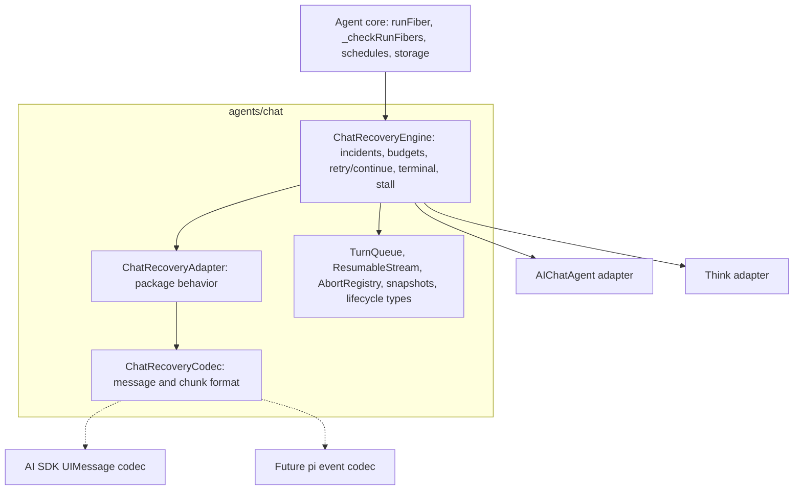
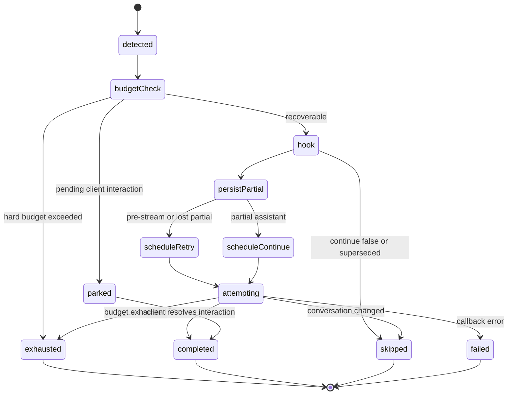
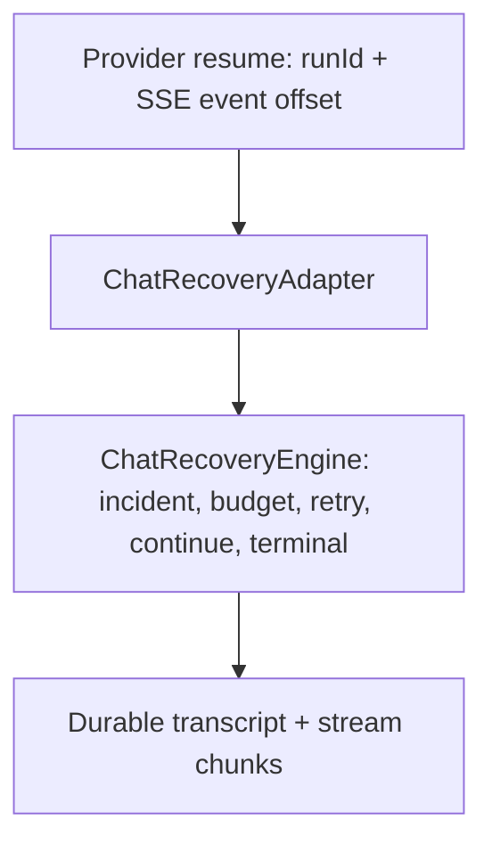

Status: accepted — foundation implemented (Phases 0–5 merged); post-v1 extensions tracked below

# RFC: Shared chat recovery foundation

Related:

- [chat-shared-layer.md](./chat-shared-layer.md)
- [rfc-chat-recovery-work-budget.md](./rfc-chat-recovery-work-budget.md)
- [rfc-ai-chat-maintenance.md](./rfc-ai-chat-maintenance.md)
- [think-vs-aichat.md](./think-vs-aichat.md)

## Current state & next steps (resume point)

> Quick orientation for a fresh working session. The authoritative detail lives in
> the **Progress log** (newest first) and the Phase 5 section; this block is the
> map, not the territory. Last updated after commit `d0c9585b` (Layer-5 live
> deploy/chaos suites landed + nightly wiring).
>
> _Archival note: the Progress log is kept inline while this branch is in flight
> (it is an active working artifact). At branch finalization, move it to a sibling
> `rfc-chat-recovery-foundation-progress.md` so this RFC freezes as a point-in-time
> record, per `design/AGENTS.md`._

**Where we are.** The shared recovery foundation (Phases 0–5) is implemented and
merged on the `chat-recovery-foundation` branch. The recovery engine, resume
handshake, and streaming codec all live in `agents/chat`; `@cloudflare/ai-chat`
and `@cloudflare/think` delegate to them, and the engine seam is
vocabulary-agnostic (`RecoveryPartial = { text, parts: unknown[],
hasSettledToolResults }`, each codec owns its own chunk vocabulary). Three codecs
exist: `AISDKRecoveryCodec` (prod), and the `experimental/pi-recovery` (pi
`AgentEvent`) + `experimental/tanstack-recovery` (AG-UI) harnesses.

**Guiding aim.** Share the implementation, converge on the behavior that is best
for the user, and keep per-package only what a product decision genuinely
dictates. ai-chat and Think already share the client contract (wire protocol +
AI-SDK `UIMessage` content model — one `useAgentChat` drives both), so remaining
divergences are server-side substrate or latent bug-asymmetries, not client
protocol. See **"Convergence philosophy (north star)"** for the litmus test
(behavior drift → converge; bug-asymmetry → fix in the shared primitive; product
substrate → keep per-package) and the ai-chat-as-subset end-state.

**Recently landed (most recent first).**

- `d0c9585b` — **Layer 5 live deploy/chaos — LANDED, validated on the real edge**
  (opt-in, not a merge gate). ai-chat's `deployed-recovery.test.ts` gained a
  false-positive guard (a completed turn is NOT spuriously recovered by
  reconnect/idle churn, and keeps serving) beside the mid-turn-redeploy eviction
  test; `experimental/chat-recovery-probe` gained `scripts/run-suite.mjs` (deploy
  under a throwaway name → run the fast abort-driven Think scenarios a6/a7/a8/idem
  → always delete). Root `test:recovery:live` runs both; gated nightly jobs
  (`e2e-deployed-ai-chat`, `e2e-deployed-think-probe`) stay off unless the
  `RUN_DEPLOYED_E2E` repo var / manual `run_deployed` dispatch enables them. See
  the **Layer 5** section for the real-edge realities discovered.
- `d7f3e5bc` / `f44227bf` / `55091855` — **e2e CI hardening** (no product change):
  promoted the previously manual-only SIGKILL suites to nightly jobs
  (`e2e-ai-chat-recovery`, `e2e-agents`, `e2e-engine-genericity`); added
  `pi-recovery`'s missing `test` script + `pi-codec.test.ts` (32 tests, matching
  tanstack's codec coverage) + READMEs for both genericity harnesses; fixed a
  `think` `assistant-e2e` post-test unhandled-rejection flake. (Deferred, tracked:
  unifying the divergent ai-chat/agents wrangler e2e harnesses — pure hygiene.)
- `16175930` / `ba05478e` — **branch cleanup, Tiers 1–2** (no behavior change):
  dedup the third hand-copied `sendIfOpen` (now imported from `connection.ts`),
  remove dead code (`targetAssistantId` engine field, pi-recovery `hasFiberRows`),
  `@internal`-group the recovery exports in the `agents/chat` barrel and prune 12
  zero-consumer barrel exports, and truth-up `chat-shared-layer.md` + this RFC.
- `754c7b0f` — **orphan-persist store seam promoted to a shared interface**: the
  by-convention store-write alignment from orphan-persist step (d) is now the
  type-enforced `OrphanPersistStore<M = UIMessage>` (the `SessionProvider` write
  subset, message-type-parameterized). Both hosts route their orphan-persist write
  through a host adapter typed against it (`agents` patch changeset). This is the
  first concrete step of the deferred "align the storage seam with `Session`"
  north-star item below.
- `66e7a790` / `b62241e9` — **engine-owned exhaustion helper** (API-ergonomics
  finding **#3**, closed): `runChatRecoveryExhaustion(input, { emit, onExhausted?,
onError, terminalize })` folds the `build → notify → terminalize` give-up
  sequence every host repeated, owning the invariant (notify before any terminal
  write; a throwing `onExhausted` never blocks terminal UX) while the host
  expresses its terminal writes in `terminalize(ctx)`. All four hosts moved onto
  it; the harnesses also gained a `_setChatRecovering` option-bag wrapper. A
  follow-up convergence then flipped `AIChatAgent`'s terminalize to
  **broadcast-first** (matching `Think`), removing the last divergent give-up
  ordering — both hosts now broadcast the banner before the durable writes
  (`@cloudflare/ai-chat` patch changeset). See the two newest Progress-log
  entries.
- `799d2a04` — **real Workers AI provider run** (open
  item #1, closed): the `experimental/tanstack-recovery` harness now streams a
  real `@cf/moonshotai/kimi-k2.7-code` reply via `@tanstack/ai` `chat()` +
  `@cloudflare/tanstack-ai`'s `createWorkersAiChat`, behind a per-turn `provider`
  switch and a `RUN_WORKERS_AI_E2E`-gated e2e (faux stays the CI default). The
  codec/handshake/engine seams were unchanged — recovery genuinely CONTINUES from
  the survived partial against a non-deterministic stream. See the newest
  Progress-log entry.
- `c6f596c4` — progress-bump **timing** convergence (the deferred Tier-2
  correctness item): both hosts now credit the no-progress counter through one
  shared rule `shouldCreditStreamProgress` (milestone-always + throttled
  streaming-content deltas via `StreamProgressCreditThrottle`). Closes
  API-ergonomics finding **#1**.
- `21d02e4b` — RFC doc-staleness fixes (status/header/caveat/dangling ref).
- `a1925401` — Route 2 reframed and deprioritized (it reduces to a client-side
  AI-SDK-SSE → AG-UI translator, an already-proven codec axis; **not** a
  recovery deliverable).
- Earlier on-branch: `038e6d23` Tier-2 extraction (codec + resume-handshake
  seams; findings **#2, #5, #6** closed); the TanStack/AG-UI second harness; the
  tool-`parts` codec path; the `RecoveryPartial` agnostic-seam refactor.

**Tracked work items (status inline — #1 landed; #2 is release-sweep only).**

1. **Orphan-persist consolidation — LANDED** (all four steps; kept here for the
   4-step verdict record). Subsumes the former "finding #4 — hand the
   decoded partial through" and "start-id alignment onto the codec" items; see the
   _Orphan-persist 4-step verdict_ design note and the Progress-log entries.
   A step-by-step investigation of both `_persistOrphanedStream` bodies found that
   3 of its 4 steps are unifiable and only one is genuinely storage-coupled:
   - **(a) chunks → parts** — **LANDED.** ai-chat's `_persistOrphanedStream` now
     reconstructs via the shared `StreamAccumulator` instead of a hand-rolled
     `applyChunkToParts` loop + inline `start`/`finish`/`message-metadata`. Scoped
     to reconstruction only (provably behavior-identical); the full
     seed-then-replace was **not** adopted because it would change ai-chat's
     tool-result-merge semantics — so (b)/(c)/(d) below were kept verbatim. See the
     newest Progress-log entry.
   - **(b) target-id resolution** — **LANDED** as a named seam. ai-chat now has a
     `_resolveOrphanTargetId(streamId, reconstructedId, fallbackId)` method — the one
     legitimately per-package step (a flat array can't express the parent/child a
     Session tree uses to resolve this structurally, so ai-chat reads the stored
     `message_id`, #1691, with a last-assistant fallback for legacy rows). Think
     resolves it structurally from its Session tree and so never had #1691. Neither
     is buggy. **Design correction from the earlier plan:** the hook lives **on the
     host, not on the shared engine adapter.** Hoisting the full orchestration into
     the engine would have required strip/broadcast/flush hooks that fight the
     substrate split for negative clarity; the engine boundary (it decides _whether_
     to persist; the host decides _how_) is already the right seam.
   - **(c) tool-part dedup** — **LANDED** as the shared pure primitive
     `reconcileOrphanPartial(existing, incoming)` in `message-reconciler.ts`
     (exported from `agents/chat`, unit-tested). It captures ai-chat's
     append-merge-with-`toolCallId`-dedup-and-metadata-overlay. Confirmed (per the
     2026-06 correction) this is **not** convergeable to Think's whole-message
     replace: ai-chat's early tool-approval persist can apply a client tool result
     IN PLACE that lives ONLY in storage (never in the chunk stream), so a replace
     would clobber it — the append-merge deliberately preserves it. Think has no
     early/mid-stream persist, so its replace is already dedup-safe (the shared
     reconstruction is idempotent by `toolCallId`) and it doesn't call the helper.
     So (c) is a shared primitive with one consumer today, available to any host that
     later gains an early-persist path.
   - **(d) upsert-by-id** — **LANDED** as recognizably the same `SessionProvider`
     -subset store-write on both hosts: ai-chat does `findIndex` → map-replace /
     append over its flat array; `Think._upsertMessageInHistory` does
     `session.getMessage` → `updateMessage` / `appendMessage` over a Session tree.
     No behavior change. (Handing the already-decoded partial through to close the
     old finding-#4 second-decode is a separate, still-open codec-seam item — it was
     **not** part of this consolidation.)
     \_As-built: (b)/(c)/(d) are now factored into named seams (`_resolveOrphanTargetId`
     - shared `reconcileOrphanPartial` + the subset upsert) rather than collapsed into
       one engine body — the substrate split (flat vs tree) and ai-chat's deliberate
       client-tool-result preservation correctly keep the two `_persistOrphanedStream`
       bodies separate. No changeset: pure internal refactor, no public API / observable
       behavior change. See the newest Progress-log entry.\_
2. **Phase 6 e2e audit + Phase 7 docs/release notes** — **largely done.** Phase 6
   orphan-persist e2e audit complete (see the Phase-6 audit subsection: coverage map
   - green ai-chat SIGKILL re-runs, one accepted gap). `chat-shared-layer.md` now has
     a `recovery-engine.ts` section (engine ownership, adapter/wake seams, the four
     orphan-persist seams) + a history note linking this RFC; stale orphan-persist
     references in that doc were corrected. The full local SIGKILL e2e sweep is now
     wired into nightly CI, and the optional Layer-5 live deploy/chaos suites have
     **landed** (opt-in; see the Layer 5 section). **Remaining:** finalize/sweep
     changesets at release time (the `reconcileOrphanPartial` export changeset is in;
     the broader behavior-change changesets already exist), and — at branch
     finalization — archive the inline Progress log to a sibling file per
     `design/AGENTS.md`.

**Explicitly deferred / post-v1.** The two host-convergence extractions
(`AutoContinuationController` — the ~260-line duplicated auto-continuation
barrier; and the shared adapter-spine helpers — a dozen near-identical private
methods), each its own tested PR + changeset; Tier-3 (full streaming-driver
merge); Workers AI Gateway provider-resume checkpoints; Route 2 (front
`AIChatAgent` itself with a TanStack client); `ResumeHandshakeHost` Approach B
(injectable frame vocabulary — revisit only if a second foreign client appears);
unifying the divergent ai-chat/agents wrangler e2e harnesses (pure test hygiene).
See **"Platform context: where this seam is heading"** for the (non-scope) north
star — aligning the storage seam with the existing `Session` provider interface
and eventually lifting `resumable-stream` into a general durable-stream substrate.

> **Tracked follow-up — `AutoContinuationController` extraction (next session).**
> Self-contained brief so this can be picked up cold from the repo alone:
>
> - **Precondition (already done):** the barrier _behavior_ converged and landed
>   (ai-chat adopted Think's event-driven, no-timeout, stream-gated shape; see the
>   as-built note under the "auto-continuation barrier convergence" progress
>   entry). Both hosts now expose the **same method shape**, so this follow-up is a
>   pure code de-dup, **not** a behavior change.
> - **Scope:** extract the ~260-line near-identical barrier into a shared
>   `AutoContinuationController` in `agents/chat`. Shared method names across both
>   hosts: `_scheduleAutoContinuation`, `_rearmPendingAutoContinuationForBatch`,
>   `_fireAutoContinuationWhenStable`, `_drainInteractionApplies`,
>   `_onStreamingTurnFinalized`, `_fireAutoContinuation` (+ the
>   `AUTO_CONTINUATION_COALESCE_MS` constant). ai-chat additionally has the
>   `_continuation` deferred/coalesce machinery and an idle-awareness shim Think
>   lacks — keep those as host hooks, don't force them into Think.
> - **Parameterization:** a stream-active signal (`_streamingAssistant` /
>   `_streamingTurnActive`), a fire callback (host's `_runExclusiveChatTurn`), and
>   the host's apply-drain primitive. Controller owns the timer + double-fire guard
>   (`_continuationBarrierActive`).
> - **Gate:** its own PR + `agents` changeset + behavior tests proving both hosts'
>   barriers stay byte-for-byte behaviorally identical (no double-fire, no
>   fire-through on incomplete batch, self-heal across hibernation).
> - **Sibling follow-up (separate PR):** the adapter-spine helpers
>   (`_classifyAgentToolChildRecovery`, `_runChatRecoveryFiber`, engine adapter
>   wiring, `broadcast()` frame interception, `_getPartialStreamText`,
>   `_awaitWithDeadline`, `_resumeHandshake` factory, terminal-storage delegates).

**Working conventions.** Validate with `pnpm run check` (113 projects) before
considering anything done; host-suite tests via each package's
`vitest.config.ts`; `packages/` API/behavior changes need a changeset; commit per
coherent step and add a Progress-log entry (newest first) for anything
substantive. Do **not** edit `node_modules/`/`dist/`; no `any`; ES modules only.

## The problem

`@cloudflare/ai-chat` and `@cloudflare/think` now have a sophisticated durable
chat recovery system: a turn can survive browser disconnects, Durable Object
hibernation, process death, deploy churn, partial streaming failures, pending
client tool/HITL interactions, and exhausted recovery budgets.

The underlying idea is strong, but the implementation is not in a strong
long-term shape. The durable recovery engine is duplicated across:

- [packages/ai-chat/src/index.ts](../packages/ai-chat/src/index.ts)
- [packages/think/src/think.ts](../packages/think/src/think.ts)

The shared `agents/chat` layer already owns important primitives:

- [packages/agents/src/chat/turn-queue.ts](../packages/agents/src/chat/turn-queue.ts)
- [packages/agents/src/chat/submit-concurrency.ts](../packages/agents/src/chat/submit-concurrency.ts)
- [packages/agents/src/chat/resumable-stream.ts](../packages/agents/src/chat/resumable-stream.ts)
- [packages/agents/src/chat/recovery.ts](../packages/agents/src/chat/recovery.ts)
- [packages/agents/src/chat/lifecycle.ts](../packages/agents/src/chat/lifecycle.ts)
- [packages/agents/src/chat/message-builder.ts](../packages/agents/src/chat/message-builder.ts)
- [packages/agents/src/chat/stream-accumulator.ts](../packages/agents/src/chat/stream-accumulator.ts)
- [packages/agents/src/chat/protocol.ts](../packages/agents/src/chat/protocol.ts)

The core durable execution primitive is also shared in
[packages/agents/src/index.ts](../packages/agents/src/index.ts): `runFiber`,
`_runFiberWithStashWrapper`, `_checkRunFibers`,
`_handleInternalFiberRecovery`, and `FiberRecoveryContext`.

What is not shared is the recovery orchestration policy. Both `AIChatAgent` and
`Think` carry their own copies of the same large state machine:

- `_runChatRecoveryFiber`
- `_handleInternalFiberRecovery`
- `_beginChatRecoveryIncident`
- `_chatRecoveryContinue`
- `_chatRecoveryRetry`
- `_exhaustChatRecovery`
- `_persistOrphanedStream`
- `_getPartialStreamText`
- `_bumpChatRecoveryProgress`
- terminal replay helpers
- stable-timeout reschedule helpers
- HITL park helpers
- retry-vs-continue classification
- request-context restore
- recovery observability emission

This is already causing drift. Some comments in the code explicitly say one
helper mirrors the same helper in the other package. That is a warning sign: the
recovery path is one of the highest-risk pieces of the chat stack, and it is
being maintained by copying changes between two large files.

### Recovery and hibernation layers

The current system has several related but separate recovery layers.

1. **Reconnect resume.** A browser disconnects while the Durable Object is still
   alive. The server keeps reading the provider stream, persists stream chunks
   through `ResumableStream`, and replays buffered chunks to the reconnecting
   client.

2. **WebSocket hibernation.** The Durable Object has hibernated sockets and no
   active JavaScript isolate. A later client message, reconnect, alarm, or
   platform event wakes a new isolate that must restore enough chat state to
   route the message, replay any active stream metadata, and run fiber recovery
   before user `onStart()` code can accidentally overwrite recovery context.
   This is not always a crash: a clean hibernation should not create a false
   recovery incident, but it exercises the same boot/rehydration path.

3. **Durable turn recovery.** The Durable Object isolate dies, a deploy happens,
   or the process crashes mid-turn. The provider stream reader is gone. On the
   next wake, `Agent._checkRunFibers()` detects an orphaned `runFiber` row and
   dispatches the recovery hook. The chat agent reconstructs the partial
   assistant state, persists what is safe to persist, and schedules either a
   retry or a continuation through Durable Object alarms.

All three layers matter. `ResumableStream` is already shared. WebSocket
hibernation and durable turn recovery both depend on correct wake-time
rehydration. Durable turn recovery orchestration is not shared today.

### Current shared pieces

The existing shared layer is useful but incomplete.

`packages/agents/src/chat/recovery.ts` defines `ChatFiberSnapshot` and helpers
to wrap/unwrap the initial fiber stash. It captures request identity,
continuation status, latest message IDs, `lastBody`, and `lastClientTools`.

`packages/agents/src/chat/lifecycle.ts` defines shared public types:

- `ChatRecoveryContext`
- `ChatRecoveryOptions`
- `ChatRecoveryConfig`
- `ResolvedChatRecoveryConfig`
- `ChatRecoveryExhaustedContext`
- `ChatRecoveryProgressContext`
- `SaveMessagesOptions`
- `SaveMessagesResult`
- `ChatResponseResult`
- `MessageConcurrency`

Those files describe the public shape, but they do not run recovery. The
incident state machine, scheduling, terminalization, pending-interaction
handling, orphan persistence, and retry/continue decisions still live in each
consumer package.

### Current behavioral drift

Some divergence is intentional product behavior. Some is accidental drift. Some
is an improvement that should be shared.

Important differences today include:

- `Think` has a live stall watchdog (`_iterateWithStallWatchdog`,
  `_routeStallToBoundedRecovery`, `ChatStreamStalledError`) that routes an
  in-isolate stalled stream into the same bounded recovery path. `AIChatAgent`
  does not have equivalent protection.
- `Think` defaults `chatRecovery` to `true`; `AIChatAgent` defaults it to
  `false`.
- `Think` replays recovering state on connect; `AIChatAgent` did not — converged
  in slice 2d (`AIChatAgent` now replays it too; see the progress log).
- `Think` has stronger recovery callback error handling.
- `Think` has durable submission recovery and must complete, skip, or park
  submissions correctly.
- `AIChatAgent` has client/server reconciliation behavior required by the AI SDK
  React client, which `Think` mostly avoids through its Session persistence
  model.
- Progress accounting differs: `AIChatAgent` records progress on meaningful
  chunks, while `Think` often records progress around durable chunk flushes and
  tool-output paths.
- Terminal delivery ordering differs: `AIChatAgent` records terminal state
  before broadcasting, while `Think` favors a broadcast-first path in parts of
  the exhaustion flow for deploy/storage-failure resilience.

The goal is not to preserve every difference forever behind an abstraction. When
one implementation has better behavior, we should converge both packages on that
behavior intentionally, with tests and release notes.

### AI SDK coupling

The implementation is currently AI SDK oriented, but not every part is AI SDK
specific.

AI SDK specific pieces include:

- `UIMessage` and `UIMessageChunk`
- `toUIMessageStream()` / `toUIMessageStreamResponse()` stream shape
- chunk-to-parts assembly in `message-builder.ts`
- `StreamAccumulator`
- `convertToModelMessages` and continuation checkpoint repair in `Think`
- client-side `@ai-sdk/react` transport behavior
- client/server assistant ID reconciliation in `AIChatAgent`
- tool part states such as `input-available`, `output-available`,
  `approval-requested`, and dynamic tool parts

Generic pieces include:

- serialized turn queueing
- submit concurrency policies
- abort registry
- resumable stream byte storage
- fiber snapshots
- incident budgets
- progress/work accounting
- alarm scheduling
- terminal replay via WebSocket resume handshake
- recovering-state delivery
- observability event names
- retry-vs-continue orchestration

This suggests a split: the shared recovery engine should be format-agnostic
where possible, but the seam cannot be just a message/chunk codec. Much of the
current variance is behavioral: persistence model, HITL semantics, submission
lifecycle, terminal UX, and reconnect policy.

## The proposal

Introduce a shared, internal, composition-based recovery foundation in
`packages/agents/src/chat`.

The foundation has three conceptual parts:

1. `ChatRecoveryEngine` - shared policy and orchestration.
2. `ChatRecoveryAdapter` - package-specific behavior and host operations.
3. `ChatRecoveryCodec` - message/chunk format normalization, initially AI SDK
   oriented and later extensible to other harnesses.

The engine should be treated as sibling-package support, not as a public API for
application developers. Users should continue to interact with:

- `chatRecovery`
- `onChatRecovery`
- `onExhausted`
- `shouldKeepRecovering`
- `stash()`
- `continueLastTurn`
- existing `AIChatAgent` and `Think` APIs

There should be no new app-developer import required to get recovery behavior.

### Shape of the engine

`ChatRecoveryEngine` owns the durable recovery state machine.

Responsibilities:

- Wrap chat turns in durable fibers through the adapter's fiber seam.
- Detect and classify recovered chat fibers.
- Create and update `ChatRecoveryIncident` records.
- Apply attempt, no-progress, work-budget, and caller-predicate limits.
- Keep retry and continue attempts under one incident identity.
- Debounce deploy storms so repeated wakes do not burn the attempt budget.
- Park recovery when the turn is waiting on a client/HITL interaction.
- Decide _whether_ to persist a recoverable orphan partial (the adapter does the
  write; see "Persist-orphan boundary" below).
- Schedule `_chatRecoveryContinue` or `_chatRecoveryRetry`.
- Reschedule after stable-timeout churn without self-deduping the alarm row.
- Terminalize exhausted recovery and invoke `onExhausted`.
- Preserve the terminal replay path used by `useAgentChat`.
- Emit `chat:recovery:*` observability events with compatible payloads.
- Coordinate optional live stall recovery.
- Handle recovery callback errors consistently.

It should not own:

- The public `onChatMessage` contract.
- Provider invocation.
- AI SDK `UIMessage` semantics.
- The package's canonical message store.
- `Think` Session internals.
- `AIChatAgent` message reconciliation.
- `Think` durable submission lifecycle.
- WebSocket protocol parsing outside recovery-specific frames.
- Public defaults for `chatRecovery`.

### Recovery surface map

Recovery is not a single entry point. The current code reaches recovery-adjacent
logic from several places, and the refactor must be explicit about which layer
owns each one. Otherwise the extraction silently drops a `Think`-only path.

| Surface                           | Today                                                                                                                | Ownership after refactor                                                                |
| --------------------------------- | -------------------------------------------------------------------------------------------------------------------- | --------------------------------------------------------------------------------------- |
| Fiber recovery on wake            | `Agent._checkRunFibers()` -> `_handleInternalFiberRecovery` in each package                                          | Engine. Dispatched through the adapter's fiber seam.                                    |
| Incident lifecycle and budgets    | `_beginChatRecoveryIncident`, progress, attempt/work limits                                                          | Engine.                                                                                 |
| Retry vs continue scheduling      | `_chatRecoveryContinue`, `_chatRecoveryRetry`                                                                        | Engine policy; adapter executes the actual turn.                                        |
| Terminalization and replay        | `_exhaustChatRecovery`, `_recordChatTerminal`, `_replayTerminalOnResume`                                             | Engine policy; adapter delivers UX.                                                     |
| Messenger/workflow fiber dispatch | `Think` delegates first: `_messengerRuntime?.handleFiberRecovery(ctx)` ([think.ts](../packages/think/src/think.ts))  | Adapter. Runs before chat recovery via `tryHandleNonChatFiberRecovery`.                 |
| Durable submission drain          | `Think` constructor + submission lifecycle hooks                                                                     | Adapter. Engine provides hooks; `AIChatAgent` adapter no-ops.                           |
| Agent-tool child-run reconcile    | `_reconcileOwnStaleAgentToolChildRuns` in both packages                                                              | Adapter. Engine calls it after recovery completes.                                      |
| Resume-ACK orphan persist         | `_persistOrphanedStream` reached from a resume ACK (not a fiber) ([ai-chat index](../packages/ai-chat/src/index.ts)) | Adapter (reconnect-resume layer). Shares the adapter orphan writer with fiber recovery. |
| Live stall route                  | `Think._routeStallToBoundedRecovery`                                                                                 | Adapter input into engine; opens an incident sharing identity with deploy recovery.     |

Explicit non-goals for this refactor (named so reviewers know they are out of
scope, not forgotten):

- Parent agent-tool re-attach (`Agent._scheduleAgentToolRunRecovery`) stays in
  `Agent`. The only constraint is an ordering invariant: chat fiber recovery runs
  before user `onStart()` and before parent agent-tool re-attach on wake.
- Context-overflow compact-and-retry inside the inference loop is a different
  failure class and stays in `Think`.
- Facet/sub-agent fiber recovery (`Agent._checkFacetRunFibers`) is out of scope.
- `onStart` media/`SQLITE_NOMEM` boot degradation stays package-owned; recovery
  classification must read durable state where the in-memory cache is degraded
  (see "Boot-time degraded reads" below).

### Adapter seam

`ChatRecoveryAdapter` is the main seam. It is behavioral, not just a codec.

Illustrative shape:

```ts
type ChatRecoveryAdapter = {
  readonly name: "AIChatAgent" | "Think" | string;
  readonly snapshotKind: string;
  // New snapshots are written under one shared envelope key
  // (`__cfChatFiberSnapshot`, owned by the engine). Adapters only list their
  // legacy per-package keys so pre-cutover rows still unwrap on read.
  readonly legacySnapshotEnvelopeKeys: readonly string[];
  readonly chatFiberName: string;

  getRecoveryConfig(): ResolvedChatRecoveryConfig;
  getMessages(): unknown[];
  getLatestLeaf(): Promise<RecoveredLeaf | null>;
  findLatestUserMessage(): Promise<RecoveredUserMessage | null>;

  restoreRecoveredRequestContext(ctx: RecoveredRequestContext): Promise<void>;
  rehydrateBeforeBudgetCheck?(): Promise<void>;

  // Post-v1 extension. Not implemented in the first ship. The engine is designed
  // to accommodate provider-level resume via opaque outcomes (see "Relationship
  // to Workers AI Gateway resume"), but v1 ships transcript-level recovery only.
  getProviderResumeCheckpoint?(): Promise<ProviderResumeCheckpoint | null>;
  tryProviderResume?(input: ProviderResumeInput): Promise<ProviderResumeResult>;

  // Non-chat fibers (messenger/workflow) get first refusal before chat recovery.
  tryHandleNonChatFiberRecovery?(ctx: FiberRecoveryContext): Promise<boolean>;

  // Classification is adapter-owned: stream-terminal alone is not enough.
  classifyRecoveredTurn(input: ClassifyRecoveredTurnInput): Promise<{
    kind: "retry" | "continue" | "skip";
    retryTargetUserId?: string;
    targetAssistantId?: string;
    skipReason?: string;
  }>;

  resolveStreamForRecovery(requestId: string): Promise<{
    streamId: string | null;
    streamStillActive: boolean;
    streamIsTerminal: boolean;
  }>;
  getPartialForStream(streamId: string): Promise<RecoveredPartial>;
  persistOrphanPartial(input: OrphanPersistInput): Promise<void>;
  completeOrphanStream?(streamId: string): Promise<void>;

  hasPendingInteractionForStable(): Promise<boolean>;
  hasPendingInteractionForBudget(): Promise<boolean>;
  parkForPendingInteraction(input: ParkRecoveryInput): Promise<void>;

  continueRecoveredTurn(
    input: ContinueRecoveryInput
  ): Promise<RecoveryTurnResult>;
  retryRecoveredUserTurn(
    input: RetryRecoveryInput
  ): Promise<RecoveryTurnResult>;
  handleConversationSuperseded(input: SupersededRecoveryInput): Promise<void>;

  // Durable submissions (Think). ai-chat adapter no-ops, but the engine must not
  // assume submissions are absent.
  completeSubmissionAfterRecovery?(
    input: SubmissionRecoveryInput
  ): Promise<void>;
  markSubmissionInterrupted?(input: SubmissionRecoveryInput): Promise<void>;

  // Stale agent-tool child runs after a recovered parent turn.
  reconcileAgentToolRunsAfterRecovery?(): Promise<void>;

  // Forward progress is recorded at stream production time, never on replay.
  onForwardProgressAtProductionTime(input: ForwardProgressInput): Promise<void>;

  // Scheduled-callback failures: distinguish app failure from platform transient.
  handleScheduledRecoveryError(
    input: ScheduledRecoveryErrorInput
  ): Promise<ScheduledRecoveryErrorOutcome>;

  setRecovering(input: RecoveringStateInput): Promise<void>;
  deliverTerminal(input: TerminalDeliveryInput): Promise<void>;
  replayTerminalOnResume(input: TerminalReplayInput): Promise<boolean>;

  onRecoveryEvent(input: RecoveryEventInput): void;
  log(level: "info" | "warn" | "error", message: string, meta?: unknown): void;

  // Host operations. The agent that implements the adapter is also the host, so
  // there is no separate `ChatRecoveryHost` type. These let the engine run the
  // state machine and stay unit-testable against a fake adapter (fake storage,
  // fake scheduler, deterministic clock) with no Workers runtime.
  schedule(
    delaySeconds: number,
    callback: "_chatRecoveryContinue" | "_chatRecoveryRetry",
    data: unknown,
    opts: { idempotent: boolean }
  ): Promise<void>;
  storageGet<T>(key: string): Promise<T | undefined>;
  storagePut<T>(key: string, value: T): Promise<void>;
  storageDelete(key: string): Promise<void>;
  storageList<T>(opts: { prefix: string }): Promise<Map<string, T>>;
  invokeOnChatRecovery(
    ctx: ChatRecoveryContext
  ): Promise<ChatRecoveryOptions | void>;
  getResumableStream(): ResumableStreamHandle;
};
```

The new methods reflect behavior that already exists in code but did not map onto
the original sketch:

- `classifyRecoveredTurn` replaces implicit retry-vs-continue logic. A
  stream-terminal check alone is not sufficient: `Think` also consults
  `_shouldPersistOrphanedPartial` and `_hasPersistedRecoveredAssistant`, and
  `AIChatAgent` uses `_shouldRetryRecoveredPreStreamTurn`. The adapter returns the
  decision; the engine applies budgets and scheduling.
- `tryHandleNonChatFiberRecovery` preserves `Think`'s ordering where messenger and
  workflow fibers are dispatched before chat recovery claims a recovered fiber.
- `completeSubmissionAfterRecovery` / `markSubmissionInterrupted` extend
  `ContinueRecoveryInput` / `RetryRecoveryInput` with submission fields (such as
  `Think`'s `recoveredRequestId`). The engine threads them through scheduling; the
  `AIChatAgent` adapter leaves them unimplemented.
- `reconcileAgentToolRunsAfterRecovery` keeps `_reconcileOwnStaleAgentToolChildRuns`
  behavior under the adapter.
- `onForwardProgressAtProductionTime` makes explicit that progress is bumped from
  streaming/codec hooks while the turn is producing output, not from recovery
  replay or re-persisting already-stored chunks.
- `handleScheduledRecoveryError` converges both packages on `Think`'s stronger
  callback-error handling (app error terminalizes/marks failed; platform transient
  defers and reschedules without sealing the incident).

The actual interface should be smaller than this sketch if implementation shows
some operations can be derived rather than supplied. The important point is that
the seam must cover behavior and host I/O, not only message parsing. Because the
agent class is both the adapter and the host, the engine is constructed as
`new ChatRecoveryEngine(adapter)` with a single object - there is no second host
seam to wire.

Adapter-owned behaviors:

- How to inspect the latest persisted leaf.
- How to determine whether a pre-stream turn is retryable.
- How to preserve settled tool results even when `persist: false`.
- How to restore `lastBody`, `lastClientTools`, and stash data.
- (Post-v1) How to persist and restore provider-level resume checkpoints such as
  Workers AI Gateway `{ runId, eventOffset }`, and how to attempt provider-level
  byte-exact resume before falling back to transcript-level continuation.
- How to detect pending client/HITL interactions.
- How to wait for stable state before continuing.
- How to call `continueLastTurn` or retry the last user turn.
- How to reconcile or skip if the conversation changed.
- How to complete, skip, or park durable submissions.
- How to deliver recovering and terminal UX.
- How to record progress under package-specific streaming semantics.
- How to reconcile stale agent-tool child runs after recovery.

### Codec seam

`ChatRecoveryCodec<TMessage, TChunk>` is a narrower seam under the adapter.

It should contain only format knowledge:

- parse serialized chunk body
- serialize chunk body
- classify progress-bearing chunks
- classify replay chunks
- reconstruct a partial assistant from chunk bodies (via the shared
  `StreamAccumulator` — the codec feeds chunks in; it does not own a bespoke
  reconstruction. This is the single home for "chunks → parts", removed from the
  adapter list above to kill the double-assignment that let ai-chat hand-roll a
  subset inline.)
- repair interrupted tool parts
- determine whether a message contains settled tool results
- find latest user/assistant messages if the transcript shape is generic enough
- normalize continuation checkpoints if the provider rejects assistant prefill

The initial codec will be AI SDK oriented and can reuse existing primitives:

- `applyChunkToParts`
- `StreamAccumulator`
- `sanitizeMessage`
- `enforceRowSizeLimit`
- `isReplayChunk`
- `normalizeToolInput`

This keeps the engine open to a future non-AI-SDK harness without pretending
that today's system is already fully generic.

### Persist-orphan boundary

Persisting an orphaned partial is the place where the "engine owns policy,
adapter owns the store" split is easiest to get wrong. In code today,
`_persistOrphanedStream` reconstructs messages, merges by message id /
`toolCallId`, writes the transcript, and (in `Think`) broadcasts. That is store
knowledge, not policy. The boundary should be three explicit responsibilities:

1. **Adapter reports state.** `resolveStreamForRecovery(requestId)` returns
   `{ streamId, streamStillActive, streamIsTerminal }`, and `getPartialForStream`
   returns the reconstructed partial. This is the only way the engine learns
   about the stream.
2. **Engine decides.** `shouldPersistOrphan(flags)` is engine policy over
   adapter-supplied flags only (`streamStillActive`, `streamIsTerminal`,
   `hasPartial`, `hookOptions`, `hasSettledToolResults`). The engine never reads
   the transcript directly.
3. **Shared layer reconstructs + merges; adapter writes.** Reconstruction
   (`StreamAccumulator`), the merge onto an existing message, and tool-part dedup
   are **shared** (`StreamAccumulator.mergeInto` + `message-reconciler`) — they are
   not store knowledge. The adapter owns only the genuinely store-coupled steps:
   **target-id resolution** (`resolveOrphanTargetId` — stored `message_id` vs
   tree-position), the **raw store write**, the **broadcast**, and preserving
   settled tool results even when `onChatRecovery` returns `{ persist: false }`.

> **General seam rule (the principle the 4-step verdict generalizes).**
> _Merge/reconcile/dedup is shared; only target-id resolution and the raw store
> write are the adapter seam._ This is the litmus test applied to persistence:
> "how to combine two messages" is behavior (converge it into a shared primitive);
> "where the bytes live and under what id" is the product's storage model (keep it
> in the adapter). The same rule already governs the incoming path —
> `reconcileMessages` is shared, the `persistMessages`/`appendMessage` write is
> per-host — so the orphan path is just bringing one straggler corner in line.

The reconnect-resume layer reaches the same orphan writer from a resume ACK rather
than from fiber recovery. That path is adapter-owned and shares the writer so the
two layers cannot diverge on how an orphan is persisted.

#### Orphan-persist 4-step verdict (2026-06 investigation)

A step-by-step read of both `_persistOrphanedStream` bodies (ai-chat
[`index.ts:1452–1543`](../packages/ai-chat/src/index.ts), Think
[`think.ts:11174–11197`](../packages/think/src/think.ts)) against the shared
primitives (`StreamAccumulator`, `applyChunkToParts`, `resolveToolMergeId`, the
`message_id` stream-metadata column) decomposes the writer into four steps and
takes a best-in-class call on each. This **supersedes** the earlier Tier-3 claim
that the whole writer is "legitimately different, keep package-specific" — only
one of the four steps actually is.

| Step                         | ai-chat today                                                                                                                                     | Think today                                                                                                                           | Verdict                                                                                                                                                                                                                                                                                                                                                                                                                                                                                                                                                                                                                                                                                                                                                                                                                                                                                                                                                                                                                                                                                                                                                                                                                                                                                                |
| ---------------------------- | ------------------------------------------------------------------------------------------------------------------------------------------------- | ------------------------------------------------------------------------------------------------------------------------------------- | ------------------------------------------------------------------------------------------------------------------------------------------------------------------------------------------------------------------------------------------------------------------------------------------------------------------------------------------------------------------------------------------------------------------------------------------------------------------------------------------------------------------------------------------------------------------------------------------------------------------------------------------------------------------------------------------------------------------------------------------------------------------------------------------------------------------------------------------------------------------------------------------------------------------------------------------------------------------------------------------------------------------------------------------------------------------------------------------------------------------------------------------------------------------------------------------------------------------------------------------------------------------------------------------------------ |
| **(a)** chunks → parts       | hand-rolls `applyChunkToParts` + inline `start`/`finish`/`message-metadata`                                                                       | `StreamAccumulator` (superset: same builder + all metadata chunks + `error`/`finish-step` + cross-message-tool detection)             | **Think.** `StreamAccumulator` is the complete shared abstraction; ai-chat duplicates a subset inline (and adopts `start.messageId` without the `!isContinuation` guard the accumulator has — safe only because #1229 strips it upstream). Migrate ai-chat onto it. No behavior change.                                                                                                                                                                                                                                                                                                                                                                                                                                                                                                                                                                                                                                                                                                                                                                                                                                                                                                                                                                                                                |
| **(b)** target-id resolution | fresh id → provider `start.messageId` → stored `message_id` (#1691) → last-assistant fallback                                                     | fresh UUID; continuation target resolved later from tree position (`getLatestLeaf` + the `lastLeaf?.id !== targetId` supersede guard) | **Tie — genuinely storage-coupled.** ai-chat needs the explicit stored id because a flat array can't express parent/child, so "last assistant" is ambiguous (the #1691 corruption). Think can't represent #1691: the tree's `getLatestLeaf` lands a new-turn-after-a-later-user-message as "leaf is a user message → skip." Forcing either onto the other's scheme regresses or adds dead weight. Keep behind a narrow `resolveOrphanTargetId` host hook. _Residual: ai-chat's `storedId == null` branch is the pre-#1691 buggy last-assistant path, live only for legacy rows; Think has no such hazard._                                                                                                                                                                                                                                                                                                                                                                                                                                                                                                                                                                                                                                                                                             |
| **(c)** tool-part dedup      | inline dedup by `toolCallId` when **appending** reconstructed parts onto an existing message (`message.parts = [...existing.parts, ...newParts]`) | none — appends a fresh-id message; no same-id merge to dedup against                                                                  | **Neither has a bug; (c) is downstream of (b), NOT an independent asymmetry** (corrected 2026-06 — supersedes the earlier "fixed in one, not the other" reading). `applyChunkToParts` is **already fully idempotent by `toolCallId`** (`message-builder.ts:237–240, 273–297`, the #1404 `findToolPartByCallId` guards), so the accumulator never holds duplicate tool parts and `StreamAccumulator.mergeInto` (which _replaces_ parts with the deduped `[...this.parts]`, not append) needs **no** dedup. ai-chat hand-rolls a dedup only because its path reconstructs a _fresh_ message and then **appends** onto the existing same-id message (a consequence of (b)'s same-id merge + ai-chat's **ai-chat-only** tool-approval early-persist, so the message already exists on replay). Think uses a fresh id + the `_shouldPersistOrphanedPartial` guard and has **no** early message-persist, so there is nothing to dedup against — not a gap. **Action:** not a standalone patch. The dedup disappears for free when ai-chat adopts the shared **seed-then-replace** model (seed the accumulator with the resolved target's parts, replay chunks — `applyChunkToParts` dedups against the seed — then `mergeInto` replaces), folded into the step-(a) migration. `mergeInto` is left unchanged. |
| **(d)** upsert-by-id         | `findIndex` + replace/append (flat array)                                                                                                         | `_upsertMessageInHistory` (Session `getMessage` → update/append)                                                                      | **Tie — mechanically equivalent given a resolved id.** The flat-array case already lives in `mergeInto`; Think keeps the tree upsert. Substrate difference only, no bug.                                                                                                                                                                                                                                                                                                                                                                                                                                                                                                                                                                                                                                                                                                                                                                                                                                                                                                                                                                                                                                                                                                                               |

Net target: **(a)+(d)** both flow through `StreamAccumulator`/`mergeInto`,
**(c)** moves into `mergeInto` (closing Think's gap), and **(b)** is the single
remaining host primitive (`resolveOrphanTargetId`) — the step that legitimately
follows the storage model. That collapses ~90 lines of ai-chat's hand-rolled
writer into the engine and removes a silent Think correctness gap, while leaving
exactly one seam where the flat-array vs Session-tree substrate shows through.
_Wiggle room when we get to it: whether `resolveOrphanTargetId` hangs off the
adapter or the codec, and whether (c) ships standalone first._

#### Pluggable storage — feasible, but a product/risk call, not an impossibility

A related pressure-test: the non-goals forbid moving ai-chat onto Session
storage, but is a single pluggable-storage agent actually _impossible_? **No — a
flat message list is a degenerate (linear) Session tree**, so a neutral store
interface (`upsertById`, `getLatestLeaf`, `append(parentId?)`) is conceivable and
would make even step (b) above a shared implementation. The reason to **not** do
it is risk/reward and product direction, not architecture: the storage model is
the most load-bearing, already-shipped surface in each host (ai-chat's flat
`cf_ai_chat_agent_messages` + v4→v5 migration vs Think's Session tree + hydration
budget), the payoff is non-user-facing, and the roadmap is for `Think` to subsume
`AIChatAgent` rather than to unify their substrates underneath a shared interface.
Forcing a shared store interface now would constrain independent evolution of both
formats for little gain. Recorded so the "can't" is understood as "shouldn't (yet)."

### Architecture



### Recovery state machine

The shared engine should make this state machine explicit and testable:



### Public API stance

This RFC does not propose a new public recovery API.

`ChatRecoveryEngine`, `ChatRecoveryAdapter`, and `ChatRecoveryCodec` are internal
sibling-package support. They are marked `@internal`, not exported from the
`agents` package root, and not documented for application developers. We own all
the consumers (`AIChatAgent`, `Think`, and the internal pi validation adapter),
so there is no reason to expose them. If a barrel re-export is needed for build
reasons, it stays `@internal`. Promoting any of these to a public API is a
separate future decision, not part of this refactor.

Existing public hooks and config remain the supported surface:

```ts
chatRecovery: ChatRecoveryConfig;

protected onChatRecovery(
  ctx: ChatRecoveryContext
): Promise<ChatRecoveryOptions | void>;
```

`ChatRecoveryConfig` remains class-field or constructor configuration. The
existing warning remains important: recovery budgets are evaluated before
`onStart()` runs after a wake, so assigning `chatRecovery` in `onStart()` is too
late for the interrupted turn that matters.

## Better-behavior convergence

The refactor should not preserve every current divergence as permanent adapter
policy. When one package has clearly better recovery behavior, both packages
should converge on that behavior intentionally.

### Convergence philosophy (north star)

The guiding aim across this whole effort: **share the implementation, converge on
the behavior that is best for the user, and keep per-package only what a product
decision genuinely dictates.** We own both `@cloudflare/ai-chat` and
`@cloudflare/think`, so there is no reason to ship a capability dark on one side
and "flip it later" — we converge now, with a changeset and tests, every time.

This rests on a load-bearing fact that is easy to forget: **ai-chat and Think
already share the client-facing contract.** Both speak the same wire protocol
(`CHAT_MESSAGE_TYPES` / `cf_agent_chat_*` in
[protocol.ts](../packages/agents/src/chat/protocol.ts)) and the same content model
(AI-SDK `UIMessage` chunks streamed through `aiSdkRecoveryCodec` /
`toUIMessageStream()`), which is exactly why one `useAgentChat` hook drives both
agents today. The divergences are therefore **not** in what the client sees — they
are server-side substrate (storage model, durable submissions) and _additive_
event types layered on the shared stream. That means convergence is mostly about
aligning **server behavior** behind an already-shared contract, not about
reconciling two different client protocols.

#### The litmus test: why does this difference exist?

For every divergence, ask which of three buckets it falls in — the bucket dictates
the action:

1. **Behavior drift / one side is simply better** → **converge on the better one.**
   The other package adopts it (e.g. give-up broadcast-first ordering; Think's
   event-driven auto-continuation barrier; shared stall recovery). Best-in-class
   for the user is the tie-breaker, not "least change."
2. **Latent bug-asymmetry — one side fixed something the other didn't** →
   **propagate the fix into the shared primitive** so neither can regress. These
   are not design choices; they are bugs found by reading the two implementations
   side by side, and the shared layer is where the fix belongs. (Candidate
   habitat: the Tier-1 4f-ii items, where ai-chat hand-rolls a subset of a shared
   primitive — diff for a latent fix before converging. _Note: orphan-persist (c)
   first looked like a clean bucket-2 case but on inspection was **downstream of
   (b)** — `applyChunkToParts` is already idempotent, so there was no shared-
   primitive gap. A good reminder to verify the asymmetry is real before
   "propagating a fix" that isn't needed._)
3. **Product decision dictates the difference** → **keep per-package**, with the
   engine treating it as an _optional capability_, never a shared requirement.
   Storage model (ai-chat's flat array + v4→v5 migration vs Think's Session tree),
   durable submissions, codemode execute-pause HITL, media eviction — these exist
   because the products differ, and forcing them to converge would be the
   abstraction dictating the product (the inversion the adapter seam exists to
   prevent). See "Decision: substrate capabilities are optional".

#### End-state: ai-chat as the lean subset, Think as the product superset

Played out, convergence makes **ai-chat's recovery behavior a strict subset of
Think's** — same shared engine, same wire/content contract, same converged
behaviors — with Think adding only the _product substrate_ on top (submissions,
Session tree, codemode HITL, scheduled-task/workflow entry points). The roadmap is
for Think to eventually subsume ai-chat, so we deliberately push behavior toward a
single shared implementation while letting the substrate stay divergent. This is
**not** a plan to unify the storage models: a flat list is a degenerate Session
tree and a neutral store interface is _feasible_, but doing it is a risk/reward and
product-direction call, not a recovery deliverable (see the pluggable-storage note
under "Persist-orphan boundary").

#### Wiggle room (decided deliberately, revisit when we get there)

- **Per-package defaults stay** (`chatRecovery` off for ai-chat, on for Think)
  unless a separate semver-visible RFC changes them — the engine does not own
  defaults.
- **Some convergences are large rearchitectures, not leaf lifts** (the
  auto-continuation barrier was a substantial `AIChatAgent` slice, not a follow-on
  to a dedup). Sequence behavior convergence by risk, and let a changeset + tests
  gate each one.
- **"Better" is occasionally a judgment call.** Where it is, record the reasoning
  in a Behavior decision / Progress-log entry (as with broadcast-first) rather than
  converging silently, so the call is reviewable.

#### When to use `OrphanPersistStore` vs converge onto `SessionProvider`

The orphan-persist store seam (`OrphanPersistStore<M = UIMessage>` in
[orphan-store.ts](../packages/agents/src/chat/orphan-store.ts), the landed
instance of deferred north-star item (a)) is worth a standing note, because it is
easy to mistake for a general message store and over-apply.

- **What it is:** a deliberately narrow _capability slice_ — read-one + upsert
  (`getMessage` / `appendMessage` / `updateMessage`) — that is the **write subset
  of `SessionProvider`**, parameterized over the message type (`UIMessage` default
  for the two AI-SDK hosts; `SessionProvider` satisfies it at `SessionMessage`).
  "Generic" here means _SDK-neutral_, **not** _general-purpose_. The actual
  general store is `SessionProvider` (tree, branches, history, compaction); this
  is a keyhole onto that same substrate, named for its one current consumer.
- **Reuse the _pattern_, not the type.** The reusable convergence mechanism is:
  define a narrow interface that is a structural subset of `SessionProvider` →
  have each host expose an adapter typed against it → enforce with a return-type
  annotation + a `tests-d` assignability assertion. That turns "the two hosts
  happen to write the same shape" into "the compiler fails if they drift," and is
  the playbook for future storage-seam convergence.
- **Don't widen it into a god-interface.** If a future RFC needs more than
  read-one + upsert (history reads, branches, deletes, compaction), converge that
  host path onto `SessionProvider` _proper_, or define a **sibling** narrow slice —
  do not bolt operations onto `OrphanPersistStore`. The moment it stops being "the
  orphan-persist write subset" it is lying about its name.
- **Expect it to dissolve, not calcify.** The end-state above (ai-chat's flat list
  as a degenerate `Session` tree, both hosts persisting through `Session` /
  `SessionProvider`) makes this seam collapse: the adapter stops being
  "flat-array vs tree" and becomes "use the session." Treat `OrphanPersistStore`
  as the forcing function that proves the subset relationship _today_, expected to
  retire once ai-chat adopts a Session-backed store — not a permanent fixture.
- **Naming signals scope.** It is `OrphanPersistStore`, not `ChatMessageStore`, on
  purpose. Rename to a neutral name only when a real _second_ consumer of the same
  read-one+upsert slice appears — not speculatively.

Litmus shorthand: reach for this interface when you hit the **orphan-persist
write** specifically; for anything broader, prefer converging the host onto
`SessionProvider` over growing this seam.

### Convergence matrix

| Area                           | Current `AIChatAgent`                                                                                           | Current `Think`                                                                                          | Proposed shared behavior                                                                                                                                                                                  |
| ------------------------------ | --------------------------------------------------------------------------------------------------------------- | -------------------------------------------------------------------------------------------------------- | --------------------------------------------------------------------------------------------------------------------------------------------------------------------------------------------------------- |
| Durable recovery default       | `chatRecovery = false`                                                                                          | `chatRecovery = true`                                                                                    | Keep defaults per package unless a separate semver-visible RFC changes them. The engine does not own defaults.                                                                                            |
| Live stalled stream            | No bounded stall watchdog                                                                                       | Routes stalls into bounded recovery                                                                      | Adopt shared stall recovery in both packages, enabled by default when `chatRecovery` is on. `AIChatAgent` gains a default stall timeout. Changeset required.                                              |
| Recovery callback errors       | Less complete handling                                                                                          | Stronger callback-error handling                                                                         | Adopt Think's stronger behavior for both packages: app errors terminalize or mark failed consistently; platform transients can defer.                                                                     |
| Recovering state on reconnect  | Not replayed on connect → now replayed (slice 2d)                                                               | Replayed on connect                                                                                      | DONE (slice 2d): `AIChatAgent` converged onto Think's replay-on-connect UX; shipped as a user-visible behavior change (minor changeset).                                                                  |
| Terminal delivery              | Resume handshake, persist-first in main path                                                                    | Resume handshake, some broadcast-first resilience                                                        | Keep resume-handshake delivery. Converge on terminal-before-seal ordering (durably record/deliver before sealing the incident); duplicate delivery tolerated, lost delivery is not.                       |
| Pending interaction predicates | Split stable wait vs client-budget predicate                                                                    | More client-focused predicate                                                                            | Converge on split predicates so server-tool stability and client/HITL budget exemption are not conflated.                                                                                                 |
| Auto-continuation barrier      | Barrier inside the continuation turn; fixed 60s timeout then continues against an incomplete tool batch (#1649) | Event-driven barrier before enqueue; stream-gated; no orphan timeout; waits for batch completion (#1650) | DONE: `AIChatAgent` converged onto Think's event-driven, no-timeout, stream-gated barrier; the 60s force-continue is gone (parks until the batch completes). Minor changeset shipped. See decision below. |
| Durable submissions            | Not applicable                                                                                                  | Must recover, park, complete, skip, or exhaust submissions                                               | Keep as adapter-owned Think behavior. The engine provides hooks; `AIChatAgent` adapter no-ops.                                                                                                            |
| Message reconciliation         | Required for AI SDK client IDs                                                                                  | Session persistence avoids much of it                                                                    | Keep adapter-owned. Do not force Think into ai-chat reconciliation.                                                                                                                                       |
| Progress accounting            | Meaningful chunk types                                                                                          | Durable flush/tool-output oriented                                                                       | Converge on one progress policy: bump only on new forward work at production time, never on replay/re-persist. Land with budget tests proving no regressions.                                             |
| Terminal exhausted callback    | Existing public hook                                                                                            | Existing public hook plus durable-work effects                                                           | Shared engine invokes hook, but adapter owns durable side effects.                                                                                                                                        |

#### Matrix status + litmus re-classification (2026-06)

The matrix above mixes "current state" with "proposed", and a 2026-06 re-read
against the [Convergence philosophy](#convergence-philosophy-north-star) litmus
test found several cells the landed work has overtaken. Corrections (the matrix
cells are left as the original record; this is the authoritative status):

- **Terminal delivery** — the "ai-chat = persist-first" cell is **stale**. ai-chat
  converged to **broadcast-first** this cycle (bucket 1; `@cloudflare/ai-chat`
  patch shipped). **DONE.**
- **Message reconciliation** — "Keep adapter-owned. Do not force Think into ai-chat
  reconciliation" is **no longer true and was the right call to drop**:
  `reconcileMessages` / `resolveToolMergeId` are shared in
  `agents/chat/message-reconciler.ts` and **both** hosts call them (Think at
  `think.ts:7590` incoming + `8766` `resolveToolMergeId`). This is **bucket 1, DONE**.
  (It once looked like the precedent for an orphan-persist (c) dedup, but (c)
  turned out to be downstream of (b) with no shared-primitive gap — see the 4-step
  table.)
- **Auto-continuation barrier / Recovering-state-on-connect** — already tagged DONE
  in-cell; bucket 1.
- **Progress accounting** — converged via `shouldCreditStreamProgress` (finding #1).
  **DONE**, bucket 1.
- **Durable submissions / Terminal exhausted callback durable effects** — correctly
  **bucket 3** (product substrate); confirmed keep-per-package.
- **Live stalled stream** — shipped **opt-in, not default-on**. The cell proposed
  "enabled by default when `chatRecovery` is on"; as shipped, both packages expose
  `chatStreamStallTimeoutMs` defaulting to `0` (disabled), so the rollout is a pure
  capability addition with no silent behavior change (parity with Think). **DONE**,
  bucket 1. See the corrected "Adopt shared stall recovery" decision below.

Going forward, new matrix rows should carry an explicit **status** (proposed /
DONE) and **litmus bucket** (1 behavior-drift / 2 bug-asymmetry / 3 product) so the
table stays a live triage tool rather than drifting into a mix of past and future.

### Behavior decisions

#### Adopt shared stall recovery

`Think` can detect a live stream that is not making progress and route it into
bounded recovery. This is better than waiting for a deploy or isolate death to
surface the problem.

The shared engine supports stall detection as an input path into the same
incident budget machinery, and both packages use it.

Decision (as shipped — revised from the original default-on plan): the stall
watchdog is exposed in **both** packages as the opt-in `chatStreamStallTimeoutMs`
(a class field like `chatRecovery`), defaulting to `0` (disabled). `Think` already
defaulted to `0`, and defaulting `AIChatAgent` to `0` too makes the rollout a pure
capability addition with **no** silent behavior change for existing turns. When set
(`> 0`) and `chatRecovery` is on, a stall routes into the same bounded-recovery
machinery; with `chatRecovery` off it surfaces as a terminal stream error (clears
the spinner). The original plan here was "default-on when `chatRecovery` is on";
that was revised to opt-in parity with Think to avoid changing behavior for apps
that never asked for it. Shipped with the `@cloudflare/ai-chat`
`chat-stream-stall-watchdog` changeset + tests.

#### Adopt stronger callback-error handling

Recovery callbacks can fail for two broad reasons:

- application-level failure: the recovered turn really failed and should be
  terminalized or marked failed
- platform/transient failure: storage, scheduling, or deploy churn interrupted
  the recovery callback itself

The shared engine should preserve the stronger behavior currently present in
`Think`: terminal UX should be delivered when the turn is unrecoverable, but
platform transients should not permanently seal the incident before terminal
state is durably delivered.

This is a correctness improvement for `AIChatAgent`.

#### Adopt Think's event-driven auto-continuation barrier

**DONE** (auto-continuation convergence slice) — `AIChatAgent` now runs the
event-driven, no-timeout, stream-gated barrier described below; the 60s
force-continue and the in-turn poll are gone. See the Progress log entry for the
as-built mapping (barrier-out-of-turn, double-fire guard, SSE-loop finalize
hook, deferred/coalesce reconciliation, and the idle/stable continuation
awareness that this convergence required). Orchestration stays package-local; a
future slice may lift the shared algorithm into `agents/chat`.

When a turn ends with parallel client tool calls still outstanding, the agent must
wait for every tool result before auto-continuing, or it continues inference against
an incomplete batch. The two packages solved this differently:

- **`AIChatAgent` (#1649):** the barrier runs _inside_ the exclusive continuation
  turn (`_awaitPendingInteractionBarrier`, `index.ts:2443–2471`), polling for
  completion with a fixed `AUTO_CONTINUATION_PENDING_TOOL_TIMEOUT_MS = 60_000`
  timeout, after which it proceeds with whatever arrived. The continuation is queued
  via `_enqueueAutoContinuation` → `_queueAutoContinuation` → `onChatMessage`.
- **`Think` (#1650):** the barrier is _event-driven and runs before enqueue_
  (`_scheduleAutoContinuation` → `_fireAutoContinuationWhenStable` →
  `_drainInteractionApplies`, `think.ts:10771–10961`). It returns without firing if
  the batch is incomplete (`_hasIncompleteToolBatch`), re-arms on the next applied
  result (`_rearmPendingAutoContinuationForBatch`, `_onStreamingTurnFinalized`), is
  gated on no active stream (`_streamingAssistant`), guards against double-fire
  (`_continuationBarrierActive`), and has **no orphan timeout** — an incomplete batch
  simply never auto-continues until it completes.

Decision: converge both packages onto Think's event-driven model. It is strictly
better — it never fires inference against a half-complete tool batch, and it removes
the arbitrary 60s window after which `AIChatAgent` currently continues with missing
results.

Scope — this is a substantial `AIChatAgent` slice, NOT a near-trivial follow-on to
Slice 4f. A code read (2026-06) found ai-chat's barrier is wired into a whole
continuation state machine and depends structurally on running _inside the exclusive
turn_; its own docblock (`index.ts:2437–2441`) explains it needs no concurrent-entry
guard precisely because "this runs inside the exclusive continuation turn … so the
turn queue serializes barrier waits." Moving to Think's model therefore requires more
than dropping the timeout. `AIChatAgent` must:

- Move the barrier _out_ of the continuation turn and make it event-driven before
  enqueue (the `_scheduleAutoContinuation` → `_fireAutoContinuationWhenStable` shape),
  dropping `_awaitPendingInteractionBarrier`, the in-turn poll, and
  `AUTO_CONTINUATION_PENDING_TOOL_TIMEOUT_MS`.
- **Add** a `_continuationBarrierActive`-style double-fire guard. This becomes
  load-bearing once the work leaves the turn — today the turn queue is what serializes
  barrier waits, so removing the in-turn barrier removes that guarantee.
- **Add** a stream-active gate + a stream-finalize re-arm hook. Think hangs these on
  `_streamingAssistant` / `_onStreamingTurnFinalized` in its `toUIMessageStream()`
  loop; ai-chat's streaming loop is the SSE reader (`_streamSSEReply` / `_reply`), so
  there is no equivalent finalize point — one has to be introduced in the SSE loop.
- **Reconcile** ai-chat's `_continuation` coalesce / `prerequisite` / deferred
  machinery (`_enqueueAutoContinuation`, `_mergeAutoContinuationPrerequisite`,
  `_storeDeferredAutoContinuation`, `_activateDeferredAutoContinuation`) with Think's
  re-arm-on-apply model — Think has no direct analogue, so this is a behavior mapping,
  not a delete.

The only piece Slice 4f contributes is the shared leaf `_hasIncompleteToolBatch`
(verified byte-identical, lifted in 4f). 4f is a prerequisite, not the bulk of the
work.

Risk + scope: this changes `AIChatAgent`'s user-visible timing — a stuck or
never-arriving tool result that previously force-continued after 60s now parks
indefinitely until the batch completes (matching Think, and matching how a pending
HITL/client interaction already parks). That is the intended behavior, but it is a
semver-minor behavior change and ships with a changeset. e2e coverage must include,
beyond the obvious parallel-tool-call completion case: (1) a never-completing-tool
case (confirm it parks, does not force-continue, and stays budget-free the same way
`hasPendingClientInteraction` parking does); and critically (2) a **deploy/crash
mid-park** case — confirm chat-recovery _re-arms_ the parked continuation rather than
exhausting it or false-terminalizing, since ai-chat's recovery path may currently
assume the timeout model. Sequence it as its own slice **after Slice 4f** — it is
independent of Phase 5, but note a soft coupling: the SSE-loop finalize hook lands in
the same streaming region the Tier-2 codec extraction will touch, so if Phase 5 runs
close behind, coordinate the two rather than adding a hook the codec work then moves.
The orchestration stays package-local for now (it is NOT routed through
`ChatRecoveryEngine`); only the leaf predicate is shared. A future slice may lift the
converged barrier into `agents/chat` once both packages run the identical algorithm —
track that as a follow-up, not part of this decision.

#### Prefer recovering replay on connect

If a client reconnects while recovery is already in progress, the better UX is
to know the server is recovering rather than appearing idle.

The shared behavior should replay recovering state on connect for both packages,
while still clearing it on completion, exhaustion, skipped recovery, or HITL
park. Because this changes `AIChatAgent` client-visible state, it should be
called out in the changelog.

#### Preserve terminal delivery through resume handshake

Terminal recovery errors should continue to be delivered through the stream
resume handshake:

1. server reports a stream is resumable
2. client sends resume ACK
3. server replays errored chunks and sends a terminal error frame
4. `useAgentChat` receives the error through its active transport stream

Bare connect frames are not enough because they do not flow through the
transport stream reader in the right way.

#### Preserve settled tool results

`onChatRecovery` may return `{ persist: false }`, but settled tool results must
not be dropped. Tool outputs are often side effects that already happened. The
shared engine should treat "do not persist partial text" and "drop settled tool
results" as different decisions.

#### Keep retry and continue under one incident identity

The current recovery identity intentionally excludes `recoveryKind`. An incident
can begin as a retry and later become a continue, or vice versa, without
resetting budgets. The shared engine should preserve this.

#### Keep schedule callback names stable

The scheduled callback names `_chatRecoveryContinue` and `_chatRecoveryRetry`
are effectively persisted data while a recovery is outstanding. Both packages
schedule recovery against those names, so the alarm rows in `cf_agents_schedules`
reference them by string. In addition, `Think` reads those rows back in
production through `_hasScheduledRecoveredContinuation`
([packages/think/src/think.ts](../packages/think/src/think.ts)), which queries
`WHERE callback = '_chatRecoveryContinue'`; `AIChatAgent` only queries those rows
in test helpers today. Either way, renaming the callbacks would strand old
schedule rows and break in-flight deploys. The engine may move logic behind those
callbacks, but the callback names should remain stable unless there is an
explicit migration.

## Edge-case invariants

These invariants should be treated as design constraints and test requirements.

### Boot order

`Agent._checkRunFibers()` runs on wake before user `onStart()`. Recovery config,
client-tool rehydration needed for recovery classification, and adapter
initialization must be available before budget evaluation.

### Boot-time degraded reads

Recovery classification reads the latest leaf during `_checkRunFibers`, before
`onStart()`. If `Think`'s in-memory message view is degraded after a boot failure
(for example media hydration or `SQLITE_NOMEM` degradation), the in-memory
transcript may not match durable state. `getLatestLeaf()` and
`classifyRecoveredTurn` must read durable transcript state, not a possibly empty
in-memory cache, so a degraded boot does not misclassify a recoverable turn.

### Hibernation wake order

WebSocket hibernation is a normal Durable Object lifecycle path, not only a
failure path. A hibernated object can wake because:

- a connected hibernated WebSocket sends a message
- a browser reconnects and asks to resume a stream
- a scheduled recovery alarm fires
- a platform event recreates the isolate

The shared engine must make this wake path explicit. On wake, the adapter should
restore stream metadata, recovering/terminal flags, request context, client tool
schemas, and any package-specific durable work state before recovery makes
budget or retry/continue decisions.

A clean hibernation with no orphaned fiber should not create a recovery incident
or bump recovery progress. A hibernation wake that discovers an orphaned chat
fiber should follow the same durable turn recovery path as deploy/process death.

### Hibernated sockets and active streams

Hibernated WebSockets can outlive the isolate that created them. Recovery must
not assume in-memory connection sets, pending resume connections, active stream
objects, or `_streamingMessage` references survive hibernation. Durable metadata
must be the source of truth after wake.

Client-visible behavior should remain consistent across hibernation:

- a resume request after hibernation should either replay durable chunks, report
  no resumable stream, or deliver terminal replay through the ACK path
- recovering state should be replayed according to the chosen shared behavior
- hibernation without active recovery should not show a false recovering state
- hibernation should not duplicate assistant messages or stream chunks

### ACK versus fiber recovery race

A reconnect ACK can cause `ResumableStream.replayChunks()` to finalize an
orphaned stream while the fiber recovery path is also inspecting the same
stream. Recovery must check whether the stream is still active before persisting
or finalizing the orphan partial.

### Pre-stream retry

If eviction happens before any assistant stream chunk is durably observed, the
correct behavior is usually retrying the last user turn rather than continuing a
nonexistent assistant. But the retry is only safe when the latest persisted leaf
is still the relevant user message and the stream metadata does not prove a
terminal assistant already exists.

### Partial assistant continue

If any recoverable assistant partial exists, recovery should persist it when
safe and continue from the last assistant state. Continuing must not merge into
the wrong assistant message. Stream metadata message IDs are important.

### Conversation supersession

If a user or client changed the conversation after the interrupted turn, the
recovery continuation may be stale. `AIChatAgent` and `Think` have different
side effects here because `Think` has durable submissions. The shared engine
should route this through adapter hooks.

### HITL and client tools

Pending client interactions are not stuck server work. They should not burn the
no-progress or attempt budget. Recovery should park and wait for the client
interaction to resolve.

The adapter needs two predicates:

- "Is the system stable enough to start a recovery continuation?"
- "Is this recovery budget-free because it is waiting on a client?"

Those are related but not identical.

### Stable-timeout rescheduling

Initial recovery schedules should be idempotent so deploy storms do not enqueue
many duplicate continuations.

Stable-timeout reschedules must not be idempotent against the currently
executing one-shot schedule row. If they are idempotent, they can dedupe
themselves and never fire.

### Terminal before seal

When recovery exhausts, terminal state must be delivered or durably recorded
before the incident is sealed as exhausted. If a platform transient interrupts
terminal delivery, the system should retry the give-up path rather than mark the
incident done and lose the terminal UX.

Duplicate terminal delivery is acceptable. Lost terminal delivery is not.

### Progress semantics

The progress counter is the basis for no-progress timeout reset and
`maxRecoveryWork`. It must not be bumped by mere replay or by reconstructing a
partial from already persisted chunks. It should be bumped only when the system
observes new forward work according to adapter policy.

### Provider-resume checkpoints (post-v1)

This is a forward-looking extension, not part of the first ship. It is documented
here so v1 does not paint itself into a corner. The engine vocabulary below must
exist from day one; the adapter implementation lands later.

Some providers can resume the upstream model stream directly. The Workers AI
Gateway merge RFC documents this for run-catalog models: the run path can return
`cf-aig-run-id`, and `resume(from=N)` replays from an SSE event index.

Those provider-level checkpoints are valuable but not sufficient on their own.
They should be treated as an adapter-owned fast path under chat recovery:

- the adapter persists `{ runId, eventOffset }` or an equivalent checkpoint as
  the stream advances
- hibernation wake and fiber recovery restore the checkpoint before
  retry/continue classification
- recovery first tries byte-exact provider resume when the checkpoint is valid
- if provider resume is expired or unavailable, recovery falls back to persisted
  partial + semantic continuation, retry, accept-partial, or terminalization

Provider resume replay must not double-count chat recovery progress for events
that were already emitted and persisted before interruption. Progress should
advance only when the resumed provider stream emits new complete events beyond
the persisted offset.

### Resume capability honesty

Provider capabilities vary. The Workers AI Gateway RFC calls out a current
transport split: the run path can provide resume (`cf-aig-run-id`) while the
gateway path provides server-side fallback/caching/log IDs but no run ID.

The chat recovery layer should not hide that trade-off. If the selected model
transport cannot provide provider-level resume, the adapter should report no
provider checkpoint and the shared engine should go directly to transcript-level
recovery. If a user requested an option that disables provider resume, that
belongs in provider/model configuration warnings, not in the chat recovery
engine.

### Terminal replay retention

Terminal records should survive connection drops during replay. If a client
drops mid-terminal replay, a later reconnect should still be able to receive the
terminal.

### Legacy snapshots and incidents

`ChatFiberSnapshot` version 1 and legacy unwrapped stash payloads must continue
to recover. The new unified envelope key `__cfChatFiberSnapshot` is used for new
writes, but `unwrapChatFiberSnapshot`
([packages/agents/src/chat/recovery.ts](../packages/agents/src/chat/recovery.ts))
must still accept the legacy per-package keys on read. Deprecated reason strings
such as `max_recovery_window_exceeded` must remain tolerated in persisted incident
records.

## Cutover deploy (mid-recovery)

The deploy that ships this refactor is itself a deploy-mid-recovery event. When
the new engine boots, it can find incidents, snapshots, and schedule rows written
by the old per-package code. The refactor must round-trip every persisted artifact
without a data migration. Today the `ChatRecoveryIncident` shape, its keys, and
the incident-id formula are duplicated verbatim in both packages and are not yet
in `agents/chat`; moving them must preserve the exact serialized contract.

### Cutover invariants

| Artifact                  | Requirement                                                                                                                                                                                                                                                         |
| ------------------------- | ------------------------------------------------------------------------------------------------------------------------------------------------------------------------------------------------------------------------------------------------------------------- |
| Incident KV records       | Same key prefix `cf:chat-recovery:incident:` and same JSON shape (including optional `workBaseline`, `recoveryRootRequestId`).                                                                                                                                      |
| Progress counter          | Same key `cf:chat-recovery:progress`.                                                                                                                                                                                                                               |
| Recovering / terminal KV  | Same keys `cf:chat:recovering` and `cf:chat:last-terminal`.                                                                                                                                                                                                         |
| Incident id formula       | `(recoveryRootRequestId ?? requestId) + ":" + (latestUserMessageId ?? "")`, with `recoveryKind` still excluded.                                                                                                                                                     |
| Snapshot envelope keys    | New writes use one shared key `__cfChatFiberSnapshot`. Reads tolerate the legacy per-package keys (`__cfAIChatFiberSnapshot`, `__cfThinkChatFiberSnapshot`) for pre-cutover rows. Unwrap by trying the shared key, then the adapter's `legacySnapshotEnvelopeKeys`. |
| Schedule callback names   | `_chatRecoveryContinue` / `_chatRecoveryRetry` unchanged.                                                                                                                                                                                                           |
| Schedule payload fields   | Unknown/extra fields tolerated (for example `Think`'s `recoveredRequestId` must survive a round-trip through new code).                                                                                                                                             |
| Deprecated reason strings | Strings such as `max_recovery_window_exceeded` remain tolerated.                                                                                                                                                                                                    |

### Cutover testing

- Golden fixtures: load pre-cutover incident records, snapshot envelopes, and
  schedule payloads captured from both packages, and assert the new engine
  recovers them.
- Single-release expectation: because old code schedules and new code's
  `_chatRecoveryContinue` runs on the same wake, the engine and adapters must read
  both old and new shapes for at least one release.
- Local SIGKILL smoke across the cutover: kill wrangler mid-stream before merge,
  upgrade in place, then wake and assert recovery completes.

## Relationship to Workers AI Gateway resume (post-v1)

Provider-level resume is a post-v1 adapter extension. v1 ships transcript-level
recovery (retry/continue/terminalize) only. This section exists so the v1 engine
is designed to accept the extension later without an engine rewrite: the engine
speaks only opaque resume outcomes ("available", "succeeded", "expired",
"unavailable"), and the adapter owns everything provider-specific. None of the
provider-resume work blocks the v1 merge.

[rfc-workers-ai-gateway-merge.md](./rfc-workers-ai-gateway-merge.md) is directly
related. It solves a lower-level problem: how a Workers AI / AI Gateway backed
provider can resume an upstream model stream from a provider-owned buffer.

That RFC established:

- run-catalog models on the Workers AI run path can return `cf-aig-run-id`
- resume uses an SSE event index (`from=N`), not a byte offset or UI message part
  index
- the resumed stream should be fed back through the provider's own parser
- provider-level resume can be byte-exact when the upstream buffer still exists
- provider-level resume expires, at which point callers need a fallback
- not every transport supports resume; gateway-only features can disable it

The chat recovery foundation sits above that. It should use provider resume as a
fast path when available, but it must still own the broader incident lifecycle.

### Layering



Provider resume answers:

- Can we reattach to the same upstream model run?
- From which complete SSE event should replay resume?
- Did the upstream provider buffer expire?
- Is byte-exact tail replay still possible?

Chat recovery answers:

- Is this interruption part of an existing recovery incident?
- Should the turn retry, continue, park, accept partial, or terminalize?
- Has the recovery made progress recently?
- Has the work budget been exceeded?
- What should the client see while recovery is active?
- What durable transcript state is safe to persist?

### Recovery ladder

When an interrupted stream has a provider checkpoint, the adapter should expose
it to the engine as a best-effort resume option. The recovery ladder becomes:

1. **Provider resume.** Reattach using `{ runId, eventOffset }` and stream the
   byte-exact tail through the same provider parser.
2. **Semantic continuation.** If provider resume expired or is unavailable,
   persist the partial assistant state and continue from the durable transcript.
3. **Retry.** If no assistant partial exists, retry the last user turn.
4. **Accept partial or terminalize.** If policy says recovery should stop, persist
   the chosen terminal/partial state and surface it to the client.

This ladder should be adapter-owned at the provider-specific edges and
engine-owned at the policy edges. The engine should not understand
`cf-aig-run-id` directly; it should understand "provider resume checkpoint
available", "provider resume succeeded", "provider resume expired", and
"provider resume unavailable".

### Checkpoint shape

The exact shape should stay adapter-owned, but a Workers AI Gateway checkpoint is
likely to look like:

```ts
type WorkersAIGatewayResumeCheckpoint = {
  kind: "workers-ai-gateway";
  runId: string;
  eventOffset: number;
  transport: "run";
  model: string;
  capturedAt: number;
  expiresAt?: number;
};
```

The adapter may store this inside `stash()` recovery data, stream metadata,
request context, or package-specific durable state. The RFC does not mandate the
storage location. It does require that hibernation wake and fiber recovery can
restore it before classification.

### Capability interactions

The Workers AI Gateway RFC documents a transport split: run-path calls can carry
resume, while gateway-path calls can carry server-side fallback, caching, and log
IDs. Until Cloudflare exposes a run ID on the gateway path, a caller cannot have
both provider-level resume and gateway-only features in one call.

This chat recovery RFC should not blur that boundary. If provider resume is
disabled by model/transport choice, chat recovery still works through transcript
continuation/retry. It is just less exact and may spend more tokens.

### Testing implications

These scenarios gate the provider-resume extension, not the v1 merge. They are
listed here so the extension has a ready test plan when it lands.

When provider resume ships, the chat recovery test plan should add
gateway-resume-specific scenarios:

- provider checkpoint is persisted as events stream
- hibernation wake restores checkpoint before recovery classification
- deploy/process death after event offset `N` resumes byte-exactly from `N`
- resumed provider events do not duplicate already persisted chat chunks
- provider resume expiry falls back to semantic continuation
- gateway-only options produce no provider checkpoint and use transcript recovery
- repeated deploy churn advances the provider event offset without resetting the
  chat recovery incident incorrectly

## Genericity and future harnesses

The main near-term consumer remains the AI SDK `UIMessage` system. The proposed
design should not overfit to it.

A future harness such as
[pi](https://github.com/earendil-works/pi/tree/main/packages/agent) has a
different conceptual shape:

- transcript: `AgentMessage[]`
- stream: agent events such as `message_update`, `message_end`,
  `tool_execution_start`, `tool_execution_end`
- model conversion: `convertToLlm`
- continuation: `continue()` from existing context
- custom messages: filtered or transformed before model calls

That maps naturally onto the adapter/codec split:

- `ChatRecoveryAdapter` owns how to persist and continue a pi agent context.
- `ChatRecoveryCodec` owns how pi events become recoverable partial assistant
  state and progress events.
- The shared engine still owns incident budgets, scheduling, terminalization,
  HITL park, and retry/continue orchestration.

Supporting harnesses like pi is an explicit goal, not a hypothetical. To keep the
seam honest, this RFC commits to building a real pi adapter (with a small pi codec)
as a validation deliverable. It does not need to be a published package - an
internal fixture under `experimental/` is enough - but it must run the same shared
engine through the real recovery suites. If the engine cannot drive a pi adapter
without `UIMessage`-shaped assumptions leaking through, the seam is wrong and we
fix it before declaring the foundation done. Building the second harness is the
only credible proof that the abstraction is not accidentally AI-SDK-only.

### Second harness: a TanStack AI client + Workers AI provider (stress test, follow-up)

The pi fixture (Phase 5) proves genericity along **one** axis: a non-AI-SDK server
transcript + event vocabulary, driven by a deterministic faux model over an HTTP control
surface. A second harness should stress the **complementary** axis the pi fixture leaves
untouched — a non-AI-SDK **client transport** talking to a **real streaming model** —
because that is where the remaining `UIMessage`/AI-SDK-shaped assumptions are most likely
to hide (the resume handshake and the streaming codec, not the transcript model).

**Shape.** A runnable example built on [TanStack AI](https://www.npmjs.com/package/@tanstack/ai)
(`@tanstack/ai`'s `chat()` + its event client) for the client, with
[`@cloudflare/tanstack-ai`](https://www.npmjs.com/package/@cloudflare/tanstack-ai) (the
Workers AI / AI Gateway provider adapter — "Use TanStack AI with Cloudflare Workers AI and
AI Gateway", currently `0.1.10`, `deps: openai`) as the model provider. This satisfies the
repo rule that examples use Workers AI for LLM calls (so no third-party key), and it
exercises the recovery path against a _real_ streaming provider rather than a scripted one.
Note there is already adjacent TanStack wiring to lean on: `agents/browser/tanstack-ai`,
`@cloudflare/codemode/tanstack-ai`, and `examples/think-tanstack-start` (the last wires
TanStack **Start** SSR + Think, but does NOT use `@tanstack/ai`'s chat client — so this is
net-new coverage, not a duplicate).

**What it stress-tests that pi does not.**

- **Resume / reconnect handshake against a foreign client transport.** `AIChatAgent`'s
  notify → REQUEST → ACK → replay handshake is carried over its own `cf_agent_*` WebSocket
  protocol, shaped around the AI SDK `useChat` transport. TanStack AI brings its own
  client + SSE/event transport. Binding recovery to it is exactly the Tier-2 "is the
  handshake transport-agnostic, or AI-SDK-client-coupled?" question the pi fixture could
  not ask (pi has no interactive client — it polls status over HTTP).
- **The streaming codec against a real provider's chunk stream.** Workers AI streaming
  through `@cloudflare/tanstack-ai` produces real, non-deterministic SSE chunks; the codec
  (`applyChunkToParts` / the seam pi exercised with `RecoveryPartial`) has to reconstruct a
  partial from _those_, not from a faux model's scripted deltas.
- **The tool-`parts` codec path** that pi left unproven (pi text turns are always
  `parts:[]`): a TanStack AI tool call streaming would finally exercise `MessagePart`
  reconstruction + the settled-tool persist gate (`partialHasSettledToolResults`) end-to-end.
  _(Done — the harness now reconstructs AG-UI `TOOL_CALL_\*`chunks into tool parts and proves
the gate keeps a settled-tool partial under`{ persist: false }` while dropping a text-only
  one; see the progress log. The real-Workers-AI provider run is now ALSO done — see the
  newest progress-log entry — so no open codec axis remains.)\_

**Build route (decided).** Two routes were considered:

1. _Engine-direct (like the pi fixture)_ — **chosen starting point.** A thin `Agent`
   subclass drives the shared `ChatRecoveryEngine` directly, with TanStack AI as the wire
   and Workers AI as the model. Lower effort; proves the engine runs with a real transport +
   real model, and is the cleanest way to surface transport/codec seam leaks first.
2. _Bridge onto `AIChatAgent`_ — **deprioritized after Route 1 (reframed).** The original
   pitch was "front `AIChatAgent` with a TanStack client to test whether the AI-SDK-coupled
   handshake can serve a foreign client." Route 1 already answered that: the handshake/transport
   layer is two independent concerns, and only one is coupled.
   - **The handshake + frame envelope** (`cf_agent_stream_resuming` → `resume_ack` → replay,
     `resume_none`, `chat_recovering`, and the `{ type, id, body, done, replay? }` response
     envelope) is **transport-agnostic** — Route 1 drove the REAL shared `ResumeHandshake` over
     a `@tanstack/ai` `SubscribeConnectionAdapter` with a thin client frame-router and zero
     `agents` change (`ws-bridge.ts`). So "does the handshake serve a foreign client?" = **yes,
     already proven.**
   - **The chunk payloads inside `response.body`** ARE AI-SDK-specific: `AIChatAgent` streams AI
     SDK UIMessage SSE parts (`text-delta`, `tool-input-available`, …), whereas a TanStack client
     consumes AG-UI `StreamChunk`s. Our harness bridge could `JSON.parse(body)` straight to a
     `StreamChunk` ONLY because the harness server emits AG-UI; the real `AIChatAgent` does not.

   So actually fronting the real `AIChatAgent` reduces to writing a **client-side AI-SDK-SSE →
   AG-UI chunk translator** in the bridge — a **codec-translation** exercise, NOT the handshake
   test it was billed as. And that axis is already proven from the other direction (our codec
   reconstructs AG-UI chunks, `AIChatAgent`'s reconstructs AI-SDK chunks, both feed the SAME
   agnostic `RecoveryPartial` seam). A genuinely TanStack-native `AIChatAgent` (server emits
   AG-UI) is a much larger separate effort and is essentially what the engine-direct harness
   already prototypes. **Conclusion: drop Route 2 as a recovery-validation deliverable;** the
   only remaining untested codec axis is the **real Workers AI provider** run (non-deterministic
   stream, below) — which is now **done** (see the newest progress-log entry): the faux model is
   swapped, per turn, for `@tanstack/ai` `chat()` over `@cloudflare/tanstack-ai`'s
   `createWorkersAiChat`, and recovery continues against the live stream with no seam change.

**Where it lives (decided).** A full-stack app under `examples/` (Kumo UI,
`PoweredByCloudflare`, the example conventions in `examples/AGENTS.md`) for the user-facing
demo, paired with a SIGKILL crash-mid-stream e2e mirroring `experimental/pi-recovery/e2e`
and the ai-chat e2e so the recovery claim is asserted, not just demoable.

**Dependencies / setup.** Adds `@tanstack/ai` (already in the lockfile at `0.28.0`; latest
`0.32.0`) and `@cloudflare/tanstack-ai` (new), plus a Workers AI binding (`AI`) in
`wrangler.jsonc`. Per `AGENTS.md`, new deps in `packages/` are "ask first" — but this is an
example, so it only needs the example's own `package.json`.

**Done when.** A SIGKILL mid-stream is recovered by the shared engine and the TanStack AI
client observes a continued/completed turn, with **no engine change specific to the AI SDK
client** — and any seam leak found while binding the handshake/codec to TanStack AI's
transport is recorded (the same trip-wire as pi) and folded back into the AI SDK adapter.

**Status: BUILT — engine-direct, `experimental/tanstack-recovery/`** (Route 1; sibling to
`pi-recovery`, not `examples/`, since it is a genericity harness not a showcase). Decisions
taken vs the plan above: (a) **faux AG-UI model everywhere** (user choice) — a deterministic
slow `AsyncIterable<StreamChunk>` (`RUN_STARTED` → `TEXT_MESSAGE_*` → `RUN_FINISHED`) keeps
the SIGKILL e2e's continuation math exact, with a documented one-line swap to
`@cloudflare/tanstack-ai`'s `createWorkersAiChat` + `chat()` (the chunk vocabulary the codec

- bridge consume is identical, so the swap is model-only); (b) **the LIVE resume handshake
  is bound now** (the more ambitious option) via a custom `@tanstack/ai`
  `SubscribeConnectionAdapter` (`subscribe()`/`send()` over a raw WebSocket), so the foreign
  client genuinely drives notify → ACK → replay rather than just the codec.

**Core finding (the seam this forced).** The shared `ResumeHandshake` driver — and
`ResumableStream.replayChunks` — are **frame-vocabulary-coupled but protocol-agnostic**.
They emit `cf_agent_stream_resuming` / `_resume_none` and AI-SDK-shaped
`cf_agent_use_chat_response` bodies (`{ body, done, id, type, replay? }`); only
`responseMessageType` is injectable. A `@tanstack/ai` client instead wants a stream of AG-UI
`StreamChunk`s. **Approach A (taken):** a thin client-side `cf_agent_* <-> AG-UI` bridge
(`src/ws-bridge.ts`) intercepts `STREAM_RESUMING` → fires `STREAM_RESUME_ACK`, swallows
`STREAM_RESUME_NONE`, and unwraps each response frame's `body` into a `StreamChunk`. The
measurement: that bridge is **one frame-router over ~6 wire constants** — i.e. the resume
PROTOCOL (notify → ACK → replay, #1733 double-send, #1645 terminal-via-resume) drove a
foreign client with **zero change to published `agents`**; only the frame VOCABULARY is
coupled. `TanStackRecoveryCodec` proves the complementary codec axis: it reconstructs the
partial from AG-UI `TEXT_MESSAGE_CONTENT` deltas, feeding the engine the same `{ text, parts }`.

**Approach B (deferred, optional future work).** Because the bridge is thin, generalizing the
handshake's resuming/none/response vocabulary behind injectable `ResumeHandshakeHost` fields
(defaults = the exact `cf_agent_*` bytes, so the golden-frame gate stays green) is **not**
warranted yet. It would let foreign clients drop the bridge but touches published
`packages/agents` → changeset. Revisit only if a second foreign client appears or the bridge
grows. The one genuinely still-open axis was a **real Workers AI provider** run (the documented
one-line swap) — now **done** (newest progress-log entry); the swap was model-only, exactly as
predicted, leaving the handshake/codec/engine seams untouched. **Route 2** (front `AIChatAgent`
with a TanStack client) has been
**deprioritized** — Route 1 already proved the handshake is transport-agnostic, leaving only a
client-side AI-SDK-SSE → AG-UI chunk translation that is redundant with the codec seam already
proven from both directions (see the reframed "Build route" item above). The **tool-`parts` codec
path** (once text-only here, like pi) is now **closed** — the harness reconstructs AG-UI
`TOOL_CALL_*` chunks into its own **AG-UI-native** tool parts (the follow-up `RecoveryPartial`
refactor removed the earlier AI-SDK `MessagePart` fabrication and made the engine seam
agnostic by type), computes `hasSettledToolResults` itself, and proves the engine's settled-tool
gate keeps that partial under `{ persist: false }` while dropping a text-only one (see the two
newest progress-log entries).

**Repo dependency note.** `@tanstack/ai-client` / `@tanstack/ai-react` (which expose the
`SubscribeConnectionAdapter` / `ChatClient` / `useChat` surface this harness needs) require
`@tanstack/ai@0.32`, so `@tanstack/ai` was bumped `0.28 → 0.32` across the repo
(`agents` + `codemode` devDeps); their peer ranges (`<1.0.0`) and public API are unchanged
and all 113 projects typecheck, so no changeset. No engine source changed → no changeset for
the harness itself.

### Decision: substrate capabilities are optional, not shared requirements

A recurring question (most concretely: "should `AIChatAgent` grow a submission
layer so the wake-recovery bodies fully converge?") resolves to **no**, and this is
a load-bearing design decision for Slice 4d-2 and the pi adapter.

`Think`'s durable **submission layer** (`cf_think_submissions`, see
[think-durable-submissions.md](./think-durable-submissions.md)) and its
**Session-tree leaf** model (see [think-sessions.md](./think-sessions.md)) are
_product substrates_, not recovery primitives. Submissions exist to give external
RPC callers (webhooks, scheduled tasks, workflow `step.prompt`) a durable
`accepted` boundary with idempotency; `AIChatAgent` — a flat-table protocol adapter
(see [think-vs-aichat.md](./think-vs-aichat.md)) — has none of those entry points,
and the documented roadmap is for `Think` to eventually subsume `AIChatAgent`, not
for `AIChatAgent` to grow `Think`'s machinery. Recovery merely _leverages_ whichever
substrate a host has.

Therefore the engine treats substrate-coupled behavior as an **absent capability**,
not a shared requirement: the wake frame (Slice 4d-2) owns the lifecycle, but the
retry/continue/skip **decision is a package-owned seam** (`classifyRecoveredTurn` +
`dispatchRecoveredTurn`). `Think` implements it with its submission lifecycle +
session leaf; `AIChatAgent` implements a leaf-only version over its flat message
array (no submission ops); a pi adapter implements it on its own substrate. Forcing
every adapter to grow `Think`'s substrate to participate would be the abstraction
dictating the product — the exact inversion the adapter seam exists to prevent, and
it would also break the pi-adapter genericity proof (pi will not have submissions
either).

This decision is also the coordination point with the sibling Think API RFCs:
[rfc-think-turns.md](./rfc-think-turns.md) (`_admitTurn` / `TurnSpec`, the
`recovery-continue` / `recovery-retry` triggers) and
[rfc-think-actions.md](./rfc-think-actions.md) (the durable action ledger consulted
on recovery re-entry) both _target_ this package-owned decision seam — i.e. `Think`'s
recovery decision is on a path to become _more_ substrate-specific, not less, so the
seam must stay package-owned. (Naming note: those RFCs were written against an
assumed `ThinkRecoveryAdapter` with `classifyRecoveredTurn` / `resolveStreamForRecovery`;
the implemented seam is `ChatRecoveryAdapter` in `agents/chat`. 4d-2 should reconcile
the decision-hook names with the Turns/Actions expectations, or update those RFCs to
the real names.)

### Platform context: where this seam is heading (north star, not scope)

This RFC's deliverable is the chat-recovery foundation, and that scope is **not**
expanding. But a 2026-06 step-back confirmed the seam we are building is one
instance of a platform-wide pattern, and two of its substrates **already exist in
the repo in parallel work** — so the only thing to do now is make sure this seam
converges _toward_ them rather than beside them. Cheap insurance, not new work.

The platform pattern: every agent capability ("a chat turn", "a subagent call",
"an MCP stream", "a workflow step") is composed from a few orthogonal substrates —
**durability/resume** (`runFiber`, `resumable-stream`, recovery engine, MCP
event-store), **streaming** (chunk-persist → replay → resume-handshake),
**storage/session** (where state lives), **protocol/RPC/state-sync** (the wire),
and **capabilities** (MCP/skills/browser/tools). The same litmus test governs the
whole platform: behavior is shared; only **substrate, vocabulary, and capability**
are pluggable.

Two alignments keep the chat-recovery seam compatible with that future:

1. **Shape the storage seam toward the existing `Session` provider interface.** The
   target adapter seam (the finish line for this work) is essentially three things
   a host supplies — **storage** (`upsertById` / `getLatestLeaf` /
   `resolveOrphanTargetId`), **wire vocabulary**, and **product hooks**
   (submissions, HITL). The `experimental/memory/session` provider system is
   already a pluggable, **`UIMessage`-compatible** store with `agent` + `postgres`
   providers — i.e. the "neutral store interface" the [Persist-orphan
   boundary](#persist-orphan-boundary) note called feasible-but-deferred already
   exists. The risk to avoid is inventing a _second_, chat-only storage abstraction
   that later has to be reconciled with it. So: design `resolveOrphanTargetId` + the
   store-write hook to be **shaped like (or become) a Session-provider method**, so
   ai-chat's flat array and Think's tree reduce to two providers of one interface —
   and the deferred pluggable-storage outcome arrives via work already in flight.
   This does **not** mean migrating ai-chat onto Session storage now (still a
   non-goal); it means not foreclosing it.
2. **Treat `resumable-stream` as substrate, not chat.** It is conceptually a
   general durable-stream primitive (subagent-to-parent streams and MCP streams
   would want it) but is currently coupled to `cf_ai_chat_*` tables. Do not
   generalize it now — but keep the codec seam from baking in chat-only assumptions
   that would block a later lift, the same discipline as "pi is the forcing
   function", one layer up.

Net: no scope change. The chat-recovery work stays the proving ground; these notes
just point its target seam at the platform substrates so the two efforts meet.

### Session-provider alignment spike — result (2026-06)

Ran the spike that gates orphan-persist **(b)** consolidation: read the real
`SessionProvider` interface (`experimental/memory/session/provider.ts`) and asked
whether the orphan store-write + target-id resolution can be shaped toward it
without inventing a second storage abstraction. **Yes — with one refinement to the
note above.**

Three findings:

1. **The store-write half maps cleanly onto `SessionProvider` as-is.** The orphan
   writer needs exactly four ops, and the interface already has all four with the
   right semantics:
   - `getMessage(id)` — find the existing target row.
   - `getLatestLeaf()` — Think's tail-of-branch target; ai-chat's "last assistant"
     is the flat-array analog.
   - `appendMessage(msg, parentId?)` — **idempotent** (re-appending the same id is a
     no-op), `parentId: undefined → attach to latest leaf`.
   - `updateMessage(msg)` — replace-by-id, the merge's write half.

   Methods return `T | Promise<T>`, so the sync DO-SQLite path and an async
   (Postgres) path both satisfy it.

2. **ai-chat's flat `UIMessage[]` is a _degenerate linear_ `SessionProvider`.**
   `getMessage`=findIndex, `getLatestLeaf`=last row, `appendMessage`=push (ignore
   `parentId`; linear), `updateMessage`=replace-by-id. So **both hosts implement one
   interface** — ai-chat as a linear provider, Think via `AgentSessionProvider`
   (tree). No chat-only storage abstraction is needed; the "neutral store interface"
   the [Persist-orphan boundary](#persist-orphan-boundary) note called
   feasible-but-deferred **already exists** and both shapes reduce to it. This is the
   green light to design the store-write seam as a `SessionProvider` _subset_ rather
   than a bespoke hook.

3. **`resolveOrphanTargetId` is _not_ a store method — it's recovery policy above the
   store** (this corrects the parenthetical in alignment point 1 above, which listed
   it alongside `getLatestLeaf` as if it were storage). It consults knowledge the
   store doesn't and shouldn't have: ai-chat reads the **stored stream `message_id`**
   (#1691); Think falls to `getLatestLeaf`. So it stays a thin **recovery-adapter
   hook** that _calls_ the provider's `getMessage` / `getLatestLeaf` — keeping the
   store interface clean (no recovery-specific method leaks in).

Resulting layering (the finish-line shape for orphan-persist):

```ts
// Shared recovery writer (engine) — host-agnostic:
const msg = accumulator.toMessage(); // (a) reconstruct — shared, landed
const targetId = adapter.resolveOrphanTargetId(
  // (b) policy — adapter hook
  streamId,
  msg.id
);
const existing = await store.getMessage(targetId); // store read
const merged = reconcileOrphan(existing, msg); // (c) merge+dedup — shared
existing // (d) write — store
  ? await store.updateMessage(merged)
  : await store.appendMessage(merged);

// store: a SessionProvider subset
//   ai-chat  → linear provider over the flat cf_ai_chat_agent_messages array
//   Think    → AgentSessionProvider (tree)
```

Scope guardrails confirmed: "shape toward" means **align signatures** (same names +
semantics as the `SessionProvider` subset) so a future unification is a rename, not a
redesign. It does **not** mean migrating ai-chat onto Session storage now, nor
promoting `SessionProvider` out of `experimental/` — both still non-goals.

Out of scope / not conflated: `chat-sdk`'s `ChatSdkStateAdapter` is a separate
concern — a `StateAdapter` for the external `chat` package that shards
thread/channel/message-history **state** across sub-agents (key-prefix sharding),
not the message store this seam targets.

Net for the plan: **(b) consolidation is unblocked.** Build `resolveOrphanTargetId`
as an adapter hook and the store-write as a four-method `SessionProvider`-subset
seam; **(c)** merge+dedup and **(d)** upsert ride along on that shape (they are
already shared / dedup-safe per the idempotency finding).

## Chat-layer extraction map (2026-06 design review)

Before starting Phase 5, a design review mapped **all** parallel chat machinery
across `AIChatAgent` ([packages/ai-chat/src/index.ts](../packages/ai-chat/src/index.ts))
and `Think` ([packages/think/src/think.ts](../packages/think/src/think.ts)) that is
NOT yet shared, to answer one question: beyond recovery, what other chat machinery
should move into `agents/chat`? The review covered four surfaces — message
persistence, stream lifecycle + broadcast, inbound request/connection handling, and
tool/HITL/terminal state — comparing the two files method-by-method.

Already shared (excluded from the map): `turn-queue`, `submit-concurrency`,
`resumable-stream`, `message-builder`, `stream-accumulator`, `protocol`,
`parse-protocol`, `message-reconciler`, `tool-state`, `client-tools`,
`broadcast-state`, `agent-tools`, `continuation-state`, `abort-registry`,
`sanitize`, plus the recovery modules (`recovery-engine`, `recovery-incident`,
`recovery`, `stall-watchdog`, `lifecycle`).

The pervasive tell is the same one that motivated the recovery engine: both files
are littered with "Mirrors `@cloudflare/think`" / "symmetric with `AIChatAgent`"
comments marking hand-maintained parallel code (e.g. ai-chat `758`, `2305–2319`,
`3156`, `3936`, `4445`; think `2667–2668`, `7627`, `7996–7997`, `9205–9206`,
`11109–11110`). Findings sort into three tiers. Line numbers are as of 2026-06 and
will drift — trust the method names.

### Tier 1 — leaf dedup (Slice 4f; do before pi)

Near-duplicate leaf helpers and constants, captured as Slice 4f in the Phase 4 slice
plan below (with method names, line ranges, and per-item lift strategy). Slice 4f is
split by risk: **4f-i** is the genuine pure / storage-glue lifts (same playbook as 4e
— zero behavior change, no changeset; several confirmed byte-identical in the 2026-06
review), and **4f-ii** is two items that _look_ like dedup but are behavior-sensitive
convergences (ai-chat's local `enforceRowSizeLimit` reimpl; ai-chat's inline protocol
parse vs the shared `parseProtocolMessage`) and so each take their own slice with a
verify-first gate and a likely changeset. The 4f-i leaves land first because several
are the pieces the Tier-2 resume-handshake frame will compose.

**Litmus re-read (2026-06):** the two **4f-ii** items — ai-chat's local
`enforceRowSizeLimit` reimpl and its inline protocol parse vs the shared
`parseProtocolMessage` — are the _same shape_ as orphan-persist step (a): **ai-chat
hand-rolls a subset of something that already exists shared.** That pattern is the
prime habitat for a **bucket-2 bug-asymmetry** (one copy quietly carries a fix or
an edge-case the other lacks). So 4f-ii's "verify-first + likely changeset" gate
should explicitly _diff the two implementations for a latent fix_, not just confirm
behavioral equivalence — converge onto the shared primitive AND carry whichever
side's fix is better into it, exactly as (c) does for `mergeInto`.

### Tier 2 — structural seams pi should drive (do WITH Phase 5)

Two subsystems are parallel-but-divergent in the same shape recovery was — a shared
spine with package-specific organs and heavy "Mirrors" cross-referencing — but they
should be extracted **as part of Phase 5, driven by the pi adapter**, not
speculatively before it. The reason is the core Phase-5 thesis: extracting a seam
without a third (non-AI-SDK) consumer risks re-baking the exact `UIMessage` / AI-SDK
assumptions the seam is meant to abstract. Pi is the forcing function.

1. **Resume / reconnect handshake.** The notify → REQUEST → ACK → replay sequence
   (`_notifyStreamResuming`, the `STREAM_RESUME_REQUEST` / `STREAM_RESUME_ACK`
   handlers, `_replayTerminalOnResume` / `_replayTerminalOnAck`) plus terminal
   replay and the recovering frame. ai-chat (`1077–1161`, `3877–3928`) and Think
   (`_handleStreamResumeRequest` / `_handleStreamResumeAck` `7495–7566`,
   `11167–11214`) are near byte-parallel; they differ almost entirely in (a) the
   **wire-type vocabulary** (`CF_AGENT_STREAM_*` vs `MSG_STREAM_*`) and (b) the
   **idle-connect payload** (Think pushes the full transcript via
   `_buildIdleConnectMessages`; ai-chat sends only the recovering frame). This is the
   single most coherent extractable subsystem after recovery — a shared "resume
   handshake" frame + a small adapter (wire vocabulary, idle-connect payload builder,
   storage). Pi has its own wire vocabulary, so pi is exactly what proves the seam is
   wire-agnostic. The Tier-1 leaf lifts (terminal trio, recovering flag,
   `_getPartialStreamText`) are the pieces this frame composes, which is why they go
   first. **Litmus re-read (2026-06):** the spine is already _partly_ shared
   (`ResumeHandshake` in `agents/chat`, imported by both — Think `think.ts:159`), so
   the remaining divergence is genuinely just (a) wire vocabulary (bucket 3,
   protocol naming) and (b) the idle-connect payload. (b) deserves its own litmus
   pass when we extract: "Think sends the full transcript, ai-chat sends only the
   recovering frame" is a **user-visible behavior difference**, not vocabulary —
   it may be a bucket-1 convergence (should a reconnecting ai-chat client also get
   the transcript?) rather than a permanent adapter knob. Flag, don't assume.

2. **Streaming response loop + codec.** The provider-stream → accumulate → store
   durably → broadcast → complete/error → terminal-frame spine. The drivers are
   genuinely different architectures (ai-chat reads an SSE `Response` via
   `_streamSSEReply` / `_reply` and mutates a `UIMessage` with `applyChunkToParts`;
   Think iterates `result.toUIMessageStream()` through a `StreamAccumulator` in
   `_streamResult`), but the inner spine is parallel. This is precisely what the
   RFC's **third conceptual part, the `ChatRecoveryCodec`, already exists to abstract
   — and Phase 5 already requires a `PiRecoveryCodec`.** So this extraction is on the
   pi roadmap by construction; doing it standalone first would duplicate that effort
   and risk an AI-SDK-shaped codec. Treat the codec seam as the home for the
   chunk-shape differences (`applyChunkToParts` vs `StreamAccumulator`, start-id
   alignment `_alignStreamStartId` vs the inline rewrite, chunk-type progress
   gating).

   **Litmus re-read (2026-06) — this item shrinks.** The orphan-persist (a)
   verdict already decides the biggest "chunk-shape difference" listed here:
   ai-chat adopts the shared `StreamAccumulator` (the superset), so
   "`applyChunkToParts` vs `StreamAccumulator`" and "start-id alignment" stop being
   _two codec implementations to abstract behind a seam_ and become _one shared
   reconstruction both drivers feed_. What genuinely remains divergent is the
   **driver** (ai-chat's SSE `Response` reader vs Think's async-iterator over
   `toUIMessageStream()`) plus **progress gating** (already converged via
   `shouldCreditStreamProgress`). **Consequence:** the orphan-persist consolidation
   (open item #1) and this streaming-codec extraction **share the reconstruction
   work** — converging ai-chat onto `StreamAccumulator` does double duty (live loop
   _and_ orphan path), and should be sequenced as one effort rather than two. The
   codec seam is correspondingly thinner than this bullet originally implied: it
   abstracts the driver + format vocabulary, not the reconstruction.

### Tier 3 — keep package-specific (do NOT extract)

The map confirms these are correctly divergent; extracting them would be the
"abstraction dictating the product" inversion the Genericity decision forbids:

- **Message storage model** — ai-chat's flat `cf_ai_chat_agent_messages` array
  (`persistMessages`, `_loadMessagesFromDb`, `_persistedMessageCache`,
  `maxPersistedMessages`, the v4→v5 `autoTransformMessages` migration) vs Think's
  Session tree (`session.appendMessage` / `updateMessage` / `getHistory`,
  `hydrationByteBudget`, `_syncMessages`). Fundamental; the non-goals already forbid
  moving ai-chat onto Session storage.
- **Think-only substrate** — durable submissions (`cf_think_submissions`,
  `submitMessages`), codemode execute-pause/resume HITL (`pendingExecutions`,
  `approveExecution` / `rejectExecution`), media eviction, transcript repair,
  scheduled tasks, workflow notifications.
- **ai-chat-only substrate** — `_persistedMessageCache` incremental-skip,
  `maxPersistedMessages` cap, streaming `tool-approval-request` early-persist
  (`_approvalPersistedMessageId`), the v4→v5 migration.
- **`_persistOrphanedStream` — only the target-id step stays per-package**
  (revised; the 2026-06 _Orphan-persist 4-step verdict_ under "Persist-orphan
  boundary" supersedes the original "whole writer is legitimately different"
  claim here). Of its four steps, (a) chunks→parts, (c) tool dedup, and (d) upsert
  unify behind `StreamAccumulator`/`mergeInto`; only **(b) target-id resolution**
  is genuinely storage-coupled (ai-chat's stored `message_id` / #1691 vs Think's
  tree-position), and it stays as a narrow `resolveOrphanTargetId` host hook. Note
  (c) tool dedup is **downstream of (b)**, not a Think gap: `applyChunkToParts` is
  already idempotent, so ai-chat's hand-rolled dedup just dissolves when it adopts
  the shared seed-then-replace model (no `mergeInto` change). (The shared
  invariant — progress is not bumped on orphan persist — still holds.)
- **Boot ordering** — ai-chat installs chat in the constructor; Think defers
  protocol setup to `onStart` step 7 after session / workspace / skills hydration.
  Different lifecycle by construction.
- **Request-context persist/restore** — ai-chat combines body + client tools in one
  `cf_ai_chat_request_context` table (`_persistRequestContext` /
  `_restoreRequestContext`); Think splits them across `think_config`
  (`_persistBody` / `_persistClientTools`). Same semantics, different storage
  backends — keep package-local. (The pure predicate leaves over the restored client
  tools _are_ shared in 4f-i; only the storage glue stays package-specific.)

### Auto-continuation convergence (a behavior decision, not a leaf lift)

The parallel-tool-call barrier (#1649 ai-chat vs #1650 Think) was intentionally
divergent and has now been **converged onto Think's event-driven model** (DONE) —
recorded as a behavior decision under "Better-behavior convergence" (minor changeset
shipped). This was NOT a dedup: it was a substantial `AIChatAgent` rearchitecture
(barrier out of the turn, a new double-fire guard, a new SSE-loop finalize hook,
reconciling ai-chat's `_continuation` coalesce/deferred machinery, and teaching the
idle/stable checks about an armed-but-unfired continuation). Slice 4f contributed the
shared leaf (`_hasIncompleteToolBatch`, verified byte-identical) that the convergence
consumes — see the behavior decision and the Progress log entry for the full
as-built scope.

### Sequencing

1. **Slice 4f** (Tier 1) — shrink the copy-paste drift surface with safe leaf lifts
   (4f-i) before pi touches this code; the two behavior-sensitive convergences (4f-ii:
   `enforceRowSizeLimit`, `parseProtocolMessage`) each take their own slice.
2. **Auto-continuation convergence** — its own `AIChatAgent` slice (changeset),
   gated on 4f-i landing the shared `_hasIncompleteToolBatch`. Independent of Phase 5,
   but its SSE-loop finalize hook touches the same streaming region the Tier-2 codec
   extraction will; if Phase 5 runs close behind, coordinate the two. See the behavior
   decision for the full scope — it is the largest single piece of go-forward work,
   not a follow-on to 4f.
3. **Phase 5 (pi)** — let the pi adapter drive the Tier-2 extractions (resume
   handshake + streaming codec). If a Tier-2 seam cannot be cleanly shared for pi,
   that is the signal the seam is wrong — better learned while extracting than after.

## Testing strategy

This refactor should leave the test suite in a better place than today. The
testing strategy should be layered so each level catches a different class of
failure.

### Layer 1: shared engine unit tests

Location:

- `packages/agents/src/chat/__tests__/`

Use:

- fake `ChatRecoveryAdapter`
- fake storage
- fake scheduler
- deterministic clock
- deterministic progress counter
- no Workers runtime unless necessary

The goal is to test the incident state machine directly without involving AI SDK
streams, WebSockets, or real Durable Object storage.

Coverage:

- incident opens on recovered fiber
- incident identity excludes recovery kind
- first attempt behavior
- retry and continue share one budget
- attempt cap
- attempt reset on progress
- deploy-storm debounce does not burn attempts
- no-progress timeout
- work budget
- `maxRecoveryWork: Infinity`
- `shouldKeepRecovering` returns true
- `shouldKeepRecovering` returns false
- `shouldKeepRecovering` throws and is treated as keep-recovering
- no-progress timeout wins before predicate
- work budget wins before predicate
- HITL park marks the incident skipped/parked rather than exhausted
- HITL park clears recovering state
- initial recovery schedule uses idempotent scheduling
- stable-timeout reschedule uses non-idempotent scheduling
- terminal delivery happens before incident seal
- duplicate terminal delivery is tolerated
- terminal delivery transient leaves incident recoverable
- callback app error follows chosen shared behavior
- callback platform error follows chosen shared behavior
- deprecated persisted reason strings are tolerated
- legacy v1 fiber snapshot unwrap works

Suggested test names:

- `opens an incident for an orphaned chat fiber`
- `shares budget when retry becomes continue`
- `does not burn attempts inside deploy debounce window`
- `resets attempts after adapter-reported progress`
- `exhausts on no-progress timeout`
- `exhausts on finite work budget`
- `does not exhaust progressing work when maxRecoveryWork is Infinity`
- `parks budget-free while waiting on client interaction`
- `records terminal before sealing exhausted incident`
- `uses non-idempotent stable-timeout reschedules`

### Layer 2: adapter contract tests

Location:

- `packages/ai-chat/src/tests/`
- `packages/think/src/tests/`
- optionally a shared contract helper under `packages/agents/src/chat/__tests__/`

These tests should run the same behavioral contract against the `AIChatAgent`
adapter and the `Think` adapter, but only for the **shared subset**. Several
contract areas are `Think`-only (durable submissions, messenger/workflow fiber
dispatch, live stall recovery) and have no `AIChatAgent` equivalent; those run
against the `Think` adapter alone.

Coverage:

- pre-stream eviction classifies as retry
- partial assistant classifies as continue
- terminal stream metadata does not retry incorrectly
- changed latest leaf is treated as superseded
- stream metadata message ID is used when persisting orphan partials
- `{ persist: false }` still preserves settled tool results
- `lastBody` restores before recovered continuation
- `lastClientTools` restores before pending-interaction classification
- stash data reaches `onChatRecovery` as `recoveryData`
- pending interaction for stability is distinct from pending interaction for
  budget exemption
- adapter progress policy does not bump during replay
- recovering-state delivery follows chosen shared behavior
- terminal delivery follows resume-handshake behavior
- observability payloads match current event names and fields
- log prefixes remain package-specific

Think-specific contract coverage:

- recovered durable submission completes after recovered success
- recovered durable submission parks during HITL
- recovered durable submission skips on conversation supersession
- recovered durable submission exhausts with terminal state
- messenger/workflow fiber recovery is not intercepted by chat recovery

AIChatAgent-specific contract coverage:

- client/server assistant ID reconciliation remains intact
- stale AI SDK client messages do not duplicate assistant rows
- tool result replay does not regress settled tool parts
- `useAgentChat` receives terminal errors through transport streams

### Layer 3: package integration tests

Existing unit and integration tests become golden behavior. They should be
updated only where this RFC intentionally chooses a better shared behavior.

Important existing suites:

- `packages/ai-chat/src/tests/durable-chat-recovery.test.ts`
- `packages/ai-chat/src/tests/chat-recovery.test.ts`
- `packages/ai-chat/src/tests/continue-last-turn.test.ts`
- `packages/ai-chat/src/tests/ws-transport-resume.test.ts`
- `packages/ai-chat/src/tests/tool-result-replay.test.ts`
- `packages/ai-chat/src/tests/pending-interaction.test.ts`
- `packages/ai-chat/src/tests/errored-stream-replay.test.ts`
- `packages/ai-chat/src/tests/reconcile-identical-content.test.ts`
- `packages/ai-chat/src/tests/streaming-message-id.test.ts`
- `packages/think/src/tests/agents/think-session.ts`
- `packages/think/src/tests/errored-stream-replay.test.ts`
- Think tests for durable submissions, stall recovery, tool rollback,
  messenger recovery, workflow recovery, and assistant loop recovery

Hibernation at this layer is **simulated**: real WebSocket hibernation cannot be
driven inside `vitest-pool-workers`. Existing tests reconstruct `ResumableStream`
and clear in-memory state to model a wake (for example
`packages/ai-chat/src/tests/resumable-streaming.test.ts`). Real hibernation/process
death is covered in Layer 4.

Assertions to add or tighten:

- terminal error reaches `useAgentChat` through the resume handshake
- `useAgentChat` sets and clears `error` correctly after terminal recovery
- hibernation wake restores stream metadata before handling resume requests
- hibernation wake restores `lastBody`, `lastClientTools`, recovering state, and
  terminal replay state before recovery classification
- clean hibernation without an orphaned fiber does not create a recovery incident
- (post-v1) hibernation wake restores provider resume checkpoints before recovery
  classification
- (post-v1) provider resume success streams only new events beyond the persisted
  event offset
- (post-v1) provider resume expiry falls back to semantic continuation or retry
  according to policy
- `isRecovering` is true during live recovery
- `isRecovering` is restored on reconnect if recovery is already active
- `isRecovering` clears after completion
- `isRecovering` clears after exhaustion
- `isRecovering` clears after HITL park
- multi-tab reconnect preserves `STREAM_RESUME_NONE`
- terminal replay remains available after mid-replay disconnect
- settled tool results survive `{ persist: false }`
- initial recovery schedules are idempotent
- stable-timeout reschedules are non-idempotent
- observability event payloads remain compatible
- no public hook signature or import-path changes
- no app-developer imports are required
- intentional behavior changes from the convergence matrix (for example
  `AIChatAgent` recovering-replay-on-connect) are covered by changesets

### Layer 4: local e2e crash and reconnect tests

The refactor must be validated against real Durable Object persistence and real
WebSocket reconnect/hibernation behavior. Unit tests cannot model all timing
windows.

This layer already exists and should be extended, not invented. There is a real
SIGKILL + persistent-storage e2e suite (`.wrangler-e2e-state`) to build on.

Required harnesses (extend these in Phase 0):

- `packages/agents/src/e2e-tests/fiber-eviction.test.ts` and
  `packages/agents/src/e2e-tests/recovery-helpers.ts` - SIGKILL + persistent
  state primitives.
- `packages/ai-chat/src/e2e-tests/harness.ts` with
  `packages/ai-chat/src/e2e-tests/chat-recovery.test.ts`,
  `chat-recovery-outcomes.test.ts`, `chat-recovery-exhaustion.test.ts`,
  `chat-recovering-status.test.ts`, and `stream-buffer-cleanup.test.ts`.
- `packages/think/src/e2e-tests/chat-recovery.test.ts`, `stall-recovery.test.ts`,
  `submission-recovery.test.ts`, `messenger-recovery.test.ts`,
  `workflow-recovery.test.ts`, `context-overflow-recovery.test.ts`,
  `tool-rollback.test.ts`, `reattach-budget.test.ts`, and
  `persist-false-preserves.test.ts`.

Scenarios:

- kill/restart before the first assistant chunk
- kill/restart during text streaming
- kill/restart during reasoning streaming
- kill/restart during tool input streaming
- kill/restart after tool output but before assistant continuation
- kill/restart during `continueLastTurn`
- kill/restart during terminal exhaustion
- browser disconnect while Durable Object remains alive
- browser disconnect plus Durable Object death before reconnect
- hibernated WebSocket wakes the Durable Object with a normal chat message
- hibernated WebSocket wakes the Durable Object with a stream resume request
- hibernated WebSocket wakes while `cf:chat:recovering` is set
- hibernated WebSocket wakes after terminal state was recorded but before the
  client saw it
- hibernation after stream completion does not replay stale active stream state
- clean hibernation with no orphaned fiber does not schedule recovery
- (post-v1) provider resume checkpoint exists after event offset `N`; recovery
  reattaches and emits only the tail beyond `N`
- (post-v1) provider resume checkpoint has expired; recovery falls back to
  transcript-level continuation
- (post-v1) provider transport lacks resume capability; recovery skips provider
  resume and uses transcript-level recovery
- reconnect ACK races with fiber recovery
- repeated deploy churn over a long progressing turn
- explicit work budget catches a progressing runaway loop
- no-progress timeout catches a stuck turn
- pending client tool/HITL across deploy parks recovery
- client tool result after park resumes the turn
- multi-tab reconnect across deploy
- one tab receives live tail while another receives resume-none
- Think durable submission recovers after process death
- Think durable submission parks for HITL
- Think durable submission exhausts and records terminal state
- Think stall watchdog routes a live stalled stream into bounded recovery

Each e2e should assert both transcript state and wire-visible client state.

For transcript state, assert:

- no duplicate assistant messages
- no lost settled tool results
- correct final assistant text
- correct assistant message ID after orphan persistence
- correct submission status where applicable

For client state, assert:

- replayed chunks arrive in order
- (post-v1) provider-resumed chunks do not duplicate chunks already emitted
  before the persisted SSE event offset
- live tail continues after replay
- `isRecovering` state is correct
- terminal error is surfaced through the transport
- error and recovering state clear at the right time
- hibernation wake does not produce duplicate `start`, `finish`, or terminal
  frames
- hibernated sockets route `TOOL_RESULT`, `TOOL_APPROVAL`, cancel, clear, and
  resume messages through the same recovered state as fresh connections

### Layer 5: live deploy and chaos tests (LANDED — opt-in, not a merge gate)

Layer 4 (the extended local SIGKILL + persistent-state e2e suites) is the
confidence gate for this refactor. Live deploy/chaos testing catches real
isolate-replacement and hibernation timing that local workerd cannot; it is
opt-in (real, billable Workers) and not a merge blocker.

**Status: implemented and validated on the real edge.** The two fixtures the
sketch called for already existed and were extended/wired:

- **ai-chat** (`packages/ai-chat/src/e2e-tests/deployed-recovery.test.ts`,
  `RUN_DEPLOYED_E2E=1 pnpm --filter @cloudflare/ai-chat test:e2e:deployed`):
  1. a mid-turn redeploy evicts the live DO → recovery fires on cold start;
  2. a normally-completed turn is NOT spuriously recovered by reconnect / idle
     churn, and the agent keeps serving fresh turns (the false-positive guard).
- **Think** (`experimental/chat-recovery-probe`, `scripts/run-suite.mjs`,
  `RUN_DEPLOYED_E2E=1 pnpm test:e2e:deployed`): deploys the probe under a
  throwaway name and runs the fast, deterministic, abort-driven scenarios — `a6`
  (HITL park survives churn, completes on reply), `a7` (server-orphan recovers
  via repair, not exempt), `a8` (approval-requested park), `idem` (idempotency).
  The slow real-deploy-churn scenarios (`a1/a2/a4/a5/a9/rapid`) stay manual.

Realities discovered building it (worth keeping):

- On the real edge a `wrangler deploy` takes ~15–20s, so a _finite_ turn
  completes before the redeploy lands — the deployed fixtures hang the turn to
  guarantee an interruptible in-flight fiber. A deployed CONTINUE-with-exact-text
  assertion is therefore racy; the local SIGKILL suites own that, and the
  deployed suites prove "recovery triggers / no false positive" instead.
- _Natural_ deployed exhaustion seals are racy (a content runaway loses its seal
  to a `conversation_changed` skip; a stuck turn is dropped as non-recoverable on
  attempt 1), so the probe seeds them deterministically (`/probe/prime-seal`,
  the `rapid` scenario) rather than asserting a flaky live seal.
- With multiple accessible accounts wrangler can resolve the wrong one and fail
  with `Authentication error [code: 10000]`; pin `CLOUDFLARE_ACCOUNT_ID`.

Operational rules met: opt-in `pnpm run test:recovery:live` (root), unique
throwaway worker names, guaranteed `wrangler delete` teardown, deterministic
fakes, bounded timeouts, no secrets in the repo. CI: gated nightly jobs
`e2e-deployed-ai-chat` + `e2e-deployed-think-probe` (off unless the
`RUN_DEPLOYED_E2E` repo variable is set or a manual `run_deployed` dispatch
enables them).

### Layer 6: release gates

Before merging the implementation:

- `pnpm run check`
- shared `agents/chat` recovery engine tests
- targeted `AIChatAgent` recovery tests
- targeted `Think` recovery tests
- extended local e2e crash/reconnect tests (Layer 4) - this is the gate
- internal pi adapter runs the shared engine recovery subset (genericity proof)
- explicit reviewer checklist for behavior convergence items
- changelog/changeset for user-visible behavior changes
- live deploy smoke (Layer 5) is an optional follow-up, not a merge blocker

Reviewer checklist:

- Does `AIChatAgent` keep its public hook signatures and import paths unchanged?
- Does `Think` keep its public hook signatures and import paths unchanged?
- Is every intentional behavior change from the convergence matrix covered by a
  changeset?
- Are package defaults unchanged unless explicitly changed?
- Does the engine remain internal?
- Are schedule callback names stable?
- Are observability payloads compatible?
- Does terminal replay still go through resume ACK?
- Are settled tool results preserved?
- Are HITL/client interactions budget-free?
- Are stable-timeout reschedules non-idempotent?
- Did the extended local e2e suites pass for changed behavior?
- Does the internal pi adapter still recover through the shared engine?

## Implementation plan

### Working cadence (applies to every phase)

This refactor is high-risk and long-running, so every step follows the same
loop. Do not skip steps; the review-before-advance discipline is the main
guard against shipping a subtly broken recovery path.

1. **Do the step.** Make the smallest coherent change that advances the current
   phase.
2. **Update the plan.** Immediately reflect what changed in this document —
   tick the relevant phase checklist, record new findings, and note any scope
   or interface change. The plan is kept live; it always describes reality, not
   the original intent. The "Progress log" below is the running record.
3. **Deep-review the change.** Before moving on, audit the change for edge cases
   and things we might have missed: cutover/round-trip safety, hibernation and
   wake ordering, budget/idempotency invariants, terminal-before-seal, settled
   tool results, observability payload compatibility, and behavior parity
   between `AIChatAgent` and `Think`. Write the findings down (in the commit
   message and, when they change the design, in this document) so the next step
   starts from a known-good base. If the review surfaces a problem that could
   force an interface redesign (e.g. a seam that cannot be cleanly shared across
   `AIChatAgent`, `Think`, and the pi/TanStack harnesses — see the
   "Chat-layer extraction map" and the Phase 5 API-ergonomics findings), pause
   and revisit the seam rather than pushing forward.
4. **Commit.** Commit the work with a detailed message that states what changed,
   why, what was reviewed, and what is deliberately deferred. One commit per
   coherent step keeps the history bisectable across a risky refactor.

### Progress log

Running record of completed steps (newest first). Each entry links the phase,
the change, and the key review findings.

- _Phase 7 — chat-shared-layer.md: recovery-engine ownership (docs, no code)_ —
  Updated `design/chat-shared-layer.md` (which predated the whole chat-recovery
  foundation) to document the shared recovery layer. Added a `recovery-engine.ts`
  module section: `ChatRecoveryEngine` ownership of the wake lifecycle + its
  ordering invariants (incident → exhausted-persist-before-seal #1631 → guarded
  `onChatRecovery` → persist-gate → complete → dispatch), the two host seams
  (`ChatRecoveryAdapter` + per-wake `ChatFiberWakeHooks`), `pi-recovery` as the
  non-AI-SDK forcing function, and the four orphan-persist seams ((a) shared
  `StreamAccumulator`, (b) host `resolveOrphanTargetId`, (c) shared
  `reconcileOrphanPartial`, (d) `SessionProvider`-subset upsert) with the
  flat-vs-tree rationale. Also **corrected stale content** the refactor invalidated:
  the `applyChunkToParts` users list and the "accumulator used vs not" section both
  claimed `_persistOrphanedStream` used `applyChunkToParts` directly (it goes through
  `StreamAccumulator` now), added `reconcileOrphanPartial` to the module map +
  reconciler section, and added a History entry linking this RFC. Anchor/cross-refs
  verified. No code change.
- _Phase 6 — orphan-persist e2e audit (no code)_ — Audited whether the SIGKILL +
  persistent-state e2e suites cover the just-landed (a)/(b)/(c)/(d) orphan-persist
  behavior, and re-ran the two ai-chat e2e files that drive the refactored
  `_persistOrphanedStream` through a real process crash: `chat-recovery-outcomes`
  **2/2** (partial persisted as exactly one assistant message under `continue:false`;
  plain-text `persist:false` dropped) and `chat-recovery` **3/3** (retry on empty
  partial, continue → `assistantMessages === 1` merge-to-one, restart churn). Both
  green post-refactor. Built the orphan-persist coverage map (see the Phase-6 audit
  subsection): (a)/(d) and the persist gate are covered both at the workers runtime
  level and via real-SIGKILL e2e; (b) #1691 distinctness and (c) tool-approval dedup
  are covered at the workers level (`durable-chat-recovery.test.ts:1096/1152/1267`)
  - the new `reconcileOrphanPartial` unit tests. **One documented, accepted gap:**
    no real-SIGKILL e2e for the (c) tool-dedup path (the ai-chat e2e worker has no
    client-tool/approval agent); the dedup is a runtime-independent pure function
    already asserted at the workers + unit layers, and the alarm-wake it would add is
    exercised generically by the plain-text orphan e2e — so marginal value is low,
    harness cost high. Think e2e not re-run: its orphan path is unchanged and it
    doesn't call the new helper. Phase-6 exit criteria for the converged orphan-persist
    behavior otherwise met.
- _Phase 5 / Tier-2 — orphan-persist (b)/(c)/(d) consolidation: named seams +
  shared merge primitive (LANDED)_ — Factored ai-chat's `_persistOrphanedStream`
  into the three RFC seams now that the Session-provider spike settled their shape.
  **(b):** extracted `AIChatAgent._resolveOrphanTargetId(streamId, reconstructedId,
fallbackId)` — the #1691 stored-id / last-assistant-fallback policy — as a named
  per-host method. **Design correction:** kept the hook **on the host, not the shared
  engine adapter** (the earlier plan floated an engine-level `resolveOrphanTargetId`);
  hoisting the orchestration into the engine would need strip/broadcast/flush hooks
  that fight the flat-vs-tree split for negative clarity, and the engine boundary
  (whether-to-persist vs how) is already correct. **(c):** extracted the
  append-merge-with-`toolCallId`-dedup-and-metadata-overlay into a shared pure
  `reconcileOrphanPartial(existing, incoming)` in `message-reconciler.ts` (exported
  from `agents/chat`, **8 new unit tests**). Confirmed it is _not_ convergeable to
  Think's whole-message replace: ai-chat's early tool-approval persist can apply a
  client tool result in place that lives only in storage (never in the chunk
  stream), so a replace would clobber it. Think has no early-persist, so its replace
  is already dedup-safe and it doesn't call the helper — (c) is a shared primitive
  with one consumer today. **(d):** the store-write is now recognizably the same
  `SessionProvider`-subset shape on both hosts (ai-chat `findIndex`→map/append over
  the flat array; `Think._upsertMessageInHistory` `getMessage`→`update`/`append` over
  the Session tree). The two `_persistOrphanedStream` bodies stay separate by design
  — the substrate split and ai-chat's tool-result preservation are product/substrate
  decisions, not drift. **Validation:** ai-chat **687/687**, agents **2067 passed /
  8 skipped**, typecheck **113/113**, `pnpm run check` clean. No changeset — pure
  internal refactor of `@internal` methods, no public API / observable behavior
  change (the new export is additive). The old finding-#4 second-decode (hand the
  decoded partial through the codec) was **not** in scope and stays open.
- _Phase 5 — Session-provider alignment spike: orphan-persist (b) unblocked
  (design, no code)_ — Ran the spike that gated the (b) consolidation: read the real
  `SessionProvider` interface (`experimental/memory/session/provider.ts`) to decide
  whether the orphan store-write can be shaped toward it without a second storage
  abstraction. **Result: yes.** (1) The store-write half needs exactly four ops and
  the interface already has them with the right semantics — `getMessage`,
  `getLatestLeaf`, `appendMessage` (idempotent, `parentId:undefined→latest leaf`),
  `updateMessage`; methods return `T | Promise<T>` so sync DO-SQLite and async
  Postgres both fit. (2) **ai-chat's flat `UIMessage[]` is a degenerate _linear_
  `SessionProvider`** (findIndex / last / push / replace-by-id), so both hosts reduce
  to one interface — ai-chat linear, Think `AgentSessionProvider` (tree); the
  "neutral store interface" the Persist-orphan note deferred already exists. (3)
  **`resolveOrphanTargetId` is recovery _policy_, not a store method** (corrects
  alignment point 1, which had listed it as storage): it reads the stored stream
  `message_id` (#1691, ai-chat) or `getLatestLeaf` (Think) — knowledge the store
  shouldn't have — so it stays a thin adapter hook that _calls_ the provider. `chat-sdk`'s
  `ChatSdkStateAdapter` (subagent-sharded thread/history _state_ for the external
  `chat` package) confirmed orthogonal, not conflated. Recorded the finish-line
  layering (reconstruct → `resolveOrphanTargetId` → `getMessage` → merge →
  `update`/`append`) as the (b)/(c)/(d) target. Scope guardrails hold: "shape toward"
  = align signatures (a `SessionProvider` _subset_), **not** migrate ai-chat onto
  Session storage or promote it out of `experimental/` (both still non-goals). See
  the _Session-provider alignment spike — result_ note.
- _Phase 5 / Tier-2 — orphan-persist step (a): ai-chat reconstruction onto the
  shared `StreamAccumulator` (LANDED)_ — `AIChatAgent._persistOrphanedStream` now
  rebuilds the partial via the shared `StreamAccumulator` instead of a hand-rolled
  `applyChunkToParts` loop + inline `start`/`finish`/`message-metadata` extraction
  (the drift-prone duplication step (a) targeted). **Scoped deliberately narrower
  than "seed-then-replace dissolves (c)/(d)":** a closer read showed a full
  seed-then-replace would change ai-chat's tool-result-merge semantics — its merge
  intentionally _keeps_ an existing in-place-applied tool part rather than letting
  a replayed `output-available` chunk re-advance it (`index.ts` merge comment) —
  so on the highest-risk path the id-resolution (b, #1691) and the
  append-merge-with-`toolCallId`-dedup (c/d) are **kept verbatim**. Reconstruction
  is provably behavior-identical (the accumulator defaults `continuation:false`, so
  it adopts `start.messageId` unconditionally like the old code, and merges the
  same metadata chunks). **Validation:** ai-chat durable-chat-recovery **63/63**,
  full workers suite **609/609**, typecheck **113/113**, `pnpm run check` clean. No
  changeset — pure internal refactor of an `@internal` method, no public API or
  observable behavior change. _Adjusts the earlier RFC framing: step (a) is "use
  the shared reconstruction primitive"; (c)/(d) do not auto-dissolve because the
  append-merge carries ai-chat-specific tool-result preservation — converging them
  needs explicit behavior analysis + tests, deferred into the (b) consolidation._
- _Phase 5 — orphan-persist (c) correction: not a bug, downstream of (b) (design,
  no code)_ — Before implementing the proposed standalone "(c) dedup" fix, a read
  of the actual reconstruction code **reversed the finding**. `applyChunkToParts`
  is **already fully idempotent by `toolCallId`** (`message-builder.ts:237–240,
273–297` — the #1404 `findToolPartByCallId` guards), so the accumulator never
  holds duplicate tool parts and `StreamAccumulator.mergeInto` (which _replaces_
  with the deduped parts, not append) needs no dedup — the premise "`mergeInto`
  lacks dedup" was wrong. Think also has **no early/mid-stream message persist**
  (its persists are all at stream finalize, which a crash skips; tool-approval
  early-persist is ai-chat-only), so its fresh-id orphan path has nothing to
  duplicate against — not a gap. ai-chat's hand-rolled dedup is purely a
  consequence of its **reconstruct-fresh-then-append-onto-same-id** model (which
  exists because of (b)'s same-id merge + the ai-chat-only early-persist). **(c) is
  therefore downstream of (b), not an independent bug-asymmetry**; there is no
  standalone fix and `mergeInto` is left unchanged. The dedup dissolves for free
  when ai-chat adopts the shared **seed-then-replace** model in step (a). Corrected
  the 4-step table, open item #1, the Tier-3 bullet, the matrix note, and the
  bucket-2 example (which had cited (c)). Lesson captured in the litmus test:
  **verify the asymmetry is real before propagating a "fix."** Recommended next
  step is now the step-(a) reconstruction migration (part of the consolidation),
  not a standalone (c) patch.
- _Phase 5 — foundation revisit through the convergence litmus test (design, no
  code)_ — Carried the new lens (shared client contract + the 3-bucket litmus
  test) back over **all three tiers** of the extraction map and the convergence
  matrix, not just Tier 3. Findings: **(1)** the "Persist-orphan boundary"
  responsibility split was miscalibrated — re-split so reconstruct+merge+dedup are
  **shared** and only target-id resolution + raw store write + broadcast are
  adapter, and stated the general seam rule (_merge/reconcile is shared; only id
  resolution + the store write are the adapter seam_). **(2)** Convergence-matrix
  "Message reconciliation: keep adapter-owned" is already false — `reconcileMessages`
  /`resolveToolMergeId` are shared and both hosts call them (Think `7590`/`8766`);
  reframes orphan-persist (c) as _finishing_ that convergence. **(3)** Stale matrix
  cells (terminal delivery persist-first; reconciliation) corrected via a status +
  litmus-bucket note under the matrix. **(4)** "Reconstruct partial" was
  double-assigned to both adapter and codec seams — removed from the adapter list,
  homed on the shared `StreamAccumulator`. **Tier 1:** the 4f-ii items
  (`enforceRowSizeLimit`, inline protocol parse) are the same "hand-rolled subset
  of a shared primitive" shape as orphan-persist (a) → their verify gate must diff
  for a latent bucket-2 fix, not just equivalence. **Tier 2:** item 1's handshake
  spine is already partly shared (`ResumeHandshake`), narrowing divergence to wire
  vocab + the idle-connect payload (the latter possibly a bucket-1 convergence, not
  a permanent knob); item 2 **shrinks** — orphan-persist (a) collapses the
  "`applyChunkToParts` vs `StreamAccumulator`" codec difference into one shared
  reconstruction, so the orphan consolidation and the streaming-codec extraction
  share work and the codec seam is thinner (driver + vocabulary only). No code
  landed; this tightens the foundation before the orphan-persist consolidation.
- _Phase 5 / Tier-2 — orphan-persist 4-step investigation (design finding, no
  code yet)_ — Pressure-tested the long-standing assumption that
  `_persistOrphanedStream` is "legitimately different, keep package-specific."
  Read both bodies (ai-chat [`index.ts:1452–1543`], Think [`think.ts:11174–11197`])
  against the shared primitives and decomposed the writer into four steps:
  (a) chunks→parts, (b) target-id resolution, (c) tool-part dedup, (d) upsert.
  **Finding: 3 of 4 unify; only (b) is genuinely storage-coupled.** (a) Think's
  `StreamAccumulator` is the superset ai-chat hand-rolls a subset of → migrate
  ai-chat onto it. (b) ai-chat's stored `message_id` (#1691) and Think's
  `getLatestLeaf` tree-position are each correct FOR their storage model — neither
  is buggy, and Think structurally cannot have #1691 → keep behind a narrow
  `resolveOrphanTargetId` host hook. **(c)** [**later corrected — see the newest
  Progress-log entry; (c) is downstream of (b), not a standalone bug**] was read
  here as a bug-asymmetry (ai-chat dedups by `toolCallId`, Think doesn't), but on
  reading `applyChunkToParts` it is already idempotent, so there is no shared-
  primitive gap and no standalone patch. (d) mechanically equivalent (substrate only).
  Also reconsidered **pluggable storage**: a flat list is a degenerate Session
  tree, so a neutral store interface is _feasible_; not doing it is a risk/reward +
  product-direction call (Think subsumes ai-chat), not an architectural "can't."
  Recorded under "Persist-orphan boundary" (4-step verdict table) + Tier-3 bullet
  revision; folded into open item #1 (subsuming former finding #4 + start-id
  alignment). No code landed; the (c) dedup is the recommended first concrete step.
- _Phase 5 / Tier-2 — give-up ordering convergence (broadcast-first)_ —
  Follow-up to the exhaustion-helper extraction below. The two chat hosts had
  **diverged** in their give-up terminalize ORDER: `AIChatAgent` persisted the
  durable terminal record before broadcasting the banner (persist-first), while
  `Think` broadcast first. Converged `AIChatAgent` onto `Think`'s
  **broadcast-first** ordering. **Why broadcast-first is strictly better (not a
  toss-up):** a terminal-record write can reject in the deploy/storage window a
  give-up runs in (#1730). A throwing `terminalize` propagates, so the whole
  give-up re-runs on a healthy isolate and persists the record **either way** —
  so persist-first buys no durability. But under persist-first the throw fired
  BEFORE the (storage-free) broadcast, dropping the live banner on the failing
  pass; it only reappeared on the re-run, possibly a different isolate after the
  affected connections had gone. Broadcast-first delivers the banner on every
  pass (the documented at-least-once edge) and keeps the same eventual
  durability — `Think`'s own code comment already argued this. **Verified against
  the existing ai-chat give-up tests** (`testStableTimeoutSealTransientDefer`
  etc.): they assert the banner VALUE + incident status, not persist-before-
  broadcast, and `terminalBroadcast` captures the last banner — so broadcast-first
  keeps them green (now the banner also lands on the failing pass). This removes
  the last "legitimately divergent ordering" between the hosts — both now
  broadcast-first; only the durable-write SET differs (`Think` also writes a
  submission row). **Changeset:** patch for `@cloudflare/ai-chat` (behavior
  change observable only in the storage-failure mode). Tests: `pnpm run check` ✅
  (113), ai-chat **687/687** ✅ (incl. the transient/seal give-up tests).
- _Phase 5 / Tier-2 — engine-owned exhaustion helper (API-ergonomics finding #3,
  closed)_ — Every host's `_exhaustChatRecovery` repeated the same
  `buildChatRecoveryExhaustedContext → notifyChatRecoveryExhausted →` host
  terminalize sequence (~30 lines). Added
  `runChatRecoveryExhaustion(input, { emit, onExhausted?, onError, terminalize })`
  to `agents/chat`, which owns the **invariant skeleton** — build the context,
  run the notification (emit + `onExhausted`-swallow via `onError`), THEN call
  the host's `terminalize(ctx)` — and guarantees notify-before-terminalize plus
  "a throwing `onExhausted` never blocks terminal UX." **Design judgment (the
  careful part):** the RFC's literal sketch (a helper that also owns
  broadcast/storage) would have FORCED one terminalize order and silently
  converged the hosts' then-divergent ordering; instead the helper takes the
  host's `terminalize` closure so each host keeps its own terminal writes. (The
  ordering itself was converged separately, in the entry above — a deliberate
  behavior change with a changeset, not a side effect of a dedup.) `partialParts`
  stays an explicit input (not derived from `RecoveryPartial`) so a
  foreign-vocabulary host passes `[]` rather than fabricating AI-SDK parts,
  preserving the parts-agnostic seam. **Scope:** all four hosts moved onto it
  (`ai-chat`, `think`, pi + tanstack harnesses); the harnesses also gained a
  `_setChatRecovering` wrapper so the duplicated `setChatRecovering` option bag is
  built once. Behavior-neutral plumbing in the `@internal` `agents/chat` layer
  (additive sibling-only export) — **no changeset**, consistent with the
  `RecoveryPartial`-refactor precedent. Added a `runChatRecoveryExhaustion` unit
  test (notify-before-terminalize order, `onExhausted`-swallow, shared `ctx`,
  terminalize propagation). Tests: chat unit **413** ✅, ai-chat **687** ✅, think
  suites ✅, `pnpm run check` ✅ (113), typecheck 113/113 ✅.
- _Phase 5 / Second harness — real Workers AI provider run (open item #1, closed)_ —
  Replaced the harness's deterministic faux model with a REAL streaming provider on
  the last genuinely-untested codec axis: `@tanstack/ai`'s `chat()` over
  `@cloudflare/tanstack-ai`'s `createWorkersAiChat` (model
  `@cf/moonshotai/kimi-k2.7-code`), bound to the `AI` binding. Because
  `chat({ stream: true })` yields `AsyncIterable<StreamChunk>` byte-identical to the
  faux model's output, the swap is **model-only** — `TanStackRecoveryCodec`,
  `ws-bridge.ts`, the shared `ResumeHandshake`, and `ChatRecoveryEngine` are all
  **unchanged**, confirming the codec/handshake/engine seams hold against a real,
  non-deterministic chunk stream. **Shape:** a small `TurnModel` seam
  (`src/model.ts`) with two impls — `FauxTanStackModel` (default) and
  `createWorkersAiModel` (`src/workers-ai-model.ts`); the provider is chosen
  per-turn via the `/start` body (`provider: "workers-ai"`) and stored durably so a
  cold-wake recovery re-runs the SAME provider. **Continuation under
  non-determinism (the decision taken):** rather than relax to a regenerate, the
  recovered turn genuinely CONTINUES — the survived partial is re-fed to the model
  as an assistant-prefill + a "resume from where you stopped" nudge
  (`_buildModelMessages`), and the merge folds whatever it streams onto the prefix.
  The engine's continuation INVARIANT (`recoveredVia === "continue"`,
  `prefixChars > 0`, `generatedChars > 0`, `prefix + continuation === final`) holds
  by construction even when the model doesn't resume verbatim. **Finding (e2e timing,
  not a seam leak):** a real model's time-to-first-token means the orphaned fiber row
  exists well before any `TEXT_MESSAGE_CONTENT` flushes, so killing on `fiberRows > 0`
  alone races the TTFT and reconstructs an EMPTY partial (→ a `retry`). Added a
  `bufferedChars` status field (chars reconstructable from the live stream buffer)
  and gated the SIGKILL on it, so the survived prefix is non-empty — proving the
  reconstruction works on real chunks (the first run also confirmed text accumulation:
  the regenerate produced 7309 chars). **Default preserved:** the faux model remains
  the hard default; the new run lives in a **`RUN_WORKERS_AI_E2E`-gated e2e**
  (`e2e/workers-ai.test.ts`, `describe.skipIf`) that is skipped in CI, since
  `wrangler dev`'s `AI` binding (`remote: true`) proxies to real Workers AI and needs
  network + Cloudflare auth. Tests: `tanstack-recovery` unit **31** ✅, faux e2e
  **4/4** ✅, gated real e2e **1/1** ✅ (local, against the live binding),
  `pnpm run check` ✅ (113 projects). **Deps/config:** added `@cloudflare/tanstack-ai`
  to the harness `package.json` (+ its transitive `@openrouter/sdk` build skipped in
  `pnpm-workspace.yaml`, unused on the binding path) and the `AI` binding to
  `wrangler.jsonc`/`env.d.ts`. No published-package source changed → **no changeset**.
  This closes open item #1; the next open items are API-ergonomics finding #3 (engine-
  owned exhaustion helper) and #4 (hand the decoded partial to `persistOrphanedStream`).
- _Phase 5 / Tier-2 follow-up — progress-bump timing convergence_ — Closed the
  deferred, correctness-flagged divergence in how the two hosts credited the
  recovery no-progress counter. Before: `AIChatAgent` credited only on chunk-type
  milestones (`isProgressChunk`: started segments + settled tools), so a long
  **single** content segment that emits only deltas bumped exactly **once** (at
  `text-start`); `Think` credited on its flush cadence (first content, then every
  10 chunks, plus settled tools), so it kept crediting mid-segment. **Why it
  matters:** `evaluateChatRecoveryIncident` compares the counter
  _attempt-to-attempt_ (`currentProgress > prevProgress` resets `lastProgressAt`),
  so a single long segment spanning ≥2 crashes with no intervening milestone reads
  as "no progress" under `AIChatAgent` and can false-fire `no_progress_timeout`
  (300s) while content is genuinely streaming. `Think` was immune; `AIChatAgent`
  was not. **Fix:** one shared, host-agnostic rule — `shouldCreditStreamProgress`
  ({@link recovery-codec}) — that both hosts now call at chunk-store time. A
  milestone (`isProgressChunk`) credits unconditionally; mid-segment streaming
  deltas (new codec `isStreamingContentChunk`: `text-delta`/`reasoning-delta`/
  `tool-input-delta`) credit at most once per `StreamProgressCreditThrottle`
  window (per-isolate, time-based 5s — mirrors the proven N9
  `AgentToolStreamProgressThrottle`, far finer than the 300s budget). `Think`'s
  bump is now decoupled from its flush decision (flush stays for durability) and
  routed through the same rule. **Safety argument:** the unified rule is never
  coarser than either host's prior cadence, and over-crediting (e.g. crediting a
  buffered-but-not-yet-flushed chunk) only biases toward keeping recovery alive —
  so the change can only delay/avoid a false no-progress timeout, never hasten
  give-up. Tests: `recovery-codec.test.ts` pins `isStreamingContentChunk` and
  `shouldCreditStreamProgress` (milestone-always, delta-throttled, the long
  delta-only-segment gap); ai-chat durable-recovery (63) + think-session (193)
  workers suites green. Changeset: patch for `agents` + `@cloudflare/ai-chat` +
  `@cloudflare/think`. Still deferred from Tier-2: moving start-id alignment onto
  the codec; the full streaming-driver merge (Tier-3).
- _Phase 5 / Second harness — Route 2 reframed and deprioritized (doc-only)_ —
  Questioning what "front `AIChatAgent` with a TanStack client" even means surfaced that the
  original Route 2 conflated two independent layers of `AIChatAgent`'s wire. **(1) The handshake +
  frame envelope** (`cf_agent_stream_resuming`/`resume_ack`/replay/`resume_none`/`chat_recovering`
  - the `{ type, id, body, done, replay? }` response envelope) is **transport-agnostic** and Route 1
    ALREADY proved a `@tanstack/ai` client speaks it over the REAL shared `ResumeHandshake` via a thin
    frame-router (`ws-bridge.ts`), zero `agents` change. **(2) The chunk payloads inside
    `response.body`** ARE AI-SDK-specific (`AIChatAgent` streams AI SDK UIMessage SSE parts; a TanStack
    client consumes AG-UI `StreamChunk`s). So actually fronting the real `AIChatAgent` reduces to a
    **client-side AI-SDK-SSE → AG-UI chunk translator** — a codec-translation exercise, NOT the
    handshake test it was billed as — and that axis is already proven from both directions (our codec
    reconstructs AG-UI, `AIChatAgent`'s reconstructs AI-SDK, both feed the same agnostic
    `RecoveryPartial` seam). A TanStack-native `AIChatAgent` (server emits AG-UI) is a much larger
    separate effort and is essentially what the engine-direct harness already prototypes. **Decision:**
    drop Route 2 as a recovery-validation deliverable; the only genuinely untested axis left is the
    **real Workers AI provider** run. Updated the "Build route" item, the body "Still open", and this
    log accordingly. Doc-only, no code change.

- _Phase 5 / Second harness — making the engine seam genuinely AI-SDK-agnostic (`RecoveryPartial` refactor)_ —
  Review of the tool-`parts` entry below caught that its "vocabulary-agnostic" claim was **overstated
  at the type level**: the engine seam `RecoveryPartial` was typed `{ text; parts: MessagePart[] }`,
  where `MessagePart = UIMessage["parts"][number]` — i.e. the AI SDK's UI-message part type. The
  settled-tool gate was _runtime_ duck-typed (it read `type`/`output`/`state` off
  `Record<string, unknown>`, which is why the harness e2e passed), but to even **typecheck**, the
  foreign AG-UI codec had to fabricate AI-SDK parts (`… as unknown as MessagePart`). So the engine
  was text-agnostic + protocol-agnostic but **parts-vocabulary-coupled to AI SDK**, and the foreign
  codec was "converting to AI SDK format" — the exact smell the genericity harnesses exist to surface.
  **Fix (the codec owns the vocabulary; the engine owns nothing about parts):** `RecoveryPartial` is
  now `{ text: string; parts: unknown[]; hasSettledToolResults: boolean }`. The engine's never-drop
  clause reads the precomputed `partial.hasSettledToolResults` boolean and **no longer imports a part
  type at all** (`recovery-engine.ts` dropped its `MessagePart` import). The `partialHasSettledToolResults`
  predicate moved out of the engine into `recovery-codec.ts` as the **AI SDK codec's** helper
  (`AISDKRecoveryCodec.toRecoveryPartial` computes the boolean from real `UIMessage` parts; its return
  stays concretely typed `MessagePart[]` so AI-SDK hosts keep their typed parts, and is still
  assignable to the agnostic seam). Foreign codecs compute the same boolean from their own chunks: the
  **TanStack codec now returns AG-UI-native `TanStackToolPart`s and decides settledness via `hasOutput`
  — zero `MessagePart` fabrication, zero AI-SDK coupling**; pi returns `false`. AI-SDK hosts
  (`AIChatAgent`, `Think`) re-assert `MessagePart[]` with a single cast at the user-facing
  exhausted-/recovery-context edge (legitimate: those hosts genuinely own the AI SDK vocabulary), and
  their pre-stream classify helpers widened to `parts: unknown[]` (they only read `parts.length`).
  **Files:** published `agents` (`recovery-engine.ts`, `recovery-codec.ts`, `chat/index.ts` export
  repoint), `ai-chat/index.ts` + `think.ts` (edge casts + `_getPartialStreamText` boolean), both
  harness codecs/agents, and `recovery-engine.test.ts` (the gate tests now set `hasSettledToolResults`
  on the partial — proving the engine consumes the boolean, not a part shape). **Net:** the engine seam
  is now wire-vocabulary-agnostic by _type_, not just at runtime; the codec is the single owner of both
  parts reconstruction AND the settled-tool determination. Behavior-neutral (the AI SDK path computes
  the identical boolean it used to), `agents/chat` is `@internal`, so **no changeset**. Tests: engine
  unit (gate suite) ✅, `tanstack-codec` unit **20** (now asserts `hasSettledToolResults` directly,
  parts in AG-UI-native shape) ✅, `tanstack-recovery` e2e **4/4** ✅, `pi-recovery` e2e **1/1** ✅,
  `pnpm run check` ✅ (113 projects). **Still open:** a **real Workers AI provider** run is the
  only genuinely untested axis; **Route 2 (front `AIChatAgent` with a TanStack client) is
  deprioritized** — Route 1 proved the handshake is transport-agnostic, so Route 2 reduces to a
  redundant client-side AI-SDK-SSE → AG-UI chunk translation (see the reframed "Build route" item
  above for the full reasoning).

- _Phase 5 / Second harness — tool-`parts` codec path + settled-tool persist gate (foreign vocabulary)_ —
  Closed the last codec gap both genericity harnesses left open: until now the pi fixture AND
  the TanStack harness were **text-only** (`parts: []`), so the engine's shared settled-tool
  persist gate (`partialHasSettledToolResults`) had only ever been exercised through the AI SDK
  adapter. Extended the TanStack harness to reconstruct tool `parts` from a FOREIGN tool
  vocabulary and prove the gate end-to-end. **Files (all in `experimental/tanstack-recovery/`,
  zero `agents` change):** `tanstack-codec.ts` — `toRecoveryPartial` now rebuilds the AG-UI
  `TOOL_CALL_START → ARGS → END → RESULT` sub-protocol into the AI-SDK `UIMessage` tool-part
  shape (`type: "tool-<name>"`, `state`, `input`, `output`), so a tool whose `RESULT` flushed
  reads as **settled** and one torn before it reads as **unsettled**; `faux-model.ts` —
  `setNextTurnToolCall` settles a scripted tool before the text body (so a mid-text-tail SIGKILL
  leaves a partial carrying a settled result); `tanstack-agent.ts` — a durable
  `invokeOnChatRecovery` wake hook returning the configured `{ persist }` policy + a
  `partialHadSettledTool` observable; `server.ts` `/start` takes `withTool`/`persist`. **Core
  finding:** the settled-tool persist gate is **vocabulary-agnostic** — it keyed off the
  AG-UI-reconstructed parts byte-identically to AI-SDK ones, with the SAME shared predicate and
  **no engine change**. The codec — not the engine — owns the chunk→parts contract, exactly as
  Tier-2 claimed. _(**Superseded / corrected by the entry above:** this was true only at *runtime*
  — the `RecoveryPartial.parts` seam was still TYPED as AI-SDK `MessagePart[]`, so this codec had to
  fabricate AI-SDK parts to typecheck. The follow-up refactor made the seam agnostic by type too.)_
  **Proof:** two SIGKILL e2es sharing one `persist: false` policy and differing
  ONLY in whether the turn settled a tool: the **tool** turn's partial SURVIVES the
  `{ persist: false }` drop (gate override → `recoveredVia === "continue"`,
  `partialHadSettledTool === true`, `prefix + suffix === total`) while the **text-only** turn's
  partial is DROPPED (`recoveredVia === "retry"`, `prefixChars === 0`) — the divergent outcome
  isolates the gate. Tests: `tanstack-codec` unit now **20** (settled/unsettled/torn tool
  reconstruction + `partialHasSettledToolResults` over AG-UI parts, imported live in node) ✅;
  `tanstack-recovery` e2e **4/4** ✅; `pnpm run check` ✅ (113 projects, no changeset — fixture
  only). **Still open:** a real Workers AI provider run (the documented one-line swap) and
  Route 2 (front `AIChatAgent` itself with a TanStack client).

- _Phase 5 / Second harness (TanStack AI client + shared handshake, engine-direct)_ —
  Built `experimental/tanstack-recovery/` (sibling to `pi-recovery`): a `TanStackAgent`
  Durable Object driving the SAME `ChatRecoveryEngine` AND the SAME `ResumeHandshake` as
  `AIChatAgent`/`Think`, but with a foreign `@tanstack/ai` WebSocket client
  (`SubscribeConnectionAdapter`) and a foreign chunk vocabulary (AG-UI `StreamChunk`s). This
  stresses the two axes the pi fixture left untouched (resume handshake against a foreign
  client transport; streaming codec against a foreign vocabulary). **Files:** `faux-model.ts`
  (deterministic slow AG-UI stream; one-line swap to `@cloudflare/tanstack-ai` documented),
  `tanstack-codec.ts` (`TanStackRecoveryCodec implements ChatRecoveryCodec`; concatenates
  `TEXT_MESSAGE_CONTENT` deltas into `{ text, parts:[] }`; AG-UI `isProgressChunk` list) +
  unit test, `tanstack-agent.ts` (engine adapter + wake hooks mirroring `pi-agent.ts`, PLUS a
  `ResumeHandshake` instance wired over `onConnect`/`onMessage` with a `ResumeHandshakeHost`),
  `ws-bridge.ts` (the Approach-A `cf_agent_* <-> AG-UI` client translation),
  `ws-adapter.ts`/`client.tsx` (real `useChat` demo), `server.ts` (WS via `routeAgentRequest`
  - HTTP `/start`/`/status`), and a SIGKILL e2e with a headless bridge client. **Core
    finding:** the shared `ResumeHandshake` (and `ResumableStream.replayChunks`) are
    **frame-vocabulary-coupled but protocol-agnostic** — only `responseMessageType` is
    injectable, yet the notify → ACK → replay protocol (incl. #1733 double-send, #1645
    terminal-via-resume) drove the foreign client through a **thin** client bridge (one
    frame-router, ~6 wire constants) with **zero change to published `agents`**. **Approach B**
    (make the resuming/none/response vocabulary injectable on `ResumeHandshakeHost`,
    defaults = exact `cf_agent_*` bytes so the golden gate stays green) is therefore **deferred
    as optional** — revisit only if a second foreign client appears. **Still open:** the
    tool-`parts` codec path (text-only here, like pi — _since closed; see the newest progress-log
    entry_), a real Workers AI provider run (the documented swap), and Route 2 (front
    `AIChatAgent` itself with a TanStack client).
    **Dependency:** `@tanstack/ai-client`/`-react` require `@tanstack/ai@0.32`, so the repo was
    bumped `0.28 → 0.32` (`agents` + `codemode` devDeps); peer ranges + public API unchanged,
    all 113 projects typecheck → no changeset (and no engine source change → none for the
    harness). Tests: `pnpm run check` ✅ (113 projects); `tanstack-codec` unit (14) ✅;
    `tanstack-recovery` e2e ✅ (deterministic mid-stream reconnect handshake — foreign client
    observes `STREAM_RESUMING` → ACK → replay → completed turn; and SIGKILL mid-stream →
    `recoveredVia === "continue"` with `prefixChars + generatedChars === total`).

- _Phase 5 / Tier-2 (resume-handshake + streaming-codec seams extracted into
  `agents/chat`; one behavior-visible convergence → one changeset)_ — Deduped the
  byte-parallel Tier-2 seams the `@cloudflare/ai-chat` and `@cloudflare/think`
  hosts hand-maintained in lockstep, in risk-ordered slices (commit `038e6d23`).
  **T2-1:** formalized `ChatRecoveryCodec` (`toRecoveryPartial`) + `AISDKRecoveryCodec`
  in `recovery-codec.ts`, made `PiRecoveryCodec` conform, and routed both hosts'
  `_getPartialStreamText` through the shared singleton (zero behavior). **T2-3a:**
  collapsed the adapter `resolveRecoveryStreamId` and the wake-hook
  `resolveRecoveryStream` into one `ChatRecoveryAdapter.resolveRecoveryStream`; the
  give-up path now reads `.streamId` and resolves the **newest durable row**
  (`ORDER BY created_at DESC LIMIT 1`) instead of an in-memory first-match `.find()`
  — identical for single-attempt turns, more correct across recovery attempts.
  Behavior-visible → `recovery-stream-resolution-newest-row` changeset
  (`@cloudflare/ai-chat` + `@cloudflare/think` patch). **T2-3b:** gave the no-op
  hooks (`isAwaitingClientInteraction`, `invokeOnChatRecovery`,
  `onShouldKeepRecoveringError`) engine-side defaults (`false` / `{}` / no-op) so a
  minimal adapter shrinks, and dropped pi's redundant `continueFromPartial` detail.
  **T2-2a/T2-2b:** extracted `resume-handshake.ts` (the proactive `STREAM_RESUMING`
  notify, the REQUEST decision tree, the ACK decision tree, and the #1645/#1575
  terminal-replay path) behind a host-owned `ResumeHandshakeHost` seam
  (`pendingResumeConnections` + the continuation `awaitingConnections` stay
  host-owned, passed in, because they couple to the out-of-scope streaming loop);
  wired ai-chat then think to delegate, deleting both hand-maintained copies.
  **T2-4:** moved the progress-chunk-type predicate onto the codec
  (`isProgressChunk`); ai-chat consults it at its existing bump site (zero timing
  change), think's flush-gated bump is untouched. **Key review findings:** (1) the
  golden handshake fixture (`resume-handshake-frames.ts`) was self-referential —
  the test asserted only the builder functions, never the real driver — so a
  driver-level test (`resume-handshake.test.ts`) now constructs the actual
  `ResumeHandshake` against a fake host and asserts every branch's frames `toEqual`
  the golden builders (host-agnostic, so it is also the byte-identity gate for
  think, whose native browser reconnect has no e2e); (2) cross-package constant
  equivalence (`cf_agent_use_chat_response` etc.) confirmed, so byte-identity is
  enforced not assumed; (3) the lazy `_resumeHandshake()` getter's captured
  `ResumableStream`/`ContinuationState`/pending-set references are stable
  per-instance (assigned once, never reassigned). `recovery-codec.test.ts` pins the
  `isProgressChunk` list; `recovery-engine.test.ts` adds minimal-adapter cases
  proving the T2-3b defaults; think's #1575 helper now exercises the shared driver.
  **Deferred (explicitly):** converging the progress-bump _timing_ (ai-chat per-type
  vs think per-flush — correctness-critical for the no-progress budget) and moving
  start-id alignment onto the codec; the full streaming-driver merge (Tier-3).
  _(Progress-bump timing convergence has since landed — see the progress-log entry
  below; start-id alignment + Tier-3 remain deferred.)_ The
  unrelated, pre-existing expected-RED `reattach-budget.test.ts` gate (wall-clock
  re-attach budget; partially addressed by #1670) was `it.skip`-ed to keep the
  manual think-e2e suite green. **Forcing function (next):** the planned TanStack AI
  harness (engine-direct, `examples/`) will validate the extracted handshake/codec
  against a foreign client transport + real Workers AI model and drive any residual
  seam corrections. Tests: `pnpm run check` ✅ (112 projects); agents workers 2004 +
  16 new codec ✅, ai-chat workers 687 ✅, think workers ✅; agents chat unit
  (golden frames + driver gate + minimal-adapter) ✅; ai-chat recovery /
  recovering-status / outcomes / exhaustion e2e ✅; think stall + messenger
  recovery e2e ✅; pi SIGKILL e2e ✅.

- _Phase 5 / P5-1b (pi adapter upgraded to `stream_continuation`; seam-difference
  correction; Flue analysis; no package behavior change, no changeset)_ — Upgraded
  the `experimental/pi-recovery/` fixture so the pi adapter takes the **same
  continue-from-partial path as the AI SDK adapter** rather than full-regenerate.
  **Motivation:** an analysis of [Flue](https://github.com/withastro/flue) (requested
  to sanity-check the recorded seam difference) showed Flue is itself a **pi-based**
  harness — its `session.ts`/`submission-state.ts` import `@earendil-works/pi-ai` — and
  it does far more than regenerate: it persists streaming deltas via a
  `StreamChunkWriter` keyed `submissionId:turnId:attemptId`, reconstructs the
  interrupted partial in `recoverInterruptedStream`, and **continues from it**
  (`stream_continuation`); it also preserves completed tool results across a mid-batch
  interruption (`tool_results_partial` — synthesize interrupted-markers for the
  unresolved calls, never re-execute the settled ones), all under a leased submission
  execution store (`attempt_id`/`lease_expires_at`/`recovery_requested_at`). That made
  it clear the prior P5-1 note ("pi has no mid-assistant resume, so it regenerates")
  described a limitation of the **first text-only codec**, not of pi. **Change:** (1)
  the codec already reconstructs `{ text, message }` from buffered `message_update`
  events — now `decodePartial`'s clonable partial `AssistantMessage` is used as a merge
  target; (2) `PiAgent` flushes every delta durably (so a SIGKILL leaves a non-empty,
  recoverable partial), preserves the reconstructed partial as a `partial`-flagged
  transcript entry in `persistOrphanedStream` (gated on `streamStillActive`, mirroring
  the AI SDK adapter), classifies `continue` when a partial survived, and on the
  scheduled `_chatRecoveryContinue` regenerates only the **suffix** after the survived
  prefix (faux model primed with `full.slice(prefix.length)`), merging it back onto the
  partial entry to land the identical full reply. A preserved partial is excluded from
  pi's model context (`_piMessages()`) so the user stays the leaf and pi GENERATES the
  suffix; the merge then folds it on. Full regenerate stays as the `retry` fallback for
  the no-partial case (crash before the first delta flushed). **Genericity proof
  strengthened:** the engine's `continue` path + `persistOrphanedStream` + the
  never-drop persist clause are now exercised by a non-AI-SDK consumer with **no
  engine-side change** — the codec owns the wire-vocabulary and the merge, the engine
  owns the lifecycle. **e2e upgraded** (`e2e/recovery.test.ts`): after the SIGKILL +
  restart it now asserts continuation, not regeneration — `recoveredVia === "continue"`,
  `partialPrefixChars > 0`, `0 < recoveryGeneratedChars < total`, and
  `partialPrefixChars + recoveryGeneratedChars === total` (prefix preserved, only the
  remainder generated). Tests: pi SIGKILL continuation e2e 1/1 ✅; package typecheck ✅.
  No changeset (no `packages/` runtime behavior change; the fixture is `experimental/`
  and unpublished; the only `agents` change in scope — `SnapshotMessage` — shipped in
  P5-1).

- _Phase 5 / P5-1 (genericity proof — REAL pi adapter on the shared engine; no
  package behavior change, no changeset)_ — Built `experimental/pi-recovery/`, a
  runnable Worker that drives the **real** `@earendil-works/pi-agent-core` `Agent`
  (real loop, real `continue()`, real `Message[]`/`AgentEvent` vocabulary) on the
  SAME `ChatRecoveryEngine` as `AIChatAgent`/`Think`. **Uses the real published
  package, not a synthetic stand-in** — an initial hand-rolled `text`/`end`
  vocabulary was scrapped because validating the engine against a strawman shaped
  to fit it is a circular proof. **Workers-compat (the load-bearing risk):** the
  real `Agent` value pulls `@earendil-works/pi-ai`, whose barrel eagerly registers
  every provider (`@smithy/node-http-handler`, proxy-agents, Anthropic/AWS/Google/
  Mistral/OpenAI SDKs). Inference said "won't bundle"; **the empirical test said it
  does** — `wrangler deploy --dry-run` bundles at 841 KiB gzip and the `Agent`
  constructs + runs in `workerd` under `nodejs_compat` (esbuild tree-shakes, and
  `canvas` is only a pi-ai _devDependency_ so it never enters the runtime tree).
  Deterministic streaming uses pi-ai's built-in `registerFauxProvider`
  (`tokensPerSecond` low) so the turn streams through pi's REAL stream path with no
  LLM/network — interruptible mid-flight. **As-built seam wiring:** `PiAgent` (a base
  `Agent` DO) persists its transcript to `pi_messages`, buffers pi's `AgentEvent`
  stream into the shared `ResumableStream`, and reconstructs partials via
  `PiRecoveryCodec` over pi's real `message_update`/`message_end` events
  (`text_delta` accumulation) — feeding the engine the identical `{ text, parts }`
  `RecoveryPartial` the AI SDK codec does, so the engine never sees the wire
  vocabulary. **Recorded Tier-2 seam difference (exit criterion #4):** a text-only
  pi turn has no settled tool results and no mid-assistant resume, so recovery
  **regenerates** the unanswered user turn via pi's real `continue()` rather than
  merging the orphaned partial (the AI SDK adapter merges). Concretely the wake
  hooks set `classifyRecoveredTurn → "retry"` and `shouldPersistOrphanedPartial →
false`; the engine supported this with **no engine-side change**, and the
  `createChatFiberSnapshot` input was already generalized off `UIMessage` to
  `SnapshotMessage` (prior slice) so the snapshot builder stayed wire-agnostic — the
  two together are the genericity proof. **e2e (the P5-1 exit criterion):** a real
  `wrangler dev` SIGKILL crash-mid-stream test (`e2e/recovery.test.ts`) — start a
  turn, confirm it is in-flight (orphaned fiber row, no committed assistant), SIGKILL
  mid-stream, restart on the same persist dir, and assert the shared engine
  regenerates the turn (assistant commits, fiber row reclaimed). **Tooling note:**
  the pi deps tripped pnpm's `verifyDepsBeforeRun` build-script gate (blocking all
  repo commands); resolved by pinning `@google/genai`/`protobufjs` to
  `allowBuilds: false` (the faux path never invokes them). The shared Tier-2
  _extraction_ (lifting the resume handshake + streaming codec into `agents/chat`
  behind adapters, then folding corrections back into the AI SDK adapter) is the
  remaining Phase-5 work; P5-1 establishes the proof and the second-consumer harness
  that extraction will be driven against. Tests: pi SIGKILL e2e 1/1 ✅; `pnpm run
check` ✅ (112 projects); agents workers 1996 ✅, ai-chat ✅, Think ✅ (the
  `SnapshotMessage` widening is type-only — all three consume `agents/chat`
  unchanged at runtime). No changeset (no `packages/` runtime behavior change; the
  fixture is `experimental/` and unpublished).
- _Auto-continuation convergence (post-Slice-4f — adopt Think's event-driven barrier in
  `AIChatAgent`; user-visible, `@cloudflare/ai-chat` minor changeset)_ — Replaced
  ai-chat's in-turn, 60s-polling parallel-tool barrier (#1649) with Think's
  event-driven, no-timeout, stream-gated barrier (#1650). **As-built mapping** (Think →
  ai-chat): `_scheduleAutoContinuation` (coalesce-timer arm + pending create/update; if
  already-running `pastCoalesce`, defer), `_rearmPendingAutoContinuationForBatch`
  (re-arm on a non-`autoContinue` sibling result that may complete the batch — never
  creates a pending), `_fireAutoContinuationWhenStable` (the barrier: returns early on
  `pastCoalesce` / `_continuationBarrierActive` / `_streamingTurnActive`; fast-path fires
  when no apply is in flight and `_hasIncompleteToolBatch()` is false; otherwise drains
  in-flight applies under `keepAliveWhile` and re-checks synchronously in `finally` so a
  sibling-armed coalesce macrotask can't double-fire), `_drainInteractionApplies`
  (tail-chasing drain bounded by real apply activity), `_onStreamingTurnFinalized`
  (clears the stream gate + re-arms — the SSE-loop finalize hook), and `_fireAutoContinuation`
  (cancels the still-armed timer, then **synchronously** calls `_runExclusiveChatTurn` so
  the queue is registered before any idle observer can resolve). Dropped
  `AUTO_CONTINUATION_PENDING_TOOL_TIMEOUT_MS`, the in-turn poll, and
  `_awaitPendingInteractionBarrier`. New fields: `_continuationTimer`,
  `_continuationBarrierActive`, `_streamingTurnActive` (all cleared in `resetTurnState`);
  `AUTO_CONTINUATION_COALESCE_MS` set to 50ms to match Think. **SSE-loop finalize hook:**
  ai-chat streams via the SSE reader, not Think's `toUIMessageStream()` loop, so the
  stream-active gate is set after `_startStream` and cleared via `_onStreamingTurnFinalized()`
  in an outer `finally` in `_reply` (package-local; carries a Phase-5 note since the Tier-2
  codec extraction will touch the same region). **Deferred/coalesce reconciliation:**
  ai-chat's `_continuation` deferred machinery is kept but the `prerequisite` field is gone
  (the event-driven barrier subsumes "wait for a prior thing"); `_activateDeferredAutoContinuation`
  now routes the activated continuation back through `_fireAutoContinuationWhenStable` (so a
  freshly-activated continuation re-checks completeness instead of firing blind).
  **Idle/stable awareness (the one place ai-chat goes beyond Think):** moving the barrier
  out of the turn opened a window where the turn queue is momentarily empty but a debounced
  continuation is armed. Added `_hasArmedContinuation()` (pending set, not `pastCoalesce`,
  and `_continuationTimer !== null || _continuationBarrierActive`) and taught both
  `waitForIdle()` (loop until the armed decision resolves) and `waitUntilStable()` (don't
  report stable while armed) about it. This is strictly more correct — recovery/idle-eviction
  must not fire mid-continuation — and matches `waitUntilStable`'s docstring ("no queued
  continuation turns"); a _parked_ continuation (incomplete batch) is reported via
  `hasPendingInteraction()`, and a _running_ one (`pastCoalesce`) via the turn queue, so
  neither is double-counted. **Deep review:** double-fire guard holds (no `await` between the
  drain `finally`'s flag clear and the fire/return decision); the stream gate prevents firing
  against a batch the model is still streaming (a fast client tool can resolve before its
  slower siblings are even emitted); a true orphan parks budget-free and re-arms when its
  sibling lands. **e2e coverage:** added a deterministic workers-pool test (parks a
  parallel batch when a sibling never arrives — `hasPending` stays true, `activeRequestId`
  null, `getChatMessageCallCount` 0, `hasPendingInteraction` true — then fires exactly once
  when the missing sibling lands); the **deploy/crash mid-park** case is covered by the
  existing recovery PARK tests (`durable-chat-recovery.test.ts` "PARKS a continuation/retry…
  while a CLIENT interaction is pending" + "client tool result after park resumes the turn"),
  because a parked auto-continuation leaves the same on-disk signature as a HITL park (an
  `input-available` orphan) → recovery parks `skipped`/`awaiting_client_interaction`
  budget-free rather than terminalizing. Tests: `pnpm run check` ✅ (111 projects); agents
  workers 1996 ✅, ai-chat workers 687 ✅ (incl. the new park test; the four existing
  auto-continuation timing tests required the idle/stable awareness above and now pass
  unchanged in intent), Think workers 686 ✅ for parity; ai-chat SIGKILL e2e 10/10 ✅; Think
  chat-recovery e2e 5/5 ✅ (Think source byte-unchanged this slice). One changeset
  (`@cloudflare/ai-chat` minor — no-timeout park behavior change).

- _Slice 4f-ii(b) (Phase 4 — `parseProtocolMessage` migration; classification-only, no
  changeset)_ — Migrated ai-chat's `onMessage` off its inline `JSON.parse` +
  `data.type === MessageType.X` switch and onto the shared `parseProtocolMessage`
  (which Think already uses), dispatching on the typed `ChatProtocolEvent` discriminants
  (`event.type === "chat-request" | "clear" | "messages" | "cancel" |
"stream-resume-request" | "stream-resume-ack" | "tool-result" | "tool-approval"`).
  **Classification-only:** all eight handler bodies are byte-preserved (`data.` →
  `event.`); the `messages` event still calls `autoTransformMessages` + `persistMessages`
  (ai-chat persists the client snapshot — explicitly NOT converged onto Think's no-op).
  **Verify-first / behavior-preservation review:** (1) the wire strings in ai-chat's
  `MessageType` enum and `agents`' `CHAT_MESSAGE_TYPES` are byte-identical for all eight
  incoming types (same client talks to both packages), so the parser recognizes exactly
  the set the inline switch did and routes each to the same body; (2) the inline switch's
  first guard was `USE_CHAT_REQUEST && init.method === "POST"`, so a non-POST use-chat
  request fell through to the consumer's `onMessage` — preserved by gating the delegate
  on `!(event.type === "chat-request" && event.init.method !== "POST")` (only the POST
  branch enters the handler; everything else, including a parser-null non-JSON/unknown
  frame, still falls to `_onMessage`); (3) non-JSON and JSON-without-`type` both yield
  `parseProtocolMessage(...) === null` → `_onMessage`, matching the old try/catch +
  no-`type` fall-through; (4) the parser is marginally _more_ robust (defaults a missing
  `init` to `{}` rather than throwing on `data.init.method`, and a missing `toolName` to
  `""`) — strictly safer for malformed frames, no change for real traffic. One type fix:
  the parser types `clientTools[].parameters` as `unknown` (vs ai-chat's `ClientToolSchema`
  `JSONSchema7`), so the auto-continuation call site now casts `clientTools as
ClientToolSchema[] | undefined`, mirroring the existing cast on the `_lastClientTools`
  assignment two lines up. Removed the now-unused `type IncomingMessage` import. Tests:
  `pnpm run check` ✅ (111 projects); ai-chat workers 686 ✅; ai-chat real-`wrangler dev`
  SIGKILL e2e 10/10 ✅ (the dispatch-path gate); Think workers 686 ✅ for parity. Think
  and the `agents` package are byte-unchanged this slice (Think already routed through
  the pre-existing `parseProtocolMessage`), so the Think SIGKILL e2e cannot regress and
  was not re-run. No changeset.

- _Slice 4f-ii(a) (Phase 4 — `enforceRowSizeLimit` convergence; user-visible, changeset
  on both packages)_ — Ran the verify-first gate on ai-chat's `_enforceRowSizeLimit`
  vs the shared `enforceRowSizeLimit` (Think's). **Not** a byte-identical lift — they
  had drifted in two independent, observable ways, so this was treated as a convergence
  (not a 4f-i leaf lift), with the correct behavior decided and written up under the
  4f-ii bucket. (1) **Tool-output compaction shape:** ai-chat replaced oversized tool
  outputs with a flat english summary string (`"…too large to persist… Preview: …"`),
  discarding shape; Think used the structured, shape-preserving `truncateToolOutput`.
  Decided **structured wins** (a model can keep reasoning about a shape-preserving
  truncation; the flat string is strictly lossier) — ai-chat now uses `truncateToolOutput`
  and its summary string is gone. (2) **Compaction annotations + warnings:** ai-chat
  annotated `metadata.compactedToolOutputs` / `compactedTextParts` and `console.warn`ed;
  Think did neither. Decided **annotate + warn on both** (additive metadata lets a client
  tell a row was compacted) — Think now emits them too. Implemented by extending the
  shared `enforceRowSizeLimit` to own both the structured compaction and the annotations,
  plus an optional `warn` hook (`EnforceRowSizeLimitOptions`) so each package keeps its
  own log prefix (`[AIChatAgent]` / `[Think]`). Both call sites are now thin bindings:
  ai-chat's `_enforceRowSizeLimit` and a new Think `_rowSafe` helper (folds in the
  `sanitizeMessage` it always pairs with, dedups three identical call sites + the
  submission-serializer). **Deep review:** truncation thresholds matched already (both
  compact tool outputs > 1KB, both truncate text parts oldest→newest until they fit, both
  use the same 1.8MB `ROW_MAX_BYTES` byte-length guard incl. multibyte UTF-8); the only
  value-level change is ai-chat's tool-output text (summary string → structured marker)
  and Think's newly-present annotations; non-assistant (user/system) messages still fall
  straight to text truncation; metadata is merged (spread over existing), never clobbered;
  the engine/recovery, hibernation/wake order, terminal-before-seal, and settled tool
  results are untouched (this is a pure pre-storage serialization step). Tests: ai-chat
  `row-size-guard.test.ts` assertions that pinned the old summary string were repointed at
  the structured `... [truncated N chars]` marker (the `compactedToolOutputs` metadata
  assertion was already correct); Think's row-size tests were already structure-shaped and
  needed no change. `pnpm run check` ✅ (111 projects); agents workers 1996 ✅, ai-chat
  workers 686 ✅, Think workers 686 ✅; ai-chat SIGKILL e2e 10/10 ✅; Think SIGKILL e2e
  11 files / 26 tests ✅ with the expected-RED `reattach-budget` gate (unrelated
  wall-clock budget) left untouched. Two changesets (`@cloudflare/ai-chat` minor —
  structured tool-output compaction; `@cloudflare/think` minor — compaction
  annotations/warnings).

- _Slice 4f-i (Phase 4 — byte-verified pure leaf lifts; zero behavior, no changeset)_
  — Ran the verify-first gate at execution time on all eight 4f-i items (line numbers
  from 2026-06 had drifted; re-diffed by method name) and confirmed each
  byte-equivalent modulo comments: `sendIfOpen` / `isWebSocketClosedSendError`
  (identical in both packages **and** a third copy in `continuation-state.ts`);
  `_getPartialStreamText` (one-word comment diff); the client-interaction predicates
  (`_partAwaitsClientInteraction` / `_toolPartName` / `_clientResolvableToolNames`,
  docblock-only diff); `_hasIncompleteToolBatch` (identical incl. comment); the
  terminal KV trio (`_recordChatTerminal` / `_clearChatTerminal` /
  `_pendingChatTerminal`, identical); the stream-cleanup pair
  (`_ensureStreamCleanupScheduled` / `_cleanupStreamBuffers`, one extra comment clause
  in Think); and `_setChatRecovering` + the recovering-frame builder (identical apart
  from the wire-type enum + broadcast wrapper, exactly as predicted). Lifted them into
  `agents/chat`: a **new `connection.ts`** (`sendIfOpen` / `isWebSocketClosedSendError`
  - a `ChatConnection` minimal type — and deduped `continuation-state.ts`'s copy, a
    bonus third-copy removal); `getPartialStreamText` in `message-builder.ts` (over the
    resumable-stream chunk reader); `hasIncompleteToolBatch` + the three client
    predicates in `tool-state.ts`; `STREAM_CLEANUP_DELAY_SECONDS` + `cleanupStreamBuffers`
    in `resumable-stream.ts`; and the terminal trio + `buildChatRecoveringFrame` +
    `setChatRecovering` in `recovery-incident.ts` (storage-glue home, same precedent as
    4e). Both packages are now thin per-package bindings; the per-package divergence
    (recovering wire-type enum `CF_AGENT_CHAT_RECOVERING` vs `MSG_CHAT_RECOVERING`, and
    the `_broadcastChatMessage` / `_broadcastChat` wrapper) is threaded as params, and
    the `_broadcastChat` wrappers stayed package-local as planned. The duplicated
    `CHAT_RECOVERING_KEY` / `CHAT_LAST_TERMINAL_KEY` / `CHAT_RECOVERING_FLAG_TTL_MS`
    local constants were deleted outright (no remaining direct references once the
    helpers absorbed them). **Deep review (zero-behavior confirmation):** storage keys +
    values unchanged (cutover-safe; the shared constants are the same strings); wake/
    hibernation ordering unchanged (bindings issue the same storage ops in the same
    order); the stream-cleanup re-arm stays non-idempotent (rearm passes
    `{ idempotent: false }`, invariant documented on the shared fn); the recovering
    set/clear stays idempotent-on-active-existing; terminal-before-seal and settled
    tool results untouched; observability/recovering-frame payload shape identical;
    `setChatRecovering` now uses a single injected `now` for both the staleness check and
    the stored `at` (was two `Date.now()` calls microseconds apart — not observable, and
    matches the engine's injected-clock seam). Tests: `pnpm run check` ✅ (sherif /
    exports / oxfmt / oxlint / typecheck 111); agents workers 1996 ✅, ai-chat workers
    686 ✅, Think workers 52 + react 2 ✅; ai-chat real-`wrangler dev` SIGKILL e2e 10/10
    ✅; Think `chat-recovery` + `stall-recovery` SIGKILL e2e 6/6 ✅. The expected-RED
    `reattach-budget` e2e (unrelated wall-clock budget) was left untouched. Internal
    `@internal` seam, zero behavior change → no changeset.

- _Confidence review of the go-forward plan (code-grounded; docs only)_ — Before
  handing the plan to a fresh session, pressure-tested the new Slice 4f and
  auto-continuation decision against the actual code (not just the explore summaries).
  **Verified solid:** `_hasIncompleteToolBatch` is byte-identical across both packages
  (comment included); `CHAT_RECOVERING_FLAG_TTL_MS` / `STREAM_CLEANUP_DELAY_SECONDS`
  and the recovering/terminal keys match the shared `recovery-incident.ts` values
  (so the constant dedup is a no-op on keys + timing, no migration); the
  client-interaction predicates (`_partAwaitsClientInteraction` / `_toolPartName` /
  `_clientResolvableToolNames`) are byte-identical with the broad-vs-client-only
  asymmetry living in the wrappers — so "lift leaves, keep wrappers" is correct.
  **Five corrections folded in:** (1) the **auto-continuation convergence was badly
  mis-scoped** — it is not a near-trivial follow-on to 4f but a substantial
  `AIChatAgent` rearchitecture (ai-chat's barrier runs _inside_ the exclusive turn and
  its own docblock at `index.ts:2437–2441` says that is why it needs no double-fire
  guard; moving to Think's event-driven model requires taking the barrier out of the
  turn, adding a `_continuationBarrierActive`-style guard, adding an SSE-loop
  stream-finalize re-arm hook that has no current analogue, and reconciling ai-chat's
  `_continuation` coalesce/deferred machinery) — rewrote the decision to spell this
  out and added a **deploy-mid-park e2e** requirement (a parked continuation must
  re-arm on recovery, not exhaust/false-terminalize); (2) **`enforceRowSizeLimit` is
  not a zero-behavior lift** (ai-chat adds compaction metadata + warnings and may
  differ in truncation) → moved to a new **4f-ii** bucket with a verify-first gate and
  likely changeset; (3) **`parseProtocolMessage` migration clarified** as
  classification-only — ai-chat must keep its distinct handlers, esp.
  `CF_AGENT_CHAT_MESSAGES` (ai-chat persists; Think no-ops) — also moved to 4f-ii;
  (4) **baked a verify-byte-equivalence-first gate into all of 4f** rather than
  asserting equivalence in prose (line numbers drift); (5) minor completeness — added
  request-context persist/restore to Tier 3, noted the `_broadcastChat` wrappers stay
  package-local (threaded as the broadcast-fn param), and noted the soft coupling
  between the auto-continuation SSE-loop hook and the Tier-2 codec region. Net: 4f is
  now split into safe **4f-i** (pure leaf lifts) and behavior-sensitive **4f-ii**, and
  the auto-continuation convergence is correctly framed as the largest single piece of
  go-forward work. No code; plan only.

- _Design review + plan update (pre-Phase-5 chat-layer extraction map; docs only)_ —
  Before starting Phase 5, ran a four-surface design review (message persistence;
  stream lifecycle + broadcast; inbound request / connection handling;
  tool / HITL / terminal) comparing `AIChatAgent` and `Think` method-by-method for
  parallel machinery NOT already shared. Recorded the result as the new "Chat-layer
  extraction map" section with three tiers. **Tier 1** — safe leaf dedup, captured as
  new **Slice 4f**: the duplicated `CHAT_*` / `STREAM_CLEANUP_*` constants,
  `sendIfOpen` / `isWebSocketClosedSendError`, the terminal KV trio
  (`_recordChatTerminal` / `_clearChatTerminal` / `_pendingChatTerminal`),
  `_setChatRecovering` + recovering frame, `_getPartialStreamText`, the stream-cleanup
  pair, `_hasIncompleteToolBatch`, the client-interaction predicates, ai-chat's local
  `enforceRowSizeLimit` reimpl, and ai-chat's non-use of the shared
  `parseProtocolMessage`. **Tier 2** — structural seams the pi adapter should DRIVE
  during Phase 5 (the resume / reconnect handshake and the streaming-loop codec);
  extracting them before a non-AI-SDK consumer would re-bake `UIMessage` assumptions,
  so they are sequenced into Phase 5, not before. **Tier 3** — keep-package-specific
  (storage model, Think submissions / codemode / media / repair, ai-chat
  persisted-cache / migration / early-approval-persist, `_persistOrphanedStream`
  id-merge semantics, boot ordering). Also **locked the auto-continuation convergence
  decision** (new behavior decision + convergence-matrix row): adopt Think's
  event-driven, no-timeout, stream-gated parallel-tool barrier (#1650) in
  `AIChatAgent`, dropping its in-turn 60s force-continue (#1649) — a semver-minor,
  changeset-bearing behavior change, sequenced after Slice 4f (which lands the shared
  `_hasIncompleteToolBatch` it depends on) and independent of Phase 5. Recommended
  sequencing: **Slice 4f → auto-continuation convergence → Phase 5 (pi drives
  Tier 2)**. No code; plan only. (Detail lives in the design-review sub-reports; this
  RFC is the durable record.)

- _Slice 4e (Phase 4 — lift the residual leaf duplication the confidence pass found)_
  — Acted on the confidence-pass finding by lifting the byte-identical leaf
  host-I/O helpers into shared `agents/chat` free functions, leaving each package a
  thin binding. Added to `recovery-incident.ts`:
  `sweepStaleChatRecoveryIncidents(storage, now)` (owns list-by-prefix + TTL select
  - the batched `KV_DELETE_MAX_KEYS` delete loop), `readChatRecoveryProgress(storage)`
    / `bumpChatRecoveryProgress(storage)` (the durable monotonic counter), and the N9
    throttle as `AgentToolStreamProgressThrottle` + the shared
    `AGENT_TOOL_STREAM_PROGRESS_BUMP_THROTTLE_MS` constant. The storage params are typed
    `Pick<DurableObjectStorage, …>` so `this.ctx.storage` passes with no cast and the
    helpers stay unit-testable with a fake. Both `AIChatAgent` and `Think` dropped
    their duplicated `_sweepStaleChatRecoveryIncidents` (hook now points straight at the
    shared fn), turned `_chatRecoveryProgressMarker` / `_bumpChatRecoveryProgress` into
    one-line bindings, replaced the in-memory `_lastAgentToolStreamProgressAt` field +
    inline throttle with `new AgentToolStreamProgressThrottle()`, and deleted their
    local duplicate `CHAT_RECOVERY_PROGRESS_KEY`, `AGENT_TOOL_STREAM_PROGRESS_BUMP_THROTTLE_MS`,
    and `KV_DELETE_MAX_KEYS` constants. Per the confidence-pass call, `_resolveRecoveryStreamId`
    was deliberately LEFT package-local (lifting it would feed `ResumableStream` into the
    engine for ~6 lines — the hook-bloat inversion the 4d-2 fallback warned against). Also
    extended the `@internal` barrel comment in `chat/index.ts` to cover the
    `recovery-engine` / `stall-watchdog` blocks, not just `recovery-incident`. Zero
    behavior change — the throttle gate is identical (a fresh isolate's first chunk still
    credits because production `now` ≫ the window; a unit test pins exactly that). Tests:
    9 new `recovery-incident` unit tests (sweep prefix-scoping + no-op + 128-batching;
    progress read/increment; throttle credit/throttle windows); full `pnpm run check`
    green; agents / ai-chat / think suites green; local `wrangler dev` SIGKILL e2e —
    ai-chat 10/10, think `chat-recovery` + `stall-recovery` green. Only e2e red remains
    the documented expected-RED `reattach-budget` gate (unrelated wall-clock budget;
    untouched). Internal `@internal` seam, zero behavior change → no changeset.

- _Phase 4 confidence pass (exit-criteria audit + reviewer checklist; docs only)_ —
  Before advancing to Phase 5, audited both packages for residual duplicated
  recovery logic and walked the release reviewer checklist. **Exit criteria met:**
  every recovery _orchestration engine_ now routes through `ChatRecoveryEngine` —
  incident begin/update + exhaustion-notification core, the give-up spine
  (`exhaustRecoveryGiveUp`, 4d-1), the schedule triplet (4b), the stable-timeout
  reschedule (4c), the wake frame (`handleChatFiberRecovery`, 4d-2), non-chat fiber
  dispatch (3c), the stall watchdog (3a/3b), the shared `partialHasSettledToolResults`
  (4d-2), and the shared incident type + key/sweep _selection_ helpers (4a). Both
  `_beginChatRecoveryIncident` / `_updateChatRecoveryIncident` are one-line engine
  delegations in both packages; `_exhaustChatRecovery` uses the shared
  `buildChatRecoveryExhaustedContext` + `notifyChatRecoveryExhausted` core with only
  package-specific terminal/broadcast ORDERING left local (ai-chat persist-first,
  Think broadcast-first — a deliberate, documented divergence). **Checklist: pass** —
  the 4d-2 commit changed no public (non-`_`) hook signatures (verified by diff);
  defaults flow from the shared `DEFAULT_CHAT_RECOVERY_*` constants; the engine module
  is `@internal` and not exported from the `agents` root (only re-barrelled through
  the `agents/chat` entry both consumers already import); schedule callback names
  (`_chatRecoveryContinue` / `_chatRecoveryRetry`) are stable; the recovery event
  payload is built identically via the `emitRecoveryEvent` adapter hook;
  settled-tool-results are preserved by the byte-equivalent shared helper; HITL turns
  stay budget-free via `isAwaitingClientInteraction` (`hasPendingInteraction` in
  Think); stable-timeout reschedules stay non-idempotent via
  `chatRecoverySchedulePolicy`. **Residual finding (bounded, optional — a possible
  "Slice 4e"):** a small cluster of byte-identical _leaf host-I/O accessors_ is still
  duplicated across both packages — `_chatRecoveryProgressMarker` /
  `_bumpChatRecoveryProgress` (the durable progress counter), the N9 throttle-credit
  pair (`_lastAgentToolStreamProgressAt` + `_onAgentToolStreamProgress`, the only
  duplicated _policy_), `_sweepStaleChatRecoveryIncidents` (sweep glue around the
  shared `selectStaleIncidentKeys`), and `_resolveRecoveryStreamId` (resumable-stream
  metadata lookup). These are leaf accessors, not orchestration engines, so they do
  NOT violate the exit criteria. The cleanest lift would be the sweep (the engine
  already owns get/put/delete incident hooks; a `listIncidents` hook lets it own the
  loop) and the progress-counter + N9 throttle (a shared `agents/chat` helper);
  `_resolveRecoveryStreamId` is deliberately LEFT package-local — lifting it would
  feed `ResumableStream` accessors into the engine for ~6 lines, the exact hook-bloat
  inversion the 4d-2 fallback warned against. Cosmetic nit recorded: the `@internal`
  barrel comment in `chat/index.ts` sits above only the `recovery-incident` export
  block, not the `recovery-engine` / `stall-watchdog` blocks. No code, no tests — audit
  only.

- _Slice 4d-2 (Phase 4 — lift the wake FRAME into the engine; the genericity seam)_
  — Implemented the reviewed seam. Added `ChatRecoveryEngine.handleChatFiberRecovery(ctx, wake)`
  owning the wake lifecycle (chat-fiber gate → requestId parse → snapshot unwrap →
  stream/partial resolution → recovery-kind classification → `beginIncident` →
  exhausted branch → `onChatRecovery` → persist + complete → decision →
  `catch → updateIncident("failed") → rethrow`), with the package-specific decision
  living behind a method-scoped `ChatFiberWakeHooks<TClassify>` object passed as the
  second arg (NOT bolted onto `ChatRecoveryAdapter`, keeping its five give-up-spine
  test fakes focused). Lifted the byte-identical `_partialHasSettledToolResults` into
  one shared pure `partialHasSettledToolResults(parts)` in `agents/chat`; both
  packages dropped their private copy (real dedup, zero behavior change). `Think` and
  `AIChatAgent` each collapsed `_handleInternalFiberRecovery` to a one-line delegation
  and implemented the hooks as private methods — `Think` keeps its submission
  lifecycle + session-leaf + `_handleRecoveryCallbackError` inside
  `dispatchRecoveredTurn`; `AIChatAgent` is leaf-only and returns
  `streamStatus: undefined` (terminal-stream handling stays absent, per the
  "substrate capabilities are optional" decision — reading status would be a behavior
  _change_). Verified: full `pnpm run check` (sherif + exports + oxfmt + oxlint +
  typecheck) green; `agents` 1989 passed, `@cloudflare/ai-chat` 686 passed, `think`
  full suite chain green; new engine unit tests for `handleChatFiberRecovery` +
  `partialHasSettledToolResults`; local `wrangler dev` SIGKILL e2e — ai-chat 10/10,
  think 26 passed + 4 skipped. The only e2e red is `reattach-budget.test.ts`, the
  documented expected-RED regression gate for the unrelated wall-clock re-attach-budget
  bug (manual `think-e2e` project, not the CI gate) — untouched by this slice.

- _Slice 4d-2 design (Phase 4 — seam design + decision record; docs only, no code)_
  — Before touching the wake path (the highest-risk surface in this RFC), recorded
  the seam design and the load-bearing decision it rests on. **Decision: substrate
  capabilities are optional, not shared requirements** (new subsection under
  Genericity) — `Think`'s submission layer and Session-tree leaf are _product
  substrates_, not recovery primitives, so `AIChatAgent` does NOT grow a submission
  layer to converge the wake bodies; instead the wake-recovery DECISION is a
  package-owned seam (`classifyRecoveredTurn` + `dispatchRecoveredTurn`) that each
  host implements on its own substrate, while the engine owns only the wake FRAME.
  This is the inversion-prevention rule (abstraction must not dictate the product)
  and the pi-genericity guarantee (pi has no submissions either). Rewrote the 4d-2
  slice bullet into a concrete seam: engine `handleChatFiberRecovery(ctx, wake)`
  lifecycle (gate → parse → unwrap → stream/partial → classify → beginIncident →
  exhausted-branch → onChatRecovery → persist+complete → decision → catch→failed) +
  a named `ChatFiberWakeHooks<TClassify>` surface, with explicit convergence-onto-Think
  items (shared `partialHasSettledToolResults`, `streamStatus` read, `onChatRecovery`
  ctx builder) and a recorded fallback (helper-extraction-only if the hook surface
  hurts engine readability). Added name-reconciliation notes to
  [rfc-think-turns.md](./rfc-think-turns.md) and
  [rfc-think-actions.md](./rfc-think-actions.md) pointing their assumed
  `ThinkRecoveryAdapter` / `classifyRecoveredTurn` / `resolveStreamForRecovery` seam at
  the real `ChatRecoveryAdapter`. No code, no tests, no changeset — design gate only;
  implementation is blocked on review (see "what I need from you").

- _Slice 4d-1 (Phase 4 — lift the give-up spine; the part deferred from 4c)_ —
  Reading both `_handleInternalFiberRecovery` bodies in full first re-shaped 4d
  (recorded in the slice plan): the bodies are ~70% structurally similar but the
  similar part is mostly control flow, while the meaty logic (stream-status
  tracking, recovery-kind detection, persist gates, stream-completion API, and
  the retry/continue/skip decision) has legitimately DIVERGED — even
  `_partialHasSettledToolResults` has drifted between the packages. So 4d split:
  4d-1 lifts the genuinely-shared give-up spine here; 4d-2 (the wake-frame
  collapse for Phase 5 genericity) is gated behind a seam-design review.
  `Think._exhaustRecoveryGiveUp` and `AIChatAgent._exhaustRecoveryAfterStableTimeout`
  were ~80% identical: resolve config → key from `data.incidentId` → best-effort
  read `stored` (tolerate failure → synthesize) → `stored.status==="exhausted"`
  re-entry guard → build the exhausted incident → resolve streamId + partial →
  `_exhaustChatRecovery` (terminalize) BEFORE the best-effort seal write. Lifted
  into `ChatRecoveryEngine.exhaustRecoveryGiveUp({ callback, data, reason })`
  behind 5 adapter hooks (`exhaustChatRecovery`, `resolveRecoveryStreamId`,
  `getPartialStreamText`, `activeChatRecoveryRootRequestId`,
  `onGiveUpBookkeepingError`); each package method is now a one-line delegation.
  **Byte-equivalence review:** the unified root-id chain (`originalRequestId ??
recoveredRequestId ?? activeRoot ?? stored.root ?? stored.requestId ?? ""`)
  reproduces Think verbatim and collapses to AIChat's chain because AIChat's
  payload type has no `recoveredRequestId` (always `undefined` → skipped);
  `reason` is the only behavioral parameter (Think `stable_timeout` |
  `recovery_error`, AIChat always `stable_timeout`); synthesized
  `attempt`/`maxAttempts` = `config.maxAttempts`, `recoveryKind` from the
  callback, `firstSeenAt`/`lastAttemptAt` = `adapter.now()` (= `Date.now()`),
  `crypto.randomUUID()` id; `createdAt` passed as `incident.firstSeenAt`; both
  read and seal stay best-effort with the original `[Think]`/`[AIChatAgent]` log
  prefixes via `onGiveUpBookkeepingError`. The terminalize-BEFORE-seal ordering
  (#1730/#1645 — a transient terminal write must re-run the WHOLE give-up, not be
  no-op'd by an armed re-entry guard) is preserved and pinned by a test. The
  give-up's terminalize + stream/partial hooks are exactly the surface 4d-2 will
  reuse, so 4d-1 de-risks 4d-2. Added 9 engine unit tests (terminalize→seal
  order + reason threading, re-entry guard, read-fail synth, seal-fail tolerance,
  root-id precedence ×2, no-incidentId uuid synth/no-seal, empty-stream partial
  skip) and back-filled the 5 hooks into the four pre-existing fake adapters.
  Tests: engine unit 42 ✅ (+9); typecheck 111 ✅; `check` ✅; ai-chat workers 686
  ✅ and Think recovery workers 285 ✅ (fiber/submissions/stream + think-session +
  messengers; benign SQLite-alarm harness log only); Think remote-Workers-AI
  give-up e2e (`stall-recovery` + `chat-recovery`) 6/6 ✅; ai-chat real-`wrangler
dev` SIGKILL give-up e2e (`chat-recovery-exhaustion` + `chat-recovery` +
  `chat-recovering-status`) 9/9 ✅. No changeset (internal `@internal` seam, zero
  behavior change).

- _Slice 4c (Phase 4 — centralize the stable-timeout reschedule; re-scoped)_ —
  `_rescheduleRecoveryAfterStableTimeout` was byte-identical between the packages
  (100% dup): read the incident → if under the attempt cap, bump `attempt`, persist
  `status:"scheduled"` + `reason:"stable_timeout_retry"`, and issue a NON-idempotent
  DELAYED schedule (it runs inside the executing one-shot row that `alarm()` deletes
  on return, so an idempotent reschedule would dedup onto the doomed row and never
  fire). Lifted into `ChatRecoveryEngine.rescheduleAfterStableTimeout({ incidentId,
callback, data, fallbackMaxAttempts })`; each package method is now a one-line
  delegation. Generalized the `ChatRecoveryAdapter.scheduleRecovery` hook (from 4b)
  to carry `delaySeconds` — the initial triplet passes `0`, the reschedule passes
  `CHAT_RECOVERY_STABLE_RETRY_DELAY_SECONDS` — so a single schedule seam serves both.
  **Bonus dedup:** both packages also kept a private `CHAT_RECOVERY_STABLE_RETRY_
DELAY_SECONDS = 3` that shadowed the canonical agents/chat constant; removed both,
  the engine uses the shared one (byte-identical value). **Byte-equivalence review:**
  `adapter.getIncident(key)` returns `ctx.storage.get(key) ?? null` (same `!incident`
  short-circuit, incl. the missing-id case → no key → false); the attempt cap uses
  `fallbackMaxAttempts === maxAttempts`; the put payload is field-for-field identical;
  `adapter.now() === Date.now()`; and the hook issues the same delay (3s) +
  non-idempotent policy. The reschedule deliberately bypasses
  `evaluateChatRecoveryIncident` (coarse same-turn retry, not a fresh interruption)
  and `updateIncident` (no `scheduled` event / recovering-flag churn) — unchanged
  from the originals. **Re-scope:** the give-up seal (`_exhaustRecoveryGiveUp` /
  `_exhaustRecoveryAfterStableTimeout`, ~80% dup) was deferred from 4c to 4d — its
  shared spine interleaves package-specific terminalization + stream/partial reads
  behind #1730/#1645 exactly-once invariants, needing ~5 adapter hooks that are
  exactly 4d's terminalize + stream surface; building them once (in 4d) avoids
  inconsistent seams. Added 5 engine unit tests (attempt bump + delayed
  non-idempotent enqueue, missing id, no record, budget spent, maxAttempts
  fallback). Tests: engine unit 34 ✅ (+5); typecheck 111 ✅; `check` ✅; Think workers
  686 ✅ and ai-chat workers 686 ✅ (clean, no flake); ai-chat real-`wrangler dev`
  SIGKILL e2e 10/10 ✅; Think remote-Workers-AI recovery e2e (`chat-recovery` +
  `stall-recovery`) 6/6 ✅. No changeset (internal `@internal` seam, zero behavior).

- _Slice 4b (Phase 4 — centralize the schedule-a-recovery triplet, behavior-preserving)_ —
  The `updateIncident("scheduled")` + `_emit("chat:recovery:scheduled")` +
  `schedule(0, callback, data, chatRecoverySchedulePolicy("initial"))` block
  appeared at 7 call sites (Think: stall + 2 fiber; AIChat: stall + 3 fiber).
  Collapsed into one engine method `ChatRecoveryEngine.scheduleRecovery({ incident,
recoveryKind, callback, data, reason? })` driving transition → emit → enqueue in
  that order, behind a new `ChatRecoveryAdapter.scheduleRecovery(callback, data,
reason)` hook (each package: `schedule(0, callback, data,
chatRecoverySchedulePolicy(reason))`). Widened `ChatRecoveryIncidentEvent["type"]`
  to include `"chat:recovery:scheduled"` so the emit flows through the existing
  `emitRecoveryEvent` mapping (byte-identical payload). **Byte-equivalence review:**
  (1) the engine preserves the exact order; (2) `incident.requestId` is what every
  call site emitted — the budget evaluation rewrites `incident.requestId =
identity.requestId` on each attempt (`recovery-incident.ts`), so reading it off
  the incident matches; (3) `recoveryKind` is passed EXPLICITLY (not derived),
  because AIChat's lost-partial branch opens a `continue` incident but schedules +
  reports a `retry` — each call site passes the same literal/variable it emitted
  before; (4) the only structural reorder is Think's stall path, where the pure
  `recoveredRequestId = _hasRunningSubmission(...)` read now precedes the engine
  call — it reads the submissions store, independent of the incident-status /
  recovering-flag that `updateIncident` mutates, so its value is unchanged; (5)
  the stable-timeout reschedule (`reason:"stable_timeout_retry"`, non-idempotent,
  direct `storage.put`) is deliberately untouched — that is Slice 4c. Added 4 engine
  unit tests pinning the order, the explicit-`recoveryKind` override, the default
  `initial` reason, and verbatim payload/reason forwarding. Tests: engine unit 29 ✅
  (+4); repo typecheck 111 ✅; `check` (sherif/exports/oxfmt/oxlint) ✅; Think workers
  686 ✅ and ai-chat workers 686 ✅ (the one transient Think failure was the known
  SQLite-alarm-timing pool race — clean on rerun, and the scheduling-heavy
  `fiber`+`submissions` suites passed twice, 53 each); ai-chat real-`wrangler dev`
  SIGKILL recovery e2e 10/10 ✅ (same engine path, offline-safe). **Both real-edge
  paths validated:** after re-auth, the Think remote-Workers-AI recovery e2e
  (`chat-recovery` + `stall-recovery`) ran green 6/6 ✅ (157s) — the routed
  `engine.scheduleRecovery` continuation/retry path exercised end-to-end against
  real Workers AI with simulated eviction/recovery. (An earlier attempt on stale
  credentials failed at "establish remote session due to an authentication issue";
  `wrangler login` cleared it.) No changeset (internal `@internal` seam, zero
  behavior).

- _Slice 4a (Phase 4 start — shared types + key/sweep helpers, zero behavior)_ —
  The mechanical band of the dedup map: both packages re-declared the
  `ChatRecoveryIncident` type + `ChatRecoveryKind`, a local
  `CHAT_RECOVERY_INCIDENT_KEY_PREFIX`, a `_chatRecoveryIncidentKey` method (100%
  dup), and an inline stale-key loop inside `_sweepStaleChatRecoveryIncidents`,
  all of which already exist canonically in `agents/chat`
  (`recovery-incident.ts`). Replaced the local copies with the shared symbols in
  both `think.ts` and `ai-chat/src/index.ts`: import `type ChatRecoveryIncident`,
  `type ChatRecoveryKind`, `chatRecoveryIncidentKey`, `selectStaleIncidentKeys`,
  `CHAT_RECOVERY_INCIDENT_KEY_PREFIX`; delete the local type/kind/prefix; route
  the two stable-timeout call sites through `chatRecoveryIncidentKey(...)`; and
  collapse the sweep's loop to `selectStaleIncidentKeys(entries, now)`. **Zero
  behavior:** the canonical type is byte-identical to both local copies; the
  prefix string matches (`"cf:chat-recovery:incident:"`); and the sweep TTL the
  shared helper applies (`CHAT_RECOVERY_INCIDENT_TTL_MS = 60*60*1000`) is
  identical to the local constant it replaced (verified before deleting the now
  -unused local). Both packages' local `CHAT_RECOVERY_INCIDENT_TTL_MS` consts
  removed. Tests: repo typecheck 111 ✅; full Think workers 686 ✅ and ai-chat
  workers 608 ✅ (unchanged counts); ai-chat real-`wrangler dev` SIGKILL recovery
  e2e re-run green (offline-safe — no remote AI binding). No changeset (internal
  `@internal` seam, zero behavior). The Think real-edge e2e stays gated on the
  Phase 6 merge gate (its Workers AI binding needs a stable remote session, not
  available on the current connection).

- _Phase 3 confidence pass (deep review + real e2e)_ — Before starting Phase 4,
  re-verified 3a/3b/3c with a fresh review and the real-`wrangler dev` suites.
  **Review findings:** (1) `_routeStallToBoundedRecovery` in `AIChatAgent` is
  structurally byte-equivalent to Think's (clean `_completeStream` + `done:true`
  on `scheduled`; `_markStreamError` on `exhausted`; `aborted` status so the turn
  is not terminalised) — confirmed by reading both side by side. (2) The
  continuation re-anchor id is safe: the catch passes `targetAssistantId =
message.id`, and the tool-approval early-persist writes under `sanitized.id ===
message.id` (sanitize preserves id), so `earlyPersistedId === message.id` and
  the continuation's leaf-check cannot mis-skip. (3) **Coverage gap found + closed:**
  no test exercised a _healthy_ stream with the watchdog armed (`timeout > 0`,
  non-stalling) — the guarded `pull()` must pass healthy streams through unchanged
  and clear its timer on completion. Added an ai-chat integration test for exactly
  that. (4) Noted (not a bug): the watchdog measures inter-chunk gaps; it is
  opt-in (default `0`) and the budget keeps HITL/awaiting-interaction turns
  budget-free, so a spurious trip cannot wrongly exhaust — documented as a tuning
  consideration. **E2e/tests run:** ai-chat local `wrangler dev` + SIGKILL
  recovery e2e — 5 files / 10 tests green (the bounded-recovery machinery the
  stall routes into works on a real isolate); shared `agents/chat` stall-watchdog
  - recovery-engine unit suites — 29 green (3a primitive + 3c engine seam); Think
    `messengers` suite — 27 green (3c dispatch through the new seam); full Think
    workers suite — 686 green (3a/3c no regression); full ai-chat workers suite —
    608 green (3b + the new healthy-passthrough test, no regression). **Blocked
    (environment, not code):** the Think real-`wrangler dev` e2e suite binds
    Workers AI with `"remote": true`, so it needs live `wrangler` auth; creds are
    expired in this environment and it cannot run headless. The shared stall-watchdog
    primitive (3a) it would exercise is identical to the one Think already shipped
    and is unit-covered; deferring the Think real-edge + deployed e2e to the
    Phase 6 merge gate (run once re-authenticated). A dedicated ai-chat real-wrangler
    stall e2e was assessed and judged low marginal value over the deterministic
    integration coverage above — left optional.

- _Slice 3a (Phase 3 start — shared stall-watchdog primitive)_ — First Phase 3
  step. The incident lifecycle is already shared for `Think` (2b/2c/2e), so
  Phase 3 is the deeper `Think`-only surface; per a recovery-surface map (stall
  watchdog, durable submissions, messenger/workflow fiber ordering, tool
  rollback, agent-tool child-run reconcile), the **stall watchdog** is the #1
  convergence-matrix item and the natural foundation. Extracted `Think`'s
  `_iterateWithStallWatchdog` + `ChatStreamStalledError` **verbatim** into the
  shared `packages/agents/src/chat/stall-watchdog.ts` and re-exported them
  (`@internal`) from `agents/chat`. Key enabler: the watchdog generator never
  referenced `this`, so it lifts to a free function with no seam needed —
  `Think` now `import`s both, its two stream-loop call sites drop the `this.`
  prefix, and the two `instanceof ChatStreamStalledError` read-loop catches are
  unaffected because the thrown error is the very same imported class (so
  `instanceof` still holds). Review findings: (1) byte-identical body +
  error-class shape (`isChatStreamStall`, name) → zero behavior change; (2) the
  `onStall` closures stay inline at `Think`'s call sites (they capture `this`),
  so the package-specific abort/emit stays package-owned — only the generic
  race/timeout/cancel mechanics moved; (3) additive barrel export, so `ai-chat`
  (which doesn't consume it yet) is untouched — confirmed by typecheck +
  `check:exports`. Tests: 4 Layer-2 unit cases at the shared layer
  (disabled-passthrough, fast passthrough, stall→throw+`onStall`-once,
  consumer-break→source-cancel); `Think` 686 + e2e suites still green (existing
  stall coverage preserved). Repo typecheck 111; `pnpm run check` clean. No
  changeset (zero behavior change; `@internal` export). Slice 3b wires
  `AIChatAgent` onto this primitive (the behavior change + changeset).

- _Slice 3b (converge `AIChatAgent` onto the stall watchdog)_ — Wired
  `AIChatAgent`'s `_streamSSEReply` read loop through the shared
  `iterateWithStallWatchdog` behind a new opt-in `chatStreamStallTimeoutMs`
  field (default `0` = off, matching `Think`; `0` keeps the raw `reader.read()`
  path untouched). The watchdog wraps the response-body reader in an
  `AsyncIterable`, and on stall cancels the reader + throws
  `ChatStreamStalledError`, which `_reply`'s catch routes via a new
  `_routeStallToBoundedRecovery`: open/reuse the incident under the turn's
  recovery identity (`id` == `_activeRequestId` during a live turn), then either
  schedule a `_chatRecoveryContinue` (close the stream cleanly, report
  `aborted`) or — when the budget is spent — deliver the same terminal UX as
  deploy-recovery exhaustion. With recovery disabled the route returns
  `"disabled"` and the stall falls through to the generic terminal stream error
  (the watchdog's "kill the spinner" guarantee). **Key correctness fix found via
  the integration test:** the partial must be persisted from the _in-memory_
  `message` (the unconditional post-stream persistence block), NOT reconstructed
  via `_persistOrphanedStream` — on a live stall the stored-chunk buffer can lag
  the in-memory parts, so the orphan reconstructor came back empty and the
  user's partial would have been lost (the exact #1626 complaint). Routing the
  partial through the normal `message.id` persistence makes the scheduled
  continuation re-anchor correctly via `targetAssistantId`. **Decision:** kept
  the watchdog opt-in in both packages (converge on the mechanism, not a forced
  default timeout). Tests: 2 new Layer-3 integration cases in
  `durable-chat-recovery.test.ts` (a hanging-SSE `onChatMessage` mode +
  `driveStallingTurnForTest` helper) — stall→continue-incident+partial-persisted,
  and timeout-`0`→watchdog-disabled — stable across repeated runs (the delay-0
  continuation does not auto-fire in the pool, so the durable incident, not the
  transient schedule row, is the stable assertion). `ai-chat` 685 green (was
  683), repo typecheck 111, lint + oxfmt clean. Changeset added
  (`@cloudflare/ai-chat` minor). No e2e: the watchdog is opt-in and a real
  hung-provider stall is impractical to provoke on the edge; the existing
  deploy-eviction e2e already covers the shared continuation machinery the stall
  routes into.

- _Slice 3c (shared non-chat fiber dispatch seam)_ — Before writing more code, a
  deep map of the remaining Think recovery surface (via a thorough explore pass)
  reframed Phase 3: of the five remaining surfaces, only the **non-chat fiber
  dispatch** is genuinely additive seam work — durable submissions, agent-tool
  child-run reconcile, and resume-ACK orphan persist are ALREADY correctly
  adapter-owned and invoked at the right points, so their convergence is Phase 4
  _deduplication_, not new seams (forcing seams now adds indirection without
  removing duplication, and touches the riskiest wake path for no payoff). The
  map also corrected a doc/reality gap: `tryHandleNonChatFiberRecovery` existed
  only in this RFC — Think actually called `_messengerRuntime.handleFiberRecovery`
  directly. Slice 3c makes that seam real: a new optional
  `tryHandleNonChatFiberRecovery(ctx)` adapter hook + `engine.handleNonChatFiber`,
  with Think routing its messenger dispatch through the engine and `AIChatAgent`
  calling the same seam as a structural no-op (omits the hook → every fiber stays
  a chat candidate). The engine now owns the ordering invariant (non-chat
  dispatch before the chat-fiber gate); the behavior stays adapter-owned.
  Behavior is byte-equivalent: previously `if (await
_messengerRuntime?.handleFiberRecovery(ctx))`, now `if (await
engine.handleNonChatFiber(ctx))` which is `(await
adapter.tryHandleNonChatFiberRecovery?.(ctx)) ?? false` — same truthiness, same
  `undefined`→skip when no messenger runtime (child facet). `FiberRecoveryContext`
  imports `import type` from `../index` (same package, erased — no cycle). Tests:
  3 Layer-2 fake-adapter cases (consume→true, decline→false, omitted→false);
  agents `chat` project 25 green (was 22), Think 686 + e2e green, ai-chat 685
  green, repo typecheck 111, `pnpm run check` clean. No changeset (zero behavior
  change; `@internal` seam). Decision (user-confirmed): do 3c now, move surfaces
  3/4/5 into Phase 4 dedup.

- _Slice 2e (incident-update transitions behind the engine)_ — The transition
  twin of slice 2a: `ChatRecoveryEngine.updateIncident(incidentId, status,
reason?)` now owns the incident state-machine transitions both packages
  duplicated near byte-for-byte (`completed` → delete the record; other states →
  persist; emit the `completed`/`skipped`/`failed` lifecycle event; drive the
  #1620 "recovering…" status — set on `scheduled`, cleared on every terminal).
  Two new adapter hooks carry the package-owned I/O: `deleteIncident(key)` and
  `setRecovering(active, requestId?)` (the latter delegates to each package's
  existing `_setChatRecovering`, so its staleness/idempotency/broadcast logic
  stays package-owned). `ChatRecoveryIncidentEvent` widened to the five recovery
  event types with an optional `reason`; `emitRecoveryEvent` forwards the cause
  for `skipped`/`failed`. Both `_updateChatRecoveryIncident` methods are now thin
  adapter bindings (~50 lines deleted from each package). Review findings: (1)
  key derivation verified byte-identical (`chatRecoveryIncidentKey` ==
  `_chatRecoveryIncidentKey`), so the engine computing the key itself is safe;
  (2) `getIncident` normalizes `undefined`→`null` and the engine's truthy guard
  handles both, matching the old `storage.get<T>` undefined check; (3)
  `_emit`'s payload is an untyped `Record`, so widening the event union carries
  no per-type payload risk; (4) `_chatRecoveryIncidentKey` stays referenced by
  the resume-handshake paths in both packages — not dead code; (5)
  `deleteIncident` discards `storage.delete`'s `Promise<boolean>` to satisfy the
  `Promise<void>` hook (the one typecheck catch, fixed). Tests: 6 new
  `updateIncident` fake-adapter cases (scheduled→set+persist+no-event,
  completed→delete+emit+clear, failed/skipped→persist+emit-with-cause+clear, and
  both no-op guards) — agents `chat` project 22 green. Validation: ai-chat 683 +
  think (workers + react) suites green; repo typecheck 111; `pnpm run check`
  clean (sherif/exports/oxfmt/oxlint). Zero behavior change.

- _Smoke test (slice 2d, manual) + deferred follow-up_ — Verified recovery +
  recovering-on-connect end-to-end in `examples/ai-chat` (which needed
  `chatRecovery = true` added — `AIChatAgent` defaults it `false`; the example is
  a minimal showcase). Killing `wrangler dev` mid-story then refreshing now shows
  the "recovering…" status on reconnect and the turn resumes from its persisted
  partial. **Deferred follow-up (pre-existing, NOT introduced here; user opted to
  track, not fix now):** on the recovery _continue_ path with a reasoning model,
  if the model emits NEW reasoning after a partial text, the live stream briefly
  renders that reasoning as a second block _under_ the content, then it "jumps"
  back on top when the final persisted message replaces the live stream. Root
  cause: the continuation merge in `AIChatAgent` (`index.ts`, the
  `continuationReasoningResumed` branch, ~L5660-5708) fully suppresses
  `text-start` (so text merges seamlessly) but can only _skip the server apply_
  for `reasoning-start` while still forwarding it to the client — AI SDK v6
  requires a `reasoning-start` before any `reasoning-delta`, and the client's
  active part at that moment is the text, not the earlier reasoning block. So the
  client appends a new reasoning part (under content) while the server merges into
  the top reasoning part (`continue-last-turn.test.ts` "should merge reasoning
  into existing reasoning part during continuation" pins the merge-to-top). The
  two representations are irreconcilable mid-stream in the v6 protocol. The clean
  fix is to stop merging later-than-text reasoning (chronological order, live ==
  final, matches the repo's "render parts in array order" guidance) and update
  that test; it self-corrects on finish today, so it is cosmetic. Tracked here as
  a recovery-UX follow-up, independent of the engine convergence slices.

- _Slice 2d (recovering-on-connect convergence — first behavior change)_ —
  `AIChatAgent` now replays the live "recovering…" status on connect, matching
  `@cloudflare/think`. Before this, ai-chat only broadcast `cf_agent_chat_recovering`
  live, so a client that connected during the gap between a scheduled
  continuation and its first chunk saw nothing and looked frozen (its own code
  said so: "the live 'recovering…' signal is still not replayed on connect").
  Implementation: a new private `_buildRecoveringConnectFrame()` reads the
  durable `cf:chat:recovering` record (skipping stale ones past the flag TTL) and
  returns the frame, which `onConnect` sends on the **no-active-stream branch**
  only — an actively-streaming continuation still gets `STREAM_RESUMING`, so the
  two signals never collide and the client never double-renders. This mirrors
  Think's `_buildIdleConnectMessages` recovering replay exactly. Review findings:
  (1) terminal/recovering are mutually exclusive in storage (every terminal
  clears recovering), so a reconnecting client never gets both; (2) the client
  was already wired for it — `react.tsx` `isRecovering` handles the frame whenever
  it arrives and its doc already said the status is "replayed on connect" (for
  Think), so no client change was needed; (3) unlike `STREAM_RESUMING` (which
  needs the client's resume-protocol readiness and is therefore re-driven by a
  client-initiated request), the recovering frame is a fire-and-forget status the
  client reflects directly into state, so a direct on-connect send is the right
  channel; (4) the extra storage read happens only on idle connects, symmetric
  with Think. Tests: deterministic unit coverage via
  `getRecoveringConnectFrameForTest` (`durable-chat-recovery.test.ts`) asserting
  the frame appears once scheduled and disappears on terminal; the
  `chat-recovering-status` local e2e doc/comment was corrected (it previously
  documented the OLD "not replayed on connect" behavior) and now opportunistically
  observes the on-connect replay over a real socket (opportunistic because the
  no-active-stream replay window is timing-bound). Validation: 683 ai-chat unit
  tests green; full local e2e suite 10/10 green (no regression in the hot connect
  path); deployed real-edge e2e green (self-cleaning). Repo typecheck (111) +
  oxlint clean. Minor changeset shipped (user-visible client state change).

- _Phase 2 (deployed recovery e2e — real-edge proof)_ — Built the
  user-requested DEPLOYED recovery e2e (`packages/ai-chat/src/e2e-tests/`):
  `wrangler.deployed.jsonc` (uniquely-named Worker) + `deployed-recovery.test.ts`
  - `vitest.deployed.config.ts` + a `test:e2e:deployed` script. Unlike the local
    SIGKILL suites (which prove the recovery state machine in workerd), this
    deploys a real Worker, forces a real Durable Object eviction the way production
    does — a `wrangler deploy` **mid-turn** — then asserts recovery fires on
    Cloudflare's edge, and ALWAYS deletes the Worker in teardown (verified: the
    script left no resource behind). Double-gated so it never runs in normal CI:
    its own config (not in `test`/`test:e2e`) + a `RUN_DEPLOYED_E2E=1` body gate.
    Three real-edge findings the run surfaced (each fixed): (1) a redeploy takes
    ~18s to go live — far longer than a finite mock turn (~10s) — so a finite turn
    COMPLETES before the eviction lands and leaves nothing to recover; fixed by
    adding `ChatHangingRecoveryAgent` whose turn hangs forever, guaranteeing an
    in-flight fiber at eviction (no timing race). (2) Back-to-back deploys
    occasionally hit a transient deploy-API error; `deploy()` now retries with
    backoff so the slow deploy→evict→recover cycle isn't restarted wholesale. (3)
    A freshly-created `*.workers.dev` route drops the first WS handshakes during
    cold start/propagation, and the unguarded `sendChatMessage` rejected the whole
    test; the turn-start is now a resilient send+check poll. The `#1620`
    recovering-flag is only logged (not asserted) on the edge — it is
    timing-sensitive and already asserted deterministically by the local
    `chat-recovering-status` suite. Validated green twice against
    `spai@cloudflare.com` (~70-76s/run); typecheck (111) clean; the new DO class +
    migration `v6` are additive (local `wrangler.jsonc` dry-run validates). _This
    is the validation vehicle for the behavior-changing slice 2d._
- _Phase 2 (slice 2c — shared exhaustion-notification core)_ — **Re-scoped from
  the original "move terminal/exhaust sealing behind the engine".** Side-by-side
  reading of both `_exhaustChatRecovery` methods showed the head (build
  `ChatRecoveryExhaustedContext` → emit `chat:recovery:exhausted` → run
  `onExhausted` with the throw-swallow) is byte-identical (only the log prefix
  differs), but the tail — the terminal-record / banner-broadcast / submission
  writes **and their ordering** — is an _intentional, documented divergence_:
  `@cloudflare/ai-chat` persists-then-broadcasts (#1645 reconnect reliability)
  while `Think` broadcasts-then-persists (banner resilience under a failing
  storage write), and Think additionally marks the submission interrupted. Forcing
  the whole method behind the engine would either flatten that divergence or push
  a `persist-first | broadcast-first` knob (plus terminal/submission I/O) through
  the seam — a leaky, UIMessage-shaped adapter exactly of the kind Phase 5 warns
  about. So slice 2c extracts only the genuinely-shared core: the pure
  `buildChatRecoveryExhaustedContext` (field map + `reason`/`recoveryRootRequestId`
  fallbacks) and `notifyChatRecoveryExhausted` (emit → `onExhausted` swallow →
  `onError` report). Both packages call these two helpers at the top of
  `_exhaustChatRecovery`, then keep their own divergent terminal I/O in their own
  order. The "throwing `onExhausted` never blocks terminal UX" invariant now lives
  in one tested place. Removed the now-unused `ChatRecoveryExhaustedContext`
  type-import from both packages (kept the public re-export). Added Layer-2 tests
  pinning the field map, both fallbacks, emit-before-hook order, the swallow +
  `onError` path, and the no-hook path. Review: behavior byte-identical — the
  divergent tail is untouched (ai-chat keeps its trailing `_setChatRecovering(false)`,
  Think keeps broadcast-first + `_markRecoveredSubmissionInterrupted`); only the
  shared head moved. Gates: chat unit (296, +9), ai-chat workers (682), Think
  workers (686), typecheck (111), oxlint — all clean.
- _Phase 2 (slice 2b — Think incident-begin)_ — Wired
  `Think._beginChatRecoveryIncident` to the same `ChatRecoveryEngine`, with its
  hibernation guard implemented as the adapter's `ensureInteractionStateLoaded`
  hook (the rationale comment moved verbatim onto the hook). Removed the now-dead
  `_chatRecoveryIncidentId` + the `evaluateChatRecoveryIncident` /
  `chatRecoveryIncidentId` imports. Both packages are now symmetric for
  incident-begin (the only divergence is the predicate — `hasPendingInteraction`
  vs `hasPendingClientInteraction` — and the presence of the hook). Review:
  engine order (`get → ensureInteractionStateLoaded → readProgress →
predicate`) is byte-identical to the old inline order (`get → guard → progress
→ hasPendingInteraction`); `_restoreClientTools`/`hasPendingInteraction` keep
  their other callers; key derivation unchanged. Gates: Think workers (686) pass;
  typecheck (111) and oxlint clean.
- _Phase 2 (slice 2a — incident-begin orchestration)_ — Added
  `ChatRecoveryEngine` + `ChatRecoveryAdapter` to `recovery-engine.ts`: the
  engine owns the begin-incident sequence (resolve config → derive key → sweep
  stale → read existing → rehydrate interaction state → read progress → budget
  eval → persist → emit) and its two ordering invariants (sweep-before-read;
  interaction-state-before-predicate). Wired `AIChatAgent._beginChatRecoveryIncident`
  to a cached engine over an inline adapter; removed the now-dead
  `_chatRecoveryIncidentId` and `evaluateChatRecoveryIncident` import (engine
  derives id/key via the pure fns). Added a Layer-2 fake-adapter test pinning
  the sequence + both invariants + the optional-hook-absent (ai-chat) shape.
  Review: orchestration is byte-identical — the pure `chatRecoveryIncidentKey`
  matches the removed private method character-for-character (incl.
  `encodeURIComponent`); ai-chat omits `ensureInteractionStateLoaded` so that
  step is a no-op; the cached engine is safe because the adapter arrows capture
  `this` and `this.ctx`/storage are stable per DO instance, while `resolveConfig`
  still runs per-incident. Gates: ai-chat workers (604) + engine unit (10) pass;
  typecheck (111) and oxlint clean. Think binding deferred to slice 2b.
- _Phase 2 (cleanup — shared callback union)_ — Replaced the six inline
  `"_chatRecoveryContinue" | "_chatRecoveryRetry"` unions in the recovery helper
  signatures (AIChatAgent ×2, Think ×4) with the shared
  `ChatRecoveryScheduleCallback` type, giving the slice-1 export a real consumer.
  Pure type-alias substitution; typecheck (111) + oxlint clean.
- _Phase 2 (slice 1 — scheduling-idempotency policy)_ — Introduced the first
  engine-seam file `packages/agents/src/chat/recovery-engine.ts` with
  `chatRecoverySchedulePolicy(reason)`, the single source of truth for the
  `schedule()` idempotency flag (`"initial"` → idempotent, deploy-storm dedup;
  `"stable_timeout_retry"` → non-idempotent, survives the executing one-shot
  row's deletion). Re-exported `@internal` from the `agents/chat` barrel. Wired
  all eight recovery schedule sites — `AIChatAgent` (3 initial + 1 reschedule)
  and `Think` (3 initial + 1 reschedule) — to source the flag from the policy;
  per-site rationale comments now point to the policy. Added the deferred
  Layer-2 seam test (`__tests__/recovery-engine.test.ts`): pins both reasons
  directly and through a fake scheduler exercised the way the packages call
  `schedule()`. Review: byte-identical behavior (policy returns the same literal
  each site used); the four remaining `{ idempotent }` literals are confirmed
  non-recovery subsystems (stream-buffer cleanup, scheduled tasks, submission
  drain) and intentionally left alone — folding them in would be a false
  coupling. Gates: ai-chat workers (604) + think workers (686) + shared engine
  unit (34) pass; typecheck (111) and oxlint clean. This closes the Phase 0
  "direct `{ idempotent }` flag assertion" deferral.
- _Phase 0 breadth (audit, no new tests)_ — Audited the existing `ai-chat` and
  `think` suites against the Phase 0 breadth items (schedule idempotency,
  terminal-before-seal, callback-error coverage, recovering replay) instead of
  reflexively adding tests. Finding: the high-risk invariants are already
  characterized symmetrically in both packages, so adding more would duplicate
  (the cadence warns against over-testing). Recorded the invariant→test map as
  the verified Phase 2 safety net (see "Phase 0 breadth audit") and resolved the
  checklist: idempotency + terminal-before-seal + callback-errors =
  already-covered (cited); adapter-contract + direct `{ idempotent }` flag
  assertion = deferred to the Phase 2 engine/adapter seam; ai-chat
  recovering-on-connect hydration = confirmed asymmetry vs Think, deferred to
  Phase 2 as an intentional convergence (changeset). Decision rationale (why
  this over Phase 2): converging behavior before the safety net is verified
  contradicts the cadence; the audit makes the net explicit so Phase 2 lands
  against a known-good base. Docs-only; no code/test changes.
- _Phase 1 (incident-math wiring complete)_ — Wired `Think` to the shared
  engine the same way as `AIChatAgent`: `_resolveChatRecoveryConfig`,
  `_chatRecoveryIncidentId`, and the `_beginChatRecoveryIncident` budget
  computation now delegate to the shared functions, and the six now-unused
  default constants were removed. Both packages now share one incident state
  machine. Review: Think's package-specific seams are preserved — the
  `_restoreClientTools()` hibernation guard still runs BEFORE the engine reads
  `hasPendingInteraction()` (the guard statement executes before the
  `evaluateChatRecoveryIncident` argument object is built), the predicate is
  Think's `hasPendingInteraction()` (server-tool orphans excluded), and the
  error log keeps the `[Think]` prefix. Gates: Think workers suite (686) passes;
  typecheck (111) and oxlint clean. (Note: `vitest run` without a per-suite
  `-c` config wrongly picks up the React/CLI/e2e suites and fails in the wrong
  runner — use `pnpm run test:workers` for the recovery path.)
- _Phase 1 (in progress)_ — Wired `AIChatAgent` to the shared engine.
  `_resolveChatRecoveryConfig`, `_chatRecoveryIncidentId`, and the budget
  computation inside `_beginChatRecoveryIncident` now delegate to
  `resolveChatRecoveryConfig` / `chatRecoveryIncidentId` /
  `evaluateChatRecoveryIncident` (re-exported `@internal` from the `agents/chat`
  barrel). `AIChatAgent` keeps only the storage I/O, sweep, progress read,
  pending-interaction predicate, and event emission around the engine call.
  Removed six now-unused local default constants (defaults live in the engine).
  Review: persisted incident JSON is byte-identical (verified field-by-field),
  the sweep-before-read ordering invariant is preserved, the
  `shouldKeepRecovering` ctx and `[AIChatAgent]`-prefixed error log are
  preserved, and event payloads/order are unchanged. Gates: full `ai-chat`
  suite (682) + chat unit suite (280) pass; typecheck (111) and oxlint clean.
  Deferred: the local `ChatRecoveryIncident`/`ChatRecoveryKind` types and the
  remaining recovery constants stay duplicated until Phase 4; Think wiring is
  the next step.
- _Phase 0 (in progress)_ — Extracted the byte-identical incident-budget state
  machine into a pure, storage-free module
  (`packages/agents/src/chat/recovery-incident.ts`:
  `evaluateChatRecoveryIncident`, `resolveChatRecoveryConfig`,
  `chatRecoveryIncidentId`, `selectStaleIncidentKeys`, plus the
  `ChatRecoveryIncident` type and persisted storage-key/budget constants).
  Added Layer-1 unit tests (`__tests__/recovery-incident.test.ts`) and the
  golden cutover round-trip gate (`__tests__/recovery-cutover-fixtures.ts` +
  `recovery-cutover.test.ts`). Both packages still run their inline copies (zero
  behavior change). Review finding: a pre-cutover incident persisted without
  `lastProgressAt` is bounded by `firstSeenAt`, so a long-orphaned turn can seal
  on `no_progress_timeout` immediately on the cutover wake — existing behavior,
  now explicit and tested.

### Phase 0: characterization tests

Before moving code, add or tighten tests around existing behavior. The goal is
to make current semantics executable.

Work:

- [x] Add shared incident state-machine tests with fake adapters.
      (`packages/agents/src/chat/__tests__/recovery-incident.test.ts`, backed by
      the extracted pure `evaluateChatRecoveryIncident`.)
- [x] Add golden cutover fixtures and a round-trip gate.
      (`__tests__/recovery-cutover-fixtures.ts` + `recovery-cutover.test.ts`.)
- [→] Add package adapter contract tests. **Deferred to Phase 2** — these test
  the engine↔adapter seam (fake scheduler/storage/clock), which does not
  exist yet. The current package behavior they would assert is already
  covered behaviorally (see the coverage map below); the seam-level versions
  are written when the seam lands. Building the seam now just to test it
  would be Phase 2 work mislabeled as Phase 0.
- [x] Add missing `AIChatAgent` tests for recovery callback errors if Think
      already has stronger coverage. **Already symmetric** — `onChatRecovery`
      throw (`durable-chat-recovery.test.ts` "marks the incident failed when
      onChatRecovery throws"), `onExhausted` throw ("still delivers terminal UX
      when onExhausted throws"), and `shouldKeepRecovering` throw (shared
      `recovery-incident.test.ts`). No gap to close.
- [→] Add `AIChatAgent` tests for reconnect recovering replay if the RFC chooses
  to converge on Think's better UX. **Deferred to Phase 2 (convergence).**
  Confirmed asymmetry: Think hydrates the live "recovering…" status on a
  mid-recovery (re)connect (`think-session.test.ts` "broadcasts + hydrates a
  'recovering…' status"); `AIChatAgent` broadcasts it live but does NOT
  replay it on connect — its own code says so
  (`ai-chat/src/index.ts` `_setChatRecovering`: "the live 'recovering…'
  signal is still not replayed on connect — only the terminal outcome is").
  A characterization test asserting on-connect hydration would assert
  behavior ai-chat does not yet have, so it ships WITH the convergence in
  Phase 2 (changeset), tracked as an intentional behavior change.
- [x] Add tests proving schedule idempotency/non-idempotency invariants.
      **Already symmetric** — non-idempotent stable-timeout reschedule is pinned
      by the 2-row tests in both packages (`durable-chat-recovery.test.ts`
      "reschedules a continuation that times out… (NEW row, 2 total)" and the
      retry twin; `think-session.test.ts` equivalents). Initial-schedule
      storm-dedup is pinned by the fiber-row-deletion "double recovery" tests
      ("should not double-recover when \_checkRunFibers runs from both onStart and
      alarm" + Think equivalent). The only thing not directly asserted is the
      `{ idempotent }` flag VALUE per scheduling reason — that becomes a precise
      fake-scheduler assertion at the Phase 2 seam (see coverage map).
- [x] Add tests proving terminal-before-seal behavior. **Already symmetric** —
      `#1730` defer-on-transient tests in both packages ("defers a give-up whose
      terminal write hits a platform transient instead of half-sealing, then
      seals fully on the re-run") plus the seal-write-best-effort and
      terminal-replay-on-reconnect (`#1645`) tests. No gap to close.

See the **Phase 0 breadth audit** below for the full invariant→test map.

Exit criteria:

- The desired shared behavior is described by failing or passing tests before
  extraction begins.
- Known intentional behavior changes are identified and tracked.

#### Phase 0 breadth audit — verified Phase 2 safety net

Goal of this audit: before converging behavior in Phase 2/3, confirm the
high-risk invariants are already executable as tests in BOTH packages, so any
convergence regression fails loudly. Finding: they are. This codebase is already
densely and symmetrically tested for the recovery surface; the right move is to
treat the existing suites as the Phase 2 safety net (do not regress them) rather
than add redundant tests. Map below (ai-chat / think test homes):

| Invariant                                                                                                                                              | Guarding tests (both packages)                                                                                                                                                                        |
| ------------------------------------------------------------------------------------------------------------------------------------------------------ | ----------------------------------------------------------------------------------------------------------------------------------------------------------------------------------------------------- |
| Non-idempotent stable-timeout reschedule (fresh row, not dedup onto the executing one-shot)                                                            | `durable-chat-recovery.test.ts` "reschedules a continuation that times out…" + retry twin; `think-session.test.ts` continue/retry reschedule tests                                                    |
| Initial-schedule storm-dedup (re-detection does not re-run/duplicate)                                                                                  | `durable-chat-recovery.test.ts` "should not double-recover when \_checkRunFibers runs from both onStart and alarm"; Think equivalent (primary mechanism = orphaned fiber-row deletion after handling) |
| HITL park: no reschedule, no budget spent, incident parked `skipped`                                                                                   | `durable-chat-recovery.test.ts` "PARKS a continuation/retry…"; Think PARK tests                                                                                                                       |
| Terminal-before-seal: terminal durably recorded/delivered before the incident is sealed; a transient on the terminal write defers (does not half-seal) | `#1730` "defers a give-up whose terminal write hits a platform transient…" in both packages                                                                                                           |
| Seal write is best-effort after terminal delivery (no re-deliver if only the seal fails)                                                               | `durable-chat-recovery.test.ts` "does not defer/replay… when the post-terminal incident seal write fails"                                                                                             |
| Terminal replay on reconnect (`#1645`); cleared when a later turn supersedes                                                                           | `durable-chat-recovery.test.ts` terminal-reconnect/cleared/aborted/error tests; Think `cf:chat:last-terminal` tests                                                                                   |
| Recovering-flag set on schedule, cleared on terminal (`#1620`)                                                                                         | `durable-chat-recovery.test.ts` "tracks a durable 'recovering…' record…"; `think-session.test.ts` "broadcasts + hydrates a 'recovering…' status…"                                                     |
| Callback hooks throwing do not wedge the turn                                                                                                          | `onChatRecovery`/`onExhausted` throw tests (ai-chat); `shouldKeepRecovering` throw (shared engine unit test)                                                                                          |

Confirmed gaps, both deferred (NOT Phase 0 current-behavior pins):

1. **Recovering-status on-connect hydration** — Think hydrates on (re)connect;
   ai-chat does not (live broadcast only). Phase 2 convergence + changeset.
2. **Direct `{ idempotent }` flag-value assertion** per scheduling reason —
   today only the row-count EFFECT is asserted. When Phase 2 routes scheduling
   through `adapter.schedule(delay, cb, data, { idempotent })`, add a
   fake-scheduler unit test asserting `idempotent: true` for the initial
   schedule and `idempotent: false` for the stable-timeout reschedule. This is
   the most valuable seam-level test and is the first Layer-2 test to write in
   Phase 2.

### Phase 1: introduce internal engine scaffolding

Add internal files under `packages/agents/src/chat`, names illustrative:

- `recovery-engine.ts`
- `recovery-adapter.ts`
- `recovery-codec.ts`
- `ai-sdk-recovery-codec.ts`

Keep them internal unless build constraints require barrel exports.

Work:

- [x] Move config resolution and incident math into pure functions first.
      (`resolveChatRecoveryConfig`, `chatRecoveryIncidentId`,
      `evaluateChatRecoveryIncident`, `selectStaleIncidentKeys` in
      `recovery-incident.ts`.)
- [x] Move storage key constants and incident helpers into the engine module.
- [x] Keep existing `AIChatAgent` and `Think` private methods as callers
      initially. (Both packages' `_beginChatRecoveryIncident` /
      `_resolveChatRecoveryConfig` / `_chatRecoveryIncidentId` now delegate to
      the shared engine.)
- [x] Add fake-adapter unit tests. (`recovery-incident.test.ts`.)

Exit criteria:

- No behavior changes.
- Shared unit tests cover incident budget behavior.

### Phase 2: wire `AIChatAgent`

Move `AIChatAgent` recovery orchestration behind the shared engine.

Sliced for safety (this is the riskiest phase — see the working cadence):

- [x] **Slice 1 — scheduling-idempotency policy.** `recovery-engine.ts` ·
      `chatRecoverySchedulePolicy` is the single source of truth for the
      `schedule()` idempotency flag; both packages' eight recovery schedule
      sites source it; Layer-2 fake-scheduler test pins both reasons. Zero
      behavior change. (Lands the Phase 0 "direct flag assertion" deferral.)
- [x] **Cleanup — shared callback union.** The six inline
      `"_chatRecoveryContinue" | "_chatRecoveryRetry"` unions now use the shared
      `ChatRecoveryScheduleCallback` type (gives the slice-1 export a consumer).
- [x] **Slice 2a — incident-begin orchestration.** `ChatRecoveryEngine` +
      `ChatRecoveryAdapter` own the begin sequence (sweep → read → budget eval →
      persist → emit) and its two ordering invariants; `AIChatAgent` is now a
      thin adapter binding. Optional `ensureInteractionStateLoaded` hook reserves
      Think's client-tool rehydration. Layer-2 fake-adapter test pins the
      sequence. Zero behavior change (byte-identical orchestration). _Think
      binding = slice 2b (next)._
- [x] **Slice 2b — Think incident-begin.** `Think._beginChatRecoveryIncident`
      now delegates to the same engine; its hibernation guard is the
      `ensureInteractionStateLoaded` hook (verbatim, same position). Both
      packages are now symmetric for incident-begin. Zero behavior change.
- [x] **Slice 2c — shared exhaustion-notification core** (re-scoped from "move
      terminal/exhaust sealing behind the engine"). Only the byte-identical head
      moved: `buildChatRecoveryExhaustedContext` (pure field map) +
      `notifyChatRecoveryExhausted` (emit → `onExhausted`-swallow → `onError`).
      The terminal-record / banner / submission writes **stay package-owned**
      because their ordering is an intentional divergence (ai-chat persist-first
      #1645; Think broadcast-first), which the engine must not flatten. Layer-2
      tests pin the field map, both fallbacks, and the swallow invariant. Zero
      behavior change.
- [x] **Slice 2d — recovering-on-connect convergence for `AIChatAgent`**
      (behavior change + changeset + e2e). **First behavior-changing slice.**
      `AIChatAgent.onConnect` now replays the live "recovering…" status on
      connect via `_buildRecoveringConnectFrame` (no-active-stream branch only,
      so an actively-streaming continuation still gets `STREAM_RESUMING`),
      mirroring Think's `_buildIdleConnectMessages`. Stale records (older than
      the flag TTL) are skipped; terminal outcomes still clear it. Client already
      handled the frame (`react.tsx` `isRecovering`). Deterministic guarantee:
      `durable-chat-recovery` unit test (`getRecoveringConnectFrameForTest`);
      real-socket exercise: `chat-recovering-status` e2e (opportunistic, since
      the replay window is timing-bound). Minor changeset shipped.
- [x] **Slice 2e — incident-update transitions.** `recovery-engine.ts` ·
      `ChatRecoveryEngine.updateIncident` (the transition twin of `beginIncident`)
      now owns the delete-on-completed / persist / event-emit / #1620-flag
      state-machine both packages duplicated; two new adapter hooks
      (`deleteIncident`, `setRecovering`) carry the package-owned I/O.
      `ChatRecoveryIncidentEvent` widened to the five recovery event types +
      optional `reason`. Both `_updateChatRecoveryIncident` are thin bindings now
      (~50 lines deleted each). Layer-2 fake-adapter test pins all transitions +
      both no-op guards. Zero behavior change.

Work:

- Implement `AIChatAgentRecoveryAdapter`.
- Keep `_chatRecoveryContinue` and `_chatRecoveryRetry` callback names stable.
- Keep public hooks and config types unchanged.
- Preserve AI SDK message reconciliation.
- Preserve terminal replay through `WebSocketChatTransport`.
- Add the chosen better behaviors where tests require them.

Exit criteria:

- Existing ai-chat recovery tests pass.
- New adapter contract tests pass.
- E2E reconnect and terminal replay pass.

### Phase 3: wire `Think`

Move `Think` recovery orchestration behind the same shared engine. The incident
lifecycle (begin / update / exhaustion-notification) already routes through the
engine for `Think` (slices 2b/2c/2e); Phase 3 is the deeper, `Think`-heavy
surface. Sliced like Phase 2 — lowest-risk extraction first, behavior change
behind a changeset second:

- [x] **Slice 3a — shared stall-watchdog primitive (zero behavior change).**
      Extracted `Think`'s `_iterateWithStallWatchdog` + `ChatStreamStalledError`
      verbatim into `packages/agents/src/chat/stall-watchdog.ts` (the function
      never touched `this`, so it lifts cleanly to a free function). `Think`
      imports both from `agents/chat`; the two call sites and the two
      `instanceof ChatStreamStalledError` read-loop catches are unchanged in
      behavior (the thrown error is the same imported class, so `instanceof`
      still holds). Layer-2 unit test added (disabled-passthrough, fast-source
      passthrough, stall→throw+onStall, consumer-break→source-cancel). This is
      the shared foundation slice 3b wires `AIChatAgent` onto.
- [x] **Slice 3b — converge `AIChatAgent` onto the stall watchdog (behavior
      change + changeset).** Wired `AIChatAgent`'s SSE stream loop through
      `iterateWithStallWatchdog` behind a new opt-in `chatStreamStallTimeoutMs`
      field (default `0` = off, matching `Think`). When a stall fires and
      `chatRecovery` is enabled, `_routeStallToBoundedRecovery` opens/reuses the
      incident under the turn's recovery identity and schedules a
      `_chatRecoveryContinue` (or delivers terminal UX once the budget is spent);
      with recovery off the stall stays a terminal stream error. **Decision:**
      kept the watchdog opt-in (off by default) in BOTH packages rather than
      defaulting it on with recovery — convergence on the _mechanism_, not a
      forced timeout value users must tune above their slowest legitimate
      inter-chunk gap. Changeset added (`@cloudflare/ai-chat` minor).
- [x] **Slice 3c — shared non-chat fiber dispatch seam (zero behavior change).**
      Added the optional `tryHandleNonChatFiberRecovery(ctx)` adapter hook +
      `ChatRecoveryEngine.handleNonChatFiber(ctx)`. `Think` now routes its
      messenger/workflow reply-fiber dispatch
      (`_messengerRuntime.handleFiberRecovery`) through the engine seam at the
      top of `_handleInternalFiberRecovery` instead of calling the runtime
      directly; `AIChatAgent` calls the same seam (a structural no-op — it omits
      the hook, so every fiber stays a chat candidate). The engine now owns the
      ordering invariant (non-chat dispatch BEFORE the chat-fiber gate); the
      behavior stays adapter-owned. 3 Layer-2 fake-adapter tests (hook
      consumes → `true`; hook declines → `false`; hook omitted → `false`).
      `FiberRecoveryContext` is imported `import type` from `../index` (same
      package, erased — no cycle). This is the structural precondition for a
      future shared fiber-recovery dispatch skeleton.
- [ ] **(Deferred to Phase 4 — these are already correctly adapter-owned; the
      remaining value is _deduplication_, not new seams.)** The deep surface map
      (Phase 3 mid-point) confirmed durable submissions, agent-tool child-run
      reconcile, and resume-ACK orphan persist are each already package-private
      and invoked at the right points (submission drain in onStart; reconcile in
      the recovery-callback `finally`; orphan persist on the reconnect-ACK path).
      Forcing them behind engine seams now would add indirection without removing
      duplication, so they move to Phase 4 where the engine grows the
      fiber-recovery dispatch skeleton and the duplicated bodies collapse:
  - [ ] Durable submission lifecycle hooks (engine provides; `AIChatAgent`
        no-ops) — _preserved_ today, deduped in Phase 4.
  - [ ] Agent-tool child-run reconcile after recovery completes — _preserved_
        today (both call it in the callback `finally`), deduped in Phase 4.
  - [ ] Resume-ACK orphan persist sharing the adapter orphan writer with fiber
        recovery — _preserved_ today, unified in Phase 4.
  - [ ] Tool rollback — _preserved_ (Think-owned), no seam needed.
  - [ ] Session persistence — _preserved_ (Think-owned), no seam needed.

Exit criteria:

- Existing Think recovery tests pass. ✅ (686 + e2e green after 3a/3b/3c)
- Durable submissions still recover correctly. ✅ (unchanged; covered by suite)
- Stall recovery still works. ✅ (3a/3b; existing Think stall coverage preserved)
- Tool rollback tests still pass. ✅ (unchanged)

### Phase 4: delete duplicate private logic

Once both packages are wired through the engine:

- Remove duplicated incident state-machine code.
- Remove copied helpers that are now owned by the engine.
- Keep thin package methods only where they are public hooks, scheduled callback
  entry points, or adapter behavior.
- Update comments that currently say helpers mirror the other package.

#### Slice plan (low-risk → high-risk; map: see Phase 4 dedup analysis)

The Phase 4 surface was mapped precisely before any code change. The duplication
falls into four bands, ordered here from mechanical/safe to behavioral/risky so
each slice ships with its own review + e2e gate before the next begins:

- **Slice 4a — shared types + pure key/sweep helpers (mechanical, zero behavior).**
  Both packages re-declare the `ChatRecoveryIncident` type (`think.ts:623–675`,
  `index.ts:111–157`) when a canonical one exists in
  `agents/chat/recovery-incident.ts`; both re-implement `_chatRecoveryIncidentKey`
  (100% dup of `chatRecoveryIncidentKey`) and `_sweepStaleChatRecoveryIncidents`
  (inlines `selectStaleIncidentKeys`). Replace local copies with the shared
  symbols. Pure type/identity/selection — no control-flow change.

- **Slice 4b — centralize the "schedule a recovery callback" triplet. ✅ DONE.** The
  block `updateIncident("scheduled")` + `_emit("chat:recovery:scheduled")` +
  `schedule(callback, …, chatRecoverySchedulePolicy("initial"))` appeared at 7 call
  sites (AIChat: stall + 3 fiber; Think: stall + 2 fiber). Added one engine method
  (`engine.scheduleRecovery({ incident, recoveryKind, callback, data, reason? })`)
  that owns the transition + emit + idempotent schedule behind a new
  `ChatRecoveryAdapter.scheduleRecovery` hook, and routed every call site through it.
  `recoveryKind` is explicit (AIChat's lost-partial branch reports `retry` over a
  `continue` incident). Behavior-preserving; collapses the most-copied block first so
  the later body-collapse is smaller. See the Slice 4b progress-log entry.

- **Slice 4c — move the stable-timeout RESCHEDULE behind the engine. ✅ DONE
  (re-scoped).** `_rescheduleRecoveryAfterStableTimeout` is byte-identical between
  the packages (100% dup): read incident → if under the attempt cap, bump
  `attempt`, set `status:"scheduled"` + `reason:"stable_timeout_retry"`, and issue a
  non-idempotent delayed schedule. Lifted into `engine.rescheduleAfterStableTimeout`,
  with the `ChatRecoveryAdapter.scheduleRecovery` hook generalized to carry a
  `delaySeconds` (the 4b triplet now passes `0`; the reschedule passes
  `CHAT_RECOVERY_STABLE_RETRY_DELAY_SECONDS`). **Re-scope note:** the original 4c
  also bundled the give-up seal (`_exhaustRecoveryGiveUp` /
  `_exhaustRecoveryAfterStableTimeout`, ~80% dup). That spine interleaves
  package-specific terminalization (`_exhaustChatRecovery`), stream-id resolution,
  and partial-text reads behind subtle exactly-once/ordering invariants
  (#1730/#1645). Lifting it needs ~5 new adapter hooks that are _exactly_ the
  terminalize + stream surface Slice 4d already builds for the body-collapse —
  building them twice risks inconsistent seams — so the give-up spine moves to 4d
  (below), where those hooks live. Same judgment as the Phase 3 re-scope: defer an
  entangled item to where its seam naturally belongs.

- **Slice 4d — the wake + terminal-UX paths (the big one), split in two after a
  full read of both bodies.** Reading the two `_handleInternalFiberRecovery` bodies
  in full (think.ts ~265 lines; index.ts ~245 lines) changed the picture: they are
  ~70% structurally similar, but the similar part is mostly _control flow_ (chat
  gate, requestId parse, snapshot unwrap, begin-incident, exhausted→exhaust,
  onChatRecovery invocation, catch→failed) while the meaty logic has legitimately
  DIVERGED — streamStatus tracking (Think) vs not (AIChat); different recovery-kind
  detection helpers; different persist gates; different stream-completion APIs; and
  especially the retry/continue/skip decision (Think's submission lifecycle +
  terminal-record + session-leaf vs AIChat's flat-messages leaf + lost-partial third
  branch). Even the `_partialHasSettledToolResults` helper has drifted (Think
  delegates to `_toolPartHasSettledResult`; AIChat inlines a different state check).
  So 4d splits:
  - **Slice 4d-1 — lift the give-up spine (the part deferred from 4c). ✅ DONE.**
    `_exhaustRecoveryGiveUp` / `_exhaustRecoveryAfterStableTimeout` are ~80%
    identical: resolve config → key from `data.incidentId` → best-effort read
    `stored` (tolerate failure, synthesize) → re-entry guard
    (`stored.status==="exhausted"` ⇒ return) → build the exhausted incident →
    resolve streamId + partial → `_exhaustChatRecovery` (terminalize) → best-effort
    seal write. Lift this spine into `ChatRecoveryEngine.exhaustRecoveryGiveUp({
callback, data, reason })` behind hooks `exhaustChatRecovery`,
    `resolveRecoveryStreamId`, `getPartialStreamText`, `activeChatRecoveryRootRequestId`,
    and `onGiveUpBookkeepingError`. Divergences parameterize cleanly: Think passes
    `reason` (`stable_timeout` | `recovery_error`) and its root-id chain includes
    `recoveredRequestId`; AIChat hardcodes `stable_timeout` and never sets
    `recoveredRequestId` (so a unified chain — `originalRequestId ?? recoveredRequestId
?? activeRoot ?? stored.root ?? stored.requestId ?? ""` — collapses identically
    there). Moderate risk; its hooks are exactly what 4d-2 needs, so this lands first
    and de-risks 4d-2.

  - **Slice 4d-2 — lift the wake FRAME, keep the decision a package-owned seam (the
    genericity seam).** Owns the Phase 5 goal: a third (pi) adapter must drive
    deploy/crash recovery through the SAME engine, so the wake dispatch frame has to
    live in the engine, not be re-implemented per package. The value here is
    **genericity, not dedup** — the bulk of the logic stays package-owned in the
    decision hook; what the engine gains is a single, reusable wake lifecycle.

    Engine frame: `ChatRecoveryEngine.handleChatFiberRecovery(ctx, wake)`, called by
    each package's `_handleInternalFiberRecovery` right after `handleNonChatFiber`.
    Lifecycle: chat-fiber gate, requestId parse, snapshot unwrap, stream/partial
    resolution, recovery-kind classification, `beginIncident`, exhausted branch
    (persist-gate + `exhaustChatRecovery`), `onChatRecovery` invocation, persist +
    complete, decision, then `catch → updateIncident("failed") → rethrow`. The engine
    owns the control flow, incident lifecycle, and exactly-once ordering invariants;
    it does NOT own the decision.

    Hook surface: cohesive hooks named for responsibility, not micro-hooks. They live
    on a SEPARATE `ChatFiberWakeHooks<TClassify>` object passed as the second arg to
    `handleChatFiberRecovery(ctx, wake)`, NOT bolted onto the base
    `ChatRecoveryAdapter` — that keeps the incident/give-up adapter (and its five
    existing unit-test fakes) focused, and the classification detail is a
    method-scoped generic `TClassify` inferred from `wake` (no class-level generic, no
    `any`/`unknown` casts). The hooks:
    - `chatFiberPrefix()` — the fiber-name prefix that gates the chat path.
    - `unwrapRecoverySnapshot(ctx)` — returns `{ snapshot, recoveryData }`.
    - `resolveRecoveryStream(requestId)` — returns
      `{ streamId, streamStillActive, streamStatus? }`.
    - `classifyRecoveredTurn(input)` — returns `{ recoveryKind, detail: TClassify }`.
    - `invokeOnChatRecovery(...)` — builds the package's `onChatRecovery` ctx and
      calls the user hook.
    - `shouldPersistOrphanedPartial(...)` — the base persist gate; the engine owns the
      shared `options.persist !== false || partialHasSettledToolResults` clause.
    - `persistOrphanedStream(streamId)` and `completeRecoveredStream(streamId)`.
    - `dispatchRecoveredTurn({ ..., detail: TClassify })` — the decision hook; the
      whole retry/continue/skip body. Think runs its submission lifecycle +
      terminal-record + session-leaf logic and `_handleRecoveryCallbackError`; AIChat
      runs its flat-messages leaf + lost-partial branch; pi runs its own.

    `partialHasSettledToolResults`, reconstructed-from-give-up, and
    `exhaustChatRecovery` stay on the base adapter (shared with the give-up spine).
    The classify/dispatch pair is named to line up with the Turns/Actions RFCs'
    `classifyRecoveredTurn` seam: their `recovery-continue` / `recovery-retry`
    re-entry runs through `dispatchRecoveredTurn`, which for Think will eventually
    delegate to `_admitTurn`.

    Converge only where the difference is provably incidental (refined after the full
    code read): the drifted `_partialHasSettledToolResults` is behaviorally identical
    across the packages (AIChat inlines exactly what Think's `_toolPartHasSettledResult`
    checks: `output`/`result` present, or state in `output-available` /
    `output-error` / `output-denied`), so it lifts to one shared pure
    `partialHasSettledToolResults(parts)` in `agents/chat` — both packages drop their
    private copy, a real dedup with zero behavior change. NOT converged:
    `streamStatus` / terminal-stream handling stays absent for AIChat (its
    `resolveRecoveryStream` returns `streamStatus: undefined`, so the terminal
    branches are dead there) — making AIChat read status would be a behavior _change_,
    the exact inversion the "substrate capabilities are optional" decision forbids.
    The submission-coupled / Session-leaf parts are NOT converged — see that decision
    under Genericity.

    Highest risk (the wake path; #1631/#1691/#1645 + submission-completion
    correctness) — its own e2e gate, and the seam above is reviewed before the wake
    path is touched. Success criterion: the engine frame reads as a linear lifecycle
    and each hook is cohesive; AIChat's `dispatchRecoveredTurn` is leaf-only (no
    submission ops); pi can implement every hook. Fallback (recorded either way): if
    the hook surface still makes the engine LESS readable than two self-contained
    methods, land only the shared pure-helper extraction (`partialHasSettledToolResults`,
    the `onChatRecovery` ctx builder) plus a documented decision to keep the
    per-package decision bodies.

    Locked decisions (2026-06 review, before implementation):
    1. _Ambition:_ attempt the full frame-lift; drop to helper-extraction-only ONLY if
       the hook surface measurably hurts engine readability.
    2. _Hook names:_ align with the Think Turns/Actions RFCs — `classifyRecoveredTurn`
       (recovery-kind) + `dispatchRecoveredTurn` (the retry/continue/skip decision);
       `resolveRecoveryStream` for stream/status. So `_admitTurn` (Turns RFC) and the
       action ledger (Actions RFC) attach to these exact names; the only correction to
       those RFCs is the adapter _type_ (`ChatRecoveryAdapter`, not
       `ThinkRecoveryAdapter`).
    3. _Gate:_ does not start until this seam is human-reviewed (in progress).
    4. _Phase 5 pi:_ validated via an internal `experimental/` fixture scaffolded from
       the pi shape in "Genericity and future harnesses" — sequenced after 4d-2.

- **Slice 4f — lift the remaining duplicated chat leaf machinery.** The 2026-06
  extraction map (see "Chat-layer extraction map") found a cluster of near-identical
  leaf helpers still copy-maintained across both packages, _outside_ the recovery
  orchestration engine. Two sub-groups with different risk profiles — keep them
  separate so the safe lifts are not held back by the behavior-sensitive ones.

  **Verify-first gate (applies to every item).** Do NOT lift on the strength of the
  prose below — diff the two implementations at execution time first. If they are
  byte-equivalent (modulo comments), lift as a pure/glue helper with zero behavior
  change. If they have drifted, STOP and treat it as a convergence: pick the correct
  behavior, write it down, and ship a changeset. This is the discipline that made
  4d-2/4e safe; line numbers below are as of 2026-06 and will drift, so trust the
  names and re-diff.

  **4f-i — byte-verified pure leaf lifts (zero behavior, no changeset). ✅ DONE.**
  Lift each into `agents/chat` with a thin per-package binding (free functions
  taking `Pick<DurableObjectStorage, …>` or a small param, exactly like 4e's
  `sweepStaleChatRecoveryIncidents` / `readChatRecoveryProgress`). Items marked
  ✔verified were diffed during the 2026-06 confidence review and confirmed
  byte-identical; the rest were re-diffed at execution time (verify-first gate)
  and all eight passed. Landed in `agents/chat`: new `connection.ts`
  (`sendIfOpen` / `isWebSocketClosedSendError` — also deduped `continuation-state`'s
  third copy); `message-builder.getPartialStreamText`;
  `tool-state.{hasIncompleteToolBatch,partAwaitsClientInteraction,clientResolvableToolNames,toolPartName}`;
  `resumable-stream.{STREAM_CLEANUP_DELAY_SECONDS,cleanupStreamBuffers}`;
  `recovery-incident.{recordChatTerminal,clearChatTerminal,pendingChatTerminal,buildChatRecoveringFrame,setChatRecovering}`.
  Both packages are now thin bindings; the recovering set/clear and recovering
  frame thread their wire-type enum + broadcast wrapper as params (the only
  per-package divergence). See the Slice 4f-i progress-log entry.
  - **Duplicated constants ✔verified.** `CHAT_RECOVERING_KEY`,
    `CHAT_LAST_TERMINAL_KEY`, `CHAT_RECOVERING_FLAG_TTL_MS` are already exported from
    `recovery-incident.ts` (`109`, `115`, `166`) and re-barrelled by `chat/index.ts`,
    yet ai-chat still redefines them locally (`index.ts:162,169,178`) and Think
    likewise (`think.ts:679,685` + terminal/recovering keys). Confirmed all values
    match the shared copies (`CHAT_RECOVERING_FLAG_TTL_MS = 15 * 60 * 1000` and
    `STREAM_CLEANUP_DELAY_SECONDS = 10 * 60` are identical in both packages), so
    importing them is a no-op on storage keys and timing — no migration risk. Delete
    the local copies and import the shared ones (same fix as 4e's
    `CHAT_RECOVERY_PROGRESS_KEY`). `STREAM_CLEANUP_DELAY_SECONDS` (ai-chat `192`, think
    `699`) was not yet in the shared barrel — now exported from
    `resumable-stream.ts`. ✅ In practice both packages no longer reference the
    `CHAT_*` keys directly at all (every use went through a lifted helper), so the
    local key constants were simply deleted rather than re-imported.
  - **`sendIfOpen` / `isWebSocketClosedSendError`** (ai-chat `199–214`, think
    `239–254`) — byte-identical WS send guard. Lift to a shared `agents/chat` helper.
  - **Terminal KV trio** `_recordChatTerminal` / `_clearChatTerminal` /
    `_pendingChatTerminal` (ai-chat `3845–3866`, think `11131–11155`) —
    byte-identical, same `CHAT_LAST_TERMINAL_KEY`. Lift as free fns over a storage
    `Pick`; leave each package a one-line binding.
  - **`_hasIncompleteToolBatch` ✔verified** (ai-chat `2481–2513`, think
    `10971–11003`) — confirmed byte-identical (comment included). Lift to a shared
    pure fn. This is the one piece the auto-continuation convergence consumes — ship
    it here so that slice can build on it. (It is a prerequisite for the convergence,
    not the bulk of it — see that behavior decision.)
  - **Client-interaction predicates ✔verified** `_partAwaitsClientInteraction` /
    `_clientResolvableToolNames` / `_toolPartName` (ai-chat `2230–2265`, think
    `9367–9418`) — confirmed byte-identical (only docblock prose differs). Lift to
    shared pure fns. Note `_clientResolvableToolNames` reads `this._lastClientTools`,
    so the shared fn takes the client-tool list (or the resolved `Set`) as a param.
    Keep each package's higher-level `hasPendingInteraction` /
    `hasPendingClientInteraction` wrappers local — the broad-vs-client-only asymmetry
    lives in the wrappers (both already call the identical leaf), so it is Tier-3
    package surface.
  - **`_getPartialStreamText`** (ai-chat `4646–4671`, think `10707–10732`) —
    structurally identical; already wired through the engine's `getPartialStreamText`
    hook. Lift to a shared fn over the resumable-stream chunk reader.
  - **Stream-cleanup pair** `_ensureStreamCleanupScheduled` / `_cleanupStreamBuffers`
    (ai-chat `1446–1474`, think `11368–11394`) — near byte-identical alarm scheduling
    - buffer cleanup (#1706). Lift with the schedule / clear primitives as params.
  - **Recovering-flag** `_setChatRecovering` (ai-chat `3967–3997`, think
    `11224–11255`) + the recovering-frame builder (`_buildRecoveringConnectFrame`
    ai-chat `3938–3957`; the recovering slice of Think's `_buildIdleConnectMessages`
    `11283–11296`) — near byte-identical; differ only in the broadcast frame's
    message-type enum (`CF_AGENT_CHAT_RECOVERING` vs `MSG_CHAT_RECOVERING`). Lift with
    the message type + broadcast fn passed as params. The `_broadcastChat` /
    `_broadcastChatMessage` wrappers themselves stay package-local (they are the
    `exclude` + `_pendingResumeConnections` merge) and are threaded in as the
    broadcast-fn param — do not try to lift them in 4f.

  **4f-ii — behavior-sensitive convergences (own review + likely changeset; NOT in
  the zero-behavior bucket).** These look like dedup but are not pure lifts; each is a
  convergence that can change observable output and so gets its own slice, review, and
  (where output changes) a changeset.
  - **ai-chat's local `enforceRowSizeLimit`** (`_enforceRowSizeLimit`) vs the shared
    `enforceRowSizeLimit` (`agents/chat/sanitize.ts`, which Think uses). ✅ DONE
    (Slice 4f-ii(a)). The verify-first diff confirmed this was not a byte-identical
    lift: the two had drifted in two independent ways and we converged each onto the
    better behavior (changeset on both packages). (a) _Tool-output compaction shape_ —
    ai-chat replaced an oversized tool output with a flat english summary string
    (`"This tool output was too large to persist… Preview: …"`), discarding shape,
    while the shared fn (Think) used the structured, shape-preserving
    `truncateToolOutput`; structured wins (a model can keep reasoning about a
    shape-preserving truncation, and a flat string is strictly lossier), so ai-chat now
    uses `truncateToolOutput` and its old summary string is gone (user-visible
    persisted-row change → ai-chat changeset). (b) _Compaction annotations + warnings_ —
    ai-chat annotated `metadata.compactedToolOutputs` / `compactedTextParts` and
    `console.warn`ed while Think did neither; annotate + warn on both (the annotations
    let a client tell a stored message was compacted, and are cheap/additive), so Think
    now emits them too (additive metadata + a warn → Think changeset). Implemented by
    extending the shared `enforceRowSizeLimit` to own both the structured compaction and
    the annotations, plus an optional `warn` hook so each package keeps its own log
    prefix (`[AIChatAgent]` / `[Think]`); both packages are now thin bindings (ai-chat's
    `_enforceRowSizeLimit`; Think's `_rowSafe`). ai-chat's `row-size-guard.test.ts`
    assertions that pinned the old summary string were repointed at the structured
    `... [truncated N chars]` marker; Think's row-size tests were already
    structure-shaped and unchanged. See the Slice 4f-ii(a) progress-log entry.

  - **ai-chat's inline protocol parse vs the shared `parseProtocolMessage`**
    (`agents/chat/parse-protocol.ts`). ✅ DONE (Slice 4f-ii(b)). ai-chat's `onMessage`
    wrapper now classifies via `parseProtocolMessage` and dispatches on the typed
    `event.type` discriminants instead of inline `JSON.parse` + `data.type ===
MessageType.X` checks; the eight handler bodies are kept verbatim
    (`data.` → `event.`), in particular the `messages` event still persists the client
    snapshot (Think no-ops it). Verified behavior-preserving: the wire strings in
    ai-chat's `MessageType` and `agents`' `CHAT_MESSAGE_TYPES` are byte-identical for
    all eight incoming types, so the parser recognizes exactly what the inline switch
    did; the non-POST `use-chat-request` fall-through to the consumer's `onMessage` is
    preserved by gating the delegate on `!(event.type === "chat-request" &&
event.init.method !== "POST")` (equivalently: only the POST branch enters the
    handler). No changeset — internal dispatch refactor, no user-visible behavior
    change for well-formed traffic (the parser is in fact slightly more robust for
    malformed frames: it defaults a missing `init` to `{}` rather than throwing, and
    defaults a missing `toolName` to `""`). See the Slice 4f-ii(b) progress-log entry.

  4f-i items are independently revertible; land them as small commits (or one
  tightly-scoped slice) with the 4e verification bar — `pnpm run check`, agents /
  ai-chat / think suites, local SIGKILL e2e for both packages — zero behavior change,
  no changeset. 4f-ii items each get a dedicated slice with the verify-first gate
  above. 4f does not depend on 4d-2; it can run any time after 4e.

Each slice: deep review for edge cases, run the local + (where auth permits) real
e2e suites, commit with a detailed message. Slice 4d does not start until 4a–4c
are green.

Exit criteria:

- Code search shows no duplicated `_beginChatRecoveryIncident` style engines in
  both packages.
- `agents/chat` owns the recovery policy.
- `AIChatAgent` and `Think` own package behavior.

### Phase 5: pi adapter validation

Build an internal pi adapter (and a small pi codec) that runs on the shared
engine. This is the genericity proof, not a product.

Phase 5 is also the **forcing function for the Tier-2 extractions** in the
"Chat-layer extraction map" — the resume/reconnect handshake and the streaming-loop
codec. Drive those extractions through the pi adapter rather than before it: pi's
non-AI-SDK wire vocabulary and transcript shape are exactly what prove the seams are
not `UIMessage`-coupled. (Run Slice 4f and the auto-continuation convergence first;
they are independent of Phase 5 and shrink the surface pi has to reason about.)

Work:

- Add an internal pi fixture under `experimental/` (no published package).
- Implement a `PiRecoveryAdapter` and `PiRecoveryCodec` over pi's
  `AgentMessage[]` transcript and agent-event stream.
- Run the shared engine unit suite and a recovery subset against the pi adapter.
- As pi forces the seams, extract the Tier-2 subsystems into `agents/chat`: the
  resume handshake (notify → REQUEST → ACK → replay, terminal replay, recovering
  frame) behind a wire-vocabulary + idle-payload adapter, and the streaming codec
  (chunk apply, start-id alignment, progress gating) behind `ChatRecoveryCodec` /
  `PiRecoveryCodec`. Fold the corrections back into the AI SDK adapter and codec.
- Record any place where the engine or adapter leaked a `UIMessage`-shaped
  assumption, and fix the seam.

Exit criteria:

- The pi adapter recovers a deploy/crash mid-stream through the same engine.
- No engine change was required that is specific to `UIMessage`.
- Any seam corrections are folded back into the AI SDK adapter and codec.
- If a Tier-2 seam could not be cleanly shared for pi, the reason is recorded (it
  signals the seam shape is wrong) rather than forced.

**Status — DONE.** P5-1 (pi proof + harness), the Tier-2 extraction (resume handshake +
streaming codec into `agents/chat`, commit `038e6d23`), the second TanStack/AG-UI harness
(foreign client transport + foreign chunk vocabulary), the tool-`parts` codec path, and the
`RecoveryPartial` agnostic-seam refactor have all landed — see the Progress log. The historical
detail below is preserved as the original P5-1 record; "Still open" at the end of this section is
superseded by the Progress log's current open items (a real Workers AI provider run; the deferred
Tier-2 start-id alignment onto the codec — the progress-bump _timing_ convergence has since
landed). The
`experimental/pi-recovery/` fixture drives the **real** `@earendil-works/pi-agent-core`
`Agent` (verified to bundle + run in `workerd`; deterministic via pi-ai's
`registerFauxProvider`) on the shared engine, and a real `wrangler dev` SIGKILL
crash-mid-stream e2e passes with no `UIMessage` assumption (the snapshot builder was
generalized off `UIMessage` to `SnapshotMessage`). **The pi adapter takes the same
`stream_continuation` path as the AI SDK adapter:** the codec reconstructs the partial
from the durable buffer, the engine PRESERVES it
(`shouldPersistOrphanedPartial → streamStillActive`, `classifyRecoveredTurn →
"continue"`), and the recovered turn regenerates only the remaining suffix through pi's
real `continue()`, merging it onto the survived prefix. The e2e asserts continuation,
not regeneration: `recoveredVia === "continue"`, `prefixChars > 0`, `0 < generatedChars
< total`, and `prefixChars + generatedChars === total`. Full regenerate
(`classifyRecoveredTurn → "retry"`) remains only as the fallback when no partial
survived. **Seam-difference correction:** the earlier "pi can only regenerate; it has no
mid-assistant resume" note was an artifact of the first text-only codec, **not** a pi
constraint. An analysis of [Flue](https://github.com/withastro/flue) — itself a
pi-based harness (its `session.ts`/`submission-state.ts` import `@earendil-works/pi-ai`)
— confirms the richer path is the norm on this substrate: Flue persists streaming
deltas (`StreamChunkWriter`), reconstructs the partial (`recoverInterruptedStream`), and
continues from it (`stream_continuation`), plus preserves completed tool results across
a mid-batch interruption (`tool_results_partial`), under a leased submission execution
store. The shared engine supported pi's continuation with **no engine-side change**.
_(Originally "still open: lifting the resume handshake + streaming codec into `agents/chat`" —
since **DONE** in the Tier-2 extraction, commit `038e6d23`; see the Progress log entry.)_

**Scoping conclusion — the engine is message-generic but substrate-coupled (and that
is correct).** An inverse analysis (could Flue drop its in-house recovery and adopt this
engine?) sharpened where the genericity actually lives. The half that ports is the
**message model**: `RecoveryPartial = { text, parts }` + `SnapshotMessage` + the codec
seam carry pi's (or any) transcript with no `UIMessage` leak — the thing P5-1 set out to
prove. The half that does **not** port is, deliberately, the substrate:

- **Trigger.** The engine is entered through `handleChatFiberRecovery(ctx:
FiberRecoveryContext, …)` — the Agents-SDK fiber-recovery wake (`cf_agents_runs`,
  `_runFiberWithStashWrapper`, `wrap/unwrapChatFiberSnapshot`). A host without fibers
  (Flue uses a lease/queue + recover-on-start drain) would have to synthesize a
  `FiberRecoveryContext` and bypass the stash machinery — adopting the orchestration but
  not the trigger.
- **Scheduler.** `chatRecoverySchedulePolicy` encodes DO-alarm semantics (the
  non-idempotent stable-timeout reschedule exists because `alarm()` deletes the executing
  one-shot row only after the callback returns). That invariant does not map to a
  Node/Postgres scheduler.
- **Persistence.** `ResumableStream` is DO-SQLite (`this.sql`) and the adapter storage is
  `ctx.storage`; a multi-backend host (Flue's `@flue/postgres`) would reimplement the
  buffer.
- **Lease layer.** A multi-owner execution store (Flue's `owner_id`/`lease_expires_at`/
  `attempt_count`) sits _below_ this engine; the engine assumes a single-DO actor and
  idempotent `schedule()`. They are complementary layers, not substitutes.

So the engine is correctly factored as "message-agnostic recovery for the Agents-SDK
fiber + DO-alarm substrate," not a general-purpose durable-recovery library — matching
the "substrate capabilities are optional" stance. The reusable kernel shared with a
pi-based host like Flue is the codec + partial-reconstruction + continue-vs-regenerate
concept, which both already implement and both inherit from the pi substrate rather than
from each other.

**API-ergonomics findings (from building the pi adapter) — direct Tier-2 input.** Writing
a third, from-scratch, non-AI-SDK adapter surfaced where the `ChatRecoveryAdapter` /
`ChatFiberWakeHooks` seam is mis-cut. The signal is strong because the same boilerplate is
duplicated **identically across all three hosts** (`ai-chat`, `think`, and the pi
fixture), not just the fixture — so these are seam-shape corrections, not fixture quirks.
They should drive the Tier-2 extraction (lifting the resume handshake + streaming codec
into `agents/chat`). Ranked by payoff:

1. **Move the progress-bump PREDICATE onto the codec (not a blind fold into the chunk
   path).** Every host hand-wires `bumpChatRecoveryProgress` into its stream loop
   (`ai-chat` `_maybeBumpRecoveryProgress`; `think` at the `_shouldFlushRecoverableChunk`
   decision; the pi fixture inline in `_onPiEvent`) and each carries a comment
   re-explaining the invariant. The naive fix — have `ResumableStream.flush`/`storeChunk`
   bump on every durable chunk — is **wrong**: the bump is deliberately gated by a
   host/codec-specific "genuinely new produced content" predicate, NOT "any chunk." ai-chat
   bumps only on `text-start` / `reasoning-start` / settled tool input-output chunk types
   (never per `text-delta`); think bumps only when `_shouldFlushRecoverableChunk` elects to
   flush; pi (coarse events) bumps per event. Folding it into `ResumableStream` blind would
   write storage per token and silently change ai-chat's semantics. The real simplification
   is to put the predicate on the codec (e.g. `ChatRecoveryCodec.isProgressChunk(chunk)`)
   and bump when storing a chunk the codec marks as progress — which **belongs WITH the
   Tier-2 codec extraction**, not as a standalone change. (Verified 2026-06: the bump is
   chunk-type-gated in ai-chat and flush-gated in think, so this is behavior-sensitive.)
2. **Collapse stream resolution to one seam (a verify-first convergence, not a no-op).**
   `ChatRecoveryAdapter.resolveRecoveryStreamId(requestId): string` (give-up path) and
   `ChatFiberWakeHooks.resolveRecoveryStream(requestId): ResolvedRecoveryStream` (wake
   path) both resolve a turn's stream id, and every host implements both. They have
   **drifted**: the give-up `_resolveRecoveryStreamId` uses an in-memory
   `getAllStreamMetadata().find(...)` (first match), while the wake `_resolve*RecoveryStream`
   uses `SELECT … WHERE request_id = ? ORDER BY created_at DESC LIMIT 1` (newest row) and
   additionally computes `streamStillActive` (+ `streamStatus` for think). Collapsing to one
   method — `ChatRecoveryAdapter.resolveRecoveryStream(requestId): ResolvedRecoveryStream`,
   used by both the wake path and the give-up path (which reads `.streamId`) — is the right
   shape, but it inherently **converges the give-up lookup from `.find()` onto the newest-row
   query**. Identical in the common case (one stream per request id); differs only when
   multiple stream rows share a request id (across recovery attempts), where newest-row is
   the more correct "whatever partial the turn produced." Treat as a verify-first slice
   (4f-ii-style), likely with a changeset, not a pure dedup.
3. **Provide an engine-owned exhaustion helper.** The give-up choreography
   (`buildChatRecoveryExhaustedContext` → `notifyChatRecoveryExhausted` →
   `recordChatTerminal` → `setChatRecovering(false)`) is hand-assembled identically in
   each host (~30 lines). A single `runChatRecoveryExhaustion(incident, config, partial,
…, { emit, broadcast, storage })` would absorb it, leaving the host to supply only the
   emit/broadcast primitives. The duplicated `setChatRecovering` option bag
   (`{ storage, messageType, broadcast, now }`, constructed in two places per host) folds
   into the same helper. _(Since closed — `runChatRecoveryExhaustion(input, { emit,
   onExhausted?, onError, terminalize })` lands in commit `b62241e9`. The one
   correction to the sketch above: the helper takes the host's `terminalize`
   closure rather than raw `{ broadcast, storage }`, because owning those directly
   would force a single terminal-write ORDER and erase the hosts' then-divergent
   broadcast/persist ordering. That ordering was instead converged deliberately
   (ai-chat → broadcast-first, commit `66e7a790`, with a changeset) as a separate
   slice. The `setChatRecovering` option-bag dedup landed too, via a host-side
   `_setChatRecovering` wrapper. See the two newest Progress-log entries.)_
4. **Hand the decoded partial back to `persistOrphanedStream`.** The engine already
   decodes the buffer for classification (`getPartialStreamText`), then the host decodes
   the same buffer again to preserve the partial message. Passing the decoded
   `RecoveryPartial` (or a codec handle) into `persistOrphanedStream` removes the second
   decode.
5. **Drop the redundant classify `detail` when it mirrors `recoveryKind`.** The pi
   adapter threads `{ continueFromPartial }` that is identical to `recoveryKind ===
"continue"`, then `dispatchRecoveredTurn` re-derives it and re-maps to a callback name.
   Either let `recoveryKind` drive the callback selection, or stop requiring a custom
   `TClassify` for the common continue-vs-retry case.
6. **Make trivially-no-op hooks optional with engine-side defaults.** A host without
   client tools / HITL / lifecycle callbacks still must implement
   `isAwaitingClientInteraction`, `invokeOnChatRecovery`, `onShouldKeepRecoveringError`,
   and friends (the pi fixture's are all `() => false` / `async () => ({})` / a
   `console.error`). The "smallest real adapter" the fixture is meant to measure is still
   ~15 methods; optional hooks would shrink it.

Two correctness caveats the fixture also exposed, to record honestly:

- **The codec's tool-`parts` path is unproven on a non-AI-SDK substrate.** A pi text turn
  always yields `parts: []`, so the settled-tool persist gate was only ever exercised
  through the AI SDK adapter. A turn carrying tool calls would be needed to prove the
  settled-tool seam end-to-end off `UIMessage`. _(Since closed — not in pi, but in the
  TanStack harness: it reconstructs AG-UI `TOOL_CALL_\*`chunks into its own **AG-UI-native**
tool parts and computes`hasSettledToolResults`itself — no AI-SDK`MessagePart`fabrication — and proves the engine's gate keeps a settled-tool partial under`{ persist: false }`. The follow-up `RecoveryPartial` refactor then made the engine seam
  agnostic by type, not just at runtime. See the two newest progress-log entries.)\_
- **The fixture's continuation is simulated, not pi-native.** `_resumeRecoveredTurn`
  recomputes the full reply (`replyFor`) and primes the faux model with
  `full.slice(prefix.length)`; a real pi `continue()` would resume generation from the
  partial assistant message held in context. So P5-1b proves the **engine's**
  preserve/continue/merge plumbing is message-generic — not that pi natively prefilled.
  The claim should be stated at that scope.

### Phase 6: confidence and e2e hardening

Extend the existing local e2e suites (Layer 4) so the SIGKILL + persistent-state
harnesses cover the converged behavior. This is the merge gate. Live deploy
smoke (Layer 5) is an optional follow-up that can run nightly once fixtures
stabilize.

Exit criteria:

- Extended SIGKILL e2e mid-stream recovery passes for `AIChatAgent` and `Think`.
- Terminal replay works after crash/disconnect in local e2e.
- Repeated crash churn over progressing work does not false-terminalize.
- Optional: live deploy smoke passes for any PR that changes engine behavior.

#### Phase 6 audit — orphan-persist coverage (2026-06)

Audited whether the existing SIGKILL + persistent-state e2e suites cover the
**converged orphan-persist behavior** (the (a)/(b)/(c)/(d) seams just landed).
Coverage map for the orphan-persist path:

| Behavior                                           | Workers-runtime test (`durable-chat-recovery.test.ts`)               | Real-`wrangler dev` SIGKILL e2e                                               |
| -------------------------------------------------- | -------------------------------------------------------------------- | ----------------------------------------------------------------------------- |
| (a) reconstruct partial via `StreamAccumulator`    | ✅ (implicit in all orphan cases)                                    | ✅ `chat-recovery` (partialText > 0), `chat-recovery-outcomes`                |
| (b) #1691 new-turn NOT merged into prior assistant | ✅ `:1096`, `:1346`                                                  | ❌ (workers-only)                                                             |
| (b) continuation merges onto last assistant        | ✅ `:1152`                                                           | ⚠️ indirect — `chat-recovery` continue test asserts `assistantMessages === 1` |
| (c) early tool-approval persist → recovery dedup   | ✅ `:1267` (one `tc-dup` part) + `reconcileOrphanPartial` unit tests | ❌ (no client-tool/approval agent in the e2e worker)                          |
| (d) upsert → single durable message                | ✅                                                                   | ✅ `chat-recovery-outcomes` (`assistantMessages === 1`)                       |
| persist gate (`persist:false` drops plain text)    | ✅                                                                   | ✅ `chat-recovery-outcomes` test 2                                            |

**Re-ran the two ai-chat e2e files that drive the refactored `_persistOrphanedStream`
through a real process crash, post-refactor:** `chat-recovery-outcomes` **2/2**,
`chat-recovery` **3/3** (incl. the continue-path merge-to-one). Green. Think's
e2e was **not** re-run: this refactor touched only ai-chat's orphan path plus an
additive shared export — Think doesn't call `reconcileOrphanPartial` and its
`_persistOrphanedStream` is unchanged, so its prior-green parity is unaffected.

**One documented gap, assessed acceptable (not a blocker):** the (c)
tool-approval-early-persist → recovery **dedup** has no real-SIGKILL e2e — the
ai-chat e2e worker has no client-tool/approval agent. It is covered (i) at the
workers runtime level by `durable-chat-recovery.test.ts:1267` (asserts a single
`tc-dup` part after an early persist + recovery replay), and (ii) by the
`reconcileOrphanPartial` unit tests. The dedup logic is runtime-independent (a
pure function over `parts`), so the only thing a real-SIGKILL e2e would add over
the workers test is the alarm-driven wake — which IS exercised generically for
the plain-text orphan path. Marginal value is low; harness cost (a HITL-approval
agent + crash-mid-approval flow) is high. **Recommendation:** leave it to the
workers + unit layer; add a tool-dedup SIGKILL e2e only if a regression ever
surfaces there. Phase-6 exit criteria for the converged orphan-persist behavior
are otherwise **met**.

### Phase 7: documentation and release notes

After implementation:

- Update [chat-shared-layer.md](./chat-shared-layer.md) to describe recovery
  engine ownership.
- Add a history note linking this RFC.
- Add changesets/changelog entries for packages with user-visible behavior
  changes.
- Keep this RFC as the point-in-time decision record.

## Non-goals

This RFC does not propose:

- Replacing `AIChatAgent` with `Think`.
- Moving `AIChatAgent` onto `Think` Session storage.
- Changing `onChatMessage` signatures.
- Publishing a general third-party recovery engine API.
- Replacing the AI SDK React transport.
- Refactoring the full chat WebSocket protocol into a new base class.
- Changing `chatRecovery` defaults without an explicit semver decision.
- Removing `runFiber`.
- Changing how app developers configure recovery.
- Publishing a public pi package. (An internal pi adapter is in scope as a
  validation harness; shipping pi as a supported product is not.)

## The alternatives

### Leave the duplication

We could keep the two recovery engines and rely on discipline to sync fixes
between them.

Rejected. Recovery is too subtle for hand-synced private methods. The existing
drift already shows better behavior landing in one package but not the other.

### Shared abstract base class

We could introduce a shared `RecoverableChatAgent` base class and have
`AIChatAgent` and `Think` inherit from it.

Rejected. Both already extend `Agent`, and inheritance would push package
behavior into protected-method overrides. That is similar to the shape that made
the current code hard to reason about. Composition gives each package an
explicit adapter boundary.

### Mixin

We could use a mixin to inject recovery methods into both classes.

Rejected. A mixin hides dependencies and makes initialization order harder to
audit. Recovery depends on boot timing, storage, schedules, WebSocket UX, and
package-specific state. An explicit engine object is easier to test.

### Codec-only abstraction

We could define `ChatHarness<TMessage, TChunk>` as a message/chunk codec and
keep the rest of recovery in each package.

Rejected. The main duplication is not chunk parsing. It is incident policy,
budgets, scheduling, terminalization, HITL park, and retry/continue
orchestration.

### Adapter-only abstraction, no codec seam

We could make the adapter own all message/chunk behavior and skip a separate
codec.

Partially rejected. The adapter is the main seam, but a small codec seam is
useful because AI SDK message/chunk normalization is already shared and future
non-AI-SDK harnesses will need a place to normalize event streams.

### Preserve every current divergence as policy

We could use the adapter to preserve every difference between `AIChatAgent` and
`Think`.

Rejected as the default stance. Some differences are product defaults or storage
model necessities, but others are simply better behavior in one package. The
refactor should converge on the better behavior intentionally, with tests and
release notes.

### Publish `ChatRecoveryEngine`

We could expose `ChatRecoveryEngine` as a public `agents/chat` API for external
frameworks.

Rejected for now. The shape is not proven by a second real harness. Keep it
internal until a concrete adapter such as pi validates the API.

### New package

We could create a new package for recovery primitives.

Rejected. Both `ai-chat` and `think` already depend on `agents`, and
`agents/chat` is already the shared sibling-package layer. A new package adds
publishing and dependency complexity without solving a real boundary problem.

## Open questions and what could force a redesign

This RFC is confident in the direction but honest about where the ground is soft.
These are the risks most likely to change the shape of the work, called out so
reviewers can evaluate them directly rather than discovering them mid-implementation.

### Could force an interface redesign

- **Adapter shape surviving `Think` (Phase 3).** The adapter sketch is validated
  against today's code, but `Think`'s submission lifecycle, messenger/workflow
  fiber ordering, and live stall routing are the real stress test. If wiring
  `Think` needs hooks that do not generalize, the adapter interface will move.
  Expectation: the interface is provisional until Phase 3 lands; Phase 2 alone
  does not prove it.
- **Clean deletion in Phase 4.** The goal is to remove the duplicated state
  machine, not to replace it with thin wrappers in both packages that re-create a
  different kind of duplication. If too much logic has to stay package-side to
  preserve behavior, the engine boundary is in the wrong place and should be
  reconsidered before the duplication is deleted.
- **Pi adapter leaks (Phase 5).** If the internal pi adapter cannot recover
  through the engine without `UIMessage`-shaped assumptions, the codec/adapter
  split is wrong. That is the intended trip-wire, but it can invalidate parts of
  the seam.

### Could change scope or sequencing

- **Cutover safety.** The shipping deploy is itself a deploy-mid-recovery. If
  golden-fixture round-trip cannot be made reliable, the cutover may need a
  staged dual-read release rather than a single release. Golden fixtures must land
  in Phase 0, not be deferred.
- **Test fidelity.** Real WebSocket hibernation cannot be driven in
  `vitest-pool-workers`. We accept simulated hibernation at Layer 3 and the
  existing SIGKILL e2e suites at Layer 4 as the gate. If a class of timing bugs
  only reproduces live, Layer 5 may have to be promoted from optional to required
  sooner than planned.

### Accepted, not blocking

- Intentional `AIChatAgent` behavior changes (stall timeout, recovering-replay,
  callback-error handling) are semver-visible and ship with changesets. This is a
  deliberate convergence cost, not an open question.

If any of the "could force an interface redesign" items fire, the right response
is to pause extraction and revisit the seam, not to push through with a leaky
abstraction.

## The decision

Proposed:

- Add an internal shared `ChatRecoveryEngine` under `agents/chat`.
- Use composition, not inheritance.
- Make `ChatRecoveryAdapter` the single behavioral + host seam (no separate host
  type).
- Keep `ChatRecoveryCodec` narrow and message/chunk focused.
- Keep `ChatRecoveryEngine`, `ChatRecoveryAdapter`, and `ChatRecoveryCodec`
  strictly internal.
- Build an internal pi adapter to prove the seam is not AI-SDK-only.
- Keep existing public hooks and defaults unless explicitly changed.
- Converge decisively on the better behavior where current packages differ
  (stall recovery, callback-error handling, recovering-replay, terminal-before-seal,
  one progress policy), each with a changeset.
- Design for provider-level resume as a post-v1 adapter extension without
  building it in v1.
- Make the test strategy a prerequisite for implementation, with the extended
  local e2e suites as the merge gate and live deploy as an optional follow-up.

If accepted, implementation should proceed only after Phase 0 characterization
tests define the intended behavior.

## Future work: ideas adapted from the Flue analysis

These came out of the Phase 5 inverse analysis ("could Flue drop its in-house recovery
and adopt this engine, and what does it do that we don't?"). Flue
([github.com/withastro/flue](https://github.com/withastro/flue)) is a pi-based agent
harness — its `session.ts`/`submission-state.ts` import `@earendil-works/pi-ai`, the same
substrate as our P5-1 pi fixture — so its recovery design is directly comparable to ours.
None of these are required for the foundation refactor; they are independent, mostly
small follow-ups. Each entry is written to be picked up cold in a later session: what
Flue does, what we do today, the concrete change, where it lands, and how to know it
works. Ordered by recommended priority.

### F1. In-band recovery signals in the transcript (recommended first)

- **What Flue does.** When a submission is interrupted and resumed, Flue writes explicit
  entries into the durable message history — a `submission_interrupted` signal (carrying
  the list of tool calls that were in flight), a `stream_continued` marker, and
  per-tool interrupted markers. The transcript itself becomes the audit trail, and the
  model sees that its previous turn was cut off and is being continued.
- **What we do today.** We do the _structural_ repair — `repairInterruptedToolPart`
  flips an unresolved tool part to an errored/interrupted result so the model does not
  silently re-run it (#1631), and settled results are preserved. But recovery itself is
  only surfaced out-of-band: incident records in storage + `chat:recovery:*` events on
  the chat socket. The model never receives an in-band "you were interrupted and
  resumed" signal, and the durable history has no human-readable record that a given
  assistant message was reconstructed/continued rather than generated in one pass.
- **Concrete change.** Add an optional, host-controlled recovery signal that the engine
  asks the adapter to record at resume time. Sketch: a new adapter hook
  `recordRecoverySignal(signal: RecoverySignal)` where `RecoverySignal` is a small
  discriminated union (`{ kind: "continued"; partialChars; generatedChars }`,
  `{ kind: "interrupted"; interruptedToolCallIds: string[] }`). The default AIChatAgent
  adapter implementation can no-op (preserving current behavior) or append a system/data
  part to the assistant message; an opted-in host can inject a real history entry the
  model reads. Keep it message-agnostic: the signal is plain data, the adapter decides
  how it materializes in its message model (mirrors the `RecoveryPartial`/codec split).
- **Where it lands.** Engine seam: `ChatRecoveryAdapter` (new optional hook) +
  `recovery-engine.ts` call site at the continue/retry dispatch. Reference
  implementations: AI SDK adapter in `packages/ai-chat`, and the pi fixture in
  `experimental/pi-recovery/src/pi-agent.ts` (it already computes
  `recoveredVia`/`partialPrefixChars`/`recoveryGeneratedChars` in its `RecoverySummary`,
  so it is the cheapest place to prove the hook end-to-end).
- **Done when.** The pi SIGKILL e2e can assert a recovery signal is present in the
  recovered transcript, and the engine unit suite covers the no-op default. No engine
  change is `UIMessage`-specific.

### F2. Transport-agnostic recovery observability hook

- **What Flue does.** Exports run/recovery telemetry through OpenTelemetry (with
  Braintrust/Sentry sinks), so a headless operator sees recovery activity without a
  connected client.
- **What we do today.** Recovery progress is emitted over the chat WebSocket
  (`chat:recovery:notify/progress/...`), which is ideal for a live SPA but invisible to
  production/headless monitoring. There is no substrate-level observer.
- **Concrete change.** Add a single optional observer callback on the engine/adapter,
  e.g. `onRecoveryIncident(summary: RecoveryIncidentSummary)`, fired at the key
  lifecycle points (incident opened, attempt started, continued/regenerated, exhausted,
  resolved). It must take no dependency on any telemetry vendor — just hand the host a
  structured summary and let it wire OTel/logs/metrics. Reuse the existing incident
  record shape as the payload so this is mostly plumbing, not new bookkeeping.
- **Where it lands.** `recovery-engine.ts` incident lifecycle transitions; surfaced via
  an optional adapter method so it is opt-in and tree-shakeable. No new deps in
  `packages/`.
- **Done when.** A test host can capture the full incident lifecycle through the hook,
  and the default path (no observer) is unchanged.

### F3. Context-overflow as a first-class recoverable mode

- **What Flue does.** Treats context overflow (silent truncation or an explicit
  provider overflow error) as a recovery state that triggers compact-then-retry within
  the same classifier, rather than a separate ad-hoc code path.
- **What we do today.** The recovery classifier models interruption only (crash/deploy/
  stall → continue vs retry). Overflow handling, where it exists, is not part of the
  recovery state machine.
- **Concrete change.** Add an `overflow` classification to the recovered-turn
  classifier that routes to a compaction step before retrying, reusing the existing
  attempt budget so an overflow loop cannot run unbounded. This needs a host-provided
  "compact context" operation (likely already present in some hosts) exposed through the
  adapter; if absent, classification falls back to the current behavior.
- **Where it lands.** `classifyRecoveredTurn` + the dispatch in `recovery-engine.ts`; new
  optional adapter operation `compactForRetry()`. Scope caveat: this is broader than the
  interruption-recovery foundation and may pull in context-management concerns — treat as
  a separate mini-RFC if it grows.
- **Done when.** A simulated overflow drives compact→retry under budget in the engine
  unit suite, and a host without `compactForRetry()` degrades to current behavior.

### F4. Explicit schema versioning for durable recovery tables

- **What Flue does.** Keeps a `schema-version.ts` stamp for its durable store, enabling
  ordered forward migrations and downgrade detection.
- **What we do today.** Lazy `ALTER`-on-missing-column migration (e.g.
  `ResumableStream._migrateMetadataColumns`; the P5-1b pi fixture added its `partial`
  column the same way). It works but is ad hoc — no ordered migrations, no downgrade
  detection, easy to drift between packages.
- **Concrete change.** Stamp a `schema_version` row (or `PRAGMA user_version`) on the
  recovery-owned SQLite tables (`ResumableStream` buffers, incident storage) and run an
  explicit, ordered migration list on open. Keep it tiny — a version int + an array of
  migration steps — not a migration framework.
- **Where it lands.** `ResumableStream` and the incident/storage layer in `agents/chat`.
- **Done when.** Opening an old-schema DB migrates forward deterministically and a unit
  test exercises a version bump.

### F5. "Provider-unreached" as a distinct classification signal

- **What Flue does.** Distinguishes "the model provider was never reached" (the turn made
  zero progress, so it is safe to replay/retry even when inspection is otherwise
  uncertain) from "the provider responded partially," and feeds that into the
  retry/replay decision.
- **What we do today.** We track a no-progress budget but do not explicitly model
  _whether the provider was even reached_ as an input to continue-vs-retry-vs-give-up.
- **Concrete change.** Thread a `providerReached: boolean` (or a small progress-stage
  enum) into the snapshot/recovery context so `classifyRecoveredTurn` can safely choose
  a clean replay when nothing was sent to the model, without consuming the same budget as
  a partial-response retry.
- **Where it lands.** `ChatFiberSnapshot`/recovery context + `classifyRecoveredTurn`;
  the adapter populates the signal from its turn state.
- **Done when.** The classifier picks replay-without-budget-burn for a provably
  provider-unreached interruption, covered in the engine unit suite.

### Not on this list (already at parity or below the engine)

- **Mid-batch tool repair (`tool_results_partial`).** We already preserve settled tool
  results and mark unresolved calls via transcript repair (#1631, #1657 and the
  parallel-clobber fixes), and additionally handle client-tool replay / HITL approval
  that Flue's server-only model does not. This is parity (arguably ahead), not a gap.
- **Leased multi-owner execution store** (`owner_id`/`lease_expires_at`/`attempt_count`).
  This sits _below_ the engine and assumes a multi-runtime/Postgres world. The DO
  single-actor model with idempotent `schedule()` makes a lease layer unnecessary here
  (see the Phase 5 "substrate-coupled" scoping conclusion). Think already has a
  queryable `cf_think_submissions` store for its own case.
