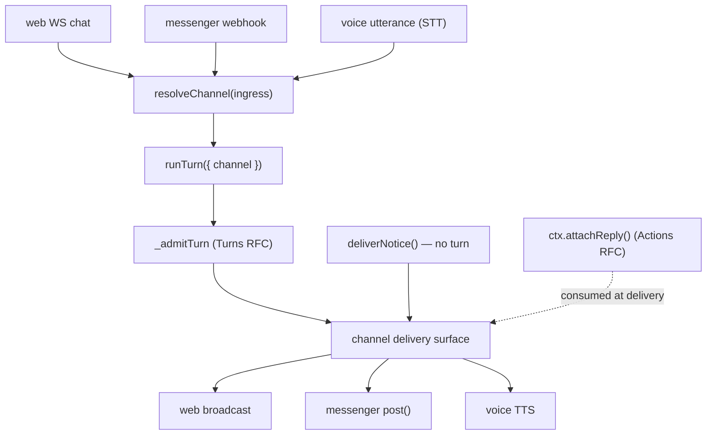

Status: proposed

# RFC: Think channels and notices

Related:

- [rfc-think-turns.md](./rfc-think-turns.md) — `runTurn`/`TurnSpec`; `channel` is the seam this RFC fills (`TurnSpec.channelContext`)
- [rfc-think-actions.md](./rfc-think-actions.md) — `ctx.attachReply()` produces delivery metadata; channels consume it
- [rfc-chat-recovery-foundation.md](./rfc-chat-recovery-foundation.md) — `tryHandleNonChatFiberRecovery` and messenger-reply snapshots are adapter-owned; this RFC must preserve that contract and keep notices out of the incident path
- [think.md](./think.md) — Think design doc
- Strategy plan: `think_api_strategy`

## Status and dependencies (read first)

Third of three sibling API RFCs (turns, actions, channels) to be picked up in
**separate** sessions. Recommended order: **Turns → Actions → Channels** — this
one lands last because it consumes seams from both.

- ⛔ **Nothing in this RFC is built yet** — confirmed absent from
  `packages/think/src/think.ts` (`configureChannels`, `deliverNotice` do not
  exist). The messenger runtime it generalizes (`packages/think/src/messengers/`)
  is fully built and unchanged.
- **Depends on the Turns RFC** for `TurnSpec.channelContext`,
  `runTurn({ channel })`, and `addMessages()` (the `informModel` write —
  `addMessages` is already shipped).
- **Depends on the Actions RFC** for `ctx.attachReply()` (consumed at delivery,
  §6) — but only suggested-order step 5 needs it.
- **Depends on the chat-recovery RFC** to preserve `tryHandleNonChatFiberRecovery`
  and the messenger-reply snapshot contract, and to keep notices out of the
  incident path.
- **Partial early win available:** suggested-order step 1
  (`deliverNotice()` + `informModel`) only needs the already-shipped
  `addMessages()` plus the existing web/messenger delivery surfaces, so it can
  ship independently of the larger messengers→channels rename.

## The problem

Think already has a working multi-surface runtime, but it is named and shaped as
"messengers", and two of the most important surfaces are not modeled by it at
all. Concretely:

- **The vocabulary is too narrow.** [`packages/think/src/messengers/`](../packages/think/src/messengers/index.ts)
  is a real channel runtime — ingress (webhook routing + verification +
  `toEvent`), conversation routing (self vs sub-agent), durable delivery with
  recovery snapshots, and capabilities — but it is presented as "messengers"
  (chat-app adapters). `getMessengers()` (`think.ts:2965`) is the only public
  entry, so the general concept reads as a Slack/Telegram feature rather than
  the surface model it actually is.
- **The native web chat is not a channel.** The built-in WebSocket chat
  (`_handleChatRequest`, broadcast via `broadcast`/`_broadcast`,
  `think.ts:2739`, `11821`, frames `MSG_CHAT_RESPONSE`/`MSG_CHAT_MESSAGES`,
  `think.ts:211`) is special-cased and shares no abstraction with messengers.
  Anything that wants to treat "web" uniformly with "Slack" has to special-case
  both.
- **Voice is not a channel.** A customer left `AIChatAgent` because they needed a
  channel runtime for voice, not a chat-protocol adapter (parent plan, "What
  Already Exists"). Voice today would be a third parallel surface.
- **There is no no-turn delivery (`deliverNotice`).** Every outbound message
  either rides a model turn (messenger reply, WS `MSG_CHAT_RESPONSE`) or is a
  raw `_hostSendMessage` append (`think.ts:4631`) that web clients see but other
  channels do not. There is no supported way to say "tell the user/channel
  _this exact thing_ without invoking the model."
- **Delivery lifecycle is inferred, not declared.** Delivery state is
  `MessengerReplyStage = "accepted" | "streaming" | "completed"`
  (`delivery.ts:201`) plus heuristics on text shape
  (`messengerReplyFailureMode`, `delivery.ts:261`). Surfaces cannot tell a
  _final_ answer from an _interim_ progress note from a deterministic _notice_
  from a _command_; voice and CLI especially need this explicitly rather than
  guessing from whether text arrived.
- **No `informModel`.** When something is delivered outside the model (a
  deterministic status, a fallback, a notice), the next model turn does not know
  it happened and can repeat or contradict it.
- **No per-channel policy.** Every channel gets the same tools, instructions, and
  turn behavior; there is no way to say "the voice channel has a smaller tool set
  and a turn cap" without loading everything everywhere.

The runtime is strong; the gap is **vocabulary generalization + two missing
surfaces + no-turn delivery + explicit delivery semantics**. This RFC does
rename-and-unify, not rebuild.

## Goals

- Make **channel** the lead public concept, with messengers as one channel
  family. Keep `getMessengers()` working unchanged (wrap, do not supersede).
- Model the **native web chat** and **voice** as channels over the same contract,
  so app code treats every surface uniformly.
- Add **`deliverNotice(...)`** — no-turn, channel-routed delivery — with
  **`informModel`** to optionally record it in the model-visible transcript.
- Make delivery lifecycle **explicit**: extend `MessengerReplyStage` with a
  delivery **kind** (`final | interim | notice | command`) and a `turnEnded`
  flag, rather than inferring from text shape.
- Add **`configureChannels(...)`** for per-channel instructions, tools, and turn
  caps without loading every tool into every channel.
- Let channels **consume `ctx.attachReply()`** (Actions RFC) at delivery time.
- Preserve the recovery contract: `tryHandleNonChatFiberRecovery` and
  messenger-reply snapshots stay adapter-owned, and **notices never open a
  recovery incident** (they are not turns).

## Non-goals

- Rebuilding the messenger runtime (`ThinkMessengerRuntime`, `chat-sdk.ts`).
  Channels are a generalization layer over it, not a replacement.
- Voice transport details (binary audio, STT/TTS, barge-in). This RFC only
  defines the **voice channel seam**; [the Voice spike](./rfc-think-voice.md)
  fills it.
- Defining the `ReplyAttachment` union — that is owned by the
  [Actions RFC](./rfc-think-actions.md). This RFC only _consumes_ attachments.
- Changing recovery policy/budgets (recovery RFC) or turn admission internals
  (Turns RFC). This RFC plugs into both.
- Multi-session routing (`rfc-think-multi-session.md`).

## The proposal



Five additions, in order of importance:

1. A public **`ChannelDefinition`** contract that generalizes
   `MessengerDefinition`, plus built-in `web` and `voice` channels.
2. **`configureChannels()`** — wraps `getMessengers()`; adds per-channel policy.
3. **`deliverNotice()`** + **`informModel`** — no-turn delivery.
4. **Explicit delivery tagging** — extend `MessengerReplyStage`.
5. **Reply-attachment consumption** at delivery time.

### 1. The `ChannelDefinition` contract

A channel is the generalization of a messenger: an **ingress** (how events
arrive), a **delivery surface** (how replies/notices go out), **capabilities**,
**conversation routing**, and a **delivery policy**. `MessengerDefinition`
(`chat-sdk.ts:69`) is exactly this for chat-app adapters; we lift its shape to a
named public type and add a `kind` discriminator and the two new surfaces.

```ts
type ChannelKind = "messenger" | "web" | "voice" | "custom";

interface ChannelDefinition {
  /** Surface family. Drives the default ingress/delivery wiring. */
  kind: ChannelKind;

  /** Stable id (the registration key, like a messenger id). */
  // (set by configureChannels()'s record key, mirroring normalizeMessengers)

  capabilities?: ChannelCapabilities; // == MessengerCapabilities (events.ts:58)
  conversation?: ConversationMode | ConversationResolver; // == MessengerConversation*
  delivery?: ChannelDeliveryPolicy; // == MessengerDeliveryPolicy (delivery.ts:300)

  /** Per-channel policy (new — see configureChannels). */
  instructions?: string | ((ctx: ChannelContext) => string | Promise<string>);
  tools?: (all: ToolSet) => ToolSet; // narrow the tool set for this channel
  maxTurns?: number; // per-turn cap for this channel

  /** Ingress, by kind (below). */
  ingress: ChannelIngress;
}
```

Field-by-field mapping from `MessengerDefinition` (the messenger channel is the
identity case — nothing is lost):

| `ChannelDefinition`               | `MessengerDefinition` (`chat-sdk.ts`) | Notes                                     |
| --------------------------------- | ------------------------------------- | ----------------------------------------- |
| `kind: "messenger"`               | (implicit)                            | new discriminator                         |
| id (record key)                   | id (record key in `ThinkMessengers`)  | `normalizeMessengers` enforces uniqueness |
| `capabilities`                    | `capabilities`                        | identical (`MessengerCapabilities`)       |
| `conversation`                    | `conversation`                        | identical (`self`/`thread`/resolver)      |
| `delivery`                        | `delivery`                            | identical (`MessengerDeliveryPolicy`)     |
| `ingress.adapter`/`adapterName`   | `adapter`/`adapterName`               | chat-sdk adapter                          |
| `ingress.path`                    | `path`                                | webhook route                             |
| `ingress.verifyWebhook`           | `verifyWebhook`                       | identical                                 |
| `ingress.toEvent`                 | `toEvent`                             | identical                                 |
| `ingress.respondTo`               | `respondTo`                           | identical                                 |
| `ingress.subscribeOnMention`      | `subscribeOnMention`                  | identical                                 |
| `instructions`/`tools`/`maxTurns` | —                                     | net-new per-channel policy                |

`ChannelIngress` is a discriminated union so `web`/`voice` do not have to invent
webhook fields they do not use:

```ts
type ChannelIngress =
  | {
      transport: "webhook";
      adapter: Adapter;
      adapterName?: string;
      path?: string;
      verifyWebhook: VerifyWebhook | false;
      toEvent?: ToEvent;
      respondTo?: readonly MessengerRespondTo[];
      subscribeOnMention?: boolean;
    } // == messenger ingress today
  | { transport: "websocket" } // built-in web chat
  | { transport: "voice" }; // seam for the Voice spike
```

Internally, a `kind: "messenger"` channel is normalized to exactly today's
`NormalizedMessengerDefinition` and handed to the unchanged
`ThinkMessengerRuntime` (`chat-sdk.ts:169`). No messenger behavior changes; the
public surface just gains the channel vocabulary on top.

### 2. Modeling native web and voice as channels

The point of the contract is that `web` and `voice` are not special cases.

- **`web` channel (built-in, always present).** Its ingress is the existing WS
  chat path (`_handleChatRequest`); its delivery surface is the existing
  broadcast (`broadcast`/`_broadcast`, `MSG_CHAT_RESPONSE`/`MSG_CHAT_MESSAGES`).
  Capabilities: `{ canStream: true, canEditMessages: true }`. It is registered
  implicitly so that `deliverNotice({ channel: "web" })` and
  `runTurn({ channel: "web" })` work with zero config. Apps never have to define
  it; they may override its policy via `configureChannels()`.
- **`voice` channel (seam only here).** Ingress `transport: "voice"`: an STT
  utterance dispatches `runTurn({ channel: "voice", input: utterance })`.
  Delivery surface is TTS. The actual audio transport, barge-in, and
  STT/TTS wiring are the Voice spike's job; this RFC only guarantees voice is
  _expressible_ as a channel (capabilities `{ canStream: true }`, deterministic
  `notice` delivery for spoken status/approval prompts).

This is the crux the parent plan flagged: "how the built-in web WS chat (and
voice) are represented as channels, since neither is a messenger today." The
answer is the `ChannelIngress` union — messengers keep the `webhook` transport;
web and voice are first-class transports over the same delivery/policy/capability
model.

### 3. `configureChannels()` — wraps `getMessengers()`

A new hook, mirroring `getMessengers()`/`getTools()`, that returns the channel
map. It **wraps** `getMessengers()` rather than superseding it (back-compat):

```ts
configureChannels(): Record<string, ChannelDefinition>
  | Promise<Record<string, ChannelDefinition>> {
  return {};
}
```

Resolution order at startup (`_initializeMessengers` becomes
`_initializeChannels`):

1. Start with the implicit `web` channel.
2. Add channels from `configureChannels()`.
3. Add channels derived from `getMessengers()` — each `MessengerDefinition`
   becomes a `kind: "messenger"` channel (1:1, mechanical). If a key collides
   with `configureChannels()`, that is an error (mirrors
   `normalizeMessengers`' duplicate-id guard, `chat-sdk.ts:589`).

So existing apps that only implement `getMessengers()` keep working untouched;
the channel runtime simply _contains_ their messengers. New apps use
`configureChannels()` and get web/voice/messenger uniformly.

Per-channel policy (`instructions`/`tools`/`maxTurns`) is applied at turn
admission: when `runTurn({ channel })` resolves a `ChannelContext`, the
inference loop uses that channel's narrowed tool set and instructions. This is
how "the voice channel has a smaller tool set and a turn cap" is expressed
without loading every tool into every channel.

```ts
configureChannels() {
  return {
    voice: {
      kind: "voice",
      ingress: { transport: "voice" },
      maxTurns: 4,
      tools: (all) => pick(all, ["lookupOrder", "checkStatus"]),
      instructions: "You are on a phone call. Keep replies short and speakable."
    },
    support: chatChannel({ /* messenger adapter, == chatSdkMessenger today */ })
  };
}
```

### 4. `deliverNotice()` + `informModel`

A no-turn, channel-routed delivery. It does **not** invoke the model and does
**not** open a recovery incident.

```ts
interface DeliverNoticeOptions {
  /** Target channel id. Defaults to the active turn's channel, else "web". */
  channel?: string;
  /**
   * Also record the notice in the model-visible transcript so the next turn
   * knows it was said. Default false. When true, addMessages() is called with a
   * standard annotation (see below).
   */
  informModel?: boolean;
  /** Delivery kind for the wire tag. Default "notice". */
  kind?: DeliveryKind; // usually "notice" or "command"
  /** Conversation/thread hint for multi-thread channels (see routing). */
  thread?: string;
}

function deliverNotice(
  text: string | { markdown: string },
  options?: DeliverNoticeOptions
): Promise<void>;
```

Semantics:

- **No model turn.** It delivers straight to the channel's delivery surface
  (web: `_broadcast` a notice frame; messenger: `surface.post(...)`; voice: TTS).
  Because it is not a turn, it bypasses `_admitTurn` (Turns RFC) and the turn
  queue entirely — like `addMessages`/`_hostSendMessage`, it cannot deadlock
  inside a tool `execute`.
- **`informModel: true`** calls `addMessages()` (Turns RFC) with a standard,
  model-legible annotation, e.g. an `assistant`/`system` message
  `"[Delivered to the user out of band] <text>"`, so the next turn does not
  repeat or contradict it. `informModel: false` (default) leaves the transcript
  untouched — pure side channel.
- **Routing.** Inside a turn, the target defaults to the active channel
  (`getMessengerContext()`/`_activeMessengerContext`, `think.ts:2969`). Outside a
  turn (a scheduled task, a webhook handler, an action firing a status update),
  the caller must name `channel` (and `thread` for multi-thread messengers);
  otherwise it resolves to `web`. If a named channel/thread cannot be resolved,
  it throws (fail fast rather than silently drop).
- **Never an incident.** A notice is explicitly _not_ a turn, so it must not
  enter `tryHandleNonChatFiberRecovery` or create a messenger-reply snapshot.
  Notices are best-effort deliveries; if the channel post fails, that is a
  delivery error surfaced to the caller, not a recovery incident. This aligns
  with the recovery engine's definition of a turn (parent plan, "Channels/notices
  vs the adapter seam").

Example (the parent-plan recipe):

```ts
await this.deliverNotice("I started a background agent.", {
  channel: "web",
  informModel: true
});
```

### 5. Explicit delivery tagging

Today delivery state is `MessengerReplyStage = "accepted" | "streaming" |
"completed"` (`delivery.ts:201`) and lifecycle is otherwise inferred from text
shape. We **extend, not replace**: keep the stage, add an orthogonal delivery
**kind** and a `turnEnded` flag.

```ts
type DeliveryKind = "final" | "interim" | "notice" | "command";

interface DeliveryTag {
  stage: MessengerReplyStage; // unchanged: accepted | streaming | completed
  kind: DeliveryKind; // new
  turnEnded: boolean; // new — does this delivery close the turn?
}
```

- `final` — the model's answer for the turn (today's implicit case);
  `turnEnded: true` on completion.
- `interim` — progress/streaming partials; `turnEnded: false`.
- `notice` — `deliverNotice()` output; not part of a turn; `turnEnded: false`.
- `command` — a control/deterministic instruction to the surface (e.g. "start
  typing", "play earcon"); `turnEnded: false`.

Where it lives on the wire:

- **Messenger snapshots:** `messengerReplySnapshot` (`delivery.ts:210`) gains an
  optional `tag: DeliveryTag` field; recovery code that switches on
  `messengerReplyRecoveryMode(snapshot)` (`delivery.ts:249`) keeps working
  because `stage` is unchanged.
- **Web frames:** notice/command frames carry the tag in the broadcast payload
  alongside the existing `MSG_CHAT_RESPONSE`/`MSG_CHAT_MESSAGES` types; clients
  that ignore unknown fields are unaffected (additive).
- **Voice/CLI:** read the tag instead of guessing from text — this is the whole
  point for non-streaming-text surfaces.

This lets `deliverMessengerReply` (`delivery.ts:324`) stop relying solely on
`messengerReplyFailureMode` heuristics (`delivery.ts:261`) to decide
apologize-vs-error-vs-final, and gives voice/CLI an explicit lifecycle signal.

### 6. Consuming reply attachments

The [Actions RFC](./rfc-think-actions.md) defines `ctx.attachReply(attachment)`,
which accumulates `ReplyAttachment`s on the active turn (keyed by `requestId`).
This RFC is the **consumer**: at delivery time, the resolved channel inspects the
turn's attachments and renders accordingly — a `voice_note` attachment makes the
voice channel speak the final text; an `email_draft` makes an email channel build
a draft; a `card` makes a web/messenger surface render a card. Unknown
attachment types are ignored by channels that do not understand them (the union
is open by design). Attachments are surfaced at the existing delivery hook points
(`onChatResponse`/`_fireResponseHook`, `think.ts`, and the messenger
`TextStreamCallback`, `delivery.ts:24`), which is exactly where the Actions RFC
said it would expose them.

## Coordination with the Turns and recovery RFCs

- **Turns RFC seam.** `runTurn({ channel })` (Turns RFC) resolves the channel id
  to a `ChannelContext` and sets `TurnSpec.channelContext` (the field the Turns
  RFC reserved). For `kind: "messenger"` channels this is the existing
  `MessengerContext` (`events.ts:67`) — so `chatWithMessengerContext`
  (`think.ts:2980`) becomes the messenger-channel specialization of one general
  path. The Turns RFC owns admission; this RFC owns what `channel` _means_.
- **Per-channel policy at admission.** `instructions`/`tools`/`maxTurns` are read
  when `_admitTurn` builds the inference loop, so a channel's narrowed tool set
  applies to that turn only.
- **Recovery contract preserved.** Messenger fiber dispatch
  (`tryHandleNonChatFiberRecovery` per the recovery RFC; `handleFiberRecovery`,
  `chat-sdk.ts:238`) and reply snapshots stay adapter-owned and behavior-
  identical. The only change is the additive `DeliveryTag` on the snapshot.
- **Notices stay out of the incident path.** `deliverNotice` is a no-turn
  delivery; it must never create a snapshot or an incident. This is the hard
  invariant the recovery RFC depends on.

## Observability

New events, parallel to `chat:recovery:*`, `chat:turn:*` (Turns RFC), and
`action:*` (Actions RFC):

- `channel:resolved` — `{ channel, kind, requestId }`
- `channel:delivered` — `{ channel, kind: DeliveryKind, turnEnded }`
- `notice:delivered` — `{ channel, informModel }`
- `notice:failed` — `{ channel, error }` (delivery error, not an incident)

These make the channel/notice path visible in the same ledger as turns,
actions, and recovery.

## Versioning and compatibility

- `@cloudflare/think` is pre-1.0 (0.9.x); additive minor changes with a
  changeset.
- New: `ChannelDefinition`/`configureChannels()`, the built-in `web` (and `voice`
  seam) channels, `deliverNotice()`, `DeliveryKind`/`DeliveryTag`,
  `channel:*`/`notice:*` events.
- Unchanged: `getMessengers()`, `MessengerDefinition`, `ThinkMessengerRuntime`,
  `chatWithMessengerContext`, `deliverMessengerReply`, and `MessengerReplyStage`
  (extended, not replaced). Apps using only `getMessengers()` see no behavior
  change — their messengers are absorbed as channels.
- Deprecation stance: nothing is deprecated. Docs lead with `channel`/
  `configureChannels()`; `getMessengers()` is documented as the messenger-channel
  shortcut.

## Testing strategy

1. **Messenger-as-channel parity.** Existing messenger suites (Telegram,
   chat-sdk) run unchanged against the channel-wrapped runtime — the regression
   gate that the generalization dropped nothing.
2. **Channel resolution.** `configureChannels()` + `getMessengers()` merge order,
   implicit `web`, duplicate-id error, per-channel `tools`/`instructions`/
   `maxTurns` applied at admission.
3. **`deliverNotice` tests.** No turn started/no incident created; `informModel`
   true vs false (transcript annotation present/absent); routing inside a turn
   (active channel) vs outside (named channel, else `web`, else throw); delivery
   error surfaced (not an incident); no turn-queue deadlock when called from a
   tool `execute`.
4. **Delivery tagging.** `DeliveryTag` round-trips through messenger snapshots
   without breaking `messengerReplyRecoveryMode`; web notice/command frames carry
   the tag; voice/CLI read kind instead of inferring.
5. **Attachment consumption.** A `voice_note`/`card`/`email_draft` attachment
   from an action reaches the right channel renderer; unknown types are ignored.
6. **Recovery coordination.** Messenger reply recovery
   (`accepted`/`streaming`/`completed`, apologize-vs-error) is unchanged with the
   added tag; notices never appear in `tryHandleNonChatFiberRecovery`.

## Edge cases and invariants

- **`web` channel is always available** even with no `configureChannels()`/
  `getMessengers()`, so `deliverNotice()` and `runTurn({ channel: "web" })` work
  out of the box.
- **Notice during an active turn** branches like `addMessages` when
  `informModel: true` (it appends to the last committed leaf). Supported pattern:
  deliver the notice, let the in-flight turn finish; the annotation is visible to
  the _next_ turn. Documented, same caveat as `addMessages`.
- **Notice ordering vs streaming.** A `notice`/`command` delivered mid-stream is
  tagged `turnEnded: false` so surfaces render it without closing the turn's
  `final` reply.
- **Multi-thread messenger routing for notices.** Out-of-turn `deliverNotice` to
  a messenger channel requires `thread`; without it the target is ambiguous and
  it throws.
- **Sub-agent channels.** A channel whose conversation routes to a sub-agent
  (`conversation: "thread"`, `resolveTarget`, `chat-sdk.ts:474`) keeps that
  behavior; the sub-agent has its own turn queue, unchanged.
- **Capabilities are advisory.** `canStream`/`maxMessageLength` etc. inform
  delivery (e.g. `visibleSoftLimit`, `splitText`) but a channel that lies about
  capabilities degrades gracefully, as today.
- **Attachments are best-effort across replay** (Actions RFC): a replayed settled
  action does not re-fire `attachReply`, so channel rendering of that attachment
  is producing-attempt only in v1.

## The alternatives

- **Build a parallel channels system next to messengers.** Maximizes design
  freedom but creates exactly the coherence problem the strategy warns about
  (more power, harder to learn) and duplicates the recovery/delivery machinery.
  Rejected — generalize the existing runtime instead.
- **Supersede `getMessengers()` with `configureChannels()`.** Cleaner long-term
  surface but a breaking change for every messenger user. Rejected for v1; wrap
  first, revisit deprecation later.
- **Replace `MessengerReplyStage` with the new tag.** Breaks
  `messengerReplyRecoveryMode` and the snapshot format. Rejected — extend with an
  orthogonal `kind` + `turnEnded` and keep `stage`.
- **Make `deliverNotice` a turn with `mode: "none"`.** Reintroduces turn-queue
  coupling and risks opening incidents for a no-turn delivery. Rejected — notices
  are deliberately not turns (same reasoning as `addMessages` vs `runTurn`).
- **Infer delivery kind from text shape (status quo).** Fails for voice/CLI and
  is the source of the apologize-vs-final heuristics. Rejected.

## Open questions and what could force a redesign

- **`configureChannels()` supersede vs wrap.** Proposed: wrap (back-compat). If
  the dual hook proves confusing, a later major could fold `getMessengers()` into
  `configureChannels()` with a codemod.
- **`deliverNotice` on `AIChatAgent`.** Should a reduced, chat-protocol-only
  `deliverNotice` exist on `AIChatAgent` (mapping to `cf_agent_chat_*`), or is it
  Think-only? Leaning Think-only; `AIChatAgent` stays the low-level adapter
  (parent plan, Recommendation 5).
- **Where per-channel granted permissions come from.** The Actions RFC's
  `authorizeTurn` can draw default grants from the channel (a voice channel might
  grant less than an authenticated web session). If channels must inject grants
  at admission, `ChannelContext` needs a `grants` field consumed by
  `authorizeTurn`. Cross-RFC seam to settle with Actions.
- **Channel gateways: explicit DO vs managed.** Should channel ingress always be
  an app-defined Worker entrypoint (verify/parse → durable enqueue → return), or
  can Think generate/manage gateways for common channels? Keep the thin
  awaited-durable-handoff invariant either way (parent plan).
- **Voice as a literal channel vs a parallel surface.** This RFC assumes voice is
  a channel. If the Voice spike finds the audio transport cannot fit the
  delivery-surface contract, voice may become a parallel surface that _reuses_
  turns/notices instead of being a `ChannelKind`. The spike decides.
- **`DeliveryKind` extensibility.** Is the four-value enum enough, or do surfaces
  need an open string union (like `ReplyAttachment`)? Start closed; widen if a
  channel needs a fifth lifecycle signal.

## Implementation notes (for a fresh session)

Line numbers are approximate (captured at writing time); search by symbol first.

Where things live:

- Channel runtime to generalize: [`packages/think/src/messengers/`](../packages/think/src/messengers/index.ts)
  — `chat-sdk.ts` (`MessengerDefinition`, `NormalizedMessengerDefinition`,
  `ThinkMessengerRuntime`, `normalizeMessengers`, `chatSdkMessenger`,
  `idempotencyKeyForEvent`), `events.ts` (`MessengerContext`/`MessengerEvent`/
  `MessengerCapabilities`, `toMessengerUserMessage` sets `metadata.messenger`),
  `delivery.ts` (`deliverMessengerReply`, `MessengerReplyStage`,
  `MessengerDeliveryPolicy`/`MessengerDeliverySurface`, `TextStreamCallback`,
  `messengerReplyRecoveryMode`/`messengerReplyFailureMode`), `telegram.ts`
  (a concrete adapter to keep working).
- Think wiring: `getMessengers()` (`think.ts:2965`), `_initializeMessengers`
  (`think.ts:2995`, becomes `_initializeChannels`), `getMessengerContext`/
  `_activeMessengerContext` (`think.ts:2969`), `chatWithMessengerContext`
  (`think.ts:2980`), `_messengerRuntime.handleRequest` (`think.ts:7374`),
  `handleFiberRecovery` (`think.ts:9996`).
- Native web surface (the `web` channel): `broadcast` override (`think.ts:2739`),
  `_broadcast` (`think.ts:11821`), frame types `MSG_CHAT_RESPONSE`/
  `MSG_CHAT_MESSAGES` (`think.ts:211`), `_hostSendMessage` (`think.ts:4631`, the
  no-turn-append precedent for web notices).
- New public methods/hooks live on `Think` (`packages/think/src/think.ts`):
  `configureChannels()`, `deliverNotice()`. New types can live in a
  `packages/think/src/channels/` module that re-exports/wraps `messengers/`.
- Depends on Turns RFC (`TurnSpec.channelContext`, `addMessages` for
  `informModel`, `runTurn({ channel })`) and Actions RFC (`ctx.attachReply`).
- Tests: `packages/think/src/tests/` (`npm run test:workers`). Build
  `tsx ./scripts/build.ts`; gate `pnpm run check`; changeset required; no `any`,
  use `import type`.

Suggested implementation order:

1. **`deliverNotice()` + `informModel`** over the existing web broadcast and
   messenger `surface.post` — independent of the bigger rename; ships early and
   is the highest-value net-new (depends only on `addMessages`).
2. **`DeliveryTag`** (additive `kind` + `turnEnded`) on snapshots/frames.
3. **`ChannelDefinition` + `configureChannels()`** wrapping `getMessengers()`,
   with the implicit `web` channel and the `voice` ingress seam. Messenger
   channels normalize to today's `NormalizedMessengerDefinition`.
4. **Per-channel policy** (`instructions`/`tools`/`maxTurns`) applied at
   admission via the Turns RFC's `_admitTurn`.
5. **Attachment consumption** at the delivery hook points (after the Actions RFC
   lands `attachReply`).
6. **`channel:*`/`notice:*` observability.**

## The decision

_Pending review._ Proposed direction: generalize the existing messenger runtime
into a public `ChannelDefinition`/`configureChannels()` surface (wrapping, not
replacing, `getMessengers()`), model native web and voice as channels over one
contract, add a no-turn `deliverNotice()` with `informModel`, make delivery
lifecycle explicit via an additive `DeliveryKind`/`turnEnded` tag on top of
`MessengerReplyStage`, and consume Actions' `ctx.attachReply()` at delivery —
all additive, with notices kept strictly out of the recovery incident path.
